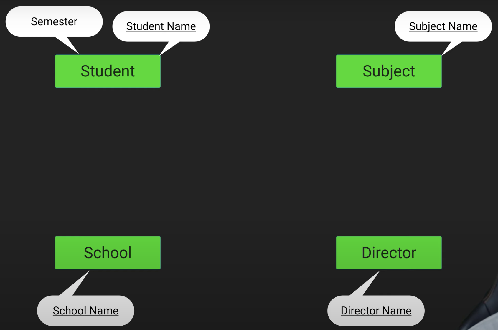
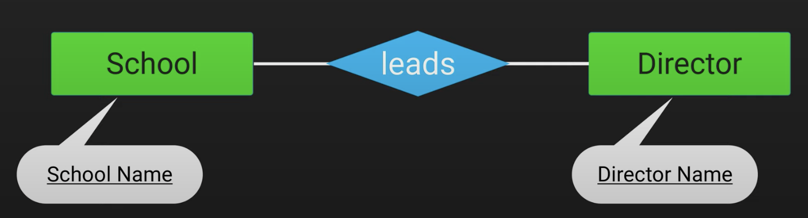
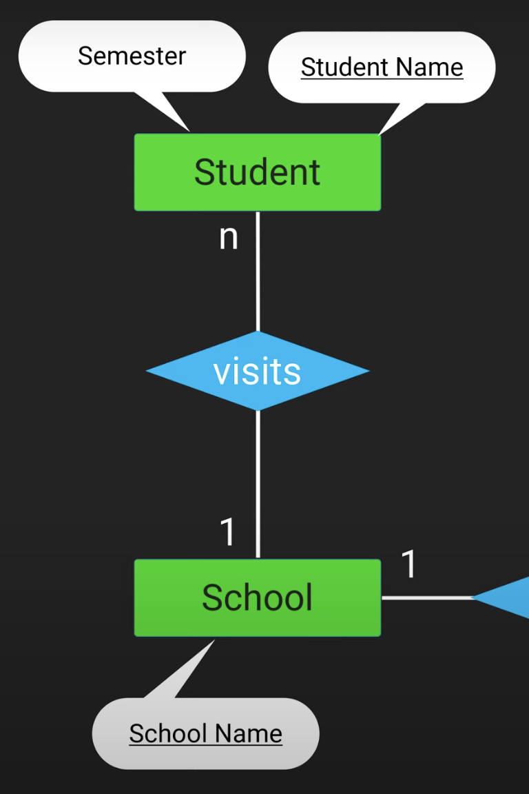
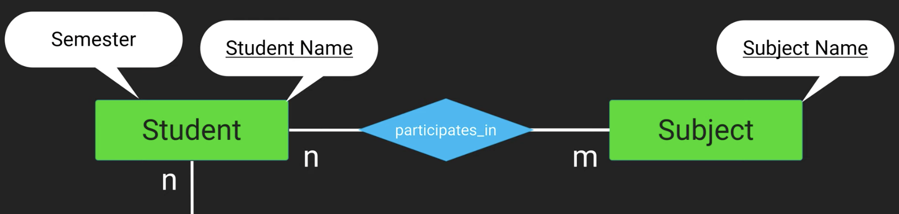
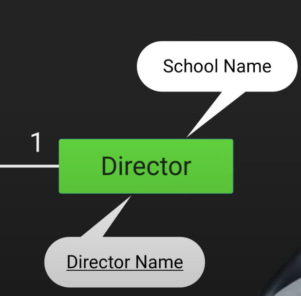
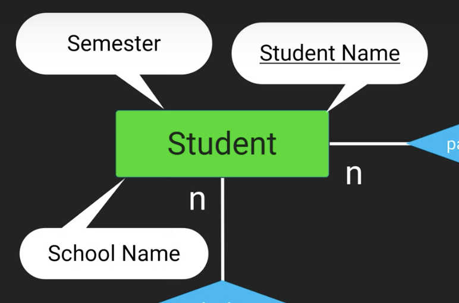
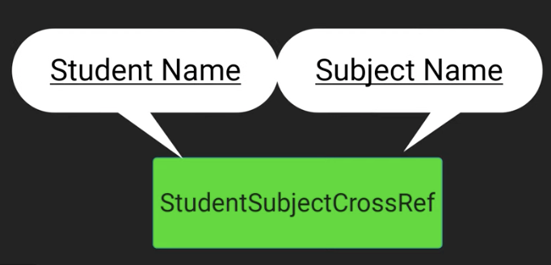

# How to Model an SQL Database

DB는 여러 테이블과 관계를 가지고 있다. 하나의 테이블만 사용할 수도 있지만 복잡한 DB를 구현해야 하는 경우들이 있다.

만약 복잡한 데이터베이스 구현이 예상된다면 손으로 먼저 작성(E-R-Model)한 후 구현하는 것이 좋다. E-R-Model을 작성하는 법과 이를 기반으로 데이터베이스를 구현하는 방법을 배워보자.

School 테이블이 있다고 가정하자.

| Name | City | Address |
| --- | --- | --- |
| Kotlin School | Berlin | Kotlin Str. 5 |
| JetBrains School  | New York | JetBrains Str. 9 |

School, Director, Student, Subject 4개의 테이블이 있고, 각 테이블은 기본키를 가지고 있다.

이를 E-R-Model로 표현하면 다음과 같다. 개인키는 E-R-Model에서 밑줄로 표시한다.

현재 4개의 테이블을 정의했지만 이 테이블 간 관계를 정의하지 않았다.

관계형 데이터베이스엔 3가지 타입이 있다. 우선 1:1 관계는 하나의 레코드가 다른 테이블 레코드 하나와 연결된 경우이다. School은 오직 하나의 Director를 가지고 있고, Director는 오직 하나의 School에 속한다. 이 경우(1:1 관계) 다이아몬드 모양을 통해 표현한다.

다음은 1:N 관계이다. School(1)에는 여러 Student(n)가 있는 것이다. 한 학생은 오직 하나의 School에만 속한다.

다음은 N:M 관계이다. Student는 여러 Subject를 수강할 수 있고 Subject는 여러 Student에게 수강받을 수 있기 때문에 N:M 관계라고 할 수 있다.

Director가 어떤 School에 속하는지 알기 위해 School Name 저장하기만 하면 된다.

어떤 Student가 어디의 School에 속하는지 알려면 위와 동일하게 School Name을 저장하면 된다.

Subject 테이블에 Student Name을 저장하지 않는다. Subject는 여러 Student를 통해 수강되기 때문이다. 때문에 이 N:M 관계를 해결하기 위해 새로운 테이블을 하나 생성한다. 이 추가된 테이블은 Student Name과 Subject Name을 저장한다.

| Student Name | Subject Name |
| --- | --- |
| Peter | math |
| Peter | science |
| ... | ... |

## References

* [How to Model an SQL Database (DON'T SKIP THIS) - Android Room With Multiple Tables - Part 1](https://www.youtube.com/watch?v=A8AUtcP0rRs&list=PLQkwcJG4YTCS3AD2C-yWtJUGTYMh5h3Zz&index=1)