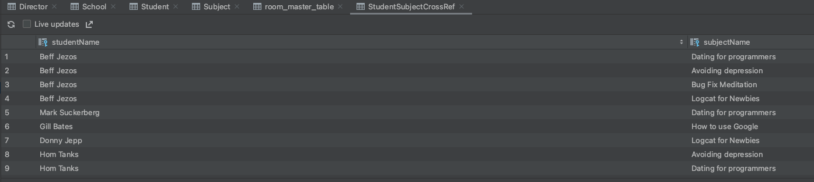

# Finishing the Database

지금까지 작성한 데이터베이스 클래스를 실제로 구현해보자. 다음과 같이 DAO를 구현한다.

```kotlin
@Dao
interface SchoolDao {

    @Insert(onConflict = OnConflictStrategy.REPLACE)
    suspend fun insertSchool(school: School)

    @Insert(onConflict = OnConflictStrategy.REPLACE)
    suspend fun insertDirector(director: Director)

    @Insert(onConflict = OnConflictStrategy.REPLACE)
    suspend fun insertStudent(student: Student)

    @Insert(onConflict = OnConflictStrategy.REPLACE)
    suspend fun insertSubject(subject: Subject)

    @Insert(onConflict = OnConflictStrategy.REPLACE)
    suspend fun insertStudentSubjectCrossRef(crossRef: StudentSubjectCrossRef)

    // multi-threading 이슈 발생하기 때문에 @Transaction 주석 추가
    @Transaction
    @Query("SELECT * FROM school WHERE schoolName = :schoolName")
    suspend fun getSchoolAndDirectorWithSchoolName(schoolName: String): List<SchoolAndDirector>

    @Transaction
    @Query("SELECT * FROM school WHERE schoolName = :schoolName")
    suspend fun getSchoolWithStudents(schoolName: String): List<SchoolWithStudents>

    @Transaction
    @Query("SELECT * FROM subject WHERE subjectName  = :subjectName")
    suspend fun getStudentsOfSubject(subjectName: String): List<SubjectWithStudents>

    @Transaction
    @Query("SELECT * FROM student WHERE studentName = :studentName")
    suspend fun getSubjectsOfStudent(studentName: String): List<StudentWithSubjects>
}
```

`SchoolDatabase`를 생성한다.

```kotlin
@Database(
        entities = [
            School::class,
            Student::class,
            Director::class,
            Subject::class,
            StudentSubjectCrossRef::class
        ],
        version = 1
)
abstract class SchoolDatabase : RoomDatabase() {

    abstract val schoolDao: SchoolDao

    companion object {
        // @Volatile 은 INSTANCE가 변경되면 즉시 다른 스레드에 반영되게 하기 위함 -> 레이스컨디션 방지
        @Volatile
        private var INSTANCE: SchoolDatabase? = null

        fun getInstance(context: Context): SchoolDatabase {
            // 이 블록이 실행될 때 다른 스레드가 접근할 수 없게하기 위해 synchronized(this)
            // 두 스레드가 동시에 getInstance()를 요청할 경우 2개의 인스턴스가 생성될 수 있다.
            synchronized(this) {
                return INSTANCE ?: Room.databaseBuilder(
                        context.applicationContext,
                        SchoolDatabase::class.java,
                        "school_db"
                ).build().also {
                    INSTANCE = it
                }
            }
        }
    }
}
```

이제 `MainActivity`에 다음과 같이 각 테이블에 데이터를 넣어준다.

```kotlin
class MainActivity : AppCompatActivity() {
    override fun onCreate(savedInstanceState: Bundle?) {
        super.onCreate(savedInstanceState)
        setContentView(R.layout.activity_main)
        val dao = SchoolDatabase.getInstance(this).schoolDao

        val directors = listOf(
                Director("Mike Litoris", "Jake Wharton School"),
                Director("Jack Goff", "Kotlin School"),
                Director("Chris P. Chicken", "JetBrains School")
        )
        val schools = listOf(
                School("Jake Wharton School"),
                School("Kotlin School"),
                School("JetBrains School")
        )
        val subjects = listOf(
                Subject("Dating for programmers"),
                Subject("Avoiding depression"),
                Subject("Bug Fix Meditation"),
                Subject("Logcat for Newbies"),
                Subject("How to use Google")
        )
        val students = listOf(
                Student("Beff Jezos", 2, "Kotlin School"),
                Student("Mark Suckerberg", 5, "Jake Wharton School"),
                Student("Gill Bates", 8, "Kotlin School"),
                Student("Donny Jepp", 1, "Kotlin School"),
                Student("Hom Tanks", 2, "JetBrains School")
        )
        val studentSubjectRelations = listOf(
                StudentSubjectCrossRef("Beff Jezos", "Dating for programmers"),
                StudentSubjectCrossRef("Beff Jezos", "Avoiding depression"),
                StudentSubjectCrossRef("Beff Jezos", "Bug Fix Meditation"),
                StudentSubjectCrossRef("Beff Jezos", "Logcat for Newbies"),
                StudentSubjectCrossRef("Mark Suckerberg", "Dating for programmers"),
                StudentSubjectCrossRef("Gill Bates", "How to use Google"),
                StudentSubjectCrossRef("Donny Jepp", "Logcat for Newbies"),
                StudentSubjectCrossRef("Hom Tanks", "Avoiding depression"),
                StudentSubjectCrossRef("Hom Tanks", "Dating for programmers")
        )
        lifecycleScope.launch {
            directors.forEach { dao.insertDirector(it) }
            schools.forEach { dao.insertSchool(it) }
            subjects.forEach { dao.insertSubject(it) }
            students.forEach { dao.insertStudent(it) }
            studentSubjectRelations.forEach { dao.insertStudentSubjectCrossRef(it) }
        }
    }
}
```

`StudentSubjectCrossRef`에 학생과 과목의 조합이 저장되어 있는 것을 확인할 수 있다.

<div align="center">

</div>

특정 school에 대한 `Director`나 `Students`를 얻고 싶다면 다음과 같이 구현하면 된다.

```kotlin
        lifecycleScope.launch {
    // ...
    val schoolWithDirector = dao.getSchoolAndDirectorWithSchoolName("Kotlin School")

    val schoolWithStudents = dao.getSchoolWithStudents("Kotlin School")
}
```

## References

* [Finishing the Database - Android Room Database With Multiple Tables](https://www.youtube.com/watch?v=iTdzBM1zErA&list=PLQkwcJG4YTCS3AD2C-yWtJUGTYMh5h3Zz&index=5)