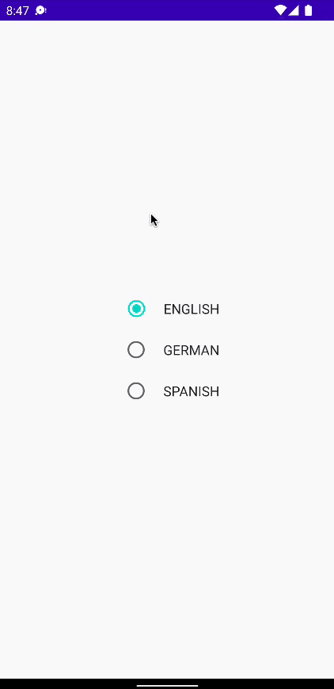

# **Type-Safe Preferences With Proto DataStore (without Protobuf Files!) - Full Guide**

안드로이드의 Proto DataStore를 알아본다. DataStore는 Shared Preferences 같이 데이터를 저장할 수 있는 저장소를 의미한다.

2가지 다른 타입의 DataStore가 존재하며 DataStore Preferences(Shared Preferences와 유사)와 Proto DataStore가 있다. Proto DataStore는 구성하기 조금 복잡하지만 type-safe 이점이 있다. 따라서 코틀린 객체를 저장할 수 있다.

여기서 serialization과 같이 사용하는 방법을 보여준다. serialization을 사용하면 protobuf 언어를 사용하지 않고도 쉽게 저장할 수 있다.

간단한 language picker를 구현해보자.

## Prerequisites

다음 3개의 디펜던시를 추가해준다.

```groovy
implementation "androidx.datastore:datastore:1.0.0"
implementation "org.jetbrains.kotlinx:kotlinx-collections-immutable:0.3.5" // list를 datastore에 저장하는 경우 필요
implementation "org.jetbrains.kotlinx:kotlinx-serialization-json:1.3.2" // to parse json data
```

## Implementation

루트 패키지에 `AppSettings.kt` 파일을 생성하고 `AppSettings` data class를 만든다.

```kotlin
@Serializable
data class AppSettings(
    val language: Language = Language.ENGLISH,
    val knownLocations: PersistentList<Location> = persistentListOf()
)

@Serializable
data class Location(
    val lat: Double,
    val lng: Double
)

enum class Language {
    ENGLISH, GERMAN, SPANISH
}
```

`var`을 사용하여 mutable하게 만드는 것 보다 `val`로 immutable하게 만드는 것을 권장한다. 또한 `List`를 만들 때도 immutable 컬렉션을 사용하는 것을 권장한다. `PersistentList`는 기존 `List`와 같이 `add`, `remove`를 사용할 수 있지만 리스트 내용을 변경시키진 않는다. mutate를 원하면 `.mutate`를 사용해 immutable을 유지하며 아이템을 변경할 수 있다.

Proto DataStore에 저장하기 위한 `AppSettings` 클래스를 만들었다. DataStore가 inputstream 또는 outputstream에 대해 어떻게 파싱하고 읽기, 쓰기를 수행하는지에 대한 Serializer라는 것이 필요하다. 루트 패키지에 `AppSettingsSerializer` object를 생성하고 다음과 같이 작성한다.

```kotlin
@Suppress("BlockingMethodInNonBlockingContext")
object AppSettingsSerializer: Serializer<AppSettings> {
    override val defaultValue: AppSettings
        get() = AppSettings()

    override suspend fun readFrom(input: InputStream): AppSettings {
        return try {
            // json to AppSettings object
            Json.decodeFromString(
                deserializer = AppSettings.serializer(),
                string = input.readBytes().decodeToString()
            )
        } catch (e: SerializationException) {
            e.printStackTrace()
            defaultValue
        }
    }

    override suspend fun writeTo(t: AppSettings, output: OutputStream) {
        output.write(
            Json.encodeToString(
                serializer = AppSettings.serializer(),
                value = t
            ).encodeToByteArray()
        )
    }
}
```

SharedPreferences와 다르게 DataStore는 속성이 변경되면 state가 자동적으로 업데이트되고 이를 UI에 업데이트 된 상태로 유지한다.

이제 `MainActivity`를 다음과 같이 작성한다.

```kotlin
val Context.dataStore by dataStore("app-settings.json", AppSettingsSerializer)

class MainActivity : ComponentActivity() {
    override fun onCreate(savedInstanceState: Bundle?) {
        super.onCreate(savedInstanceState)
        setContent {
            ProtoDataStoreGuideTheme {
                val appSettings = dataStore.data.collectAsState(
                    initial = AppSettings()
                ).value
                val scope = rememberCoroutineScope()
                Column(
                    modifier = Modifier.fillMaxSize(),
                    verticalArrangement = Arrangement.Center,
                    horizontalAlignment = Alignment.CenterHorizontally
                ) {
                    for(i in 0..2) {
                        val language = Language.values()[i]
                        Row(
                            verticalAlignment = Alignment.CenterVertically
                        ) {
                            RadioButton(
                                selected = language == appSettings.language,
                                onClick = {
                                    scope.launch {
                                        setLanguage(language)
                                    }
                                }
                            )
                            Spacer(modifier = Modifier.width(8.dp))
                            Text(text = language.toString())
                        }
                    }
                }
            }
        }
    }

    private suspend fun setLanguage(language: Language) {
        dataStore.updateData {
            it.copy(language = language)
        }
    }
}
```

<div align="center">

</div>

앱의 규모가 커짐에 따라 이 DataStore를 사용하는 것을 추천한다.

## References
* [Type-Safe Preferences With Proto DataStore (without Protobuf Files!) - Full Guide](https://www.youtube.com/watch?v=yMGAbm84iIY&t=10s)