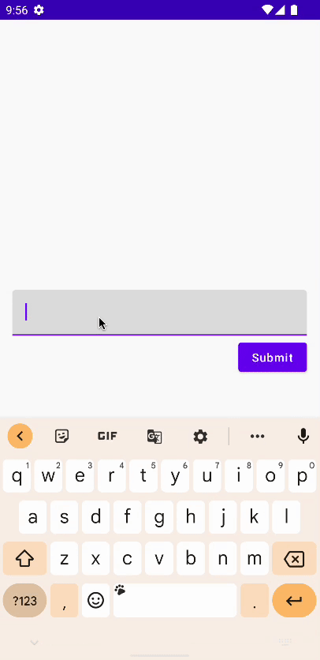

# How to Handle Errors with Clean Architecture the Right Way

클린 아키텍처에서 에러 핸들링을 어떻게 수행하는지 알아본다.

## Example

`data`, `domain`, `presentation` 패키지를 생성한다.

`presentation` 패키지에 `email`과 `error`를 노출하는 `MyViewModel`을 생성 및 작성한다.

```kotlin
class MyViewModel : ViewModel() {

    var email by mutableStateOf("")
        private set

    var error by mutableStateOf<String?>(null)
        private set

    fun onEmailChanged(email: String) {
        this.email = email
    }
}
```

Use case에서 에러를 핸들링하기 위한 방법은 2가지가 있다. 제네릭 파라미터를 받는 `Resource` 클래스를 통해, 성공, 실패 여부 및 에러 메시지를 전달하거나, `Exception` 클래스를 사용해
예외를 throw 하는 방법이 있다.

다음은 이메일이 유효하지 않을 때 `Exception`을 발생시키는 use case 예제이다.

```kotlin
class SubmitEmailUseCase {

    fun execute(email: String) {
        if (!email.contains("@")) {
            throw InvalidEmailException()
        }
        // ...
    }

    class InvalidEmailException : Exception("That is not a valid email")
}
```

여기서는 `Resource` 클래스를 통해 에러를 핸들링해본다. `util` 패키지를 생성한 후 `Resource` 클래스를 생성하고 다음과 같이 작성한다.

```kotlin
sealed class Resource<T>(val data: T? = null, val message: String? = null) {
    class Success<T>(data: T?) : Resource<T>(data)

    // 에러일 때 데이터를 전달하는 경우 -> 로컬에 캐싱되어 있는 데이터를 전달할 때
    class Error<T>(message: String, data: T? = null) : Resource<T>(data = data, message = message)
}
```

이메일을 제출하기 위해 `domain` 패키지에 `MyRepository` 인터페이스를 생성한다.

```kotlin
interface MyRepository {
    suspend fun submitEmail(email: String): Resource<Unit>
}
```

이에 대한 구현체를 `data` 패키지에 생성하고 작성해준다. 50% 확률로 이메일 제출에 성공하거나 실패하게 된다.

```kotlin
class MyRepositoryImpl : MyRepository {
    override suspend fun submitEmail(email: String): Resource<Unit> {
        delay(500L)
        return if (Random.nextBoolean()) { // 50% success or fail
            Resource.Success(Unit)
        } else {
            if (Random.nextBoolean()) {
                Resource.Error("Server error")
            } else {
                Resource.Error("Not authenticated error")
            }
        }
    }
}
```

이제 이메일을 검증하는 use case인 `SubmitEmailUseCase`를 다음과 같이 작성한다.

```kotlin
class SubmitEmailUseCase(
    private val repository: MyRepository = MyRepositoryImpl() // 테스트 프로젝트라 구현체를 직접 대입, 실제 프로젝트에서는 DI를 통해 인터페이스를 인젝션한다.
) {

    suspend fun execute(email: String): Resource<Unit> {
        if (!email.contains("@")) {
            return Resource.Error("That is not a valid email")
        }
        return repository.submitEmail(email)
    }
}
```

이제 `MyViewModel`에 `SubmitEmailUseCase`를 사용해 검증하는 `sumbitEmail` 함수를 작성한다. 반환된 결과에 따라 다르게 처리할 수 있다.

```kotlin
class MyViewModel(
    private val submitEmailUseCase: SubmitEmailUseCase = SubmitEmailUseCase()
) : ViewModel() {
    // ...

    fun sumbitEmail() {
        viewModelScope.launch {
            val result = submitEmailUseCase.execute(email)
            when (result) {
                is Resource.Success -> {

                }
                is Resource.Error -> {
                    error = result.message
                }
            }
        }
    }
}
```

마지막으로 `MainActivity`의 UI를 다음과 같이 작성한다.

```kotlin
class MainActivity : ComponentActivity() {
    override fun onCreate(savedInstanceState: Bundle?) {
        super.onCreate(savedInstanceState)
        setContent {
            ErrorHandlingCleanArchTheme {
                Column(
                    modifier = Modifier
                        .fillMaxSize()
                        .padding(16.dp),
                    verticalArrangement = Arrangement.Center
                ) {
                    val viewModel = viewModel<MyViewModel>()
                    TextField(
                        value = viewModel.email,
                        onValueChange = viewModel::onEmailChanged,
                        modifier = Modifier
                            .fillMaxWidth()
                    )
                    Spacer(modifier = Modifier.height(8.dp))
                    Button(
                        onClick = {
                            viewModel.sumbitEmail()
                        },
                        modifier = Modifier.align(Alignment.End)
                    ) {
                        Text(
                            text = "Submit"
                        )
                    }
                    Spacer(modifier = Modifier.height(8.dp))
                    if (viewModel.error != null) {
                        Text(
                            text = viewModel.error ?: ""
                        )
                    }
                }
            }
        }
    }
}
```

예상한 대로 에러가 출력되는 것을 확인할 수 있다.

<div align="center">

</div>

## How to use string resource in repository or use case

String Resource를 레포지토리 또는 use case에서 어떻게 사용하는지 알아보자.

`util` 패키지에 `UiText` sealed class를 생성하고 다음과 같이 작성한다. Use case에 string resource를 가져오기 위해 컨텍스트에 의존하게 되면 되면 유닛 테스트 시
Integrated Test로 수행해야 한다. 따라서 컨텍스트에 대한 의존성을 없애기 위해 `UiText`를 사용한다.

```kotlin
sealed class UiText {
    data class DynamicString(val value: String) : UiText()
    class StringResource(
        @StringRes val id: Int,
        val args: Array<Any> = emptyArray()
    ) : UiText()

    @Composable
    fun asString(): String {
        return when (this) {
            is DynamicString -> value
            is StringResource -> stringResource(id, args)
        }
    }
}
```

`Resource` sealed class를 다음과 같이 `UiText`를 사용하도록 구성한다.

```kotlin
sealed class Resource<T>(val data: T? = null, val message: UiText? = null) {
    class Success<T>(data: T?) : Resource<T>(data)

    // 에러일 때 데이터를 전달하는 경우 -> 로컬에 캐싱되어 있는 데이터를 전달할 때
    class Error<T>(message: UiText, data: T? = null) : Resource<T>(data = data, message = message)
}
```

`MyRepositoryImpl` 클래스에도 에러 시 `UiText`를 사용하도록 변경한다.

```kotlin
class MyRepositoryImpl : MyRepository {
    override suspend fun submitEmail(email: String): Resource<Unit> {
        delay(500L)
        return if (Random.nextBoolean()) { // 50% success or fail
            Resource.Success(Unit)
        } else {
            if (Random.nextBoolean()) {
                Resource.Error(UiText.DynamicString("Server error"))
            } else {
                Resource.Error(UiText.DynamicString("Not authenticated error"))
            }
        }
    }
}
```

`strings.xml`에 성공했을 때와 실패했을 때의 string resource를 추가한다.

```xml
<resources>
    <string name="app_name">ErrorHandlingCleanArch</string>
    <string name="error_invalid_email">This is not a valid email</string>
    <string name="successfully_submitted">Successfully submitted</string>
</resources>
```

해당 string resource를 `SubmitEmailUseCase`에서 사용하도록 구현한다.

```kotlin
class SubmitEmailUseCase(
    private val repository: MyRepository = MyRepositoryImpl() // 테스트 프로젝트라 구현체를 직접 대입, 실제 프로젝트에서는 DI를 통해 인터페이스를 인젝션한다.
) {

    suspend fun execute(email: String): Resource<Unit> {
        if (!email.contains("@")) {
            return Resource.Error(UiText.StringResource(R.string.error_invalid_email))
        }
        return repository.submitEmail(email)
    }
}
```

`MyViewModel`에서도 `error` 타입을 `UiText`로 변경한다.

```kotlin
class MyViewModel(
    private val submitEmailUseCase: SubmitEmailUseCase = SubmitEmailUseCase()
): ViewModel() {

    var email by mutableStateOf("")
        private set

    var error by mutableStateOf<UiText?>(null)
        private set
    // ...
}
```

`MainActivity`에서 `asString`을 통해 에러 텍스트를 가져오도록 구현한다.

```kotlin
class MainActivity : ComponentActivity() {
    override fun onCreate(savedInstanceState: Bundle?) {
        super.onCreate(savedInstanceState)
        setContent {
            ErrorHandlingCleanArchTheme {
                Column(
                    // ...
                ) {
                    // ...
                    if (viewModel.error != null) {
                        Text(
                            text = viewModel.error?.asString() ?: ""
                        )
                    }
                }
            }
        }
    }
}
```

앱을 실행해보면 이전 결과와 동일하게 문자열을 잘 가져오는 것을 확인할 수 있다.

## References

* [How to Handle Errors with Clean Architecture the Right Way](https://www.youtube.com/watch?v=O4WhAS2irI8&t=3s)