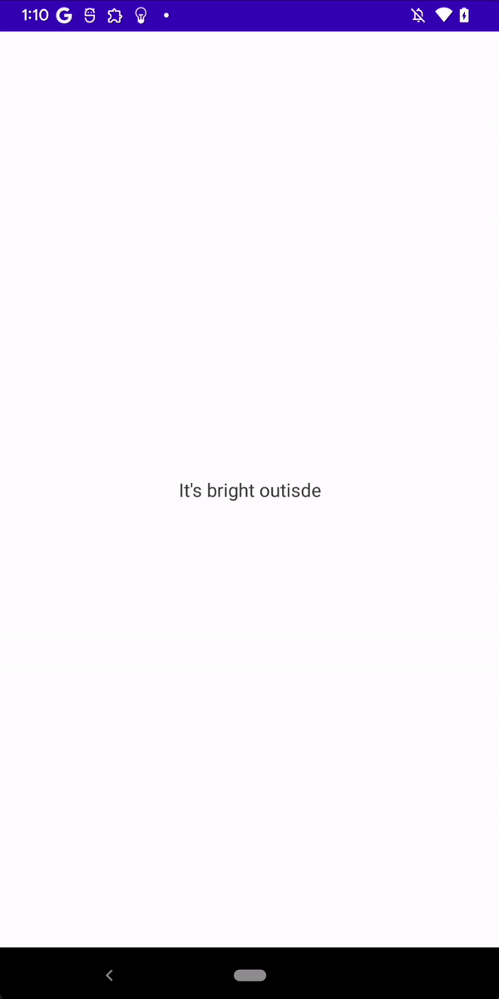

# How to Use Device Sensors the Right Way in Android

안드로이드 디바이스에서 사용할 수 있는 센서를 다루는 방법을 알아본다.

센서 핸들링에 대한 노하우를 알려준다. 추상화를 통해 테스트가 쉽도록 해주며, 클린 아키텍처로 구현한다.

여기선 빛 감지 센서를 통해 어떻게 센서가 사용되는지 알아본다. 빛 센서 외 다른 센서도 유사하게 적용할 수 있다.

이제 센서를 핸들링하기 위한 추상화 클래스를 작성한다.

```kotlin
abstract class MeasurableSensor(
    protected val sensorType: Int
) {

    // 몇몇의 센서는 여러 값을 제공한다. 예를 들어, 회전 센서는 얼마나 회전되었는지 x, y, z 값을 제공하는데, 빛 감지 센서의 경우 하나의 값만 제공한다. 따라서 List<Float>으로 선언한다.
    protected var onSensorValuesChanged: ((List<Float>) -> Unit)? = null

    abstract val doesSensorExist: Boolean

    abstract fun startListening()
    abstract fun stopListening()

    fun setOnSensorValuesChangedListener(listener: (List<Float>) -> Unit) {
        onSensorValuesChanged = listener
    }
}
```

그리고 `MeasurableSensor`와 `SensorEventListener`를 상속하는 `AndroidSensor` abstruct class를 작성한다.

```kotlin
abstract class AndroidSensor(
    private val context: Context,
    private val sensorFeature: String,
    sensorType: Int,
): MeasurableSensor(sensorType), SensorEventListener {
    override val doesSensorExist: Boolean
        get() = context.packageManager.hasSystemFeature(sensorFeature)

    private lateinit var sensorManager: SensorManager
    private var sensor: Sensor? = null

    override fun startListening() {
        if (!doesSensorExist) {
            return
        }
        if (!::sensorManager.isInitialized && sensor == null) {
            sensorManager = context.getSystemService(SensorManager::class.java) as SensorManager
            sensor = sensorManager.getDefaultSensor(sensorType)
        }

        sensor?.let {
            sensorManager.registerListener(this, it, SensorManager.SENSOR_DELAY_NORMAL)
        }
    }

    override fun stopListening() {
        if (!doesSensorExist || !::sensorManager.isInitialized) {
            return
        }
        sensorManager.unregisterListener(this)
    }

    override fun onSensorChanged(event: SensorEvent?) {
        if (!doesSensorExist) {
            return
        }
        if (event?.sensor?.type == sensorType) {
            onSensorValuesChanged?.invoke(event.values.toList())
        }
    }

    override fun onAccuracyChanged(sensor: Sensor?, accuracy: Int) = Unit
}
```

이제 모든 센서를 포함하고 있는 `Sensors` 파일을 생성한다. 추상화된 클래스를 통해 쉽게 센서를 핸들리할 수 있게 된다.

```kotlin
class LightSensor(
    context: Context
): AndroidSensor(
    context = context,
    sensorFeature = PackageManager.FEATURE_SENSOR_LIGHT,
    sensorType = Sensor.TYPE_LIGHT
)

class ProximitySensor(
    context: Context
): AndroidSensor(
    context = context,
    sensorFeature = PackageManager.FEATURE_SENSOR_PROXIMITY,
    sensorType = Sensor.TYPE_PROXIMITY
)
```

위 `LightSensor`를 사용하는 `MainViewModel`을 생성한다.

```kotlin
@HiltViewModel
class MainViewModel @Inject constructor(
    private val lightSensor: MeasurableSensor // top level abstraction으로 선언한다. 이렇게 되면 안드로이드 환경에 관계 없이 Fake 버전의 MeasurableSensor를 만들어 전달할 수 있으므로 테스트가 쉬워진다.
): ViewModel() {

    var isDark by mutableStateOf(false)

    init {
        lightSensor.startListening()
        lightSensor.setOnSensorValuesChangedListener { values ->
            val lux = values.first()
            isDark = lux < 60f
        }
    }
}
```

DI 라이브러리로 Dagger-Hilt를 사용했다. Dagger-Hilt를 사용하기 위해 `Application` 클래스에 `@HiltAndroidApp` 어노테이션 추가 후 Manifest에 추가해준다.

```kotlin
@HiltAndroidApp
class SensorApp: Application()
```

`LightSensor`를 inject 할 수 있도록 `SensorModule`을 생성한다.

```kotlin
@Module
@InstallIn(SingletonComponent::class)
object SensorModule {

    @Provides
    @Singleton
    fun provideLightSensor(app: Application): MeasurableSensor {
        return LightSensor(app)
    }
}
```

`MainActivity`에서 `MainViewModel`의 `isDark`를 통해 `background`를 설정하도록 구현한다.

```kotlin
@AndroidEntryPoint
class MainActivity : ComponentActivity() {
    override fun onCreate(savedInstanceState: Bundle?) {
        super.onCreate(savedInstanceState)
        setContent {
            SensorGuideTheme {
                val viewModel = viewModel<MainViewModel>()
                val isDark = viewModel.isDark
                Box(
                    modifier = Modifier
                        .fillMaxSize()
                        .background(
                            if (isDark) {
                                Color.DarkGray
                            } else {
                                Color.White
                            }
                        ),
                    contentAlignment = Alignment.Center
                ) {
                    Text(
                        text = if (isDark) {
                            "It's dark outside"
                        } else {
                            "It's bright outisde"
                        },
                        color = if (isDark) Color.White else Color.DarkGray
                    )
                }
            }
        }
    }
}
```

센서를 통해 외부 밝기에 따라 백그라운드가 변경되는 것을 확인할 수 있다.

<div align="center">

</div>

## References

* [How to Use Device Sensors the Right Way in Android - Android Studio Tutorial](https://www.youtube.com/watch?v=IU-EAtITRRM&t=83s)