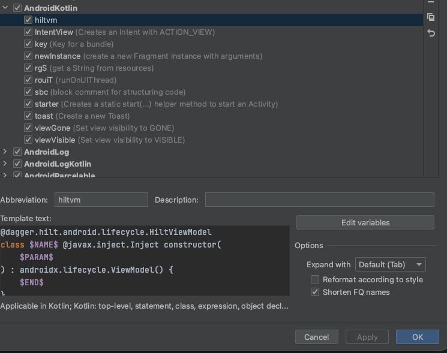

# TOP 5 Custom Live Templates for Android Studio

Live Template이란 Jetpack Compose에서 `comp`를 입력하면 자동으로 Composable 함수를 만들어 주는 것처럼 코드 작성에 도움을 주는 템플릿을 의미한다.

코드 작성 시 유용한 5가지 Live Template 구현을 하고 어떻게 적용하는지 알아보자.

`Preferences` → Live Template으로 접근하여 설정할 수 있다. 템플릿 설정 시 클래스의 전체 경로를 입력해야 템플릿 사용 시 정상적으로 import 된다.

<div align="center">

</div>

define을 클릭해 어떤 경우에서만 사용할 지 결정할 수 있다.

## ViewModel

`hiltvm`을 통해 다음과 같이 생성한다.

```kotlin
@dagger.hilt.android.lifecycle.HiltViewModel
class $NAME$ @javax.inject.Inject constructor(
    $PARAM$
) : androidx.lifecycle.ViewModel() {
    $END$
}
```

## State

`vmstat`을 통해 다음과 같이 생성한다.

```kotlin
private val _$NAME$ = mutableStateOf<$TYPE$>($initial$)
val state: State<$TYPE$> = _$NAME$
```

`vmstatfunc`를 통해 다음과 같이 생성한다.

```kotlin
private val _$NAME$ = androidx.compose.runtime.mutableStateOf<$TYPE$>($initial$)
val state: androidx.compose.runtime.State<$TYPE$> = _$NAME$

fun $FUNCNAME$($PARAM$: $TYPE$) {
    _$NAME$.value = $PARAM$
}
```

## Remember State

`remstate`를 통해 다음과 같이 생성한다.

```kotlin
var $NAME$ by androidx.compose.runtime.remember {
    androidx.compose.runtime.mutableStateOf($INIT$)
}
```

## Center Box

`centerbox`를 통해 다음과 같이 생성한다.

```kotlin
androidx.compose.foundation.layout.Box(
    modifier = androidx.compose.ui.Modifier.fillMaxSize(),
    contentAlignment = androidx.compose.ui.Alignment.Center
) {

}
```

## Icon Button

`iconbtn`를 통해 다음과 같이 생성한다.

```kotlin
androidx.compose.material.IconButton(
    onClick = {

    },
) {
    androidx.compose.material.Icon(
        imageVector = $IMAGEVECTOR$,
    contentDescription = $CONTENTDESCRIPTION$
    )
}
```

## References

* [TOP 5 Custom Live Templates for Android Studio (CODE FASTER!)](https://www.youtube.com/watch?v=HhBnNJqvzco)