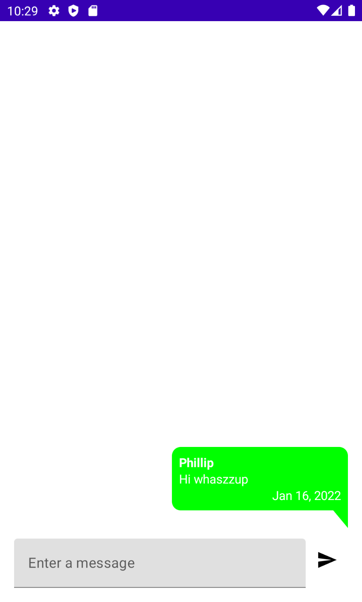
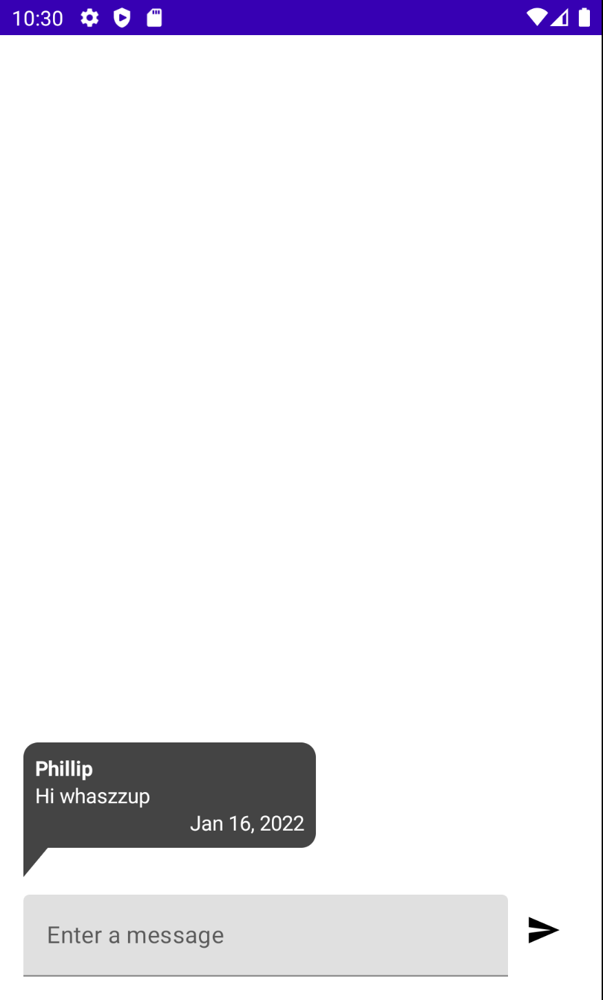
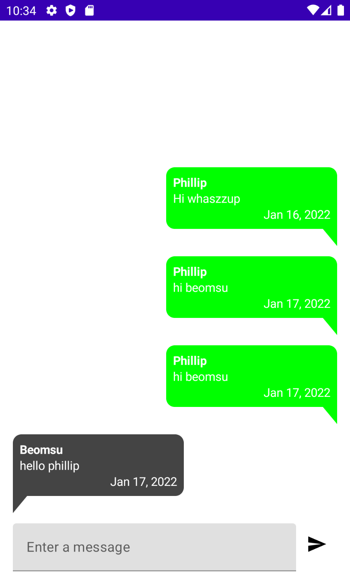
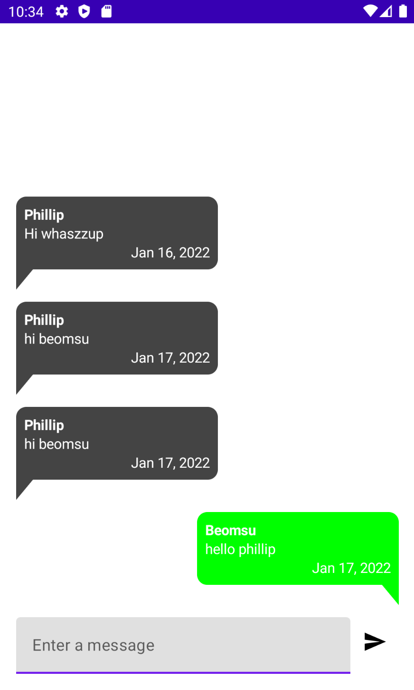

# Building the Android App

클라이언트 앱을 만들기 위해 [이 레포지토리](https://github.com/philipplackner/KtorAndroidChat)에서 클론한다. Ktor 서버는 [Building the Server](https://github.com/beomsu317/study/blob/main/contents/ktor/example/android-chat-app-with-ktor/building-the-server.md)를 참고한다.

## Setup gradle

Project gradle에 디펜던시를 다음과 같이 설정한다.

```groovy
dependencies {
    classpath "com.android.tools.build:gradle:7.0.3"
    classpath "org.jetbrains.kotlin:kotlin-gradle-plugin:1.5.21"
    classpath "org.jetbrains.kotlin:kotlin-serialization:1.5.21"
    classpath "com.google.dagger:hilt-android-gradle-plugin:2.38.1"
    // NOTE: Do not place your application dependencies here; they belong
    // in the individual module build.gradle files
}
```

Module gradle에 다음 디펜던시들을 추가한다. Retrofit은 웹소켓을 지원하지 않아 `ktor-client`를 사용한다.

```groovy
dependencies {
    // ...
    // Compose dependencies
    implementation "androidx.lifecycle:lifecycle-viewmodel-compose:2.4.0"
    implementation "androidx.navigation:navigation-compose:2.4.0-beta02"

    // Coroutines
    implementation 'org.jetbrains.kotlinx:kotlinx-coroutines-core:1.5.2-native-mt'
    implementation 'org.jetbrains.kotlinx:kotlinx-coroutines-android:1.5.2'

    // Coroutine Lifecycle Scopes
    implementation "androidx.lifecycle:lifecycle-viewmodel-ktx:2.4.0"

    // Dagger - Hilt
    implementation "com.google.dagger:hilt-android:2.38.1"
    kapt "com.google.dagger:hilt-android-compiler:2.37"
    implementation "androidx.hilt:hilt-lifecycle-viewmodel:1.0.0-alpha03"
    kapt "androidx.hilt:hilt-compiler:1.0.0"
    implementation 'androidx.hilt:hilt-navigation-compose:1.0.0-alpha03'

    // Ktor
    def ktor_version = "1.6.3"
    implementation "io.ktor:ktor-client-core:$ktor_version"
    implementation "io.ktor:ktor-client-cio:$ktor_version"
    implementation "io.ktor:ktor-client-serialization:$ktor_version"
    implementation "io.ktor:ktor-client-websockets:$ktor_version"
    implementation "io.ktor:ktor-client-logging:$ktor_version"
    implementation "ch.qos.logback:logback-classic:1.2.6"

    implementation "org.jetbrains.kotlinx:kotlinx-serialization-json:1.3.0"
}
```

## Datas

`data/remote/dto` 패키지를 만들고 하위에 `MessageDto` 데이터 클래스를 생성한다.

```kotlin
@Serializable
data class MessageDto(
        val text: String,
        val timestamp: Long,
        val username: String,
        val id: String
)
```

UI 레이어에 필요한 데이터를 보여주기 위해 `domain/model` 패키지에 `Message` 데이터 클래스를 생성한다.

```kotlin
data class Message(
        val text: String,
        val formattedTime: String,
        val username: String
)
```

클린 아키텍처를 위해 `MessageDto`에 `Message`를 매핑하는 함수를 생성한다.

```kotlin
@Serializable
data class MessageDto(
        val text: String,
        val timestamp: Long,
        val username: String,
        val id: String
) {
    fun toMessage(): Message {
        val date = Date(timestamp)
        val formattedDate = DateFormat
                .getDateInstance(DateFormat.DEFAULT)
                .format(date)
        return Message(
                text = text,
                formattedTime = formattedDate,
                username = username
        )
    }
}
```

## Services

그 다음 웹소켓 API 인터페이스인 `MessageService`를 만들자.

```kotlin
interface MessageService {

    suspend fun getAllMessages(): List<Message>

    companion object {
        const val BASE_URL = "http://10.0.2.2:8080"
    }

    // sealed class를 통해 여러 Endpoints를 만든다. 
    sealed class Endpoints(val url: String) {
        object GetAllMessages : Endpoints("${BASE_URL}/messages")
    }
}
```

ktor를 통해 네트워크 요청을 수행하는 `MessageServiceImpl`을 만들자.

```kotlin
class MessageServiceImpl(
        private val client: HttpClient
) : MessageService {
    override suspend fun getAllMessages(): List<Message> {
        return try {
            client.get<List<MessageDto>>(MessageService.Endpoints.GetAllMessages.url)
                    .map { it.toMessage() }
        } catch (e: Exception) {
            emptyList()
        }
    }
}
```

`util` 패키지를 생성하고 하위에 `Resource` sealed 클래스를 생성한다.

```kotlin
sealed class Resource<T>(val data: T? = null, val message: String? = null) {
    class Success<T>(data: T?) : Resource<T>(data)
    class Error<T>(message: String, data: T? = null) : Resource<T>(data, message)
}
```

모든 소켓 연결을 처리하며 다른 사람들에게 메시지를 전달하고 전달받는 처리를 수행하는 `remote/dto` 패키지의 `ChatSocketService` 인터페이스를 생성한다. 웹소켓은 서버에 지속적인 연결이
필요하므로 연결을 한 번 설정한 후 이를 유지하므로써 메시지를 전달하고 전달받을 수 있다.

```kotlin
interface ChatSocketService {

    // 세션 초기화가 정상적으로 수행되었는지 확인하기 위함
    suspend fun initSession(
            username: String
    ): Resource<Unit>

    suspend fun sendMessage(message: String)

    // flow를 반환하기 때문에 일반 fun 함수
    fun observeMessages(): Flow<Message>

    // 앱을 미니마이즈 했을 경우 세션을 종료
    suspend fun closeSession()

    companion object {
        const val BASE_URL = "ws://10.0.2.2:8080"
    }

    sealed class Endpoints(val url: String) {
        object ChatSocket : Endpoints("${BASE_URL}/chat-socket")
    }
}
```

`ChatSocketServiceImpl`을 생성하여 각 함수를 구현해준다. 이 클래스는 웹소켓에 대한 처리를 수행한다.

```kotlin
class ChatSocketServiceImpl(
        private val client: HttpClient
) : ChatSocketService {

    // 이 socket을 통해 서버에 메시지를 전달하거나 전달받을 수 있다.
    private var socket: WebSocketSession? = null

    // 웹소켓 통신을 초기화
    override suspend fun initSession(username: String): Resource<Unit> {
        return try {
            socket = client.webSocketSession {
                url("${ChatSocketService.Endpoints.ChatSocket.url}?username=${username}")
            }
            if (socket?.isActive == true) {
                Resource.Success(Unit)
            } else {
                Resource.Error("Couldn't establish a connection.")
            }
        } catch (e: Exception) {
            e.printStackTrace()
            Resource.Error(e.localizedMessage ?: "Unknown error")
        }
    }

    override suspend fun sendMessage(message: String) {
        try {
            socket?.send(Frame.Text(message))
        } catch (e: Exception) {
            e.printStackTrace()
        }
    }

    override fun observeMessages(): Flow<Message> {
        return try {
            socket?.incoming
                    ?.receiveAsFlow()
                    ?.filter { it is Frame.Text }
                    ?.map {
                        val json = (it as Frame.Text)?.readText() ?: ""
                        val messageDto = Json.decodeFromString<MessageDto>(json)
                        messageDto.toMessage()
                    } ?: flow { }
        } catch (e: Exception) {
            e.printStackTrace()
            flow { }
        }
    }

    override suspend fun closeSession() {
        socket?.close()
    }
}
```

## Dependency injection

DI를 구성하기 위해 `di` 패키지를 생성하고 하위에 `AppModule` object를 생성한다.

```kotlin
@Module
@InstallIn(SingletonComponent::class)
object AppModule {

    @Provides
    @Singleton
    fun provideHttpClient(): HttpClient {
        // engine을 전달해야한다. 안드로이드 엔진은 웹소켓을 지원하지 않기 때문에 CIO 엔진을 전달한다.
        return HttpClient(CIO) {
            install(Logging)
            install(WebSockets)
            install(JsonFeature) {
                serializer = KotlinxSerializer()
            }
        }
    }

    @Provides
    @Singleton
    fun provideMessageService(client: HttpClient): MessageService {
        return MessageServiceImpl(client)
    }

    @Provides
    @Singleton
    fun provideChatSocketService(client: HttpClient): ChatSocketService {
        return ChatSocketServiceImpl(client)
    }
}
```

`Application` 클래스에 `@HiltAndroidApp` 주석을 달아주고 `AndroidManifest.xml`에 `.ChatApp`을 설정한다. 인터넷 퍼미션도 추가한다.

```kotlin
@HiltAndroidApp
class ChatApp : Application()
```

```xml
<?xml version="1.0" encoding="utf-8"?>
<manifest xmlns:android="http://schemas.android.com/apk/res/android"
          package="com.plcoding.ktorandroidchat">

    <uses-permission android:name="android.permission.INTERNET"/>

    <application
            android:allowBackup="true"
            android:icon="@mipmap/ic_launcher"
            android:label="@string/app_name"
            android:roundIcon="@mipmap/ic_launcher_round"
            android:supportsRtl="true"
            android:theme="@style/Theme.KtorAndroidChat"
            android:name=".ChatApp">
        <activity
                android:name="com.plcoding.ktorandroidchat.MainActivity"
                android:exported="true"
                android:label="@string/app_name"
                android:theme="@style/Theme.KtorAndroidChat.NoActionBar">
            <intent-filter>
                <action android:name="android.intent.action.MAIN" />

                <category android:name="android.intent.category.LAUNCHER" />
            </intent-filter>
        </activity>
    </application>

</manifest>
```

## ViewModels

`presentation/uesrname` 패키지에 `UsernameViewModel`을 생성한다.

```kotlin
@HiltViewModel
class UsernameViewModel @Inject constructor() : ViewModel() {

    private val _usernameText = mutableStateOf("")
    val usernameText: State<String> = _usernameText

    private val _onJoinChat = MutableSharedFlow<String>()
    val onJoinChat = _onJoinChat.asSharedFlow()

    fun onUsernameChange(username: String) {
        _usernameText.value = username
    }

    fun onJoinClick() {
        viewModelScope.launch {
            if (usernameText.value.isNotBlank()) {
                _onJoinChat.emit(usernameText.value)
            }
        }
    }
}
```

`presentation`에 `chatViewModel` 및 `ChatState` 데이터 클래스를 생성한다.

```kotlin
@HiltViewModel
class ChatViewModel @Inject constructor(
        private val messageService: MessageService,
        private val chatSocketService: ChatSocketService,
        // SavedStateHandle은 프로세스가 죽었을 경우 등에서 ViewModel의 상태를 복구한다.
        private val savedStateHandle: SavedStateHandle
) : ViewModel() {

    private val _messageText = mutableStateOf("")
    val messageText: State<String> = _messageText

    private val _state = mutableStateOf(ChatState())
    val state: State<ChatState> = _state

    private val _toastEvent = MutableSharedFlow<String>()
    val toastEvent = _toastEvent.asSharedFlow()

    fun connectToChat() {
        getAllMessages()
        savedStateHandle.get<String>("username")?.let { username ->
            viewModelScope.launch {
                val result = chatSocketService.initSession(username)
                when (result) {
                    is Resource.Success -> {
                        chatSocketService.observeMessages()
                                .onEach { message ->
                                    val newList = state.value.messages.toMutableList().apply {
                                        add(0, message)
                                    }
                                    _state.value = state.value.copy(
                                            messages = newList
                                    )
                                }.launchIn(viewModelScope)
                    }
                    is Resource.Error -> {
                        _toastEvent.emit(result.message ?: "Unknown error")
                    }
                }
            }
        }
    }

    fun onMessageChange(message: String) {
        _messageText.value = message
    }

    fun disconnect() {
        viewModelScope.launch {
            chatSocketService.closeSession()
        }
    }

    fun getAllMessages() {
        viewModelScope.launch {
            // loading...
            _state.value = state.value.copy(isLoading = true)
            val result = messageService.getAllMessages()
            _state.value = state.value.copy(
                    messages = result,
                    isLoading = false
            )
        }
    }

    fun sendMessage() {
        viewModelScope.launch {
            if (messageText.value.isNotBlank())
                chatSocketService.sendMessage(messageText.value)
        }
    }

    override fun onCleared() {
        super.onCleared()
        disconnect()
    }
}
```

```kotlin
data class ChatState(
        val messages: List<Message> = emptyList(),
        val isLoading: Boolean = false
)
```

## UI Layer

`presentation/username`에 `UsernameScreen`을 만들고 다음과 같이 구현한다.

```kotlin
@Composable
fun UsernameScreen(
        viewModel: UsernameViewModel = hiltViewModel(),
        onNavigate: (String) -> Unit
) {
    LaunchedEffect(key1 = true) {
        viewModel.onJoinChat.collectLatest { username ->
            onNavigate("chat_screen/${username}")
        }
    }

    Box(
            modifier = Modifier
                    .fillMaxSize()
                    .padding(16.dp),
            contentAlignment = Alignment.Center
    ) {
        Column(
                modifier = Modifier
                        .fillMaxSize(),
                verticalArrangement = Arrangement.Center,
                horizontalAlignment = Alignment.End
        ) {
            TextField(
                    value = viewModel.usernameText.value,
                    onValueChange = viewModel::onUsernameChange,
                    placeholder = {
                        Text(text = "Enter a username...")
                    },
                    modifier = Modifier
                            .fillMaxWidth()
            )
            Spacer(modifier = Modifier.height(8.dp))
            Button(onClick = viewModel::onJoinClick) {
                Text(text = "Join")
            }
        }
    }
}
```

다음은 `chat/` 하위에 `ChatScreen` composable을 생성한다.

```kotlin
@Composable
fun ChatScreen(
        username: String?,  // ViewModel의 SavedStateHandle에서 이 값을 얻는다.
        viewModel: ChatViewModel = hiltViewModel()
) {
    val context = LocalContext.current
    LaunchedEffect(key1 = true) {
        viewModel.toastEvent.collectLatest { message ->
            Toast.makeText(context, message, Toast.LENGTH_LONG).show()
        }
    }

    val lifecycleOwner = LocalLifecycleOwner.current
    DisposableEffect(key1 = lifecycleOwner) {
        val observer = LifecycleEventObserver { _, event ->
            if (event == Lifecycle.Event.ON_START) {
                viewModel.connectToChat()
            } else if (event == Lifecycle.Event.ON_STOP) {
                viewModel.disconnect()
            }
        }
        lifecycleOwner.lifecycle.addObserver(observer)
        onDispose {
            lifecycleOwner.lifecycle.removeObserver(observer)
        }
    }

    val state = viewModel.state.value

    Column(
            modifier = Modifier
                    .fillMaxSize()
                    .padding(16.dp)
    ) {
        LazyColumn(
                modifier = Modifier
                        .weight(1f)
                        .fillMaxWidth(),
                reverseLayout = true
        ) {
            item {
                Spacer(modifier = Modifier.height(32.dp))
            }
            items(state.messages) { message ->
                val isOwnMessage = message.username == username
                Box(
                        contentAlignment = if (isOwnMessage) {
                            Alignment.CenterEnd
                        } else {
                            Alignment.CenterStart
                        },
                        modifier = Modifier.fillMaxWidth()
                ) {
                    Column(
                            modifier = Modifier
                                    .width(200.dp)
                                    // canvas
                                    .drawBehind {
                                        val cornerRadius = 10.dp.toPx()
                                        val triangleHeight = 20.dp.toPx()
                                        val triangleWidth = 25.dp.toPx()
                                        val trianglePath = Path().apply {
                                            if (isOwnMessage) {
                                                moveTo(size.width, size.height - cornerRadius)
                                                lineTo(size.width, size.height + triangleHeight)
                                                lineTo(
                                                        size.width - triangleWidth,
                                                        size.height - cornerRadius
                                                )
                                                close()
                                            } else {
                                                moveTo(0f, size.height - cornerRadius)
                                                lineTo(0f, size.height + triangleHeight)
                                                lineTo(triangleWidth, size.height - cornerRadius)
                                                close()
                                            }
                                        }
                                        drawPath(
                                                path = trianglePath,
                                                color = if (isOwnMessage) Color.Green else Color.DarkGray
                                        )
                                    }
                                    .background(
                                            color = if (isOwnMessage) Color.Green else Color.DarkGray,
                                            shape = RoundedCornerShape(10.dp)
                                    )
                                    .padding(8.dp)
                    ) {
                        Text(
                                text = message.username,
                                fontWeight = FontWeight.Bold,
                                color = Color.White
                        )
                        Text(
                                text = message.text,
                                color = Color.White
                        )
                        Text(
                                text = message.formattedTime,
                                color = Color.White,
                                modifier = Modifier.align(Alignment.End)
                        )
                    }
                }
                Spacer(modifier = Modifier.height(32.dp))
            }
        }
        Row(
                modifier = Modifier
                        .fillMaxWidth()
        ) {
            TextField(
                    value = viewModel.messageText.value,
                    onValueChange = viewModel::onMessageChange,
                    placeholder = {
                        Text(text = "Enter a message")
                    },
                    modifier = Modifier
                            .weight(1f)
            )
            IconButton(onClick = viewModel::sendMessage) {
                Icon(imageVector = Icons.Default.Send, contentDescription = "Send")
            }
        }
    }
}
```

메시지를 보낸 사용자로 들어가면 보낸 메시지가 초록색으로 보이고 다른 사람으로 들어가면 회색으로 보이게 된다.

<div align="center">




</div>

## References

[How to Make a Chat App With Ktor - Building the Android App - Part 2](https://www.youtube.com/watch?v=IlIuBwXhb3Y&list=PLQkwcJG4YTCSHLKOwFeFvA7XlAGXYa_y0&index=2)