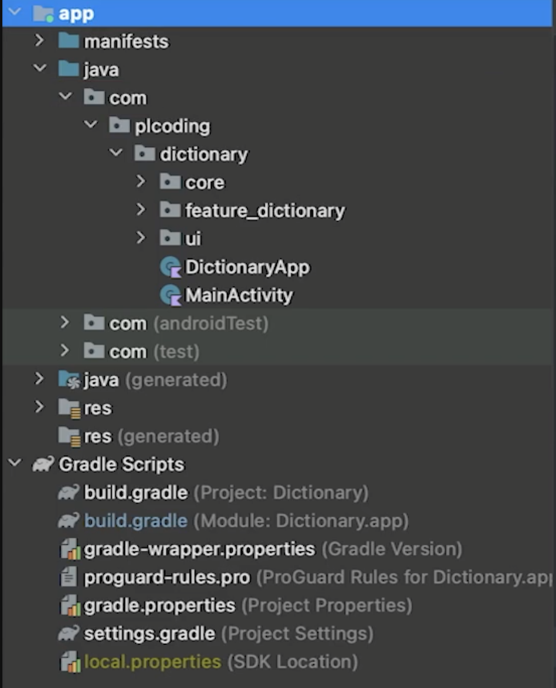
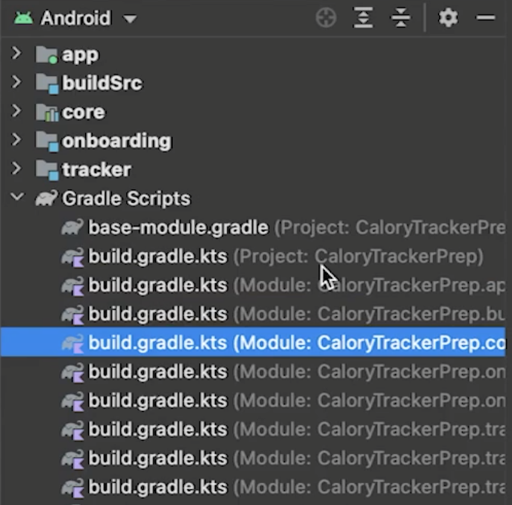
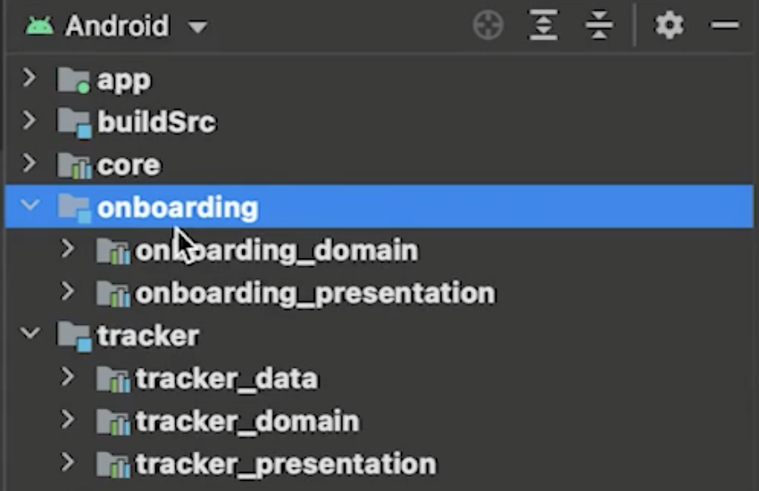

# Introduction

## What is Clean Architecture

클린 아키텍처에 대해 알아보자.

1. Well-scaling apps
2. Easily testable
3. Quickly understandable for others

### How it works

Dividing code base in presentation, domain & data layer

#### Data layer

- Database implementation, remote API, preferences, etc
- Mappers for DB entities & DTOs

#### Domain layer

- The innermost layer
- Contains use cases that contain business logic
- Contains models

#### Presentation layer

- Ui like Composables, Fragments or Activities
- Also contains ViewModels

### Why use cases

- Prevents ViewModels from getting too big
- Helps with readability

## What is a Multi-Module Architecture?

Mutil-Module Architecture가 무엇인지 알아보자.

다음과 같이 `app`을 하나의 모듈이라 한다. 루트 디렉토리에 여러개의 모듈이 있을 수 있다. 멀티 모듈일 경우 모듈 당 하나의 `build.gradle` 파일이 존재한다.

## Advantages & Disadvantages of Multiple Modules

Multi-Module의 장점과 단점에 대해 알아보자.

### Pros of Modularization

- Clear separation
    - 독립적인 모듈로 동작하기 때문에 다른 팀의 모듈에 영향이 없음
- Faster Gradle builds
    - 멀티 모듈 아키텍처의 경우 gradle은 멀티 스레딩으로 수행되기 때문에 빠름
    - gradle은 변경이 있는 모듈만 리빌드
- Support for instant apps & dynamic features
    - 개발된 기능을 설치 없이 실행해볼 수 있는 instant app 지원
    - 결과물(앱)에 대해 동적으로 모듈을 변경하거나 포함, 포함하지 않을 수 있음
- Makes parts of your app reusable

### Cons of Modularization

- Lots of initial setup involved
- Not knowing what you’re doing will strongly backfire
    - 이 구조에 대해 잘 알지 못하면 구조를 망가트릴 수 있음
        - 이로 인해 빌드 타임이 길어질 수 있음

## Choosing the Right Modularization Strategy

### Layer-Based Modularization (Bad)

- 3 modules : presentation, domain, data
- Modules are not reusable
- Hard for devs to work in an isolated environment data
- Big modules → Slow build

### Feature-Based Modularization (Good)

- One module per feature
- Size is limited
- Devs can work better in isolation
- Reusable modules
- No clear speration of concerns

### Layered-Feature Modularization

- Modularization by feature with layer sub-modules
- Combines advantages of layer and feature-based modularization

실제 멀티 모듈 프로젝트를 통해 알아보자.

- app
    - 다른 모듈들을 통합하기 때문에 다른 모듈들에 의존함
    - 여기에서 기능을 구현하면 안된다.
- buildSrc
    - 빌드 환경에 관련됨
    - 나중에 강의 보고 적기
- core
    - 데이터, 클래스 등 다른 모듈에 공유할 것들이 들어가 있음
- onboarding
    - Feature module
- tracker
    - Feature modu