# Setting Up the Module Structure

초기 설정된 [여기](https://github.com/philipplackner/CalorieTracker/tree/initial) 레포지토리에서 클론한다. 기본적인 `theme`가 설정되어 있다.

Root 디렉토리 → New → Module을 통해 모듈을 생성할 수 있다.

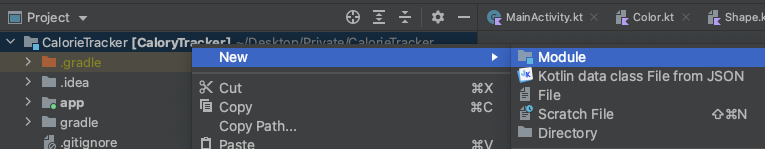

그럼 다음과 같은 다이얼로그가 발생한다. `core` 모듈을 생성한다.

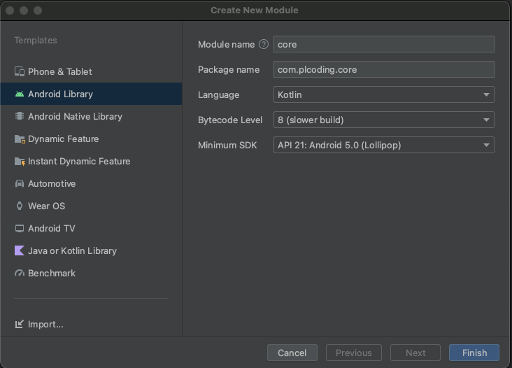

- Android Native Library : NDK
- Android Library : 액티비티, 프레그먼트 들이 필요한 경우
- Java or Kotlin Library : 자바 또는 코틀린의 기능만 필요한 경우

`onboarding` 모듈은 데이터 관련 작업이 없으므로 Java or Kotlin Library로 `onboarding`을 추가한다.

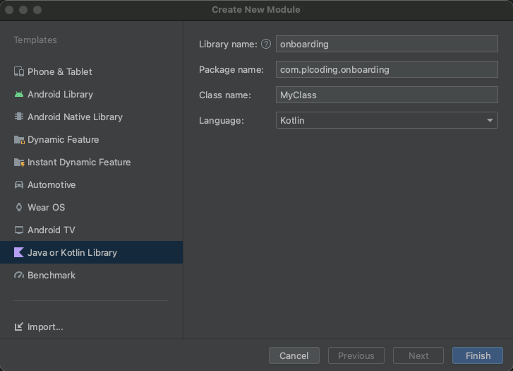

`onboarding` 모듈은 서브모듈만 포함하기 때문에 안의 내용은 모두 삭제한다.

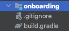

모두 동일한 presentation 이름을 가지고 있으면 gradle이 혼동할 수 있기 때문에 유니크한 이름을 지어주기 위해 presentation 앞에 onboarding을 붙여준다.

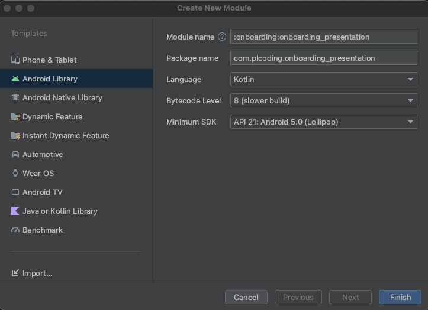

`onboarding` 모듈을 오른쪽 클릭 후 New → Module을 클릭하여 `onboarding_domain`을 만들어준다.

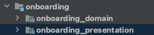

`tracker` feature를 생성한다. `onboarding` 모듈과 동일하게 안의 내용물을 모두 삭제해준다.

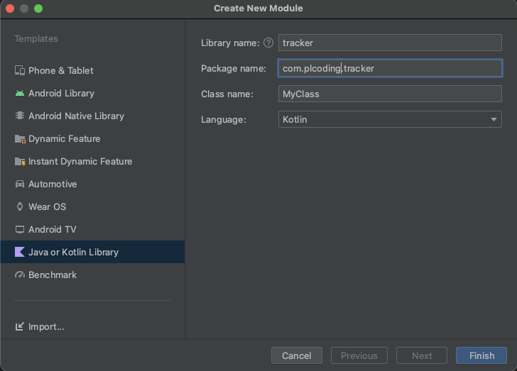

그리고 다음과 같이 3가지 모듈을 추가한다.

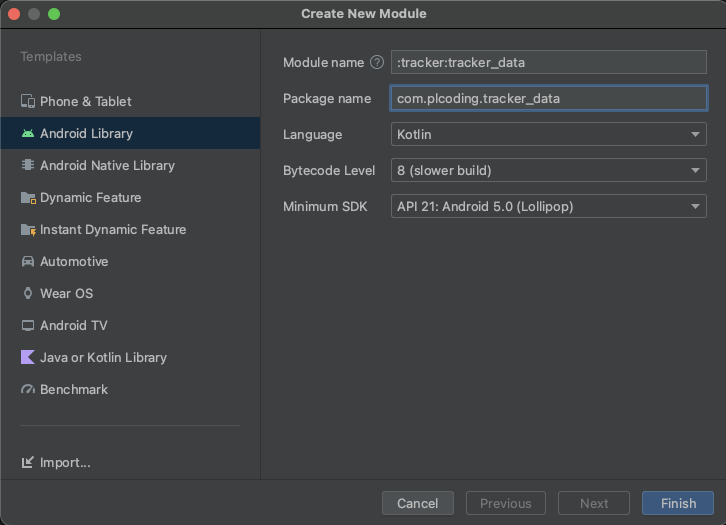

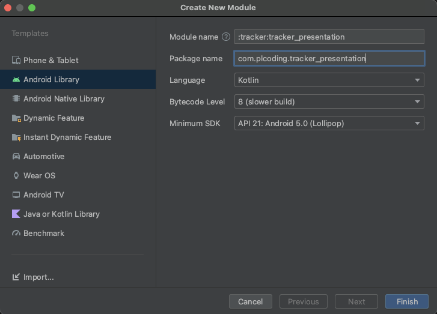

만약 모듈을 삭제하고 싶은 경우 `settings.gradle` 파일에서 제거해주면 된다.

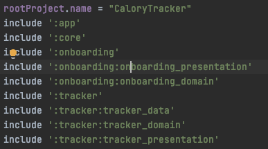

모든 모듈 설정된 디렉토리는 다음과 같다.

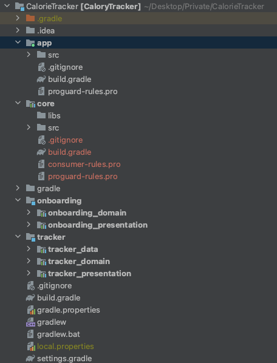

