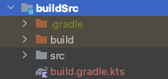

# Migrating to Gradle Kotlin DSL

gradle groovy → gradle kotlin으로 어떻게 변경하는지 알아보자.

Root 디렉토리에 `buildSrc` 디렉토리를 생성해주고, 안에 `src/main/java` 디렉토리를 만들어준다. 그리고 `buildSrc` 디렉토리 하위에 `build.gradle.kts` 파일을 생성한 후
다음과 같이 작성한다.

```kotlin
import org.gradle.kotlin.dsl.`kotlin-dsl`

repositories {
    mavenCentral()
}

plugins {
    `kotlin-dsl`
}
```

Sync Now를 해주면 디렉토리 구성이 다음과 같아진다.

<div align="center">

</div>

`build`와 `.gradle` 폴더를 제외하기 위한 `.gitignore` 파일을 생성하고 다음과 같이 작성해준다.

```
.gradle
build
```

gradle kotlin은 groovy 버전보다 더 편리하다. groovy 버전은 type-safe 하지 않지만 kotlin 버전은 type-safe 하다. 단점은 프로젝트를 생성할 때 kotlin 버전을 선택할 수
없어 마이그레이트를 해주어야 한다.

현재 `minSdk`를 변경하는 경우 모든 모듈의 각 `build.gradle` 파일에서 `minSdk` 버전을 설정해주어야 한다. 이를 쉽게 변경하는 방법은 `minSdk` 변수를 생성하는 것이다.
이를 `buildSrc` 모듈에서 수행한다.

Dagger-Hilt를 설정하는 경우 `buildSrc/src/main/java`에 `DaggerHilt` 오브젝트 파일을 생성한 후 다음과 같이 작성한다.

```kotlin
object DaggerHilt {
    const val version = "2.4.0"
    const val hiltAndroid = "com.google.dagger:hilt-android${version}"
    const val hiltCompiler = "com.google.dagger:hilt-android-compiler${version}"
}
```

[여기서](https://github.com/philipplackner/CalorieTracker/tree/Part2/Migrating_to_Gradle_Kotlin_DSL/buildSrc/src/main/java)
이 프로젝트에서 사용하는 디펜던시에 대한 파일을 얻을 수 있다.

## Project build.gradle migrate to kotlin dsl

다음은 프로젝트 `build.gradle`을 kotlin으로 마이그레이션하는 방법을 알아보자. kotlin 버전에서는 싱글 쿼터를 모두 더블 쿼터로 변경해주어야 한다. `compose_version`은
이미 `buildSrc`에 버전을 설정해놨으므로 위 `ext` 블럭은 삭제해도 된다.

```groovy
ext {
    compose_version = '1.0.1'
}
```

```groovy
ext {
    compose_version = "1.0.1"
}
```

`buildscript` `dependencies`의 각 `classpath`에는 소괄호를 추가해주어야 한다.

```groovy
dependencies {
    classpath "com.android.tools.build:gradle:7.0.4"
    classpath 'org.jetbrains.kotlin:kotlin-gradle-plugin:1.6.10'

    // NOTE: Do not place your application dependencies here; they belong
    // in the individual module build.gradle files
}
```

```groovy
dependencies {
    classpath("com.android.tools.build:gradle:7.0.4")
    classpath("org.jetbrains.kotlin:kotlin-gradle-plugin:1.6.10")

    // NOTE: Do not place your application dependencies here; they belong
    // in the individual module build.gradle files
}
```

`buildSrc`에 버전을 모두 설정해놨으므로 해당 변수를 사용하여 작성한다.

```groovy
dependencies {
    classpath(Build.androidBuildTools)
    classpath(Build.hiltAndroidGradlePlugin)
    classpath(Build.kotlinGradlePlugin)

    // NOTE: Do not place your application dependencies here; they belong
    // in the individual module build.gradle files
}
```

`clean` task는 다음과 같이 변경하면 된다.

```groovy
task clean(type: Delete) {
    delete rootProject.buildDir
}
```

```kotlin
tasks.register("clean", Delete::class) {
    delete(rootProject.buildDir)
}
```

## App build.gradle migrate to kotlin dsl

`app` `build.gradle`의 `plugins` 블럭을 2개의 플러그인 추가하여 다음과 같이 변경해준다.

```groovy
plugins {
    id 'com.android.application'
    id 'kotlin-android'
}
```

```kotlin
plugins {
    id("com.android.application")
    kotlin("android")
    id("dagger.hilt.android.plugin")
    id("kotlin-kapt")
}
```

그리고 `android` 블럭과 `dependencies` 블럭을 다음과 같이 변경해준다.

```groovy
android {
    compileSdk 32

    defaultConfig {
        applicationId "com.plcoding.calorytracker"
        minSdk 21
        targetSdk 32
        versionCode 1
        versionName "1.0"

        testInstrumentationRunner "androidx.test.runner.AndroidJUnitRunner"
        vectorDrawables {
            useSupportLibrary true
        }
    }

    buildTypes {
        release {
            minifyEnabled false
            proguardFiles getDefaultProguardFile('proguard-android-optimize.txt'), 'proguard-rules.pro'
        }
    }
    compileOptions {
        sourceCompatibility JavaVersion.VERSION_1_8
        targetCompatibility JavaVersion.VERSION_1_8
    }
    kotlinOptions {
        jvmTarget = '1.8'
        useIR = true
    }
    buildFeatures {
        compose true
    }
    composeOptions {
        kotlinCompilerExtensionVersion compose_version
        kotlinCompilerVersion '1.5.21'
    }
    packagingOptions {
        resources {
            excludes += '/META-INF/{AL2.0,LGPL2.1}'
        }
    }
}

dependencies {

    implementation 'androidx.core:core-ktx:1.7.0'
    implementation 'androidx.appcompat:appcompat:1.4.0'
    implementation 'com.google.android.material:material:1.4.0'
    implementation "androidx.compose.ui:ui:$compose_version"
    implementation "androidx.compose.material:material:$compose_version"
    implementation "androidx.compose.ui:ui-tooling-preview:$compose_version"
    implementation 'androidx.lifecycle:lifecycle-runtime-ktx:2.4.0'
    implementation 'androidx.activity:activity-compose:1.4.0'
    testImplementation 'junit:junit:4.+'
    androidTestImplementation 'androidx.test.ext:junit:1.1.3'
    androidTestImplementation 'androidx.test.espresso:espresso-core:3.4.0'
    androidTestImplementation "androidx.compose.ui:ui-test-junit4:$compose_version"
    debugImplementation "androidx.compose.ui:ui-tooling:$compose_version"
}
```

```kotlin
android {
    compileSdk = ProjectConfig.compileSdk

    defaultConfig {
        applicationId = ProjectConfig.appId
        minSdk = ProjectConfig.minSdk
        targetSdk = ProjectConfig.targetSdk
        versionCode = ProjectConfig.versionCode
        versionName = ProjectConfig.versionName

        testInstrumentationRunner = "androidx.test.runner.AndroidJUnitRunner"
        vectorDrawables {
            useSupportLibrary = true
        }
    }

    buildTypes {
        getByName("release") {
            isMinifyEnabled = false
        }
    }
    buildFeatures {
        compose = true
    }
    compileOptions {
        sourceCompatibility = JavaVersion.VERSION_1_8
        targetCompatibility = JavaVersion.VERSION_1_8
    }
    kotlinOptions {
        jvmTarget = "1.8"
    }
    composeOptions {
        kotlinCompilerExtensionVersion = Compose.composeCompilerVersion
    }
    packagingOptions {
        exclude("META-INF/AL2.0")
        exclude("META-INF/LGPL2.1")
        exclude("**/attach_hotspot_windows.dll")
        exclude("META-INF/licenses/ASM")
    }
}

dependencies {
    implementation(Compose.compiler)
    implementation(Compose.ui)
    implementation(Compose.uiToolingPreview)
    implementation(Compose.hiltNavigationCompose)
    implementation(Compose.material)
    implementation(Compose.runtime)
    implementation(Compose.navigation)
    implementation(Compose.viewModelCompose)
    implementation(Compose.activityCompose)

    implementation(DaggerHilt.hiltAndroid)
    kapt(DaggerHilt.hiltCompiler)

    implementation(project(Modules.core))
    implementation(project(Modules.onboardingPresentation))
    implementation(project(Modules.onboardingDomain))
    implementation(project(Modules.trackerPresentation))
    implementation(project(Modules.trackerDomain))
    implementation(project(Modules.trackerData))

    implementation(AndroidX.coreKtx)
    implementation(AndroidX.appCompat)

    implementation(Coil.coilCompose)

    implementation(Google.material)

    implementation(Retrofit.okHttp)
    implementation(Retrofit.retrofit)
    implementation(Retrofit.okHttpLoggingInterceptor)
    implementation(Retrofit.moshiConverter)

    kapt(Room.roomCompiler)
    implementation(Room.roomKtx)
    implementation(Room.roomRuntime)

    testImplementation(Testing.junit4)
    testImplementation(Testing.junitAndroidExt)
    testImplementation(Testing.truth)
    testImplementation(Testing.coroutines)
    testImplementation(Testing.turbine)
    testImplementation(Testing.composeUiTest)
    testImplementation(Testing.mockk)
    testImplementation(Testing.mockWebServer)

    androidTestImplementation(Testing.junit4)
    androidTestImplementation(Testing.junitAndroidExt)
    androidTestImplementation(Testing.truth)
    androidTestImplementation(Testing.coroutines)
    androidTestImplementation(Testing.turbine)
    androidTestImplementation(Testing.composeUiTest)
    androidTestImplementation(Testing.mockkAndroid)
    androidTestImplementation(Testing.mockWebServer)
    androidTestImplementation(Testing.hiltTesting)
    kaptAndroidTest(DaggerHilt.hiltCompiler)
    androidTestImplementation(Testing.testRunner)
}
```

## Other modules migrate to kotlin dsl

다른 모듈이 공유하는 모듈을 정의하기 위해 Root에 `base-module.gradle` 파일을 생성한다. 모듈들은 이 파일을 상속해 사용하기만 하면 된다.

```groovy
apply plugin: 'com.android.library'
apply plugin: 'kotlin-android'
apply plugin: 'kotlin-kapt'
apply plugin: 'kotlin-parcelize'

android {
    compileSdk ProjectConfig.compileSdk

            defaultConfig {
                minSdk ProjectConfig.minSdk
                        targetSdk ProjectConfig.targetSdk
                        versionCode ProjectConfig.versionCode
                        versionName ProjectConfig.versionName

                        testInstrumentationRunner "androidx.test.runner.AndroidJUnitRunner"
                consumerProguardFiles "consumer-rules.pro"
            }
    buildTypes {
        release {
            minifyEnabled false
            proguardFiles getDefaultProguardFile('proguard-android-optimize.txt'), 'proguard-rules.pro'
        }
    }
    compileOptions {
        coreLibraryDesugaringEnabled true

        sourceCompatibility JavaVersion.VERSION_1_8
                targetCompatibility JavaVersion.VERSION_1_8
    }
    kotlinOptions {
        jvmTarget = '1.8'
    }
}

dependencies {
    kapt DaggerHilt.hiltCompiler
            implementation DaggerHilt.hiltAndroid

            testImplementation Testing.junit4
            testImplementation Testing.junitAndroidExt
            testImplementation Testing.truth
            testImplementation Testing.coroutines
            testImplementation Testing.turbine
            testImplementation Testing.composeUiTest
            testImplementation Testing.mockk
            testImplementation Testing.mockWebServer

            androidTestImplementation Testing.junit4
            androidTestImplementation Testing.junitAndroidExt
            androidTestImplementation Testing.truth
            androidTestImplementation Testing.coroutines
            androidTestImplementation Testing.turbine
            androidTestImplementation Testing.composeUiTest
            androidTestImplementation Testing.mockk
            androidTestImplementation Testing.mockWebServer
            androidTestImplementation Testing.hiltTesting
}
```

여기서 하나의 문제가 발생한다. presentation 모듈에서만 compose를 사용하기 원하는데 `base-module.gradle`에 다음 코드를 작성한 경우 모든 모듈에서 compose를 사용하게 된다.

```groovy
buildFeatures {
    compose true
}
```

따라서 `compose-module.gradle`을 별도로 생성해 presentation에만 적용하도록 하면 된다.

```groovy
apply plugin: 'com.android.library'
apply plugin: 'kotlin-android'
apply plugin: 'kotlin-kapt'
apply plugin: 'kotlin-parcelize'

android {
    compileSdk ProjectConfig.compileSdk

    defaultConfig {
        minSdk ProjectConfig.minSdk
        targetSdk ProjectConfig.targetSdk
        versionCode ProjectConfig.versionCode
        versionName ProjectConfig.versionName

        testInstrumentationRunner "androidx.test.runner.AndroidJUnitRunner"
        consumerProguardFiles "consumer-rules.pro"
    }
    buildFeatures {
        compose true
    }
    composeOptions {
        kotlinCompilerExtensionVersion Compose.composeCompilerVersion
    }
    buildTypes {
        release {
            minifyEnabled false
            proguardFiles getDefaultProguardFile('proguard-android-optimize.txt'), 'proguard-rules.pro'
        }
    }
    compileOptions {
        coreLibraryDesugaringEnabled true

        sourceCompatibility JavaVersion.VERSION_1_8
        targetCompatibility JavaVersion.VERSION_1_8
    }
    kotlinOptions {
        jvmTarget = '1.8'
    }
}

dependencies {
    implementation Compose.compiler
    implementation Compose.ui
    implementation Compose.uiToolingPreview
    implementation Compose.hiltNavigationCompose
    implementation Compose.material
    implementation Compose.runtime
    implementation Compose.navigation
    implementation Compose.viewModelCompose
    implementation Compose.activityCompose

    kapt DaggerHilt.hiltCompiler
    implementation DaggerHilt.hiltAndroid

    testImplementation Testing.junit4
    testImplementation Testing.junitAndroidExt
    testImplementation Testing.truth
    testImplementation Testing.coroutines
    testImplementation Testing.turbine
    testImplementation Testing.composeUiTest
    testImplementation Testing.mockk
    testImplementation Testing.mockWebServer

    androidTestImplementation Testing.junit4
    androidTestImplementation Testing.junitAndroidExt
    androidTestImplementation Testing.truth
    androidTestImplementation Testing.coroutines
    androidTestImplementation Testing.turbine
    androidTestImplementation Testing.composeUiTest
    androidTestImplementation Testing.mockk
    androidTestImplementation Testing.mockWebServer
    androidTestImplementation Testing.hiltTesting
}
```

### core

`core`의 `build.gradle.kts`를 생성한 후 다음과 같이 작성해준다. `base-module.gradle`에 없는 디펜던시는 `dependencies` 블록에 추가하면 된다.

```groovy
apply {
    from("$rootDir/base-module.gradle")
}

dependencies {

}
```

### onboarding_domain

```groovy
apply {
    from("$rootDir/base-module.gradle")
}

dependencies {
    "implementation"(project(Modules.core))
}
```

### onboarding_presentation

`onboardingDomain`을 추가한다. 이 구조(feature-based)로 구현하게 되면 `onboarding_data`가 있는 경우 `onboardingDomain`에 포함되기 때문에
presentation에서는 해당 모듈을 알 수 없는 장점이 있다.

```groovy
apply {
    from("$rootDir/compose-module.gradle")
}

dependencies {
    "implementation"(project(Modules.core))
    "implementation"(project(Modules.onboardingDomain))
}
```

### tracker_data

```groovy
apply {
    from("$rootDir/base-module.gradle")
}

dependencies {
    "implementation"(project(Modules.core))
    "implementation"(project(Modules.trackerDomain))

    "implementation"(Retrofit.okHttp)
    "implementation"(Retrofit.retrofit)
    "implementation"(Retrofit.okHttpLoggingInterceptor)
    "implementation"(Retrofit.moshiConverter)

    "kapt"(Room.roomCompiler)
    "implementation"(Room.roomKtx)
    "implementation"(Room.roomRuntime)
}
```

### tracker_domain

```groovy
apply {
    from("$rootDir/base-module.gradle")
}

dependencies {
    "implementation"(project(Modules.core))
}
```

### tracker_presentation

```groovy
apply {
    from("$rootDir/compose-module.gradle")
}

dependencies {
    "implementation"(project(Modules.core))
    "implementation"(project(Modules.trackerDomain))

    "implementation"(Coil.coilCompose)
}
```