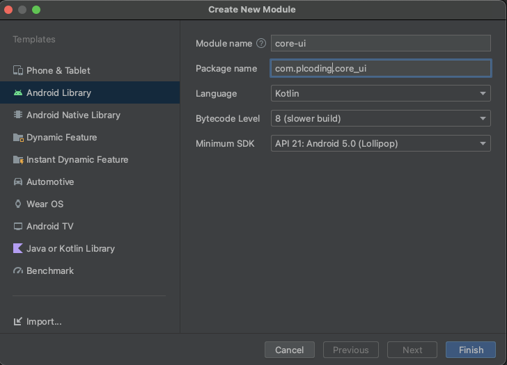
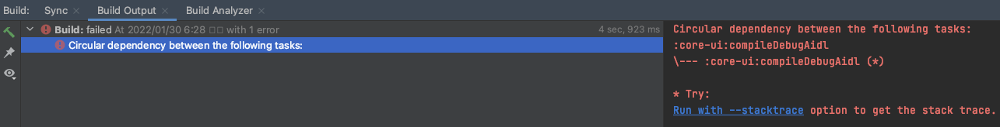
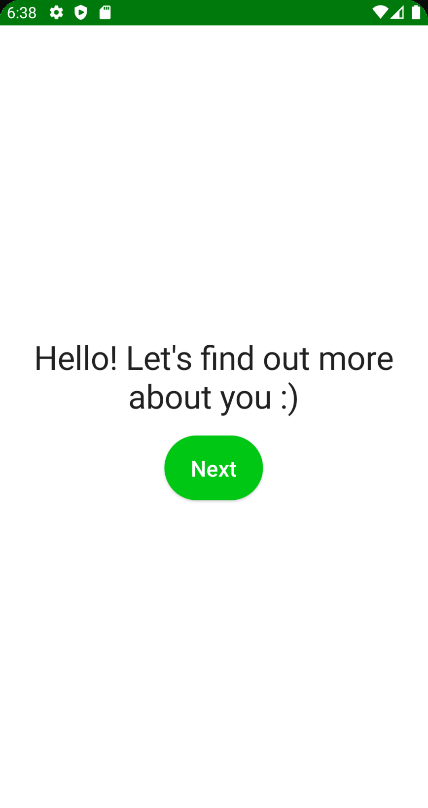

# Welcom Screen & Utility

실제 코딩을 수행하는 첫 번째 화면으로 환영하는 스크린을 만들어보자.

Welcom 화면은 `onboarding` feature에 포함되므로 `onboarding` 모듈에서 작성한다.

`core`의 string resource를 사용해 텍스트를 보여줄 것이므로 `core`의 `res` 하위에 `strings.xml`을 추가한다.

```xml

<resources>
    <string name="app_name">CaloryTrackerPrep</string>
    <string name="error_unknown">Unknown error</string>
    <string name="welcome_text">Hello! Let\'s find out more about you :)</string>
    <string name="lets_go">Let\'s go</string>
    <string name="whats_your_gender">What is your gender?</string>
    <string name="male">Male</string>
    <string name="female">Female</string>
    <string name="whats_your_age">What\'s your age?</string>
    <string name="next">Next</string>
    <string name="whats_your_height">What\'s your height?</string>
    <string name="kg">kg</string>
    <string name="cm">cm</string>
    <string name="error_age_cant_be_empty">The age can\'t be empty</string>
    <string name="error_height_cant_be_empty">The height can\'t be empty</string>
    <string name="error_weight_cant_be_empty">The weight can\'t be empty</string>
    <string name="kcal">kcal</string>
    <string name="carbs">Carbs</string>
    <string name="protein">Protein</string>
    <string name="fat">Fat</string>
    <string name="previous_day">Previous day</string>
    <string name="next_day">Next day</string>
    <string name="yesterday">Yesterday</string>
    <string name="tomorrow">Tomorrow</string>
    <string name="nutrient_info">%dg • %dkcal</string>
    <string name="amount_info">%dg</string>
    <string name="grams">g</string>
    <string name="extend">Extend</string>
    <string name="collapse">Collapse</string>
    <string name="breakfast">Breakfast</string>
    <string name="lunch">Lunch</string>
    <string name="dinner">Dinner</string>
    <string name="snacks">Snacks</string>
    <string name="add_meal">Add %s</string>
    <string name="add">Add</string>
    <string name="search">Search...</string>
    <string name="today">Today</string>
    <string name="recent">Recent</string>
    <string name="kcal_per_100g">%dkcal / 100g</string>
    <string name="track">Track</string>
    <string name="error_something_went_wrong">Oops, something went wrong!</string>
    <string name="no_results">No results</string>
    <string name="error_invalid_values">These are not valid values</string>
    <string name="what_are_your_nutrient_goals">What are your nutrient goals?</string>
    <string name="percent_proteins">% proteins</string>
    <string name="percent_fats">% fats</string>
    <string name="percent_carbs">% carbs</string>
    <string name="high">High</string>
    <string name="medium">Medium</string>
    <string name="years">years</string>
    <string name="whats_your_weight">What\'s your weight?</string>
    <string name="low">Low</string>
    <string name="gain">Gain</string>
    <string name="keep">Keep</string>
    <string name="lose">Lose</string>
    <string name="lose_keep_or_gain_weight">Do you want to lose, keep or gain weight?</string>
    <string name="whats_your_activity_level">What\'s your activity level?</string>
    <string name="error_not_100_percent">The values must add up to 100%</string>
    <string name="your_goal">Your goal:</string>
    <string name="delete">Delete</string>
</resources>
```

Spacer의 기본 간격을 설정하기 위해 `core` 모듈에 `Dimensions` 파일을 생성해보자. `core` 모듈엔 compose 라이브러리가 포함되어 있지 않아 다음과 같이 작성하면 에러가 발생한다. 단순히
base-module에 compose 라이브러리를 추가하여 해결할 수 있지만, 이전에 말했듯 base-module을 사용하는 모든 모듈들에 compose 라이브러리가 포함되게 된다.

```kotlin
data class Dimensions(
        val default: Dp   // Dp 클래스가 없어 에러 발생
)
```

`core-ui` 모듈을 따로 생성하면 이 문제를 해결할 수 있다. `core-ui` 모듈을 새로 생성한다.

<div align="center">

</div>

`core-ui` 모듈의 `build.gradle.kts` 파일을 다음과 같이 작성하고 기존 `build.gradle` 파일은 삭제한다. 그 후 Sync Now를 눌러 동기화시킨다.

```groovy
apply {
    from("$rootDir/compose-module.gradle")
}

dependencies {

}
```

그 후 `core` 모듈에 정의한 `Dimensions` 파일을 `core-ui` 모듈로 이동시킨다.

```kotlin
// 화면에 따라 다르게 보여지길 원할 때 이 클래스 사용
data class Dimensions(
        val default: Dp = 0.dp,
        val spaceExtraSmall: Dp = 4.dp,
        val spaceSmall: Dp = 8.dp,
        val spaceMedium: Dp = 16.dp,
        val spaceLarge: Dp = 32.dp,
        val spaceExtraLarge: Dp = 64.dp
)

// modifier의 파라미터로 전달하기 위함
val LocalSpacing = compositionLocalOf { Dimensions() }
```

`buildSrc`의 `Module`에 `coreUi`를 추가한 후 `app` 모듈에 `coreUi` 디펜던시를 추가한다. 그 후 Sync Now를 눌러 동기화시켜준다.

```kotlin
        // ...
const val core = ":core"
const val coreUi = ":core-ui"
// ...
```

```groovy
dependencies {
    // ...
    implementation(project(Modules.core))
    implementation(project(Modules.coreUi))
    // ...
}
```

그 다음 `app` 모듈의 `theme.kt`에 `CompositionLocalProvider(LocalSpacing provides Dimensions())` 블록을 추가해준다. 이제 어느
곳에서든 `LocalSpacing`을 사용할 수 있다.

```kotlin
@Composable
fun CaloryTrackerTheme(darkTheme: Boolean = isSystemInDarkTheme(), content: @Composable() () -> Unit) {
    val colors = if (darkTheme) {
        DarkColorPalette
    } else {
        LightColorPalette
    }
    CompositionLocalProvider(LocalSpacing provides Dimensions()) {
        MaterialTheme(
                colors = colors,
                typography = Typography,
                shapes = Shapes,
                content = content
        )
    }
}
```

사용하고자 하는 모듈에 `coreUi` 디펜던시를 추가한다. 여기의 경우 `compose-module.gradle` 파일에 추가하면 된다.

```groovy
dependencies {
    // ...
    implementation project (Modules.coreUi)
    // ...
}
```

환영 화면에서 보여줄 `ActionButton`을 생성한다.

```kotlin
@Composable
fun ActionButton(
        text: String,
        onClick: () -> Unit,
        modifier: Modifier = Modifier,
        isEnabled: Boolean = true,
        textStyle: TextStyle = MaterialTheme.typography.button
) {
    Button(
            onClick = onClick,
            modifier = modifier,
            enabled = isEnabled,
            shape = RoundedCornerShape(100.dp)
    ) {
        Text(
                text = text,
                style = textStyle,
                color = MaterialTheme.colors.onPrimary,
                // LocalSpacing 사용해 쉽게 적용할 수 있다.
                modifier = Modifier.padding(LocalSpacing.current.spaceSmall)
        )
    }
}
```

`welcome/` 패키지를 생성하고 하위에 `WelcomScreen.kt` 파일을 생성한다.

```kotlin
@Composable
fun WelcomScreen() {
    // Spacing
    val spacing = LocalSpacing.current
    Column(
            modifier = Modifier
                    .fillMaxSize()
                    .padding(spacing.spaceMedium),
            horizontalAlignment = Alignment.CenterHorizontally,
            verticalArrangement = Arrangement.Center
    ) {
        Text(
                text = stringResource(id = R.string.welcome_text),
                textAlign = TextAlign.Center,
                style = MaterialTheme.typography.h1
        )
        Spacer(modifier = Modifier.height(spacing.spaceMedium))
        ActionButton(
                text = stringResource(id = R.string.next),
                onClick = { /*TODO*/ }, // later
                modifier = Modifier.align(Alignment.CenterHorizontally)
        )
    }
}
```

`MainActivity`에  `WelcomScreen()`을 추가하고 빌드해보자.

```kotlin
class MainActivity : ComponentActivity() {
    override fun onCreate(savedInstanceState: Bundle?) {
        super.onCreate(savedInstanceState)
        setContent {
            CaloryTrackerTheme {
                WelcomScreen()
            }
        }
    }
}
```

`compose-module.gradle`이 `core-ui.gradle`에 의존되고 있고, `core-ui.gradle`이 `compose-module.gradle`에 의존되고 있다. 즉, 모듈 A가 모듈 B를
의존하고, 모듈 B가 모듈 A에 의존하여 다음과 같은 문제가 발생한다.

<div align="center">

</div>

`compose-module.gradle`에서 `Modules.coreUi` 디펜던시를 제거하고 `onboarding_presentation`, `tracker_presentation` gradle에 추가해준다.

```kotlin
dependencies {
    "implementation"(project(Modules.core))
    "implementation"(project(Modules.onboardingDomain))
    "implementation"(project(Modules.coreUi))
}
```

<div align="center">

</div>

## References

* [Locally scoped data with CompositionLocal](https://developer.android.com/jetpack/compose/compositionlocal?hl=ko)
* [CompositionLocal - Jetpack Compose Playground](https://foso.github.io/Jetpack-Compose-Playground/general/compositionlocal/)