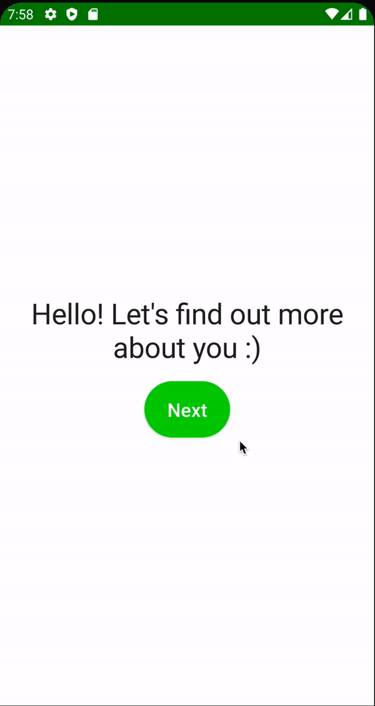

# Navigation Util

이번엔 Navigation을 구현해보자.

`core` 모듈에 `util` 패키지를 만들고 `UiEvent` sealed class를 생성해준다. ViewModel에서 Composable로 보낼 이벤트들을 이 sealed class에서 구현해주면 된다.

```kotlin
sealed class UiEvent {
    data class Navigate(val route: String) : UiEvent()
    object NavigateUp : UiEvent()
}
```

`onboarding` 모듈의 `WelcomScreen.kts`에 다음과 같이 `onNavigate` 콜백을 파라미터로 전달한다. `NavController`를 파라미터로 전달하는 것은 `NavController`를
Mock 객체로 만들어주어야 하기 때문에 testability를 떨어트린다. 콜백을 전달하면 쉽게 네비게이션에 대해 테스트 검증이 가능하다.

```kotlin
@Composable
fun WelcomScreen(
        onNavigate: (UiEvent.Navigate) -> Unit
) {
    // ...
}
```

네비게이션을 위해 `core` 모듈에 `navigation` 패키지를 만들고 `Route`를 생성한다.

```kotlin
object Route {
    const val WELCOME = "welcome"
    const val AGE = "age"
    const val GENDER = "gender"
    const val HEIGHT = "height"
    const val WEIGHT = "weight"
    const val NUTRIENT_GOAL = "nutrient_goal"
    const val ACTIVITY = "activity"
    const val GOAL = "gaol"

    const val TRACKER_OVERVIEW = "tracker_overview"
    const val SEARCH = "search"
}
```

`app` 모듈에 `navigation` 패키지를 만들고 다음과 같은 확장함수를 작성한다.

```kotlin
fun NavController.navigate(event: UiEvent.Navigate) {
    this.navigate(event.route)
}
```

`app` 모듈의 `MainActivity`에 다음과 같이 각 `Route` 별로 composable을 구성해준다.

```kotlin
class MainActivity : ComponentActivity() {
    override fun onCreate(savedInstanceState: Bundle?) {
        super.onCreate(savedInstanceState)
        setContent {
            CaloryTrackerTheme {
                val navController = rememberNavController()
                NavHost(
                        navController = navController,
                        startDestination = Route.WELCOME
                ) {
                    composable(route = Route.WELCOME) {
                        // navController::navigate 전달
                        WelcomScreen(onNavigate = navController::navigate)
                    }
                    composable(route = Route.AGE) {

                    }
                    composable(route = Route.GENDER) {

                    }
                    composable(route = Route.HEIGHT) {

                    }
                    composable(route = Route.WEIGHT) {

                    }
                    composable(route = Route.NUTRIENT_GOAL) {

                    }
                    composable(route = Route.ACTIVITY) {

                    }
                    composable(route = Route.GOAL) {

                    }

                    composable(route = Route.TRACKER_OVERVIEW) {

                    }
                    composable(route = Route.SEARCH) {

                    }
                }
            }
        }
    }
}
```

`WelcomScreen.kts`의 `ActionButton` `onClick`에 파라미터로 전달된 람다를 호출한다.

```kotlin
@Composable
fun WelcomScreen(
        onNavigate: (UiEvent.Navigate) -> Unit
) {
    // ...
    Spacer(modifier = Modifier.height(spacing.spaceMedium))
    ActionButton(
            text = stringResource(id = R.string.next),
            onClick = { onNavigate(UiEvent.Navigate(Route.AGE)) },
            modifier = Modifier.align(Alignment.CenterHorizontally)
    )
}
```

아직 `route.AGE`가 구현되지 않아 빈 화면이 출력된다.

<div align="center">

</div>
