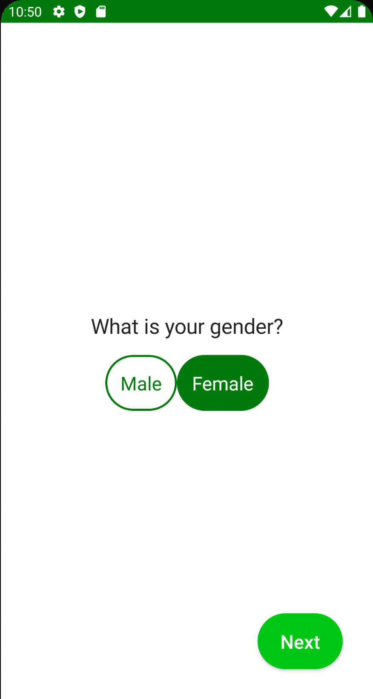
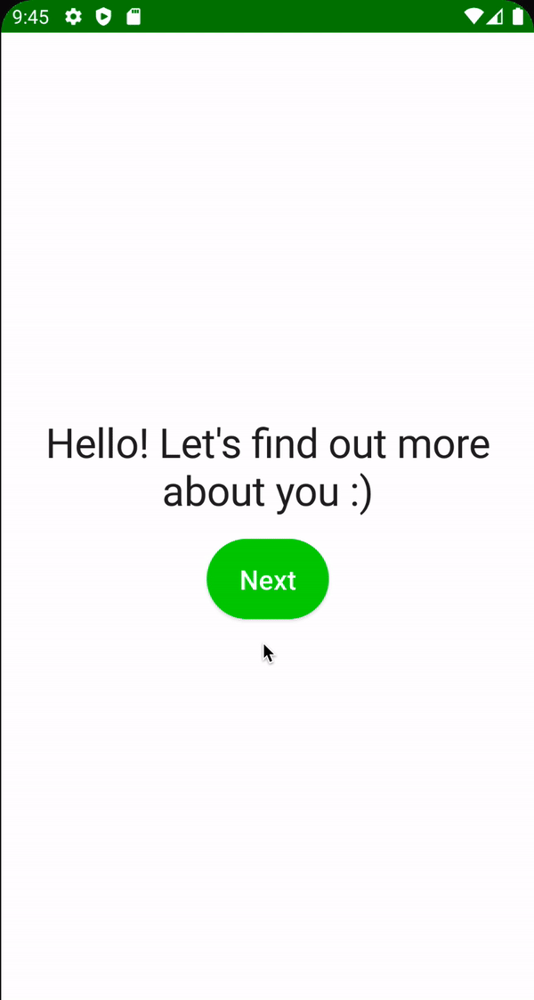

# Gender Screen

Gender를 선택하는 화면을 만들어보자. `onboarding_presentation` 모듈에 `gender` 패키지를 생성한다. 성별을 선택하는 state가 존재하기 때문에 `GenderViewModel.kt`을
만들어준다.

```kotlin
@HiltViewModel
class GenderViewModel @Inject constructor(
        private val preferences: Preferences
) : ViewModel() {

    var selectedGender by mutableStateOf<Gender>(Gender.Male)
        private set

    // one time event
    private val _uiEvent = Channel<UiEvent>()
    val uiEvent = _uiEvent.receiveAsFlow()

    fun onGenderClick(gender: Gender) {
        selectedGender = gender
    }

    fun onNextClick() {
        viewModelScope.launch {
            preferences.saveGender(selectedGender)
            _uiEvent.send(UiEvent.Navigate(Route.AGE))
        }
    }
}
```

`GenderScreen.kt` 파일을 만들고 다음과 같이 작성한다.

```kotlin
@Composable
fun GenderScreen(
        onNavigate: (UiEvent.Navigate) -> Unit,
        viewModel: GenderViewModel = hiltViewModel()
) {
    val spacing = LocalSpacing.current
    // ViewModel에서 전달하는 이벤트를 collect 하기 위함
    LaunchedEffect(key1 = true) {
        viewModel.uiEvent.collect { event ->
            when (event) {
                is UiEvent.Navigate -> onNavigate(event)
                else -> Unit
            }
        }
    }
    Box(
            modifier = Modifier
                    .fillMaxSize()
                    .padding(spacing.spaceLarge)
    ) {
        Column(
                modifier = Modifier.fillMaxSize(),
                verticalArrangement = Arrangement.Center,
                horizontalAlignment = Alignment.CenterHorizontally
        ) {
            Text(
                    text = stringResource(id = R.string.whats_your_gender),
                    style = MaterialTheme.typography.h3
            )
            Spacer(modifier = Modifier.height(spacing.spaceMedium))
            Row {
                SelectableButton(
                        text = stringResource(id = R.string.male),
                        isSelected = viewModel.selectedGender is Gender.Male,
                        color = MaterialTheme.colors.primaryVariant,
                        selectedTextColor = Color.White,
                        onClick = {
                            viewModel.onGenderClick(Gender.Male)
                        },
                        textStyle = MaterialTheme.typography.button.copy(
                                fontWeight = FontWeight.Normal
                        )
                )
                SelectableButton(
                        text = stringResource(id = R.string.female),
                        isSelected = viewModel.selectedGender is Gender.Female,
                        color = MaterialTheme.colors.primaryVariant,
                        selectedTextColor = Color.White,
                        onClick = {
                            viewModel.onGenderClick(Gender.Female)
                        },
                        textStyle = MaterialTheme.typography.button.copy(
                                fontWeight = FontWeight.Normal
                        )
                )
            }
        }
        ActionButton(
                text = stringResource(id = R.string.next),
                onClick = viewModel::onNextClick,
                modifier = Modifier.align(Alignment.BottomEnd)
        )
    }
}
```

그 다음 `app` 모듈의 `MainActivity`에 `GenderScreen()` composable을 추가한다.

```kotlin
class MainActivity : ComponentActivity() {
    override fun onCreate(savedInstanceState: Bundle?) {
        super.onCreate(savedInstanceState)
        setContent {
            CaloryTrackerTheme {
                val navController = rememberNavController()
                NavHost(
                        navController = navController,
                        startDestination = Route.WELCOME
                ) {
                    // ...
                    composable(route = Route.GENDER) {
                        GenderScreen(onNavigate = navController::navigate)
                    }
                    // ...
                }
            }
        }
    }
}
```

`WelcomScreen`에서 `ActionButton` 클릭 시 `Route.AGE`로 되어있던 부분을 `Route.GENDER`로 변경한다.

```kotlin
@Composable
fun WelcomScreen(
        onNavigate: (UiEvent.Navigate) -> Unit
) {
    // ...
    Column(
            // ...
    ) {
        //...
        ActionButton(
                text = stringResource(id = R.string.next),
                onClick = { onNavigate(UiEvent.Navigate(Route.GENDER)) },
                modifier = Modifier.align(Alignment.CenterHorizontally)
        )
    }
}
```

실행을 확인해보면 다음과 같은 에러가 발생한다.

```
java.lang.IllegalStateException: Given component holder class com.plcoding.calorytracker.MainActivity does not implement interface dagger.hilt.internal.GeneratedComponent or interface dagger.hilt.internal.GeneratedComponentManager
```

`app` 모듈의 `MainActivity`에 `@AndroidEntryPoint` 어노테이션을 추가하면 에러 없이 실행된다.

```kotlin
@AndroidEntryPoint
class MainActivity : ComponentActivity() {
    // ...
}
```

Male과 Female 사이 Spacing이 되어있지 않다.

<div align="center">

</div>


`GenderScreen`에 Male과 Female 버튼 사이 Spacing을 추가하자.

```kotlin
SelectableButton(
        // ...
)
Spacer(modifier = Modifier.width(spacing.spaceMedium))
SelectableButton(
        // ...
)
```

<div align="center">

</div>