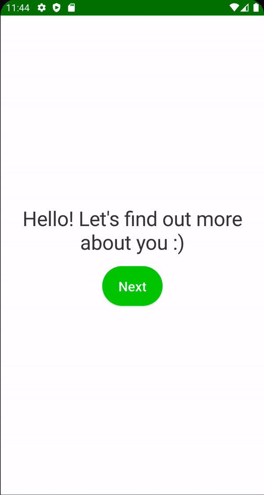

# Age Screen

Gender Screen과 비슷한 Age Screen을 만들자. `onboarding_presentation` 모듈에 `age` 패키지를 생성한 후 우선 `AgeViewModel.kt`를 작성한다.

```kotlin
@HiltViewModel
class AgeViewModel @Inject constructor(
        private val preferences: Preferences
) : ViewModel() {

    var age by mutableStateOf("20")
        private set

    // one time event
    private val _uiEvent = Channel<UiEvent>()
    val uiEvent = _uiEvent.receiveAsFlow()

    fun onAgeEnter(age: String) {
        if (age.length <= 3) {
            // 숫자만 입력되도록 filter를 적용
            this.age = age.filter { it.isDigit() }
        }
    }
}
```

만약 엄격하게 클린 아키텍처를 적용하는 경우 위 `age.filter`는 비즈니스 로직이므로 허용하지 않기 때문에 따로 use case를 구형해주어야 한다. 따라서 `core` 모듈에 `domain/use_case`
패키지에 `FilterOutDigits` 클래스를 작성한다.

```kotlin
class FilterOutDigits {

    // 함수처럼 사용 가능
    operator fun invoke(text: String): String {
        return text.filter { it.isDigit() }
    }
}
```

`app` 모듈의 `AppModule`에 `FilterOutDigits`를 provide 해주는 코드를 작성한다.

```kotlin
@Module
@InstallIn(SingletonComponent::class)
object AppModule {
    // ...
    @Provides
    @Singleton
    fun provideFilterOutDigitsUseCase(): FilterOutDigits {
        return FilterOutDigits()
    }
}
```

생성자에 해당 클래스를 인젝션한 후 다음과 같이 함수처럼 사용할 수 있다.

```kotlin
@HiltViewModel
class AgeViewModel @Inject constructor(
        private val preferences: Preferences,
        private val filterOutDigits: FilterOutDigits
) : ViewModel() {

    ...
    fun onAgeEnter(age: String) {
        if (age.length <= 3) {
            this.age = filterOutDigits(age)
        }
    }
}
```

Next 버튼을 클릭했을 때 `age`가 숫자가 아닌경우 에러 메시지를 출력해야 한다. `core` 모듈의 `util` 패키지에 있는 `UiEvent`에 에러를 보여주기 위한 스낵바 이벤트를 추가한다.

```kotlin
sealed class UiEvent {
    data class Navigate(val route: String) : UiEvent()
    object NavigateUp : UiEvent()
    data class ShowSnackbar(val message: String) : UiEvent()
}
```

스낵바에 메시지를 전달하기 위해 `stringResource`에 접근해야 하지만 `ViewModel`에는 `context`가 없기 때문에 접근할 수 없다. 쉽게 해결할 수 있는 방법은 헬퍼 클래스를 만들어주는
것이다. `core` 모듈의 `util`에 `UiText` 헬퍼 클래스를 작성한다.

```kotlin
sealed class UiText {
    data class DynamicString(val text: String) : UiText()
    data class StringResource(val resId: Int) : UiText()

    fun asString(context: Context): String {
        return when (this) {
            is DynamicString -> text
            is StringResource -> context.getString(resId)
        }
    }
}
```

`UiEvent`의 `ShowSnackbar` 파라미터를 `UiText`로 변경한다.

```kotlin
sealed class UiEvent {
    data class Navigate(val route: String) : UiEvent()
    object NavigateUp : UiEvent()
    data class ShowSnackbar(val message: UiText) : UiEvent()
}
```

그리고 `AgeViewModel`에 `onNextClick()` 함수를 작성해준다.

```kotlin
@HiltViewModel
class AgeViewModel @Inject constructor(
        private val preferences: Preferences,
        private val filterOutDigits: FilterOutDigits
) : ViewModel() {
    ...
    fun onNextClick() {
        viewModelScope.launch {
            val ageNumber = age.toIntOrNull() ?: kotlin.run {
                _uiEvent.send(
                        UiEvent.ShowSnackbar(
                                UiText.StringResource(R.string.error_age_cant_be_empty)
                        )
                )
                return@launch
            }
            preferences.saveAge(ageNumber)
            _uiEvent.send(UiEvent.Navigate(Route.HEIGHT))
        }
    }
}
```

`AgeScreen`에서 스낵바를 보여주어야 하므로 `MainActivity`에 `scaffoldState`를 선언 후 `AgeScreen`에 파라미터로 전달한다.

```kotlin
@AndroidEntryPoint
class MainActivity : ComponentActivity() {
    override fun onCreate(savedInstanceState: Bundle?) {
        super.onCreate(savedInstanceState)
        setContent {
            CaloryTrackerTheme {
                val navController = rememberNavController()
                val scaffoldState = rememberScaffoldState()
                Scaffold(
                        modifier = Modifier.fillMaxSize(),
                        scaffoldState = scaffoldState
                ) {
                    NavHost(
                            navController = navController,
                            startDestination = Route.WELCOME
                    ) {
                        // ...
                        composable(route = Route.AGE) {
                            AgeScreen(
                                    scaffoldState = scaffoldState,
                                    onNavigate = navController::navigate
                            )
                        }
                        // ...
                    }
                }
            }
        }
    }
}
```

그 다음  `AgeScreen`을 다음과 같이 작성해준다.

```kotlin
@Composable
fun AgeScreen(
        scaffoldState: ScaffoldState,
        onNavigate: (UiEvent.Navigate) -> Unit,
        viewModel: AgeViewModel = hiltViewModel()
) {
    val spacing = LocalSpacing.current
    val context = LocalContext.current // ViewModel에서 넘어온 UiText의 StringResource를 unwrap 하기 위함
    // ViewModel에서 전달하는 이벤트를 collect 하기 위함
    LaunchedEffect(key1 = true) {
        viewModel.uiEvent.collect { event ->
            when (event) {
                is UiEvent.Navigate -> onNavigate(event)
                is UiEvent.ShowSnackbar -> {
                    scaffoldState.snackbarHostState.showSnackbar(
                            message = event.message.asString(context) // 헬퍼 클래스 이용하여 unwrap string
                    )
                }
                else -> Unit
            }
        }
    }
    Box(
            modifier = Modifier
                    .fillMaxSize()
                    .padding(spacing.spaceLarge)
    ) {
        Column(
                modifier = Modifier.fillMaxSize(),
                verticalArrangement = Arrangement.Center,
                horizontalAlignment = Alignment.CenterHorizontally
        ) {
            Text(
                    text = stringResource(id = R.string.whats_your_age),
                    style = MaterialTheme.typography.h3
            )
            Spacer(modifier = Modifier.height(spacing.spaceMedium))
            UnitTextField(
                    value = viewModel.age,
                    onValueChange = viewModel::onAgeEnter,
                    unit = stringResource(
                            id = R.string.years
                    )
            )
        }
        ActionButton(
                text = stringResource(id = R.string.next),
                onClick = viewModel::onNextClick,
                modifier = Modifier.align(Alignment.BottomEnd)
        )
    }
}
```

<div align="center">

</div>