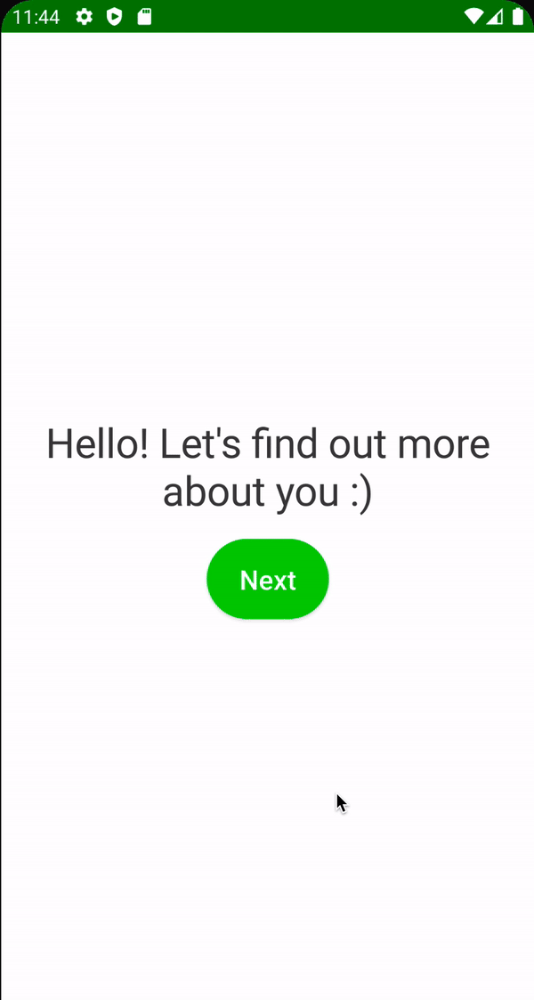

# Height & Weight Screen

Height와 Weight 화면을 만들어보자.

### Height Screen

`onboarding_presentation` 모듈에 `hight` 패키지 생성 후 `AgeViewModel`을 복사하여 `HeightViewModel.kt`를 작성한다.

```kotlin
@HiltViewModel
class HeightViewModel @Inject constructor(
        private val preferences: Preferences,
        private val filterOutDigits: FilterOutDigits
) : ViewModel() {

    var height by mutableStateOf("180")
        private set

    // one time event
    private val _uiEvent = Channel<UiEvent>()
    val uiEvent = _uiEvent.receiveAsFlow()

    fun onHeightEnter(height: String) {
        if (height.length <= 3) {
            this.height = filterOutDigits(height)
        }
    }

    fun onNextClick() {
        viewModelScope.launch {
            val heightNumber = height.toIntOrNull() ?: kotlin.run {
                _uiEvent.send(
                        UiEvent.ShowSnackbar(
                                UiText.StringResource(R.string.error_height_cant_be_empty)
                        )
                )
                return@launch
            }
            preferences.saveHeight(heightNumber)
            _uiEvent.send(UiEvent.Navigate(Route.WEIGHT))
        }
    }
}
```

그 다음 `AgeScreen`을 복사하여 `HeightScreen`을 작성한다.

```kotlin
@Composable
fun HeightScreen(
        scaffoldState: ScaffoldState,
        onNavigate: (UiEvent.Navigate) -> Unit,
        viewModel: HeightViewModel = hiltViewModel()
) {
    val spacing = LocalSpacing.current
    val context = LocalContext.current // ViewModel에서 넘어온 UiText의 StringResource를 unwrap 하기 위함
    // ViewModel에서 전달하는 이벤트를 collect 하기 위함
    LaunchedEffect(key1 = true) {
        viewModel.uiEvent.collect { event ->
            when (event) {
                is UiEvent.Navigate -> onNavigate(event)
                is UiEvent.ShowSnackbar -> {
                    scaffoldState.snackbarHostState.showSnackbar(
                            message = event.message.asString(context) // 헬퍼 클래스 이용하여 unwrap string
                    )
                }
                else -> Unit
            }
        }
    }
    Box(
            modifier = Modifier
                    .fillMaxSize()
                    .padding(spacing.spaceLarge)
    ) {
        Column(
                modifier = Modifier.fillMaxSize(),
                verticalArrangement = Arrangement.Center,
                horizontalAlignment = Alignment.CenterHorizontally
        ) {
            Text(
                    text = stringResource(id = R.string.whats_your_height),
                    style = MaterialTheme.typography.h3
            )
            Spacer(modifier = Modifier.height(spacing.spaceMedium))
            UnitTextField(
                    value = viewModel.height,
                    onValueChange = viewModel::onHeightEnter,
                    unit = stringResource(
                            id = R.string.cm
                    )
            )
        }
        ActionButton(
                text = stringResource(id = R.string.next),
                onClick = viewModel::onNextClick,
                modifier = Modifier.align(Alignment.BottomEnd)
        )
    }
}
```

### Weight Screen

`weight` 패키지 생성 후 `HeightViewModel`을 복사하여 `WeightViewModel`을 작성한다.

```kotlin
@HiltViewModel
class WeightViewModel @Inject constructor(
        private val preferences: Preferences
) : ViewModel() {

    var weight by mutableStateOf("80.0")
        private set

    // one time event
    private val _uiEvent = Channel<UiEvent>()
    val uiEvent = _uiEvent.receiveAsFlow()

    fun onWeightEnter(weight: String) {
        if (weight.length <= 5) {
            this.weight = weight
        }
    }

    fun onNextClick() {
        viewModelScope.launch {
            val weightNumber = weight.toFloatOrNull() ?: kotlin.run {
                _uiEvent.send(
                        UiEvent.ShowSnackbar(
                                UiText.StringResource(R.string.error_weight_cant_be_empty)
                        )
                )
                return@launch
            }
            preferences.saveWeight(weightNumber)
            _uiEvent.send(UiEvent.Navigate(Route.ACTIVITY))
        }
    }
}
```

`HeightScreen`을 `weight` 패키지로 복사한 후 `WeightScreen`을 작성한다.

```kotlin
@Composable
fun WeightScreen(
        scaffoldState: ScaffoldState,
        onNavigate: (UiEvent.Navigate) -> Unit,
        viewModel: WeightViewModel = hiltViewModel()
) {
    val spacing = LocalSpacing.current
    val context = LocalContext.current // ViewModel에서 넘어온 UiText의 StringResource를 unwrap 하기 위함
    // ViewModel에서 전달하는 이벤트를 collect 하기 위함
    LaunchedEffect(key1 = true) {
        viewModel.uiEvent.collect { event ->
            when (event) {
                is UiEvent.Navigate -> onNavigate(event)
                is UiEvent.ShowSnackbar -> {
                    scaffoldState.snackbarHostState.showSnackbar(
                            message = event.message.asString(context) // 헬퍼 클래스 이용하여 unwrap string
                    )
                }
                else -> Unit
            }
        }
    }
    Box(
            modifier = Modifier
                    .fillMaxSize()
                    .padding(spacing.spaceLarge)
    ) {
        Column(
                modifier = Modifier.fillMaxSize(),
                verticalArrangement = Arrangement.Center,
                horizontalAlignment = Alignment.CenterHorizontally
        ) {
            Text(
                    text = stringResource(id = R.string.whats_your_weight),
                    style = MaterialTheme.typography.h3
            )
            Spacer(modifier = Modifier.height(spacing.spaceMedium))
            UnitTextField(
                    value = viewModel.weight,
                    onValueChange = viewModel::onWeightEnter,
                    unit = stringResource(
                            id = R.string.kg
                    )
            )
        }
        ActionButton(
                text = stringResource(id = R.string.next),
                onClick = viewModel::onNextClick,
                modifier = Modifier.align(Alignment.BottomEnd)
        )
    }
}
```

### MainActivity

`MainActivity`에 `HeightScreen`, `WeightScreen`을 구현해준다.

```kotlin
@AndroidEntryPoint
class MainActivity : ComponentActivity() {
    override fun onCreate(savedInstanceState: Bundle?) {
        super.onCreate(savedInstanceState)
        setContent {
            CaloryTrackerTheme {
                val navController = rememberNavController()
                val scaffoldState = rememberScaffoldState()
                Scaffold(
                        modifier = Modifier.fillMaxSize(),
                        scaffoldState = scaffoldState
                ) {
                    NavHost(
                            navController = navController,
                            startDestination = Route.WELCOME
                    ) {
                        // ...
                        composable(route = Route.HEIGHT) {
                            HeightScreen(
                                    scaffoldState = scaffoldState,
                                    onNavigate = navController::navigate
                            )
                        }
                        composable(route = Route.WEIGHT) {
                            WeightScreen(
                                    scaffoldState = scaffoldState,
                                    onNavigate = navController::navigate
                            )
                        }
                        // ...
                    }
                }
            }
        }
    }
}
```

<div align="center">

</div>