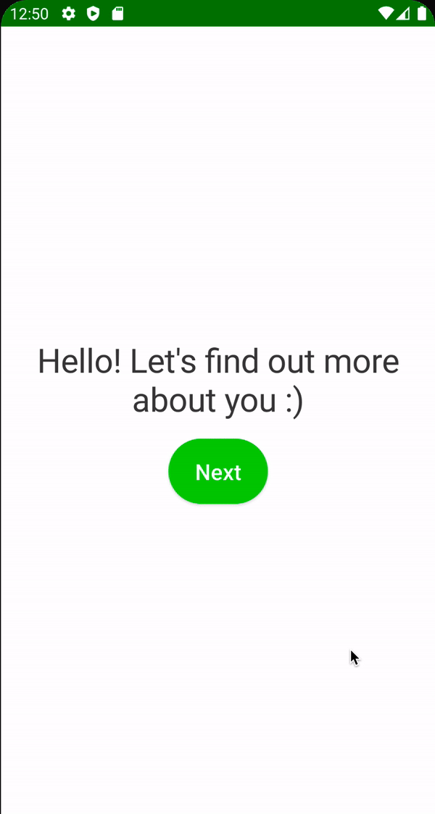

# Activity & Goal Screen

사용자가 얼만큼의 활동하는지에 대한 Activity Screen 및 목표를 위한 Goal Screen을 구현해보자.

### Activity Screen

`onboarding_presentation` 모듈에 `activity` 패키지를 생성한다. Gender Screen과 비슷하므로 우선 `GenderViewModel`를 복사해 `activity` 패키지에 붙여넣고
다음과 같이 작성한다.

```kotlin
@HiltViewModel
class ActivityViewModel @Inject constructor(
        private val preferences: Preferences
) : ViewModel() {

    var selectedActivityLevel by mutableStateOf<ActivityLevel>(
            ActivityLevel.Medium
    )
        private set

    // one time event
    private val _uiEvent = Channel<UiEvent>()
    val uiEvent = _uiEvent.receiveAsFlow()

    fun onActivitySelect(activityLevel: ActivityLevel) {
        selectedActivityLevel = activityLevel
    }

    fun onNextClick() {
        viewModelScope.launch {
            preferences.saveActivityLevel(selectedActivityLevel)
            _uiEvent.send(UiEvent.Navigate(Route.GOAL))
        }
    }
}
```

이제 `GenderScreen`을 복사해 `activity` 패키지에 붙어넣고 다음과 같이 작성한다.

```kotlin
@Composable
fun ActivityScreen(
        onNavigate: (UiEvent.Navigate) -> Unit,
        viewModel: ActivityViewModel = hiltViewModel()
) {
    val spacing = LocalSpacing.current
    // ViewModel에서 전달하는 이벤트를 collect 하기 위함
    LaunchedEffect(key1 = true) {
        viewModel.uiEvent.collect { event ->
            when (event) {
                is UiEvent.Navigate -> onNavigate(event)
                else -> Unit
            }
        }
    }
    Box(
            modifier = Modifier
                    .fillMaxSize()
                    .padding(spacing.spaceLarge)
    ) {
        Column(
                modifier = Modifier.fillMaxSize(),
                verticalArrangement = Arrangement.Center,
                horizontalAlignment = Alignment.CenterHorizontally
        ) {
            Text(
                    text = stringResource(id = R.string.whats_your_activity_level),
                    style = MaterialTheme.typography.h3
            )
            Spacer(modifier = Modifier.height(spacing.spaceMedium))
            Row {
                SelectableButton(
                        text = stringResource(id = R.string.low),
                        isSelected = viewModel.selectedActivityLevel is ActivityLevel.Low,
                        color = MaterialTheme.colors.primaryVariant,
                        selectedTextColor = Color.White,
                        onClick = {
                            viewModel.onActivitySelect(ActivityLevel.Low)
                        },
                        textStyle = MaterialTheme.typography.button.copy(
                                fontWeight = FontWeight.Normal
                        )
                )
                Spacer(modifier = Modifier.width(spacing.spaceMedium))
                SelectableButton(
                        text = stringResource(id = R.string.medium),
                        isSelected = viewModel.selectedActivityLevel is ActivityLevel.Medium,
                        color = MaterialTheme.colors.primaryVariant,
                        selectedTextColor = Color.White,
                        onClick = {
                            viewModel.onActivitySelect(ActivityLevel.Medium)
                        },
                        textStyle = MaterialTheme.typography.button.copy(
                                fontWeight = FontWeight.Normal
                        )
                )
                Spacer(modifier = Modifier.width(spacing.spaceMedium))
                SelectableButton(
                        text = stringResource(id = R.string.high),
                        isSelected = viewModel.selectedActivityLevel is ActivityLevel.High,
                        color = MaterialTheme.colors.primaryVariant,
                        selectedTextColor = Color.White,
                        onClick = {
                            viewModel.onActivitySelect(ActivityLevel.High)
                        },
                        textStyle = MaterialTheme.typography.button.copy(
                                fontWeight = FontWeight.Normal
                        )
                )
            }
        }
        ActionButton(
                text = stringResource(id = R.string.next),
                onClick = viewModel::onNextClick,
                modifier = Modifier.align(Alignment.BottomEnd)
        )
    }
}
```

### Goal Screen

`onboarding_presentation` 모듈에 `goal` 패키지를 생성한다. Activity Screen과 비슷하므로 `ActivityViewModel`을 복사해 `goal` 패키지에 붙여넣고 다음과 같이
작성한다.

```kotlin
@HiltViewModel
class GoalViewModel @Inject constructor(
        private val preferences: Preferences
) : ViewModel() {

    var selectedGoal by mutableStateOf<GoalType>(
            GoalType.KeepWeight
    )
        private set

    // one time event
    private val _uiEvent = Channel<UiEvent>()
    val uiEvent = _uiEvent.receiveAsFlow()

    fun onGoalTypeSelect(goalType: GoalType) {
        selectedGoal = goalType
    }

    fun onNextClick() {
        viewModelScope.launch {
            preferences.saveGoalType(selectedGoal)
            _uiEvent.send(UiEvent.Navigate(Route.NUTRIENT_GOAL))
        }
    }
}
```

그 다음 `ActivityScreen`을 복사해 `goal` 패키지에 붙여넣고 다음과 같이 작성한다.

```kotlin
@Composable
fun GoalScreen(
        onNavigate: (UiEvent.Navigate) -> Unit,
        viewModel: GoalViewModel = hiltViewModel()
) {
    val spacing = LocalSpacing.current
    // ViewModel에서 전달하는 이벤트를 collect 하기 위함
    LaunchedEffect(key1 = true) {
        viewModel.uiEvent.collect { event ->
            when (event) {
                is UiEvent.Navigate -> onNavigate(event)
                else -> Unit
            }
        }
    }
    Box(
            modifier = Modifier
                    .fillMaxSize()
                    .padding(spacing.spaceLarge)
    ) {
        Column(
                modifier = Modifier.fillMaxSize(),
                verticalArrangement = Arrangement.Center,
                horizontalAlignment = Alignment.CenterHorizontally
        ) {
            Text(
                    text = stringResource(id = R.string.lose_keep_or_gain_weight),
                    style = MaterialTheme.typography.h3
            )
            Spacer(modifier = Modifier.height(spacing.spaceMedium))
            Row {
                SelectableButton(
                        text = stringResource(id = R.string.lose),
                        isSelected = viewModel.selectedGoal is GoalType.LoseWeight,
                        color = MaterialTheme.colors.primaryVariant,
                        selectedTextColor = Color.White,
                        onClick = {
                            viewModel.onGoalTypeSelect(GoalType.LoseWeight)
                        },
                        textStyle = MaterialTheme.typography.button.copy(
                                fontWeight = FontWeight.Normal
                        )
                )
                Spacer(modifier = Modifier.width(spacing.spaceMedium))
                SelectableButton(
                        text = stringResource(id = R.string.keep),
                        isSelected = viewModel.selectedGoal is GoalType.KeepWeight,
                        color = MaterialTheme.colors.primaryVariant,
                        selectedTextColor = Color.White,
                        onClick = {
                            viewModel.onGoalTypeSelect(GoalType.KeepWeight)
                        },
                        textStyle = MaterialTheme.typography.button.copy(
                                fontWeight = FontWeight.Normal
                        )
                )
                Spacer(modifier = Modifier.width(spacing.spaceMedium))
                SelectableButton(
                        text = stringResource(id = R.string.gain),
                        isSelected = viewModel.selectedGoal is GoalType.GainWeight,
                        color = MaterialTheme.colors.primaryVariant,
                        selectedTextColor = Color.White,
                        onClick = {
                            viewModel.onGoalTypeSelect(GoalType.GainWeight)
                        },
                        textStyle = MaterialTheme.typography.button.copy(
                                fontWeight = FontWeight.Normal
                        )
                )
            }
        }
        ActionButton(
                text = stringResource(id = R.string.next),
                onClick = viewModel::onNextClick,
                modifier = Modifier.align(Alignment.BottomEnd)
        )
    }
}
```

### MainActivity

```kotlin
@AndroidEntryPoint
class MainActivity : ComponentActivity() {
    override fun onCreate(savedInstanceState: Bundle?) {
        super.onCreate(savedInstanceState)
        setContent {
            CaloryTrackerTheme {
                val navController = rememberNavController()
                val scaffoldState = rememberScaffoldState()
                Scaffold(
                        modifier = Modifier.fillMaxSize(),
                        scaffoldState = scaffoldState
                ) {
                    NavHost(
                            navController = navController,
                            startDestination = Route.WELCOME
                    ) {
                        // ...
                        composable(route = Route.ACTIVITY) {
                            ActivityScreen(
                                    onNavigate = navController::navigate
                            )
                        }
                        composable(route = Route.GOAL) {
                            GoalScreen(
                                    onNavigate = navController::navigate
                            )
                        }
                        // ...
                    }
                }
            }
        }
    }
}
```

<div align="center">

</div>