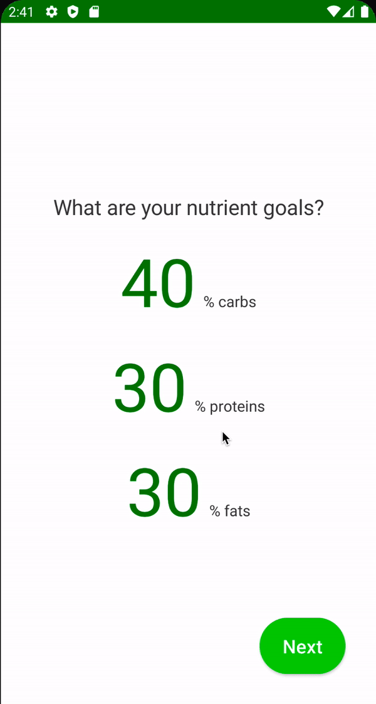

# Nutrient Goal Screen

탄수화물, 단백질, 지방을 얼마나 줄일지 목표를 보여주는 Nutrient Goal Screen을 만들어보자.

`onboarding_presentation` 모듈에 `nutrient_goal` 패키지를 생성하고 `NutrientGoalState` data class를 작성한다.

```kotlin
data class NutrientGoalState(
        val carbsRatio: String = "40",
        val proteinRatio: String = "30",
        val fatRatio: String = "30"
)
```

Nutrient Goal은 여러 이벤트가 존재하기 때문에 별도로 sealed class를 생성해준다. `nutrient_goal` 패키지에  `NutrientGoalEvent` sealed class를 작성한다.

```kotlin
sealed class NutrientGoalEvent {
    data class OnCarbRatioEnter(val ratio: String) : NutrientGoalEvent()
    data class OnProteinRatioEnter(val ratio: String) : NutrientGoalEvent()
    data class OnFatRatioEnter(val ratio: String) : NutrientGoalEvent()
    object OnNextClick : NutrientGoalEvent()
}
```

입력된 탄수화물, 단백질, 지방을 검증하기 위해 `onboarding_domain` 모듈에 `use_case` 패키지를 생성하고 `ValidateNutrients` 클래스를 작성한다.

```kotlin
class ValidateNutrients {

    operator fun invoke(
            carbsRatioText: String,
            proteinRatioText: String,
            fatRatioText: String
    ): Result {
        val carbsRatio = carbsRatioText.toIntOrNull()
        val proteinRatio = proteinRatioText.toIntOrNull()
        val fatRatio = fatRatioText.toIntOrNull()

        if (carbsRatio == null || proteinRatio == null || fatRatio == null) {
            return Result.Error(
                    message = UiText.StringResource(R.string.error_invalid_values)
            )
        }

        if (carbsRatio + proteinRatio + fatRatio != 100) {
            return Result.Error(
                    message = UiText.StringResource(R.string.error_not_100_percent)
            )
        }
        return Result.Success(
                carbsRatio / 100f,
                proteinRatio / 100f,
                fatRatio / 100f
        )
    }

    // result를 표현하기 위한 클래스
    sealed class Result {
        data class Success(
                val carbsRatio: Float,
                val proteinRatio: Float,
                val fatRatio: Float
        ) : Result()
        data class Error(val message: UiText) : Result()
    }
}
```

위 클래스는 `NutrientGoalViewModel` 모듈에만 제공되므로 `onboarding_domain` 모듈에 `di` 패키지를 생성하고 `OnBoardingDomainModule`을 만들어 사용한다.

```kotlin
@Module
@InstallIn(ViewModelComponent::class) // ViewModel에서만 사용하기 때문에 ViewModelComponent
object OnBoardingDomainModule {

    @Provides
    @ViewModelScoped
    fun provideValidateNutrientsUseCase(): ValidateNutrients {
        return ValidateNutrients()
    }
}
```

그 다음 `HeightScreen`을 복사하여 `nutrient_goal` 패캐지의 `NutrientGoalScreen`을 다음과 같이 작성해준다.

```kotlin
@Composable
fun NutrientGoalScreen(
        scaffoldState: ScaffoldState,
        onNavigate: (UiEvent.Navigate) -> Unit,
        viewModel: NutrientGoalViewModel = hiltViewModel()
) {
    val spacing = LocalSpacing.current
    val context = LocalContext.current // ViewModel에서 넘어온 UiText의 StringResource를 unwrap 하기 위함
    // ViewModel에서 전달하는 이벤트를 collect 하기 위함
    LaunchedEffect(key1 = true) {
        viewModel.uiEvent.collect { event ->
            when (event) {
                is UiEvent.Navigate -> onNavigate(event)
                is UiEvent.ShowSnackbar -> {
                    scaffoldState.snackbarHostState.showSnackbar(
                            message = event.message.asString(context) // 헬퍼 클래스 이용하여 unwrap string
                    )
                }
                else -> Unit
            }
        }
    }
    Box(
            modifier = Modifier
                    .fillMaxSize()
                    .padding(spacing.spaceLarge)
    ) {
        Column(
                modifier = Modifier.fillMaxSize(),
                verticalArrangement = Arrangement.Center,
                horizontalAlignment = Alignment.CenterHorizontally
        ) {
            Text(
                    text = stringResource(id = R.string.what_are_your_nutrient_goals),
                    style = MaterialTheme.typography.h3
            )
            Spacer(modifier = Modifier.height(spacing.spaceMedium))
            UnitTextField(
                    value = viewModel.state.carbsRatio,
                    onValueChange = {
                        viewModel.onEvent(NutrientGoalEvent.OnCarbRatioEnter(it))
                    },
                    unit = stringResource(
                            id = R.string.percent_carbs
                    )
            )
            Spacer(modifier = Modifier.height(spacing.spaceMedium))
            UnitTextField(
                    value = viewModel.state.proteinRatio,
                    onValueChange = {
                        viewModel.onEvent(NutrientGoalEvent.OnProteinRatioEnter(it))
                    },
                    unit = stringResource(
                            id = R.string.percent_proteins
                    )
            )
            Spacer(modifier = Modifier.height(spacing.spaceMedium))
            UnitTextField(
                    value = viewModel.state.fatRatio,
                    onValueChange = {
                        viewModel.onEvent(NutrientGoalEvent.OnFatRatioEnter(it))
                    },
                    unit = stringResource(
                            id = R.string.percent_fats
                    )
            )
        }
        ActionButton(
                text = stringResource(id = R.string.next),
                onClick = {
                    viewModel.onEvent(NutrientGoalEvent.OnNextClick)
                },
                modifier = Modifier.align(Alignment.BottomEnd)
        )
    }
}
```

`MainActivity`에서 `Route.NUTRIENT_GOAL`에 맞게 `NutrientGoalScreen`을 호출해준다.

```kotlin
@AndroidEntryPoint
class MainActivity : ComponentActivity() {
    override fun onCreate(savedInstanceState: Bundle?) {
        super.onCreate(savedInstanceState)
        setContent {
            CaloryTrackerTheme {
                val navController = rememberNavController()
                val scaffoldState = rememberScaffoldState()
                Scaffold(
                        modifier = Modifier.fillMaxSize(),
                        scaffoldState = scaffoldState
                ) {
                    NavHost(
                            navController = navController,
                            startDestination = Route.WELCOME
                    ) {
                        // ...
                        composable(route = Route.NUTRIENT_GOAL) {
                            NutrientGoalScreen(
                                    scaffoldState = scaffoldState,
                                    onNavigate = navController::navigate
                            )
                        }
                        // ...
                    }
                }
            }
        }
    }
}
```

<div align="center">

</div>