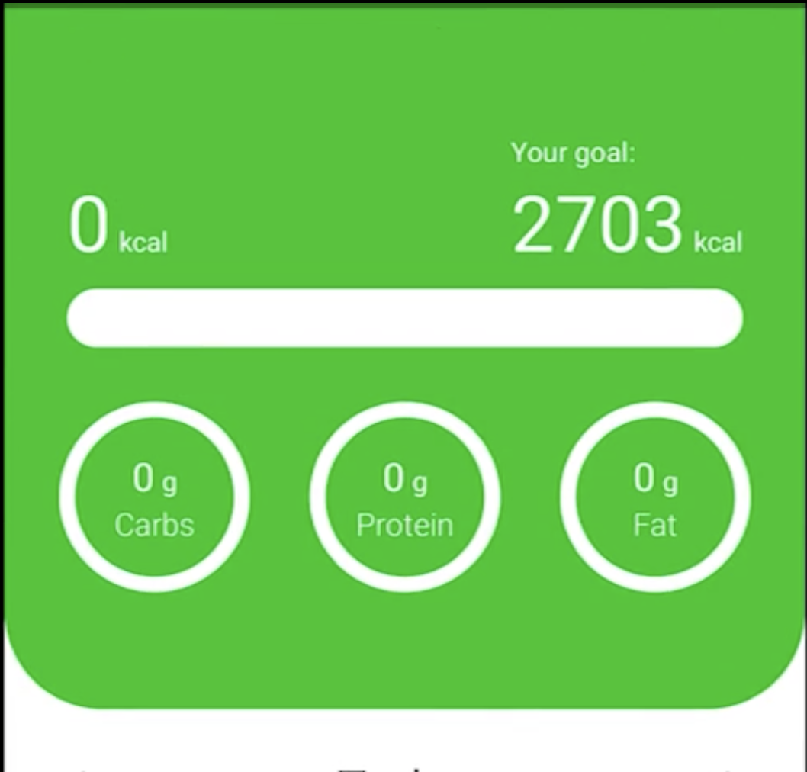
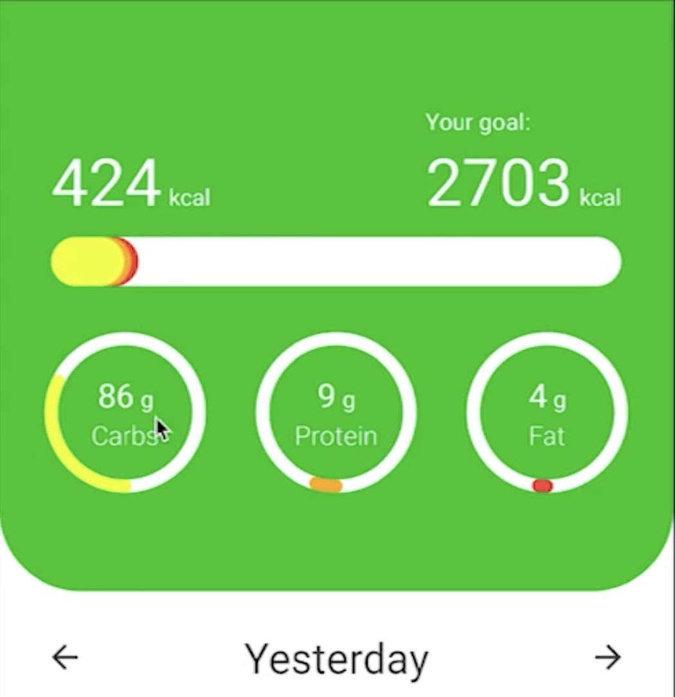
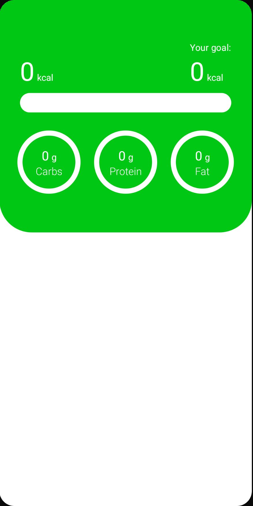

# Nutrient Header UI

이번엔 Tracker Overview의 헤더 UI를 구현해보자. 헤더 UI는 다음 초록색 영역이다.

<div align="center">

</div>

Breakfast, Lunch 등을 추가하면 다음과 같이 탄수화물, 단백질, 지방의 그램이 추가된다.

<div align="center">

</div>

### Unit Display

`tracker_presentation` 모듈에 `components` 패키지를 추가한 후 `UnitDisplay.kt` 파일을 작성한다.

```kotlin
@Composable
fun UnitDisplay(
        amount: Int,
        unit: String,
        modifier: Modifier = Modifier,
        amountTextSize: TextUnit = 20.sp,
        amountColor: Color = MaterialTheme.colors.onBackground,
        unitTextSize: TextUnit = 14.sp,
        unitColor: Color = MaterialTheme.colors.onBackground
) {
    val spacing = LocalSpacing.current

    Row(modifier = modifier) {
        Text(
                text = amount.toString(),
                style = MaterialTheme.typography.h1,
                fontSize = amountTextSize,
                color = amountColor,
                modifier = Modifier.alignBy(LastBaseline) // bottom 라인에 맞춤
        )
        Spacer(modifier = Modifier.width(spacing.spaceExtraSmall))
        Text(
                text = unit,
                style = MaterialTheme.typography.body1,
                fontSize = unitTextSize,
                color = unitColor,
                modifier = Modifier.alignBy(LastBaseline) // bottom 라인에 맞춤
        )
    }
}
```

### Nutrients Bar

다음 `tracker_overview` 패키지에 `components` 패키지를 추가한 후 `NutrientsBar.kt` 파일을 작성한다.

```kotlin
@Composable
fun NutrientsBar(
        carbs: Int,
        protein: Int,
        fat: Int,
        calories: Int,
        calorieGoal: Int,
        modifier: Modifier = Modifier
) {
    val background = MaterialTheme.colors.background
    val caloriesExceedColor = MaterialTheme.colors.error
    val carbWidthRatio = remember {
        Animatable(0f)
    }
    val proteinWidthRatio = remember {
        Animatable(0f)
    }
    val fatWidthRatio = remember {
        Animatable(0f)
    }
    LaunchedEffect(key1 = carbs) {
        carbWidthRatio.animateTo(
                targetValue = ((carbs * 4f) / calorieGoal)
        )
    }
    LaunchedEffect(key1 = protein) {
        proteinWidthRatio.animateTo(
                targetValue = ((protein * 4f) / calorieGoal)
        )
    }
    LaunchedEffect(key1 = fat) {
        fatWidthRatio.animateTo(
                targetValue = ((fat * 9f) / calorieGoal)
        )
    }

    Canvas(modifier = modifier) {
        if (calories <= calorieGoal) {
            val carbsWidth = carbWidthRatio.value * size.width
            val proteinWidth = proteinWidthRatio.value * size.width
            val fatWidth = fatWidthRatio.value * size.width
            drawRoundRect(
                    color = background,
                    size = size,
                    cornerRadius = CornerRadius(100f)
            )
            drawRoundRect(
                    color = FatColor, // app 모듈의 UI 패키지에 있음
                    size = Size(
                            width = carbsWidth + proteinWidth + fatWidth,
                            height = size.height
                    ),
                    cornerRadius = CornerRadius(100f)
            )
            drawRoundRect(
                    color = ProteinColor, // app 모듈의 UI 패키지에 있음
                    size = Size(
                            width = carbsWidth + proteinWidth,
                            height = size.height
                    ),
                    cornerRadius = CornerRadius(100f)
            )
            drawRoundRect(
                    color = CarbColor, // app 모듈의 UI 패키지에 있음
                    size = Size(
                            width = carbsWidth,
                            height = size.height
                    ),
                    cornerRadius = CornerRadius(100f)
            )
        } else {
            drawRoundRect(
                    color = caloriesExceedColor, // app 모듈의 UI 패키지에 있음
                    size = size,
                    cornerRadius = CornerRadius(100f)
            )
        }
    }
}
```

`app` 모듈의 `ui` 패키지에 Color에 대한 정보가 있으므로 `core_ui` 모듈로 복사한다.

```kotlin
package com.plcoding.core_ui

import androidx.compose.ui.graphics.Color

val BrightGreen = Color(0xFF00C713)
val DarkGreen = Color(0xFF00790C)
val Orange = Color(0xFFFFAA00)
val CarbColor = Color(0xFFEEFF00)
val ProteinColor = Orange
val FatColor = Color(0xFFF44336)
val LightGray = Color(0xFF808080)
val MediumGray = Color(0xFF404040)
val DarkGray = Color(0xFF202020)
val TextWhite = Color(0xFFEEEEEE)
```

### Nutrient Bar Info

`tracker_overview` 패키지의 `components`에 `NutrientBarInfo`를 작성한다.

```kotlin
@Composable
fun NutrientBarInfo(
        value: Int,
        goal: Int,
        name: String,
        color: Color,
        modifier: Modifier = Modifier,
        strokeWidth: Dp = 8.dp
) {
    val background = MaterialTheme.colors.background
    val goalExceededColor = MaterialTheme.colors.error
    val angleRatio = remember {
        Animatable(0f)
    }
    LaunchedEffect(key1 = value) {
        angleRatio.animateTo(
                targetValue = if (goal > 0) {
                    value / goal.toFloat()
                } else 0f,
                animationSpec = tween(
                        durationMillis = 300
                )
        )
    }

    Box(
            modifier = modifier,
            contentAlignment = Alignment.Center
    ) {
        Canvas(modifier = Modifier
                .fillMaxWidth()
                .aspectRatio(1f)
        ) {
            drawArc(
                    color = if (value <= goal) background else goalExceededColor,
                    startAngle = 0f,
                    sweepAngle = 360f,
                    useCenter = false,
                    size = size,
                    style = Stroke(
                            width = strokeWidth.toPx(),
                            cap = StrokeCap.Round
                    )
            )

            if (value <= goal) {
                drawArc(
                        color = color,
                        startAngle = 90f,
                        sweepAngle = 360f * angleRatio.value,
                        useCenter = false,
                        size = size,
                        style = Stroke(
                                width = strokeWidth.toPx(),
                                cap = StrokeCap.Round
                        )
                )
            }
        }
        Column(
                modifier = Modifier.fillMaxWidth(),
                horizontalAlignment = Alignment.CenterHorizontally
        ) {
            UnitDisplay(
                    amount = value,
                    unit = stringResource(id = R.string.grams),
                    amountColor = if (value <= goal) {
                        MaterialTheme.colors.onPrimary
                    } else goalExceededColor,
                    unitColor = if (value <= goal) {
                        MaterialTheme.colors.onPrimary
                    } else goalExceededColor,
            )
            Text(
                    text = name,
                    color = if (value <= goal) {
                        MaterialTheme.colors.onPrimary
                    } else goalExceededColor,
                    style = MaterialTheme.typography.body1,
                    fontWeight = FontWeight.Light
            )
        }
    }
}
```

### Nutrients Header

`tracker_overview` 패키지의 `components`에 `NutrientsHeader`를 작성한다.

```kotlin
@Composable
fun NutrientsHeader(
        state: TrackerOverviewState,
        modifier: Modifier = Modifier
) {
    val spacing = LocalSpacing.current
    val animatedCalorieCount = animateIntAsState(
            targetValue = state.totalCalories
    )
    Column(
            modifier = modifier
                    .fillMaxWidth()
                    .clip(
                            RoundedCornerShape(
                                    bottomStart = 50.dp,
                                    bottomEnd = 50.dp
                            )
                    )
                    .background(MaterialTheme.colors.primary)
                    .padding(
                            horizontal = spacing.spaceLarge,
                            vertical = spacing.spaceExtraLarge
                    )
    ) {
        Row(
                modifier = Modifier.fillMaxWidth(),
                horizontalArrangement = Arrangement.SpaceBetween
        ) {
            UnitDisplay(
                    amount = animatedCalorieCount.value,
                    unit = stringResource(id = R.string.kcal),
                    amountColor = MaterialTheme.colors.onPrimary,
                    amountTextSize = 40.sp,
                    unitColor = MaterialTheme.colors.onPrimary,
                    modifier = Modifier.align(Alignment.Bottom)
            )
            Column {
                Text(
                        text = stringResource(id = R.string.your_goal),
                        style = MaterialTheme.typography.body2,
                        color = MaterialTheme.colors.onPrimary
                )
                UnitDisplay(
                        amount = animatedCalorieCount.value,
                        unit = stringResource(id = R.string.kcal),
                        amountColor = MaterialTheme.colors.onPrimary,
                        amountTextSize = 40.sp,
                        unitColor = MaterialTheme.colors.onPrimary
                )
            }
        }
        Spacer(modifier = Modifier.height(spacing.spaceSmall))
        NutrientsBar(
                carbs = state.totalCarbs,
                protein = state.totalProtein,
                fat = state.totalFat,
                calories = state.totalCalories,
                calorieGoal = state.caloriesGoal,
                modifier = Modifier
                        .fillMaxWidth()
                        .height(30.dp)
        )
        Spacer(modifier = Modifier.height(spacing.spaceLarge))
        Row(
                modifier = Modifier.fillMaxWidth(),
                horizontalArrangement = Arrangement.SpaceBetween
        ) {
            NutrientBarInfo(
                    value = state.totalCarbs,
                    goal = state.carbsGoal,
                    name = stringResource(id = R.string.carbs),
                    color = CarbColor,
                    modifier = Modifier.size(90.dp)
            )
            NutrientBarInfo(
                    value = state.totalProtein,
                    goal = state.proteinGoal,
                    name = stringResource(id = R.string.protein),
                    color = ProteinColor,
                    modifier = Modifier.size(90.dp)
            )
            NutrientBarInfo(
                    value = state.totalFat,
                    goal = state.fatGoal,
                    name = stringResource(id = R.string.fat),
                    color = FatColor,
                    modifier = Modifier.size(90.dp)
            )
        }
    }
}
```

### TrackerOverviewScreen

`tracker_overview` 패키지에 `TrackerOverviewScreen`을 작성한다.

```kotlin
@Composable
fun TrackerOverviewScreen(
        onNavigate: (UiEvent.Navigate) -> Unit,
        viewModel: TrackerOverviewViewModel = hiltViewModel()
) {
    val spacing = LocalSpacing.current
    val state = viewModel.state
    val context = LocalContext.current
    LazyColumn(
            modifier = Modifier
                    .fillMaxSize()
                    .padding(bottom = spacing.spaceMedium)
    ) {
        item {
            NutrientsHeader(state = state)
        }
    }
}
```

### MainActivity

```kotlin
@AndroidEntryPoint
class MainActivity : ComponentActivity() {
    override fun onCreate(savedInstanceState: Bundle?) {
        super.onCreate(savedInstanceState)
        setContent {
            CaloryTrackerTheme {
                val navController = rememberNavController()
                val scaffoldState = rememberScaffoldState()
                Scaffold(
                        modifier = Modifier.fillMaxSize(),
                        scaffoldState = scaffoldState
                ) {
                    NavHost(
                            navController = navController,
                            startDestination = Route.WELCOME
                    ) {
                        // ...
                        composable(route = Route.TRACKER_OVERVIEW) {
                            TrackerOverviewScreen(onNavigate = navController::navigate)
                        }
                    }
                }
            }
        }
    }
}
```

<div align="center">

</div>