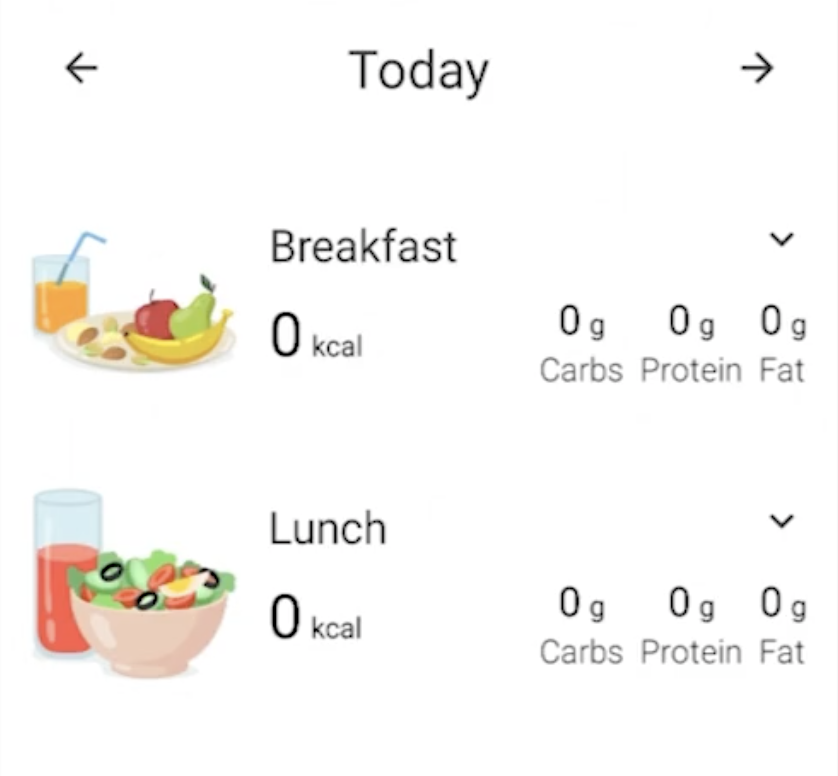
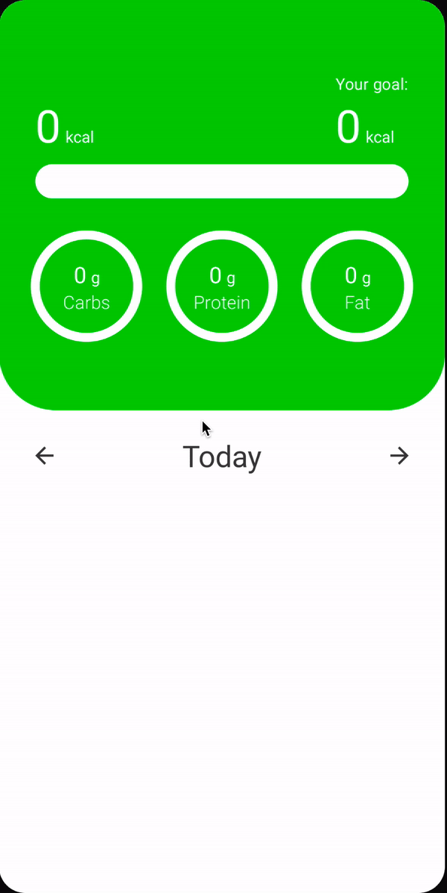

# Day Selector

이번엔 날짜를 선택하는 UI를 만들어보자. ←, → 버튼을 누르면 이전, 다음 날짜를 보여준다.

<div align="center">

</div>

`LocalDate`를 파싱해주는 `parseDateText`를 `tracker_presentation` 모듈의 `components` 패키지에 작성한다.

```kotlin
@Composable
fun parseDateText(date: LocalDate): String {
    val today = LocalDate.now()
    return when (date) {
        today -> stringResource(id = R.string.today)
        today.minusDays(1) -> stringResource(id = R.string.yesterday)
        today.plusDays(1) -> stringResource(id = R.string.tomorrow)
        else -> DateTimeFormatter.ofPattern("dd LLLL").format(date)
    }
}
```

### Day Selector

그리고 `tracker_presentation` 모듈의 `components` 패키지에 `DaySelector`를 작성한다.

```kotlin
@Composable
fun DaySelector(
        date: LocalDate,
        onPreviousDayClick: () -> Unit,
        onNextDayClick: () -> Unit,
        modifier: Modifier = Modifier
) {
    Row(
            modifier = modifier,
            horizontalArrangement = Arrangement.SpaceBetween,
            verticalAlignment = Alignment.CenterVertically
    ) {
        IconButton(onClick = onPreviousDayClick) {
            Icon(
                    imageVector = Icons.Default.ArrowBack,
                    contentDescription = stringResource(id = R.string.previous_day)
            )
        }
        Text(
                text = parseDateText(date = date),
                style = MaterialTheme.typography.h2
        )
        IconButton(onClick = onNextDayClick) {
            Icon(
                    imageVector = Icons.Default.ArrowForward,
                    contentDescription = stringResource(id = R.string.next_day)
            )
        }
    }
}
```

`DaySelector` 구현 후 `TrackerOverviewScreen`에서 호출해준다.

```kotlin
@Composable
fun TrackerOverviewScreen(
        onNavigate: (UiEvent.Navigate) -> Unit,
        viewModel: TrackerOverviewViewModel = hiltViewModel()
) {
    val spacing = LocalSpacing.current
    val state = viewModel.state
    val context = LocalContext.current
    LazyColumn(
            modifier = Modifier
                    .fillMaxSize()
                    .padding(bottom = spacing.spaceMedium)
    ) {
        item {
            NutrientsHeader(state = state)
            Spacer(modifier = Modifier.height(spacing.spaceMedium))
            DaySelector(
                    date = state.date,
                    onPreviousDayClick = {
                        viewModel.onEvent(TrackerOverviewEvent.OnPreviousDayClick)
                    },
                    onNextDayClick = {
                        viewModel.onEvent(TrackerOverviewEvent.OnNextDayClick)
                    },
                    modifier = Modifier
                            .fillMaxWidth()
                            .padding(horizontal = spacing.spaceMedium)
            )
            Spacer(modifier = Modifier.height(spacing.spaceMedium))
        }
    }
}
```

<div align="center">

</div>