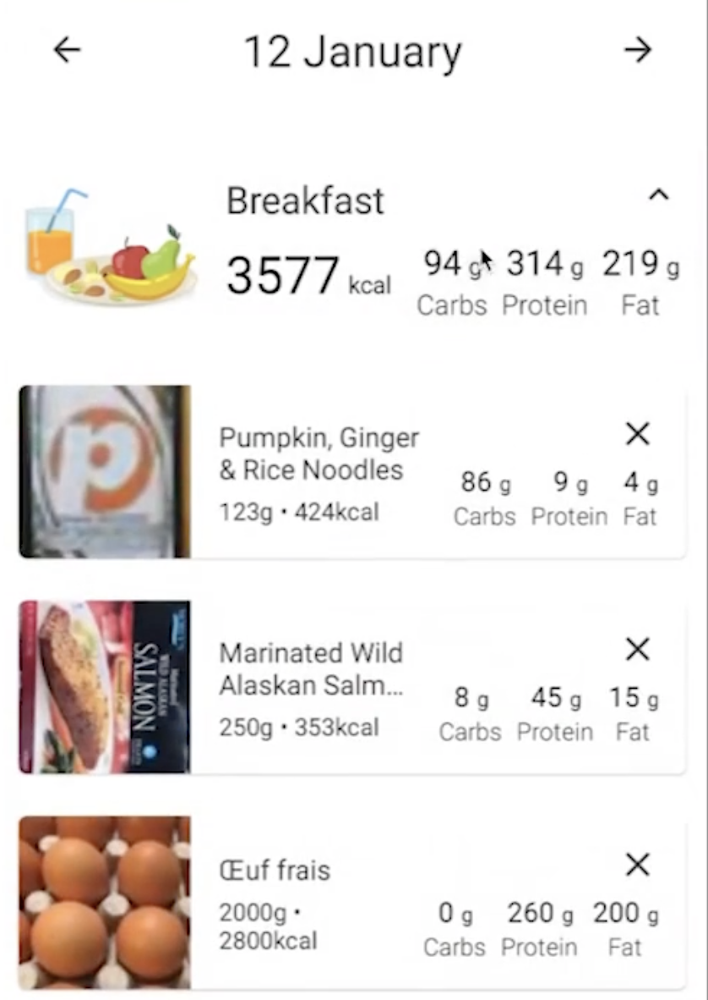
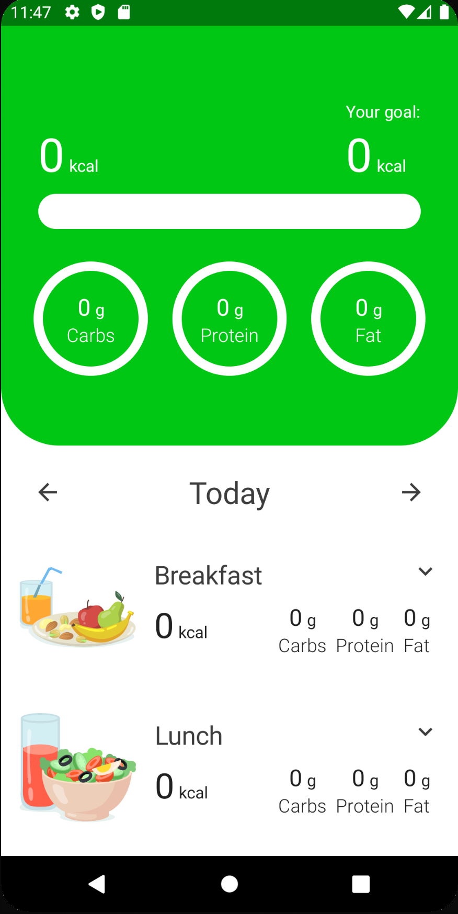

# Expandable Meal UI

이번엔 확장되는 Meal UI를 구현해보자. Breakfast UI는 다음과 같이 Meal의 총 칼로리와 탄수화물, 단백질, 지방을 보여준다.

<div align="center">

</div>

### Add Button

`tracker_presentation` 모듈의 `components` 패키지에 `AddButton` composable을 작성한다.

```kotlin
@Composable
fun AddButton(
        text: String,
        onClick: () -> Unit,
        modifier: Modifier = Modifier,
        color: Color = MaterialTheme.colors.primary
) {
    val spacing = LocalSpacing.current
    Row(
            modifier = modifier
                    .clip(RoundedCornerShape(100f))
                    .clickable { onClick() }
                    .border(
                            width = 1.dp,
                            color = color,
                            shape = RoundedCornerShape(100f)
                    )
                    .padding(spacing.spaceMedium),
            horizontalArrangement = Arrangement.Center,
            verticalAlignment = Alignment.CenterVertically
    ) {
        Icon(
                imageVector = Icons.Default.Add,
                contentDescription = stringResource(id = R.string.add),
                tint = color
        )
        Spacer(modifier = Modifier.width(spacing.spaceMedium))
        Text(
                text = text,
                style = MaterialTheme.typography.button,
                color = color
        )
    }
}
```

### Nutrient Info

`components` 패키지에 `NutrientInfo` composable을 작성한다. `UnitDisplay`와 비슷하므로 복사하여 붙여넣은 후 작성한다.

```kotlin
@Composable
fun NutrientInfo(
        name: String,
        amount: Int,
        unit: String,
        modifier: Modifier = Modifier,
        amountTextSize: TextUnit = 20.sp,
        amountColor: Color = MaterialTheme.colors.onBackground,
        unitTextSize: TextUnit = 14.sp,
        unitColor: Color = MaterialTheme.colors.onBackground,
        nameTextStyle: TextStyle = MaterialTheme.typography.body1
) {
    Column(
            modifier = modifier,
            horizontalAlignment = Alignment.CenterHorizontally
    ) {
        UnitDisplay(
                amount = amount,
                unit = unit,
                amountTextSize = amountTextSize,
                amountColor = amountColor,
                unitTextSize = unitTextSize,
                unitColor = unitColor
        )
        Text(
                text = name,
                color = MaterialTheme.colors.onBackground,
                style = nameTextStyle,
                fontWeight = FontWeight.Light
        )
    }
}
```

### Expendable Meal

`tracker_overview` 패키지의 `components` 패키지에 `ExpandableMeal` composable을 작성한다.

```kotlin
@Composable
fun ExpandableMeal(
        meal: Meal,
        onToggleClick: () -> Unit,
        content: @Composable () -> Unit,
        modifier: Modifier = Modifier
) {
    val spacing = LocalSpacing.current
    val context = LocalContext.current
    Column(
            modifier = modifier
    ) {
        Row(
                modifier = Modifier
                        .fillMaxWidth()
                        .clickable { onToggleClick() }
                        .padding(spacing.spaceMedium),
                verticalAlignment = Alignment.CenterVertically
        ) {
            Image(
                    painter = painterResource(id = meal.drawableRes),
                    contentDescription = meal.name.asString(context)
            )
            Spacer(modifier = Modifier.width(spacing.spaceMedium))
            Column(
                    modifier = Modifier
                            .weight(1f)
            ) {
                Row(
                        horizontalArrangement = Arrangement.SpaceBetween,
                        modifier = Modifier.fillMaxWidth()
                ) {
                    Text(
                            text = meal.name.asString(context),
                            style = MaterialTheme.typography.h3
                    )
                    Icon(
                            imageVector = if (meal.isExpanded) {
                                Icons.Default.KeyboardArrowUp
                            } else Icons.Default.KeyboardArrowDown,
                            contentDescription = if (meal.isExpanded) {
                                stringResource(id = R.string.collapse)
                            } else stringResource(id = R.string.extend)
                    )
                }
                Spacer(modifier = Modifier.height(spacing.spaceSmall))
                Row(
                        modifier = Modifier.fillMaxWidth(),
                        horizontalArrangement = Arrangement.SpaceBetween
                ) {
                    UnitDisplay(
                            amount = meal.calories,
                            unit = stringResource(id = R.string.kcal),
                            amountTextSize = 30.sp
                    )
                    Row {
                        NutrientInfo(
                                name = stringResource(id = R.string.carbs),
                                amount = meal.carbs,
                                unit = stringResource(id = R.string.grams)
                        )
                        Spacer(modifier = Modifier.width(spacing.spaceSmall))
                        NutrientInfo(
                                name = stringResource(id = R.string.protein),
                                amount = meal.protein,
                                unit = stringResource(id = R.string.grams)
                        )
                        Spacer(modifier = Modifier.width(spacing.spaceSmall))
                        NutrientInfo(
                                name = stringResource(id = R.string.fat),
                                amount = meal.fat,
                                unit = stringResource(id = R.string.grams)
                        )
                        Spacer(modifier = Modifier.width(spacing.spaceSmall))
                    }
                }
            }
        }
        Spacer(modifier = Modifier.height(spacing.spaceMedium))
        AnimatedVisibility(visible = meal.isExpanded) {
            content()
        }
    }
}
```

이제 `TrackerOverviewScreen`에 `ExpandableMeal` composable을 추가한다.

```kotlin
@Composable
fun TrackerOverviewScreen(
        onNavigate: (UiEvent.Navigate) -> Unit,
        viewModel: TrackerOverviewViewModel = hiltViewModel()
) {
    val spacing = LocalSpacing.current
    val state = viewModel.state
    val context = LocalContext.current
    LazyColumn(
            modifier = Modifier
                    .fillMaxSize()
                    .padding(bottom = spacing.spaceMedium)
    ) {
        // ...
        items(state.meals) { meal ->
            ExpandableMeal(
                    meal = meal,
                    onToggleClick = {
                        viewModel.onEvent(TrackerOverviewEvent.OnToggleMealClick(meal))
                    },
                    content = {

                    },
                    modifier = Modifier.fillMaxWidth()
            )
        }
    }
}
```

<div align="center">

</div>