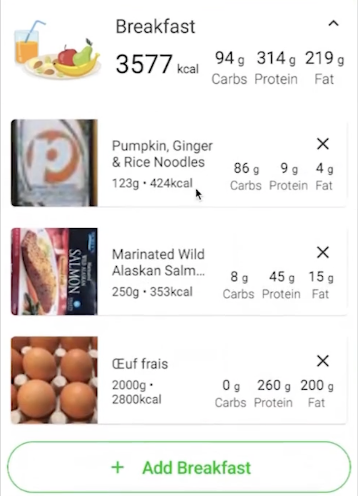
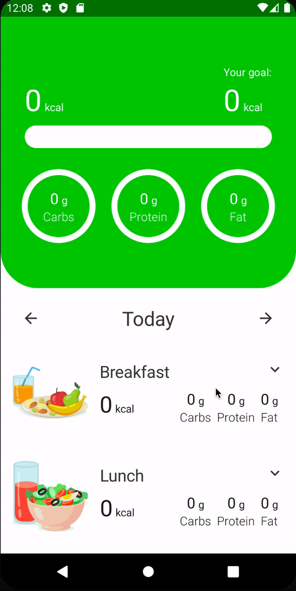

# Tracked Food Item UI

이번에는 Tracked Food 아이템 UI를 구현해보자. `ExpendableMeal`을 클릭하는 경우 다음과 같이 확장되며 Tracked Food를 보여준다.

<div align="center">

</div>

### Tracked Food Item

`tracker_overview` 패키지의 `components` 패키지에 `TrackedFoodItem` composable을 작성해준다.

```kotlin
@ExperimentalCoilApi
@Composable
fun TrackedFoodItem(
        trackedFood: TrackedFood,
        onDeleteClick: () -> Unit,
        modifier: Modifier = Modifier
) {
    val spacing = LocalSpacing.current
    Row(
            modifier = modifier
                    .clip(RoundedCornerShape(5.dp))
                    .padding(spacing.spaceExtraSmall) // shadow를 보여주기 위한 패딩
                    .shadow(
                            elevation = 1.dp,
                            shape = RoundedCornerShape(5.dp)
                    )
                    .background(MaterialTheme.colors.surface)
                    .padding(end = spacing.spaceMedium)
                    .height(100.dp),
            horizontalArrangement = Arrangement.SpaceBetween,
            verticalAlignment = Alignment.CenterVertically
    ) {
        Image(
                painter = rememberImagePainter(data = trackedFood.imageUrl,
                        builder = {
                            crossfade(true)
                            error(R.drawable.ic_burger)
                            fallback(R.drawable.ic_burger)
                        }
                ),
                contentDescription = trackedFood.name,
                contentScale = ContentScale.Crop,
                modifier = Modifier
                        .fillMaxHeight()
                        .aspectRatio(1f)
                        .clip(
                                RoundedCornerShape(
                                        topStart = 5.dp,
                                        bottomStart = 5.dp
                                )
                        )
        )
        Spacer(modifier = Modifier.width(spacing.spaceMedium))
        Column(
                modifier = Modifier.weight(1f)
        ) {
            Text(
                    text = trackedFood.name,
                    style = MaterialTheme.typography.body1,
                    overflow = TextOverflow.Ellipsis,
                    maxLines = 2
            )
            Spacer(modifier = Modifier.height(spacing.spaceExtraSmall))
            Text(
                    // format
                    text = stringResource(
                            id = R.string.nutrient_info,
                            trackedFood.amount,
                            trackedFood.calories
                    ),
                    style = MaterialTheme.typography.body2
            )
        }
        Spacer(modifier = Modifier.width(spacing.spaceMedium))
        Column(
                modifier = Modifier.fillMaxHeight(),
                verticalArrangement = Arrangement.Center
        ) {
            Icon(
                    imageVector = Icons.Default.Close,
                    contentDescription = stringResource(id = R.string.delete),
                    modifier = Modifier
                            .align(Alignment.End)
                            .clickable { onDeleteClick() }
            )
            Spacer(modifier = Modifier.height(spacing.spaceExtraSmall))
            Row(
                    verticalAlignment = Alignment.CenterVertically
            ) {
                NutrientInfo(
                        name = stringResource(id = R.string.carbs),
                        amount = trackedFood.carbs,
                        unit = stringResource(
                                id = R.string.grams,
                        ),
                        amountTextSize = 16.sp,
                        unitTextSize = 12.sp,
                        nameTextStyle = MaterialTheme.typography.body2
                )
                Spacer(modifier = Modifier.height(spacing.spaceSmall))
                NutrientInfo(
                        name = stringResource(id = R.string.protein),
                        amount = trackedFood.protein,
                        unit = stringResource(
                                id = R.string.grams,
                        ),
                        amountTextSize = 16.sp,
                        unitTextSize = 12.sp,
                        nameTextStyle = MaterialTheme.typography.body2
                )
                Spacer(modifier = Modifier.height(spacing.spaceSmall))
                NutrientInfo(
                        name = stringResource(id = R.string.fat),
                        amount = trackedFood.fat,
                        unit = stringResource(
                                id = R.string.grams,
                        ),
                        amountTextSize = 16.sp,
                        unitTextSize = 12.sp,
                        nameTextStyle = MaterialTheme.typography.body2
                )
            }
        }
    }
}
```

모두 구현 후 `TrackerOverviewScreen`의 `ExpendableMeal`의 `content`에 `TrackedFoodItem`와 `AddButton`을 추가해준다.

```kotlin
@Composable
fun TrackerOverviewScreen(
        onNavigate: (UiEvent.Navigate) -> Unit,
        viewModel: TrackerOverviewViewModel = hiltViewModel()
) {
    val spacing = LocalSpacing.current
    val state = viewModel.state
    val context = LocalContext.current
    LazyColumn(
            modifier = Modifier
                    .fillMaxSize()
                    .padding(bottom = spacing.spaceMedium)
    ) {
        // ...
        items(state.meals) { meal ->
            ExpendableMeal(
                    meal = meal,
                    onToggleClick = {
                        viewModel.onEvent(TrackerOverviewEvent.OnToggleMealClick(meal))
                    },
                    content = {
                        Column(
                                modifier = Modifier
                                        .fillMaxWidth()
                                        .padding(horizontal = spacing.spaceSmall)
                        ) {
                            state.trackedFoods.forEach { food ->
                                TrackedFoodItem(
                                        trackedFood = food,
                                        onDeleteClick = {
                                            viewModel.onEvent(
                                                    TrackerOverviewEvent.OnDeleteTrackedFoodClick(food)
                                            )
                                        }
                                )
                                Spacer(modifier = Modifier.height(spacing.spaceMedium))
                            }
                            AddButton(
                                    // format
                                    text = stringResource(
                                            id = R.string.add_meal,
                                            meal.name.asString(context)
                                    ),
                                    onClick = {
                                        viewModel.onEvent(
                                                TrackerOverviewEvent.OnAddFoodClick(meal)
                                        )
                                    },
                                    modifier = Modifier.fillMaxWidth()
                            )
                        }
                    },
                    modifier = Modifier.fillMaxWidth()
            )
        }
    }
}
```

<div align="center">

</div>