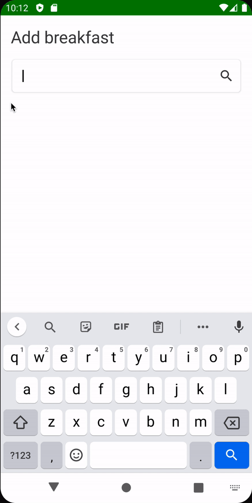
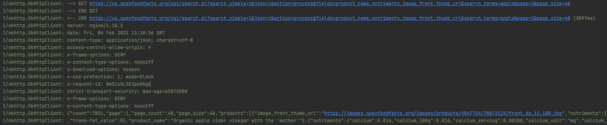

# Search Text Field UI

이번엔 음식을 검색하는 필드인 Search Text Field의 UI를 작성해보자.

`tracker_presentation` 모듈의 `search` 패키지에 `components` 패키지를 생성한 후 `SearchTextField composable`을 작성한다.

```kotlin
@Composable
fun SearchTextField(
        text: String,
        onValueChange: (String) -> Unit,
        onSearch: () -> Unit,
        modifier: Modifier = Modifier,
        hint: String = stringResource(id = R.string.search),
        shouldShowHint: Boolean = false,
        onFocusChanged: (FocusState) -> Unit
) {
    val spaceing = LocalSpacing.current
    Box(
            modifier = modifier
    ) {
        BasicTextField(
                value = text,
                onValueChange = onValueChange,
                singleLine = true,
                keyboardActions = KeyboardActions(  // 자판기에 있는 검색 아이콘
                        onSearch = {
                            onSearch()
                            defaultKeyboardAction(ImeAction.Search) // 자동으로 키보드가 닫히도록
                        }
                ),
                keyboardOptions = KeyboardOptions(
                        imeAction = ImeAction.Search
                ),
                modifier = Modifier
                        .clip(RoundedCornerShape(5.dp))
                        .padding(2.dp)
                        .shadow(
                                elevation = 2.dp,
                                shape = RoundedCornerShape(5.dp)
                        )
                        .background(MaterialTheme.colors.surface)
                        .fillMaxWidth()
                        .padding(spaceing.spaceMedium)
                        .padding(end = spaceing.spaceMedium)
                        .onFocusChanged { onFocusChanged(it) }
        )
        if (shouldShowHint) {
            Text(
                    text = hint,
                    style = MaterialTheme.typography.body1,
                    fontWeight = FontWeight.Light,
                    color = Color.LightGray,
                    modifier = Modifier
                            .align(Alignment.CenterStart)
                            .padding(start = spaceing.spaceMedium)
            )
        }
        IconButton(
                onClick = onSearch,
                modifier = Modifier.align(Alignment.CenterEnd)
        ) {
            Icon(
                    imageVector = Icons.Default.Search,
                    contentDescription = stringResource(id = R.string.search)
            )
        }
    }
}
```

그 다음 `search` 패키지에 `SearchScreen`을 구현해준다.

```kotlin
@ExperimentalComposeUiApi
@Composable
fun SearchScreen(
        scaffoldState: ScaffoldState,
        mealName: String,
        dayOfMonth: Int,
        month: Int,
        year: Int,
        onNavigateUp: () -> Unit,
        viewModel: SearchViewModel = hiltViewModel()
) {
    val spacing = LocalSpacing.current
    val state = viewModel.state
    val context = LocalContext.current
    val keyboardController = LocalSoftwareKeyboardController.current
    LaunchedEffect(key1 = keyboardController) {
        viewModel.uiEvent.collect { event ->
            when (event) {
                is UiEvent.ShowSnackbar -> {
                    scaffoldState.snackbarHostState.showSnackbar(
                            message = event.message.asString(context)
                    )
                    keyboardController?.hide()
                }
                is UiEvent.NavigateUp -> onNavigateUp()
                else -> Unit
            }
        }
    }
    Column(
            modifier = Modifier
                    .fillMaxSize()
                    .padding(spacing.spaceMedium)
    ) {
        Text(
                text = stringResource(
                        id = R.string.add_meal,
                        mealName
                ),
                style = MaterialTheme.typography.h2
        )
        Spacer(modifier = Modifier.height(spacing.spaceMedium))
        SearchTextField(
                text = state.query,
                onValueChange = {
                    viewModel.onEvent(SearchEvent.OnQueryChange(it))
                },
                onSearch = { viewModel.onEvent(SearchEvent.OnSearch) },
                onFocusChanged = {
                    viewModel.onEvent(SearchEvent.OnSearchFocusChange(it.isFocused))
                }
        )
    }
}
```

그리고 `MainActivity`에 `SearchScreen` composable을 추가한다.

```kotlin
@ExperimentalComposeUiApi
@AndroidEntryPoint
class MainActivity : ComponentActivity() {
    override fun onCreate(savedInstanceState: Bundle?) {
        super.onCreate(savedInstanceState)
        setContent {
            CaloryTrackerTheme {
                val navController = rememberNavController()
                val scaffoldState = rememberScaffoldState()
                Scaffold(
                        modifier = Modifier.fillMaxSize(),
                        scaffoldState = scaffoldState
                ) {
                    NavHost(
                            navController = navController,
                            startDestination = Route.WELCOME
                    ) {
                        // ...
                        composable(
                                route = Route.SEARCH + "/{mealName}/{dayOfMonth}/{month}/{year}",
                                arguments = listOf(
                                        navArgument("mealName") {
                                            type = NavType.StringType
                                        },
                                        navArgument("dayOfMonth") {
                                            type = NavType.IntType
                                        },
                                        navArgument("month") {
                                            type = NavType.IntType
                                        },
                                        navArgument("year") {
                                            type = NavType.IntType
                                        }
                                )
                        ) {
                            val mealName = it.arguments?.getString("mealName")!!
                            val dayOfMonth = it.arguments?.getInt("dayOfMonth")!!
                            val month = it.arguments?.getInt("month")!!
                            val year = it.arguments?.getInt("year")!!
                            SearchScreen(
                                    scaffoldState = scaffoldState,
                                    mealName = mealName,
                                    dayOfMonth = dayOfMonth,
                                    month = month,
                                    year = year,
                                    onNavigateUp = {
                                        navController.navigateUp()
                                    })
                        }
                    }
                }
            }
        }
    }
}
```

에뮬레이터에 실행하면 네비게이션이 되지 않는다. `tracker_overview` 패키지의 `TrackerOverviewScreen`에 다음과 같이 `LaunchedEffect`를 추가해준다.

```kotlin
@Composable
fun TrackerOverviewScreen(
        onNavigate: (UiEvent.Navigate) -> Unit,
        viewModel: TrackerOverviewViewModel = hiltViewModel()
) {
    // ... 
    LaunchedEffect(key1 = context) {
        viewModel.uiEvent.collect { event ->
            when (event) {
                is UiEvent.Navigate -> onNavigate(event)
                else -> Unit
            }
        }
    }
    // ...
}
```

이렇게 구현한 후 검색을 하면 인터넷 퍼미션을 따로 Manifest에 설정해주지 않아 크래시가 발생한다. 인터넷 권한이 필요한 부분은 `SearchScreen`이기 때문에 `tracker_data` 모듈의
Manifest에 인터넷 퍼미션을 추가해준다.

```xml
<?xml version="1.0" encoding="utf-8"?>
<manifest xmlns:android="http://schemas.android.com/apk/res/android"
          package="com.plcoding.tracker_data">

    <uses-permission android:name="android.permission.INTERNET"/>
</manifest>
```

검색을 해보면 검색이 완료된 후 텍스트가 clear 되는 것을 확인할 수 있다. 이는 정상적으로 네트워크 요청을 했고 응답을 받았다는 의미이다.

<div align="center">

</div>

logcat에 OkHttp로 검색하면 다음과 같이 정상적으로 API를 수행한 것으로 확인된다.

<div align="center">

</div>

이상한 부분은 hint가 노출되지 않는 것이다.