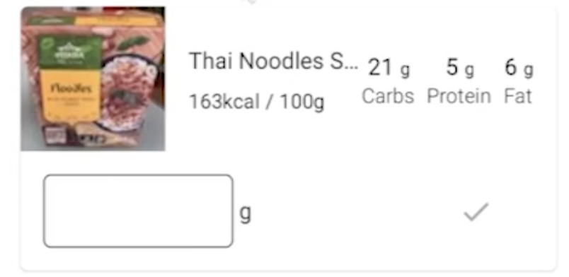
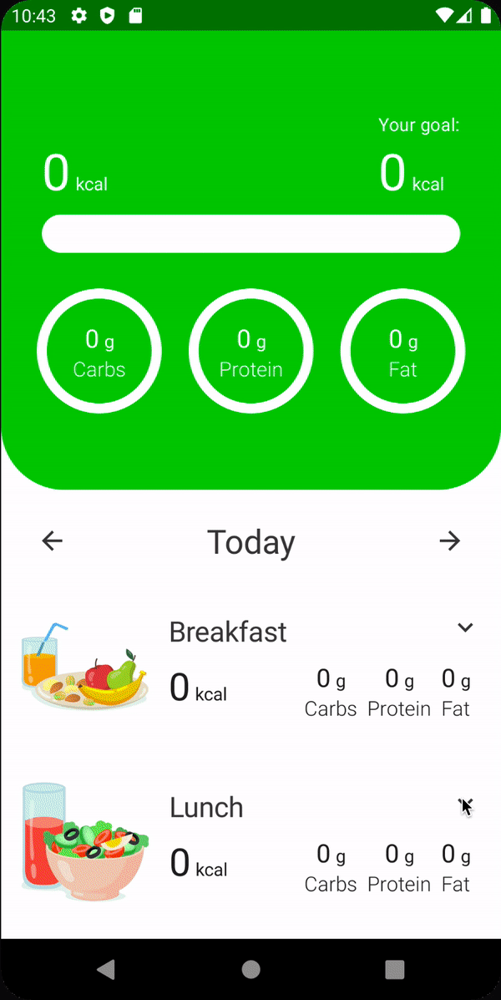

# Trackable Food Item UI

이제 Search UI에서 검색하면 보여지는 음식 아이템의 UI를 구현해보자. 아이템 UI는 다음과 같다.

<div align="center">

</div>

`tracker_presentation` 모듈의 `search/components` 패키지에 `TrackableFoodItem` composable을 추가한다.

```kotlin
@Composable
fun TrackableFoodItem(
        trackableFoodUiState: TrackableFoodUiState,
        onClick: () -> Unit,
        onAmountChange: (String) -> Unit,
        onTrack: () -> Unit,
        modifier: Modifier = Modifier
) {
    val food = trackableFoodUiState.food
    val spacing = LocalSpacing.current
    Column(
            modifier = modifier
                    .clip(RoundedCornerShape(5.dp))
                    .padding(spacing.spaceExtraSmall)
                    .shadow(
                            elevation = 1.dp,
                            shape = RoundedCornerShape(5.dp)
                    )
                    .background(MaterialTheme.colors.surface)
                    .clickable { onClick() }
                    .padding(end = spacing.spaceMedium)
    ) {
        Row(
                modifier = Modifier.fillMaxWidth(),
                horizontalArrangement = Arrangement.SpaceBetween,
                verticalAlignment = Alignment.CenterVertically
        ) {
            Row(
                    modifier = Modifier.weight(1f)
            ) {
                Image(
                        painter = rememberImagePainter(
                                data = food.imageUrl,
                                builder = {
                                    crossfade(true)
                                    error(R.drawable.ic_burger)
                                    fallback(R.drawable.ic_burger)
                                }
                        ),
                        contentDescription = food.name,
                        contentScale = ContentScale.Crop,
                        modifier = Modifier
                                .size(100.dp)
                                .clip(RoundedCornerShape(topStart = 5.dp))
                )
                Spacer(modifier = Modifier.width(spacing.spaceMedium))
                Column(
                        modifier = Modifier.align(CenterVertically)
                ) {
                    Text(
                            text = food.name,
                            style = MaterialTheme.typography.body1,
                            maxLines = 1,
                            overflow = TextOverflow.Ellipsis
                    )
                    Spacer(modifier = Modifier.height(spacing.spaceSmall))
                    Text(
                            text = stringResource(
                                    id = R.string.kcal_per_100g,
                                    food.caloriesPer100g
                            ),
                            style = MaterialTheme.typography.body2
                    )
                }
            }
            Row {
                NutrientInfo(
                        name = stringResource(id = R.string.carbs),
                        amount = food.carbsPer100g,
                        unit = stringResource(
                                id = R.string.grams
                        ),
                        amountTextSize = 16.sp,
                        unitTextSize = 12.sp,
                        nameTextStyle = MaterialTheme.typography.body2
                )
                Spacer(modifier = Modifier.width(spacing.spaceSmall))
                NutrientInfo(
                        name = stringResource(id = R.string.protein),
                        amount = food.proteinPer100g,
                        unit = stringResource(
                                id = R.string.grams
                        ),
                        amountTextSize = 16.sp,
                        unitTextSize = 12.sp,
                        nameTextStyle = MaterialTheme.typography.body2
                )
                Spacer(modifier = Modifier.width(spacing.spaceSmall))
                NutrientInfo(
                        name = stringResource(id = R.string.fat),
                        amount = food.fatPer100g,
                        unit = stringResource(
                                id = R.string.grams
                        ),
                        amountTextSize = 16.sp,
                        unitTextSize = 12.sp,
                        nameTextStyle = MaterialTheme.typography.body2
                )
            }
        }

        AnimatedVisibility(visible = trackableFoodUiState.isExpanded) {
            Row(
                    modifier = Modifier
                            .fillMaxWidth()
                            .padding(spacing.spaceMedium),
                    horizontalArrangement = Arrangement.SpaceBetween,
                    verticalAlignment = Alignment.CenterVertically
            ) {
                Row {
                    BasicTextField(
                            value = trackableFoodUiState.amount,
                            onValueChange = onAmountChange,
                            keyboardOptions = KeyboardOptions(
                                    imeAction = if (trackableFoodUiState.amount.isNotBlank()) {
                                        ImeAction.Done
                                    } else ImeAction.Default
                            ),
                            keyboardActions = KeyboardActions(
                                    onDone = {
                                        onTrack()
                                        defaultKeyboardAction(ImeAction.Done)
                                    }
                            ),
                            singleLine = true,
                            modifier = Modifier
                                    .border(
                                            shape = RoundedCornerShape(5.dp),
                                            width = 0.5.dp,
                                            color = MaterialTheme.colors.onSurface
                                    )
                                    .alignBy(LastBaseline)
                                    .padding(spacing.spaceMedium)
                    )
                    Spacer(modifier = Modifier.width(spacing.spaceExtraSmall))
                    Text(
                            text = stringResource(id = R.string.grams),
                            style = MaterialTheme.typography.body1,
                            modifier = Modifier.alignBy(LastBaseline)
                    )
                }
                IconButton(
                        onClick = onTrack,
                        enabled = trackableFoodUiState.amount.isNotBlank()
                ) {
                    Icon(
                            imageVector = Icons.Default.Check,
                            contentDescription = stringResource(id = R.string.track)
                    )
                }
            }
        }
    }
}
```

구현한 composable을 `SearchScreen`에 추가한다.

```kotlin
@ExperimentalComposeUiApi
@Composable
fun SearchScreen(
        scaffoldState: ScaffoldState,
        mealName: String,
        dayOfMonth: Int,
        month: Int,
        year: Int,
        onNavigateUp: () -> Unit,
        viewModel: SearchViewModel = hiltViewModel()
) {
    // ...
    Spacer(modifier = Modifier.height(spacing.spaceMedium))
    LazyColumn(modifier = Modifier.fillMaxSize()) {
        items(state.trackableFood) { food ->
            TrackableFoodItem(
                    trackableFoodUiState = food,
                    onClick = {
                        viewModel.onEvent(SearchEvent.OnToggleTrackableFood(food.food))
                    },
                    onAmountChange = {
                        viewModel.onEvent(
                                SearchEvent.OnAmountForFoodChange(
                                        food.food, it
                                )
                        )
                    },
                    onTrack = {
                        viewModel.onEvent(
                                SearchEvent.OnTrackFoodClick(
                                        food = food.food,
                                        mealType = MealType.fromString(mealName),
                                        date = LocalDate.of(year, month, dayOfMonth)
                                )
                        )
                    },
                    modifier = Modifier.fillMaxWidth()
            )
        }
    }
}
Box(
        modifier = Modifier.fillMaxSize(),
        contentAlignment = Alignment.Center
) {
    when {
        state.isSearching -> CircularProgressIndicator()
        state.trackableFood.isEmpty() -> {
            Text(
                    text = stringResource(id = R.string.no_results),
                    style = MaterialTheme.typography.body1,
                    textAlign = TextAlign.Center
            )
        }
    }
}
```

음식을 추가하는 경우 추가되긴 하지만 refresh 되어야 보여진다.

<div align="center">

</div>

Track 즉시 음식이 추가되지 않는 이슈, hint 보이지 않는 이슈는 다음에 fix 할 것이다.