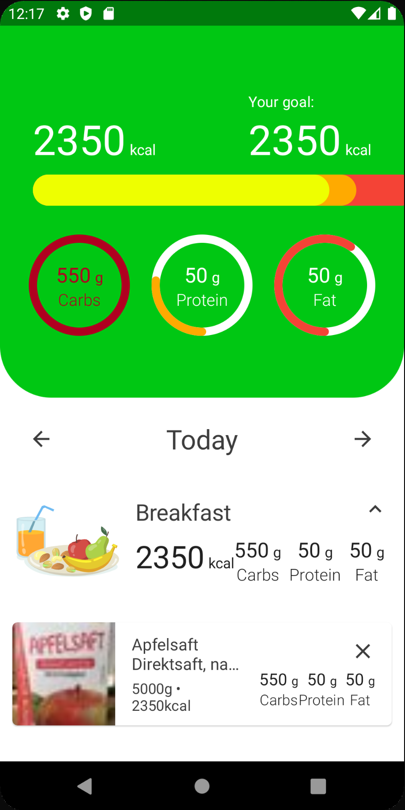
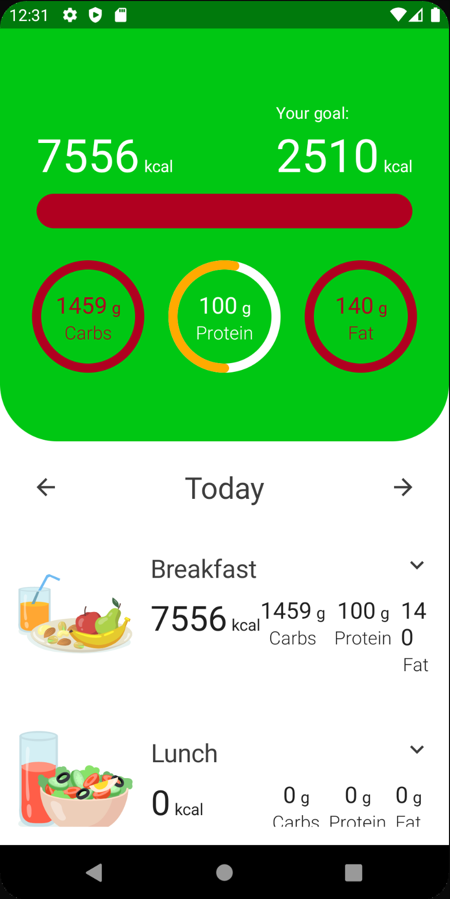

# Improving Navigation

이번엔 네비게이션을 좀 더 향상시켜보자.

## Onboarding Module

`NutrientGoalViewModel`의 네비게이션을 보자. `_uiEvent`로 `Route.TRACKER_OVERVIEW`를 전달한다. 이러한 방법은 일반적인 프로젝트에서 잘 동작하나, 모듈을 재사용할 수
없다는 단점이 있다. 만약 다른 앱에서 `onboarding` 모듈을 재사용한다면 Tracker feature가 아닌 다른 feature가 될 수 있어 다음과 같은 구현은 문제가 될 수 있다.

```kotlin
@HiltViewModel
class NutrientGoalViewModel @Inject constructor(
        private val preferences: Preferences,
        private val fileterOutDigits: FilterOutDigits,
        private val validateNutrients: ValidateNutrients
) : ViewModel() {

    // ...
    fun onEvent(event: NutrientGoalEvent) {
        when (event) {
            // ...
            is NutrientGoalEvent.OnNextClick -> {
                // ...
                when (result) {
                    is ValidateNutrients.Result.Success -> {
                        // ...

                        viewModelScope.launch {
                            _uiEvent.send(UiEvent.Navigate(Route.TRACKER_OVERVIEW))
                        }
                    }
                    // ...
                }
            }
        }
    }
}
```

feature에서 네비게이션을 분리하고 `app` 모듈에서 네비게이션을 수행하여 해결할 수 있다.

`onboarding_presentation` 모듈의 모든 Screen에서 `onNavigate` 파라미터를 `onNextClick`으로 변경해준다. `WelcomeScreen`은 다음과 같이 변경된다.

```kotlin
@Composable
fun WelcomScreen(
        onNextClick: () -> Unit
) {
    // ...
    Column(
            // ...
    ) {
        // ...
        ActionButton(
                // ...
                onClick = { onNextClick() },
                // ...
        )
    }
}
```

그리고 `UiEvent`의 `onNavigate`를 `Success`로 변경해준다.

```kotlin
sealed class UiEvent {
    object Suceess : UiEvent()
    object NavigateUp : UiEvent()
    data class ShowSnackbar(val message: UiText) : UiEvent()
}
```

그리고 `onNavigate`에 사용되던 모든 곳에서 파라미터를 제거해준다. 다음은 `WeightViewModel`의 예제이다.

```kotlin
@HiltViewModel
class WeightViewModel @Inject constructor(
        private val preferences: Preferences
) : ViewModel() {

    // ...
    fun onNextClick() {
        viewModelScope.launch {
            // ...
            _uiEvent.send(UiEvent.Suceess)
        }
    }
}
```

## Tracker Module

이와 비슷한 작업을 동일하게 `tracker_presentation` 모듈에도 해준다. `TrackerOverviewScreen`의 `onNavigate` 파라미터를 `onNavigateToSearch`로 변경해주고
파라미터도 제거한다. `LaunchedEffect` 블록도 제거한 후 `AddButton`을 눌렀을 때 `onNavigateToSearch`를 수행해준다.

```kotlin
@Composable
fun TrackerOverviewScreen(
        onNavigateToSearch: (String, Int, Int, Int) -> Unit,
        viewModel: TrackerOverviewViewModel = hiltViewModel()
) {
    val spacing = LocalSpacing.current
    val state = viewModel.state
    val context = LocalContext.current

    LazyColumn(
            // ...
    ) {
        // ...

        items(state.meals) { meal ->
            ExpendableMeal(
                    // ...
                    content = {
                        Column(
                                // ...
                        ) {
                            // ...

                            AddButton(
                                    // format
                                    text = stringResource(
                                            id = R.string.add_meal,
                                            meal.name.asString(context)
                                    ),
                                    onClick = {
                                        onNavigateToSearch(
                                                meal.name.asString(context),
                                                state.date.dayOfMonth,
                                                state.date.monthValue,
                                                state.date.year
                                        )
                                    },
                                    modifier = Modifier.fillMaxWidth()
                            )
                        }
                    },
                    modifier = Modifier.fillMaxWidth()
            )
        }
    }
}
```

그리고 `TrackerOverviewViewModel`에 `TrackerOverviewEvent.OnAddFoodClick` 이벤트를 제거한다.

```kotlin
@HiltViewModel
class TrackerOverviewViewModel @Inject constructor(
        preferences: Preferences,
        private val trackerUseCases: TrackerUseCases
) : ViewModel() {

    // ...

    fun onEvent(event: TrackerOverviewEvent) {
        when (event) {
            is TrackerOverviewEvent.OnDeleteTrackedFoodClick -> {
                viewModelScope.launch {
                    trackerUseCases.deleteTrackedFood(event.trackedFood)
                    refreshFoods()
                }
            }
            is TrackerOverviewEvent.OnNextDayClick -> {
                state = state.copy(
                        date = state.date.plusDays(1)
                )
                refreshFoods()
            }
            is TrackerOverviewEvent.OnPreviousDayClick -> {
                state = state.copy(
                        date = state.date.minusDays(1)
                )
                refreshFoods()
            }
            is TrackerOverviewEvent.OnToggleMealClick -> {
                state = state.copy(
                        meals = state.meals.map {
                            if (it.name == event.meal.name) {
                                it.copy(isExpanded = !it.isExpanded)
                            } else it
                        }
                )
            }
        }
    }
}
```

그리고 `TrackerOverviewEvent`에서 사용하지 않는 `OnAddFoodClick`를 제거해준다.

```kotlin
sealed class TrackerOverviewEvent {
    object OnNextDayClick : TrackerOverviewEvent()
    object OnPreviousDayClick : TrackerOverviewEvent()
    data class OnToggleMealClick(val meal: Meal) : TrackerOverviewEvent()
    data class OnDeleteTrackedFoodClick(val trackedFood: TrackedFood) : TrackerOverviewEvent()
    data class OnAddFoodClick(val meal: Meal) : TrackerOverviewEvent()
}
```

## App Module

`navigation/NavControllerExt` 파일의 `NavController.navigate` 확장 함수는 이제 필요 없으므로 제거한다.

그리고 `core` 모듈에 있는 `navigation` 패키지의 `Route`를 App 모듈로 이동시켜준 후 `core` 모듈의 `navigation` 패키지를 제거해준다.

이제 `MainActivity`에서 네비게이션을 설정해주는 것만 남았고 다음과 같이 작성해준다.

```kotlin
@ExperimentalComposeUiApi
@AndroidEntryPoint
class MainActivity : ComponentActivity() {

    // ...
    override fun onCreate(savedInstanceState: Bundle?) {
        // ...
        setContent {
            CaloryTrackerTheme {
                // ...
                Scaffold(
                        // ...
                ) {
                    NavHost(
                            // ...
                    ) {
                        composable(route = Route.WELCOME) {
                            WelcomScreen(onNextClick = {
                                navController.navigate(Route.GENDER)
                            })
                        }
                        composable(route = Route.AGE) {
                            AgeScreen(
                                    scaffoldState = scaffoldState,
                                    onNextClick = {
                                        navController.navigate(Route.HEIGHT)
                                    }
                            )
                        }
                        composable(route = Route.GENDER) {
                            GenderScreen(onNextClick = {
                                navController.navigate(Route.AGE)
                            })
                        }
                        composable(route = Route.HEIGHT) {
                            HeightScreen(
                                    scaffoldState = scaffoldState,
                                    onNextClick = {
                                        navController.navigate(Route.WEIGHT)
                                    }
                            )
                        }
                        composable(route = Route.WEIGHT) {
                            WeightScreen(
                                    scaffoldState = scaffoldState,
                                    onNextClick = {
                                        navController.navigate(Route.ACTIVITY)
                                    }
                            )
                        }
                        composable(route = Route.NUTRIENT_GOAL) {
                            NutrientGoalScreen(
                                    scaffoldState = scaffoldState,
                                    onNextClick = {
                                        navController.navigate(Route.TRACKER_OVERVIEW)
                                    }
                            )
                        }
                        composable(route = Route.ACTIVITY) {
                            ActivityScreen(
                                    onNextClick = {
                                        navController.navigate(Route.GOAL)
                                    }
                            )
                        }
                        composable(route = Route.GOAL) {
                            GoalScreen(
                                    onNextClick = {
                                        navController.navigate(Route.NUTRIENT_GOAL)
                                    }
                            )
                        }
                        composable(route = Route.TRACKER_OVERVIEW) {
                            TrackerOverviewScreen(
                                    onNavigateToSearch = { mealName, day, month, year ->
                                        navController.navigate(
                                                Route.SEARCH + "/${mealName}" +
                                                        "/${day}" +
                                                        "/${month}" +
                                                        "/${year}"
                                        )
                                    }
                            )
                        }
                        composable(
                                route = Route.SEARCH + "/{mealName}/{dayOfMonth}/{month}/{year}",
                                arguments = listOf(
                                        navArgument("mealName") {
                                            type = NavType.StringType
                                        },
                                        navArgument("dayOfMonth") {
                                            type = NavType.IntType
                                        },
                                        navArgument("month") {
                                            type = NavType.IntType
                                        },
                                        navArgument("year") {
                                            type = NavType.IntType
                                        },
                                )
                        ) {
                            val mealName = it.arguments?.getString("mealName")!!
                            val dayOfMonth = it.arguments?.getInt("dayOfMonth")!!
                            val month = it.arguments?.getInt("month")!!
                            val year = it.arguments?.getInt("year")!!
                            SearchScreen(
                                    scaffoldState = scaffoldState,
                                    mealName = mealName,
                                    dayOfMonth = dayOfMonth,
                                    month = month,
                                    year = year,
                                    onNavigateUp = {
                                        navController.navigateUp()
                                    }
                            )
                        }
                    }
                }
            }
        }
    }
}
```

`AndroidManifest.xml`의 `allowBackup`을 false로 하여 `onboarding`부터 시작되도록 해보자.

실행 후 음식을 검색하여 칼로리를 초과시킨 경우 `NutrientsBar`가 화면 밖으로 나가는 이슈 및 Your goal이 섭취한 칼로리 양과 동일한 이슈가 있다.

<div align="center">

</div>

### Fix NutrientsBar

API로부터 받아온 값을 통해 비율을 설정하여 발생하는 문제이다. `NutrientsBar`에서 각 값을 통해 비율을 계산하는데, API에서 얻어온 값들은 *4f, *4f, *9f 에 대해 고려하지 않은 음식들이
있다.

```kotlin
@Composable
fun NutrientsBar(
        carbs: Int,
        protein: Int,
        fat: Int,
        calories: Int,
        calorieGoal: Int,
        modifier: Modifier = Modifier
) {
    // ...
    LaunchedEffect(key1 = carbs) {
        carbWidthRatio.animateTo(
                targetValue = ((carbs * 4f) / calorieGoal)
        )
    }
    LaunchedEffect(key1 = protein) {
        proteinWidthRatio.animateTo(
                targetValue = ((protein * 4f) / calorieGoal)
        )
    }
    LaunchedEffect(key1 = fat) {
        fatWidthRatio.animateTo(
                targetValue = ((fat * 9f) / calorieGoal)
        )
    }
}
```

API로부터 받아온 음식의 탄수화물, 단백질, 지방을 적절히 계산할 수 있는 음식들만 받아오도록 구현해 해결할 수 있다. 각 값의 칼로리를 모두 더한 값의 칼로리가 `energyKcal100g`의 0.99 ~
1.01 바운드에 있는 음식들만 가져온다.

`tracker_data` 모듈의 `TrackerRepositoryImpl`에서 `lowerBound`, `upperBound`를 설정해준다.

```kotlin
class TrackerRepositoryImpl(
        private val dao: TrackerDao,
        private val api: OpenFoodApi
) : TrackerRepository {
    override suspend fun searchFood(
            // ...
    ): Result<List<TrackableFood>> {
        return try {
            // ...
            Result.success(
                    searchDto.products
                            .filter {
                                val calculatedCalories = it.nutriments.carbohydrates100g * 4f +
                                        it.nutriments.proteins100g * 4f +
                                        it.nutriments.fat100g * 9f
                                val lowerBound = calculatedCalories * 0.99f
                                val upperBound = calculatedCalories * 1.01f
                                it.nutriments.energyKcal100g in (lowerBound..upperBound)
                            }
                            .mapNotNull {
                                it.toTrackableFood()
                            }
            )
        } catch (e: Exception) {
            e.printStackTrace()
            Result.failure(e)
        }
    }
}
```

### Fix Your goal

그리고 `tracker_presentation` 모듈의 `NutrientsHeader`에서 칼로리 목표 `UnitDisplay`의 `amount`를 `state.caloriesGoal`로 변경해준다.

```kotlin
@Composable
fun NutrientsHeader(
        state: TrackerOverviewState,
        modifier: Modifier = Modifier
) {
    // ...
    Column(
            // ...
    ) {
        Row(
                // ...
        ) {
            // ...
            Column {
                // ...
                UnitDisplay(
                        amount = state.caloriesGoal,
                        unit = stringResource(id = R.string.kcal),
                        amountColor = MaterialTheme.colors.onPrimary,
                        amountTextSize = 40.sp,
                        unitColor = MaterialTheme.colors.onPrimary
                )
            }
        }
        // ...
    }
    // ...
}
```

이제 보여질 수 있는 음식들만 보여져 정확한 계산을 할 수 있다.

<div align="center">

</div>