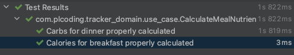

# Unit Testing Use Cases

Unit Test는 하나의 클래스, 함수를 독립적으로 테스트하는 것이다. 클린 아키텍처의 경우 보통 비즈니스 로직을 가진 use case를 테스트 한다. 멀티 모듈 프로젝트인 경우 각 모듈에 테스트 디렉토리가 있다.

## CalculateMealNutrients

`tracker_domain`의 use case인 `CalculateMealNutrients`를 테스트 한다. `trackedFoods`를 파라미터로 가지고, 필요한 영양소를 계산한 뒤 반환한다.

`test`에 `use_case` 패키지를 생성하고, `CalculateMealNutrientsTest`를 작성한다. 생성자로 `preferences`를 전달해주어야 하는데, Mocking을 통해 해결할 수
있다. `CalculateMealNutrients`에서 `preferences.loadUserInfo()` 만 사용하므로 이에 대한 리턴 값을 지정해주면 된다.

```kotlin
class CalculateMealNutrients(
        private val preferences: Preferences
) {

    operator fun invoke(trackedFoods: List<TrackedFood>): Result {
        // ...
        val userInfo = preferences.loadUserInfo()
    }
}
```

`CalculateMealNutrientsTest`를 다음과 같이 작성한다.

```kotlin
class CalculateMealNutrientsTest {

    private lateinit var calculatedMealNutrients: CalculateMealNutrients

    // run before unit test
    @Before
    fun setUp() {
        // create fake preferences
        val preferences = mockk<Preferences>(relaxed = true)
        // return loadUserInfo()
        every { preferences.loadUserInfo() } returns UserInfo(
                gender = Gender.Male,
                age = 20,
                weight = 80f,
                height = 180,
                activityLevel = ActivityLevel.Medium,
                goalType = GoalType.KeepWeight,
                carbRatio = 0.4f,
                proteinRatio = 0.3f,
                fatRatio = 0.3f
        )
        calculatedMealNutrients = CalculateMealNutrients(preferences)
    }

    @Test
    fun `Calories for breakfast properly calculated`() {
        // 30 randomize food
        val trackedFoods = (1..30).map {
            TrackedFood(
                    name = "name",
                    carbs = Random.nextInt(100),
                    protein = Random.nextInt(100),
                    fat = Random.nextInt(100),
                    mealType = MealType.fromString(
                            listOf("breakfast", "lunch", "dinner", "snack").random()
                    ),
                    imageUrl = null,
                    amount = 100,
                    date = LocalDate.now(),
                    calories = Random.nextInt(2000)
            )
        }
        val result = calculatedMealNutrients(trackedFoods)

        val breakfastCalories = result.mealNutrients.values
                .filter { it.mealType is MealType.Breakfast }
                .sumOf { it.calories }
        val expectedCalories = trackedFoods
                .filter { it.mealType is MealType.Breakfast }
                .sumOf { it.calories }

        assertThat(breakfastCalories).isEqualTo(expectedCalories)
    }

    @Test
    fun `Carbs for dinner properly calculated`() {
        // 30 randomize food
        val trackedFoods = (1..30).map {
            TrackedFood(
                    name = "name",
                    carbs = Random.nextInt(100),
                    protein = Random.nextInt(100),
                    fat = Random.nextInt(100),
                    mealType = MealType.fromString(
                            listOf("breakfast", "lunch", "dinner", "snack").random()
                    ),
                    imageUrl = null,
                    amount = 100,
                    date = LocalDate.now(),
                    calories = Random.nextInt(2000)
            )
        }
        val result = calculatedMealNutrients(trackedFoods)

        val dinnerCarbs = result.mealNutrients.values
                .filter { it.mealType is MealType.Dinner }
                .sumOf { it.carbs }
        val expectedCarbs = trackedFoods
                .filter { it.mealType is MealType.Dinner }
                .sumOf { it.carbs }

        assertThat(dinnerCarbs).isEqualTo(expectedCarbs)
    }
}
```

위 두 테스트가 정상적임인 값을 반환하는 것을 알 수 있다.

<div align="center">

</div>