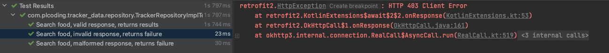

# Testing the Data Layer with Mock Web Server

이번엔 Data 레이어에 대한 테스트를 진행해 볼 것이다. 안드로이드 관련 프레임워크가 필요하지 않으므로 `test` 디렉토리에 테스트를 작성한다.

## TrackerRepositoryImpl Test

`TrackerRepositoryImpl` 클래스에서 option + enter를 입력해 JUnit4 테스트를 생성한다. `dao.insertTrackedFood`, `dao.deleteTrackedFood` 등
Room은 이미 테스트 후 사용되고 있기 때문에, 이에 테스트를 작성할 필요가 없다. 따라서 `dao` 파라미터는 `mockk(releaxed = true)`로 전달한다.

그러나 API에 대한 검증을 수행하기 위해 실제 서버와 비슷한 역할을 수행하는 Mock Web Server를 생성하여야 한다.

`test` 디렉토리에 `remote` 패키지 생성 후 다음 2개의 API에 대한 응답을 저장한다.

* [ValidFoodResponse.kt](res/part-28/ValidFoodResponse.kt)
* [InvalidFoodResponse.kt](res/part-28/InvalidFoodResponse.kt)

`test` 디렉토리에 `repository` 패키지 생성 후 `TrackerRepositoryImplTest`을 작성한다.

```kotlin
class TrackerRepositoryImplTest {

    private lateinit var repository: TrackerRepositoryImpl
    private lateinit var mockWebServer: MockWebServer
    private lateinit var okHttpClient: OkHttpClient
    private lateinit var api: OpenFoodApi

    @Before
    fun setUp() {
        mockWebServer = MockWebServer()
        okHttpClient = OkHttpClient.Builder()
                // 테스트 시 문제가 생기면 기본적으로 10초 동안을 기다려야 한다. 이를 회피하기 위해 1초로 변경한다.
                .writeTimeout(1, TimeUnit.SECONDS)
                .readTimeout(1, TimeUnit.SECONDS)
                .connectTimeout(1, TimeUnit.SECONDS)
                .build()
        api = Retrofit.Builder()
                .addConverterFactory(MoshiConverterFactory.create())
                .client(okHttpClient)
                .baseUrl(mockWebServer.url("/"))
                .build()
                .create(OpenFoodApi::class.java)
        repository = TrackerRepositoryImpl(
                dao = mockk(relaxed = true),
                api = api
        )
    }

    @After
    fun tearDown() {
        mockWebServer.shutdown()
    }

    @Test
    fun `Search food, valid response, returns results`() = runBlocking {
        mockWebServer.enqueue(
                MockResponse()
                        .setResponseCode(200)
                        .setBody(validFoodResponse)
        )
        val result = repository.searchFood("banana", 1, 40)

        assertThat(result.isSuccess).isTrue()
    }

    @Test
    fun `Search food, invalid response, returns failure`() = runBlocking {
        mockWebServer.enqueue(
                MockResponse()
                        .setResponseCode(403)
                        .setBody(validFoodResponse)
        )
        val result = repository.searchFood("banana", 1, 40)

        assertThat(result.isFailure).isTrue()
    }

    @Test
    fun `Search food, malformed response, returns failure`() = runBlocking {
        mockWebServer.enqueue(
                MockResponse()
                        .setBody(malformedFoodResponse)
        )
        val result = repository.searchFood("banana", 1, 40)

        assertThat(result.isFailure).isTrue()
    }
}
```

테스트가 정상적으로 수행되며, 실패에 대한 내용을 확인할 수 있다.

<div align="center">

</div>