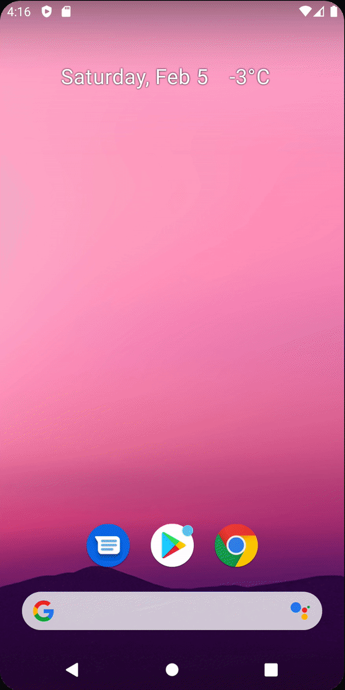
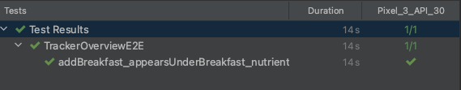

# Writing an End-to-End UI Test for Tracking Food

이번엔 End-to-End(E2E) 테스트를 작성해보자. E2E 테스트는 유저의 모든 flow를 테스트한다.

유저는 다음의 flow를 가진다.

breakfast click → add breakfast click → food seach → show result → pick food → enter amount → track food → calories,
nutrients calculated

이번에 다음과 같은 부분들을 배우게 된다.

1. Fake Repository
2. Dagger-Hilt for testing
3. Compose UI Testing

E2E 테스트는 유저의 모든 flow를 다루기 때문에 `app` 모듈에 작성한다.

실제 API를 요청하여 테스트하는 것은 다양한 문제가 발생될 수 있다. 예를 들어, 네트워크 문제나 서버가 다운되거나 하는 등의. 따라서 네트워크로 요청하는 것 대신 로컬에서 테스트할 수 있도록 작성한다. 이를 위해
Fake Repository가 필요하다. 이 레포지토리는 하드코딩된 응답을 반환한다.

`app` 모듈의 `androidTest`에 `TrackerRepositoryFake`를 생성하고 `TrackerRepository`를 작성한다.

```kotlin
class TrackerRepositoryFake : TrackerRepository {

    //
    val shouldReturnError = false

    private val trackedFood = mutableListOf<TrackedFood>()
    var searchResults = listOf<TrackableFood>()

    private val getFoodsForDateFlow = MutableSharedFlow<List<TrackedFood>>(replay = 1)

    override suspend fun searchFood(
            query: String,
            page: Int,
            pageSize: Int
    ): Result<List<TrackableFood>> {
        return if (shouldReturnError) {
            Result.failure(Throwable())
        } else {
            Result.success(searchResults)
        }
    }

    override suspend fun insertTrackedFood(food: TrackedFood) {
        trackedFood.add(food.copy(id = Random.nextInt()))
        getFoodsForDateFlow.emit(trackedFood)
    }

    override suspend fun deleteTrackedFood(food: TrackedFood) {
        trackedFood.remove(food)
        getFoodsForDateFlow.emit(trackedFood)
    }

    override fun getFoodsForDate(localDate: LocalDate): Flow<List<TrackedFood>> {
        return getFoodsForDateFlow
    }
}
```

Instrument Test에서 Test Runner는 자동으로 `@HiltAndroidApp` 주석이 달린 `Application()` 클래스를 사용하지 않기 때문에 Test에선 디펜던시들이 인젝션 되지 않는다.

이는 커스텀 Test Runner를 만들어 해결할 수 있다. `app` 모듈에 `HiltTestRunner`를 생성한 후 다음과 같이 작성한다.

```kotlin
class HiltTestRunner : AndroidJUnitRunner() {

    override fun newApplication(
            cl: ClassLoader?,
            className: String?,
            context: Context?
    ): Application {
        return super.newApplication(cl, HiltTestApplication::class.java.name, context)
    }
}
```

`HiltTestRunner`를 테스트에 사용하기 위해 `build.gradle` 파일을 수정한다.

```kotlin
android {
    // ...
    defaultConfig {
        // ...
        testInstrumentationRunner = "com.plcoding.calorytracker.HiltTestRunner"
        // ...
    }
    // ...
}
```

UI에 보여지는 버튼을 통해 테스트하기 위해 `Modifier`의 `testTag`를 사용할 수 있다. `SearchTextField`의 검색 아이콘에 다음과 같이 `testTag`를 추가했다. `testTag`를
추가하여 테스트를 수행할 수도 있지만 웬만하면 `contentDescription`을 통해 아이콘, 버튼 등을 찾는게 더 깔끔한 코드를 유지할 수 있다.

```kotlin
@Composable
fun SearchTextField(
        // ...
) {
    val spaceing = LocalSpacing.current
    Box(
            modifier = modifier
    ) {
        BasicTextField(
                // ...
                modifier = Modifier
                        // ...
                        .onFocusChanged { onFocusChanged(it) }
                        .testTag("search_textfield")
        )
        //...
    }
    // ...
}
```

테스트를 위해 `TrackableFoodItem`의 Amount를 입력하는 `BasicTextField`를 찾아야 하므로 `Modifier`에 `semantics` 블럭을 다음과 같이 추가한다. `semantics`
를 사용하면 어떤 composable이든 `contentDescription`을 입력할 수 있게 된다.

```kotlin
@Composable
fun TrackablefoodItem(
        // ...
) {
    val food = trackableFoodUiState.food
    val spacing = LocalSpacing.current
    Column(
            // ...
    ) {
        AnimatedVisibility(visible = trackableFoodUiState.isExpanded) {
            Row(
                    // ...
            ) {
                Row {
                    BasicTextField(
                            // ...
                            modifier = Modifier
                                    .border(
                                            shape = RoundedCornerShape(5.dp),
                                            width = 0.5.dp,
                                            color = MaterialTheme.colors.onSurface
                                    )
                                    .alignBy(LastBaseline)
                                    .padding(spacing.spaceMedium)
                                    .semantics {
                                        contentDescription = "Amount"
                                    }
                    )
                    // ...
                }
                // ...
            }
        }
    }
}
```

이제 `app` 모듈의 `androidTest`에 `TrackerOverviewE2E`를 작성한다.

```kotlin
@ExperimentalComposeUiApi
@ExperimentalCoilApi
@HiltAndroidTest
class TrackerOverviewE2E {

    // Dagger-Hilt 디펜던시 인젝션을 위한 Rule 설정
    @get:Rule
    val hiltRule = HiltAndroidRule(this)

    @get:Rule
    val composeRule = createAndroidComposeRule<MainActivity>()

    private lateinit var repositoryFake: TrackerRepositoryFake
    private lateinit var trackerUseCases: TrackerUseCases
    private lateinit var preferences: Preferences
    private lateinit var trackerOverviewViewModel: TrackerOverviewViewModel
    private lateinit var searchViewModel: SearchViewModel

    private lateinit var navController: NavHostController

    @Before
    fun setUp() {
//        // Dagger-Hilt injection
//        hiltRule.inject()

        preferences = mockk(relaxed = true)
        every { preferences.loadUserInfo() } returns UserInfo(
                gender = Gender.Male,
                age = 20,
                weight = 80f,
                height = 180,
                activityLevel = ActivityLevel.Medium,
                goalType = GoalType.KeepWeight,
                carbRatio = 0.4f,
                proteinRatio = 0.3f,
                fatRatio = 0.3f
        )

        repositoryFake = TrackerRepositoryFake()
        trackerUseCases = TrackerUseCases(
                trackFood = TrackFood(repositoryFake),
                searchFood = SearchFood(repositoryFake),
                getFoodsForDate = GetFoodsForDate(repositoryFake),
                deleteTrackedFood = DeleteTrackedFood(repositoryFake),
                calculateMealNutrients = CalculateMealNutrients(preferences)
        )

        trackerOverviewViewModel = TrackerOverviewViewModel(
                preferences = preferences,
                trackerUseCases = trackerUseCases
        )

        searchViewModel = SearchViewModel(
                trackerUseCases = trackerUseCases,
                filterOutDigits = FilterOutDigits()
        )

        composeRule.setContent {
            CaloryTrackerTheme {
                val scaffoldState = rememberScaffoldState()
                navController = rememberNavController()
                Scaffold(
                        modifier = Modifier.fillMaxSize(),
                        scaffoldState = scaffoldState
                ) {
                    NavHost(
                            navController = navController,
                            startDestination = Route.TRACKER_OVERVIEW
                    ) {
                        composable(route = Route.TRACKER_OVERVIEW) {
                            TrackerOverviewScreen(
                                    onNavigateToSearch = { mealName, day, month, year ->
                                        navController.navigate(
                                                Route.SEARCH + "/${mealName}" +
                                                        "/${day}" +
                                                        "/${month}" +
                                                        "/${year}"
                                        )
                                    },
                                    viewModel = trackerOverviewViewModel
                            )
                        }
                        composable(
                                route = Route.SEARCH + "/{mealName}/{dayOfMonth}/{month}/{year}",
                                arguments = listOf(
                                        navArgument("mealName") {
                                            type = NavType.StringType
                                        },
                                        navArgument("dayOfMonth") {
                                            type = NavType.IntType
                                        },
                                        navArgument("month") {
                                            type = NavType.IntType
                                        },
                                        navArgument("year") {
                                            type = NavType.IntType
                                        },
                                )
                        ) {
                            val mealName = it.arguments?.getString("mealName")!!
                            val dayOfMonth = it.arguments?.getInt("dayOfMonth")!!
                            val month = it.arguments?.getInt("month")!!
                            val year = it.arguments?.getInt("year")!!
                            SearchScreen(
                                    scaffoldState = scaffoldState,
                                    mealName = mealName,
                                    dayOfMonth = dayOfMonth,
                                    month = month,
                                    year = year,
                                    onNavigateUp = {
                                        navController.navigateUp()
                                    },
                                    viewModel = searchViewModel
                            )
                        }
                    }
                }
            }
        }
    }

    @Test
    fun addBreakfast_appearsUnderBreakfast_nutrientsProperlyCalculated() {
        repositoryFake.searchResults = listOf(
                TrackableFood(
                        name = "banana",
                        imageUrl = null,
                        caloriesPer100g = 150,
                        proteinPer100g = 5,
                        carbsPer100g = 50,
                        fatPer100g = 1
                )
        )

        val addedAmount = 150
        val expectedCalories = (1.5f * 150).roundToInt()
        val expectedCarbs = (1.5f * 50).roundToInt()
        val expectedProtein = (1.5f * 5).roundToInt()
        val expectedFat = (1.5f * 1).roundToInt()

        composeRule
                .onNodeWithText("Add Breakfast")
                .assertDoesNotExist()
        composeRule
                .onNodeWithContentDescription("Breakfast")
                .performClick()
        composeRule
                .onNodeWithText("Add Breakfast")
                .assertIsDisplayed()
        composeRule
                .onNodeWithText("Add Breakfast")
                .performClick()

        assertThat(
                navController
                        .currentDestination
                        ?.route
                        ?.startsWith(Route.SEARCH) // Route가 파라미터를 가질 수 있기 떄문에 startsWith 사용
        ).isTrue()

        composeRule
                .onNodeWithTag("search_textfield")
                .performTextInput("banana")
        composeRule
                .onNodeWithContentDescription("Search...")
                .performClick()
        composeRule
                .onNodeWithText("Carbs") // Carbs 텍스트가 있는 아이템을 클릭한다.
                .performClick()
        composeRule
                .onNodeWithContentDescription("Amount")
                .performTextInput(addedAmount.toStr())
        composeRule
                .onNodeWithContentDescription("Track")
                .performClick()

        assertThat(
                navController
                        .currentDestination
                        ?.route
                        ?.startsWith(Route.TRACKER_OVERVIEW)
        )

        composeRule
                .onAllNodesWithText(expectedCarbs.toStr())
                .onFirst()
                .assertIsDisplayed()
        composeRule
                .onAllNodesWithText(expectedProtein.toStr())
                .onFirst()
                .assertIsDisplayed()
        composeRule
                .onAllNodesWithText(expectedFat.toStr())
                .onFirst()
                .assertIsDisplayed()
        composeRule
                .onAllNodesWithText(expectedCalories.toStr())
                .onFirst()
                .assertIsDisplayed()
    }
}
```

테스트를 실행하면 다음과 같이 유저 flow를 빠르게 수행하며 테스트를 진행한다.


<div align="center" class="column">
<div></div>
<div></div>
</div>