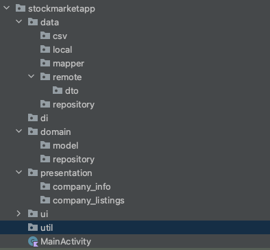
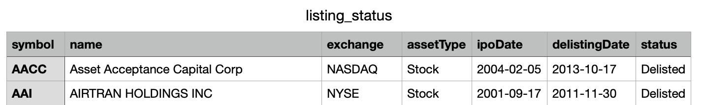
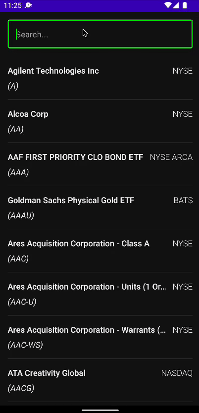
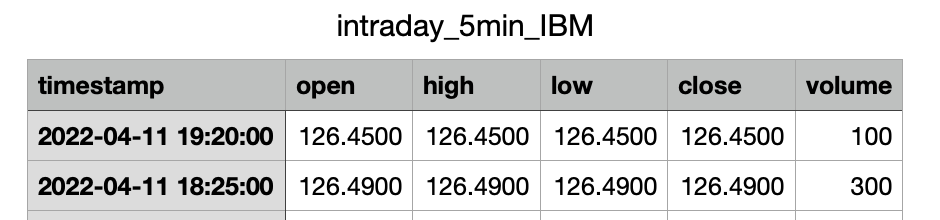
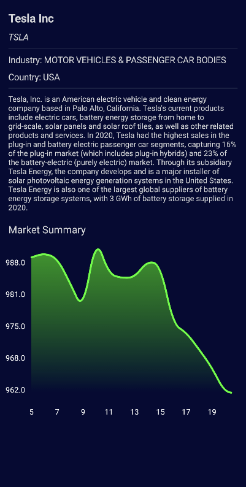

# How to Build a Clean Architecture Stock Market App

Stock Market App을 만들어보자. 이번에는 use case 없는 MVVM 아키텍처를 적용한다.

다음 URL의 API를 사용하여 구현한다.

- [https://rapidapi.com/alphavantage/api/alpha-vantage](https://rapidapi.com/alphavantage/api/alpha-vantage)

## Add dependencies

```groovy
dependencies {
    implementation 'androidx.core:core-ktx:1.7.0'
    implementation "androidx.compose.ui:ui:$compose_version"
    implementation "androidx.compose.material:material:$compose_version"
    implementation "androidx.compose.ui:ui-tooling-preview:$compose_version"
    implementation 'androidx.lifecycle:lifecycle-runtime-ktx:2.3.1'
    implementation 'androidx.activity:activity-compose:1.3.1'
    testImplementation 'junit:junit:4.13.2'
    androidTestImplementation 'androidx.test.ext:junit:1.1.3'
    androidTestImplementation 'androidx.test.espresso:espresso-core:3.4.0'
    androidTestImplementation "androidx.compose.ui:ui-test-junit4:$compose_version"
    debugImplementation "androidx.compose.ui:ui-tooling:$compose_version"
    coreLibraryDesugaring 'com.android.tools:desugar_jdk_libs:1.1.5'

    // OpenCSV
    implementation 'com.opencsv:opencsv:5.5.2'

    // Compose dependencies
    implementation "androidx.lifecycle:lifecycle-viewmodel-compose:2.4.1"
    implementation "androidx.compose.material:material-icons-extended:$compose_version"
    implementation "com.google.accompanist:accompanist-flowlayout:0.17.0"
    implementation 'androidx.paging:paging-compose:1.0.0-alpha14'
    implementation "androidx.activity:activity-compose:1.6.0-alpha01"
    implementation "com.google.accompanist:accompanist-swiperefresh:0.24.2-alpha"

    // Compose Nav Destinations
    implementation 'io.github.raamcosta.compose-destinations:core:1.1.2-beta'
    ksp 'io.github.raamcosta.compose-destinations:ksp:1.1.2-beta'

    // Coil
    implementation "io.coil-kt:coil-compose:1.4.0"

    //Dagger - Hilt
    implementation "com.google.dagger:hilt-android:2.40.5"
    kapt "com.google.dagger:hilt-android-compiler:2.40.5"
    implementation "androidx.hilt:hilt-lifecycle-viewmodel:1.0.0-alpha03"
    kapt "androidx.hilt:hilt-compiler:1.0.0"
    implementation 'androidx.hilt:hilt-navigation-compose:1.0.0'

    // Retrofit
    implementation 'com.squareup.retrofit2:retrofit:2.9.0'
    implementation 'com.squareup.retrofit2:converter-moshi:2.9.0'
    implementation "com.squareup.okhttp3:okhttp:5.0.0-alpha.3"
    implementation "com.squareup.okhttp3:logging-interceptor:5.0.0-alpha.3"

    // Room
    implementation "androidx.room:room-runtime:2.4.2"
    kapt "androidx.room:room-compiler:2.4.2"

    // Kotlin Extensions and Coroutines support for Room
    implementation "androidx.room:room-ktx:2.4.2"
}
```

## Clean architecture structuring

다음과 같이 클린 아키텍처 구조로 만든다.

<div align="center">

</div>

# Company Listings

## Implementa data layer

[https://www.alphavantage.co/documentation/](https://www.alphavantage.co/documentation/)에서 다음 URL을 통해 csv 파일을 다운받는다.

- `[https://www.alphavantage.co/query?**function**=LISTING_STATUS&**date**=2014-07-10&**state**=delisted&**apikey**=demo](https://www.alphavantage.co/query?function=LISTING_STATUS&date=2014-07-10&state=delisted&apikey=demo)`

여기엔 모든 기업에 대한 정보가 들어가 있으므로 이를 파싱하여 로컬에 캐싱할 것이다.

<div align="center">

</div>

`data.remote` 패키지에 `StockApi` 인터페이스를 작성한다.

```kotlin
interface StockApi {

    @GET("query?function=LISTING_STATUS")
    suspend fun getListings(
        @Query("apikey") apikey: String = API_KEY
    ): ResponseBody // to read byte response

    companion object {
        const val API_KEY = "PTOBZGI9OK76PNKQ"
        const val BASE_URL = "https://alphavantage.co"
    }
}
```

`data.local` 패키지에 DB 저장을 위한 `CompanyListingEntity` data class를 만든다.

```kotlin
@Entity
data class CompanyListingEntity(
    val name: String,
    val symbol: String,
    val exchange: String,
    @PrimaryKey val id: Int? = null
)
```

그리고 `domain.model`에 실제 사용될 데이터 클래스를 생성한다. 이렇게 구현하면 DB에 저장하는 로직이 변경되더라도(Realm 등) 도메인은 변경할 필요가 없고 관련 엔티티 클래스만 변경하면 된다.

```kotlin
data class CompanyListing(
    val name: String,
    val symbol: String,
    val exchange: String,
)
```

엔티티를 모델 클래스로 변경하기 위해 `data.mapper` 패키지 하위에 `CompanyMapper`를 생성한다.

```kotlin
fun CompanyListingEntity.toCompanyListing(): CompanyListing {
    return CompanyListing(
        name = name,
        symbol = symbol,
        exchange = exchange
    )
}

fun CompanyListing.toCompanyListingEntity(): CompanyListingEntity {
    return CompanyListingEntity(
        name = name,
        symbol = symbol,
        exchange = exchange
    )
}
```

`data.local` 패키지에 `StockDao` 인터페이스를 생성해준다.

```kotlin
@Dao
interface StockDao {

    @Insert(onConflict = OnConflictStrategy.REPLACE)
    suspend fun insertCompanyListings(
        companyListingEntity: List<CompanyListingEntity>
    )

    @Query("DELETE FROM companylistingentity")
    suspend fun clearCompanyListrings()

    @Query(
        """
        SELECT * 
        FROM companylistingentity
        WHERE LOWER(name) LIKE '%' || LOWER(:query) || '%' OR 
            UPPER(:query) == symbol
    """
    // || : add string
    // 즉, '%' + name의 소문자 + query 소문자 + '%' 또는 query 대문자 == symbol 인 경우
    )
    suspend fun searchCompanyListing(query: String): List<CompanyListingEntity>
}
```

`data.local` 패키지에 `StockDatabase`를 다음과 같이 만들어준다. 나머지 작업들은 Room이 알아서 처리해준다.

```kotlin
@Database(
    entities = [CompanyListingEntity::class],
    version = 1
)
abstract class StockDatabase: RoomDatabase() {

    abstract val dao: StockDao
}
```

`util` 패키지에 데이터의 상태를 알려주는 `Resource` sealed class를 생성한다.

```kotlin
sealed class Resource<T>(val data: T? = null, val message: String? = null) {
    class Success<T>(data: T?): Resource<T>(data)
    class Error<T>(message: String, data: T? = null): Resource<T>(data = data, message = message)
    class Loading<T>(val isLoading: Boolean = true): Resource<T>(null)
}
```

`domain.repository` 패키지에 `StockRepository` 인터페이스를 생성한다. 도메인 레이어는 데이터 레이어에 접근할 수 없으므로 엔티티를 반환할 수 없다.

```kotlin
interface StockRepository {

    suspend fun getCompanyListings(
        fetchFromRemote: Boolean,  // for swipe refresh layout
        query: String       // 
    ): Flow<Resource<List<CompanyListing>>> // domain layer doesn't access data layer, so don't use entity.
    // why flow? emit diffent results over a period time
}
```

CSV를 파싱하기 위해 `data.csv` 패키지에 `CSVParser` 인터페이스 및 구현체를 생성한다.

```kotlin
interface CSVParser<CompanyListing> {

    suspend fun parse(stream: InputStream): List<CompanyListing>
}
```

```kotlin
@Singleton
class CompanyListingsParser @Inject constructor() : CSVParser<CompanyListing> {

    override suspend fun parse(stream: InputStream): List<CompanyListing> {
        val csvReader = CSVReader(InputStreamReader(stream))
        return withContext(Dispatchers.IO) {
            csvReader
                .readAll()
                .drop(1) // drop column name
                .mapNotNull { line ->
                    val symbol = line.getOrNull(0)
                    val name = line.getOrNull(1)
                    val exchange = line.getOrNull(2)
                    CompanyListing(
                        name = name ?: return@mapNotNull null, // If null ignore entity
                        symbol = symbol ?: return@mapNotNull null,
                        exchange = exchange ?: return@mapNotNull null
                    )
                }.also {
                    csvReader.close()
                }
        }
    }
}
```

`data.repository`에 `StockRepository`를 상속한 `StockRepositoryImpl`을 구현해준다. Single source of truth를 따르기 위해 먼저 로컬 디비에 데이터를 저장한 후 해당 디비로부터 데이터를 가져온다.

```kotlin
@Singleton
class StockRepositoryImpl @Inject constructor(
    private val api: StockApi,
    private val db: StockDatabase,
    private val companyListingsParser: CSVParser<CompanyListing>
) : StockRepository {

    private val dao = db.dao

    override suspend fun getCompanyListings(
        fetchFromRemote: Boolean,
        query: String
    ): Flow<Resource<List<CompanyListing>>> {
        return flow {
            emit(Resource.Loading(true))
            val localListings = dao.searchCompanyListing(query)
            emit(Resource.Success(
                data = localListings.map { it.toCompanyListing() }
            ))

            val isDbEmpty = localListings.isEmpty() && query.isBlank() // If the query is black and the localListings is empty, it means there is no data in the local DB.
            val shouldJustLoadFromCache = !isDbEmpty && !fetchFromRemote
            if (shouldJustLoadFromCache) {
                emit(Resource.Loading(false))
                return@flow
            }

            val remoteListings = try {
                val response = api.getListings()
                // val csvReader = CSVReader(InputStreamReader(response.byteStream())) // This code violate single source of data.
                companyListingsParser.parse(response.byteStream())
            } catch (e: IOException) {
                e.printStackTrace()
                emit(Resource.Error("Couldn't load data"))
                null
            } catch (e: HttpException) {
                e.printStackTrace()
                emit(Resource.Error("Couldn't load data"))
                null
            }

            remoteListings?.let { listings ->
                dao.clearCompanyListrings()
                dao.insertCompanyListings(
                    listings.map { it.toCompanyListingEntity() }
                )
                // To follow the single source of truth, insert the data into db first and load from that db.
                emit(Resource.Success(
                    data = dao
                        .searchCompanyListing("")
                        .map { it.toCompanyListing() }
                ))
                emit(Resource.Loading(false))
            }
        }
    }
}
```

## Implement presentation

상태와 이벤트를 처리하기 위한 `CompanyListingsState`, `CompanyListingsEvent`를 구현해준다.

```kotlin
sealed class CompanyListingsEvent {
    object Refresh: CompanyListingsEvent()
    data class OnSearchQueryChange(val query: String): CompanyListingsEvent()
}
```

```kotlin
data class CompanyListingsState(
    val companies: List<CompanyListing> = emptyList(),
    val isLoading: Boolean = false,
    val isRefreshing: Boolean = false,
    val searchQuery: String = ""
)
```

`CompanyListingsViewModel`을 만들어준다.

```kotlin
@HiltViewModel
class CompanyListingsViewModel @Inject constructor(
    private val repository: StockRepository
) : ViewModel() {

    var state by mutableStateOf(CompanyListingsState())
        private set

    private var searchJob: Job? = null

		init {
        getCompanyListings()
    }

    fun onEvent(event: CompanyListingsEvent) {
        when (event) {
            is CompanyListingsEvent.Refresh -> {
                getCompanyListings(fetchFromRemote = true)
            }
            is CompanyListingsEvent.OnSearchQueryChange -> {
                state = state.copy(searchQuery = event.query)
                searchJob?.cancel()
                searchJob = viewModelScope.launch { 
                    delay(500L)
                    getCompanyListings()
                }
            }
        }
    }

    private fun getCompanyListings(
        query: String = state.searchQuery.lowercase(),
        fetchFromRemote: Boolean = false
    ) {
        viewModelScope.launch {
            repository.getCompanyListings(fetchFromRemote = fetchFromRemote, query = query)
                .collect { result ->
                    when (result) {
                        is Resource.Success -> {
                            result.data?.let { listings ->
                                state = state.copy(
                                    companies = listings
                                )
                            }
                        }
                        is Resource.Error -> Unit
                        is Resource.Loading -> {
                            state = state.copy(isLoading = result.isLoading)
                        }
                    }
                }
        }
    }
}
```

각 기업 아이템을 보여줄 `CompanyItem` composable을 생성한다.

```kotlin
@Composable
fun CompanyItem(
    company: CompanyListing,
    modifier: Modifier = Modifier
) {
    Row(
        modifier = modifier,
        verticalAlignment = Alignment.CenterVertically
    ) {
        Column(
            modifier = Modifier.weight(1f)
        ) {
            Row(
                modifier = Modifier.fillMaxWidth()
            ) {
                Text(
                    text = company.name,
                    fontWeight = FontWeight.SemiBold,
                    fontSize = 16.sp,
                    color = MaterialTheme.colors.onBackground,
                    overflow = TextOverflow.Ellipsis,
                    maxLines = 1,
                    modifier = Modifier.weight(1f)
                )
                Spacer(modifier = Modifier.width(4.dp))
                Text(
                    text = company.exchange,
                    fontWeight = FontWeight.Light,
                    color = MaterialTheme.colors.onBackground
                )
            }
            Spacer(modifier = Modifier.height(8.dp))
            Text(
                text = "(${company.symbol})",
                fontStyle = FontStyle.Italic,
                color = MaterialTheme.colors.onBackground
            )
        }
    }
}
```

이제 CompanyListings 화면을 구성하는 `CompanyListingsScreen` composable을 구현한다.

```kotlin
@Composable
@Destination(start = true)
fun CompanyListingsScreen(
    navigator: DestinationsNavigator,
    viewModel: CompanyListingsViewModel = hiltViewModel()
) {
    val swipeRefreshState = rememberSwipeRefreshState(
        isRefreshing = viewModel.state.isRefreshing
    )
    val state = viewModel.state

    Column(
        modifier = Modifier.fillMaxSize()
    ) {
        OutlinedTextField(
            value = state.searchQuery,
            onValueChange = {
                viewModel.onEvent(CompanyListingsEvent.OnSearchQueryChange(it))
            },
            modifier = Modifier
                .padding(16.dp)
                .fillMaxWidth(),
            placeholder = {
                Text(
                    text = "Search...",
                )
            },
            singleLine = true,
            maxLines = 1
        )
        SwipeRefresh(
            state = swipeRefreshState,
            onRefresh = {
                viewModel.onEvent(CompanyListingsEvent.Refresh)
            }
        ) {
            LazyColumn(
                modifier = Modifier.fillMaxSize()
            ) {
                items(state.companies.size) { i ->
                    val company = state.companies[i]
                    CompanyItem(
                        company = company,
                        modifier = Modifier
                            .fillMaxWidth()
                            .clickable {
                                // TODO : Navigate to detail screen
                            }
                            .padding(16.dp)
                    )
                    if (i < state.companies.size) {
                        Divider(
                            modifier = Modifier.padding(
                                horizontal = 16.dp
                            )
                        )
                    }
                }
            }
        }
    }
}
```

## Setup Dagger-Hilt

루트 패키지에 `StockApplication`을 생성해주고 다음과 같이 구현 및 `AndroidManifest.xml` 파일에 선언해준다. INTERNET 권한도 추가한다.

```kotlin
@HiltAndroidApp
class StockApplication: Application()
```

`di` 패키지에 `AppModule` object를 생성한다.

```kotlin
@Module
@InstallIn(SingletonComponent::class)
object AppModule {

    @Provides
    @Singleton
    fun provideStockApi(): StockApi {
        return Retrofit.Builder()
            .baseUrl(StockApi.BASE_URL)
            .addConverterFactory(MoshiConverterFactory.create())
            .build()
            .create(StockApi::class.java)
    }

    @Provides
    @Singleton
    fun provideStockDatabase(app: Application): StockDatabase {
        return Room.databaseBuilder(
            app,
            StockDatabase::class.java,
            "stockdb.db"
        ).build()
    }
}
```

생성자에 DI를 위해 `@Inject`를 붙이는 경우 Dagger-Hilt가 알아서 객체를 생성해주기 때문에 모듈에 provide 함수를 선언할 필요가 없다.

하지만 인터페이스인 경우 어떤 구현체가 제공되어야 하는지를 모르기 때문에 따로 선언해주어야 한다.

`di` 패키지에 `RepositoryModule`을 구현한다.

```kotlin
@Module
@InstallIn(Singleton::class)
abstract class RepositoryModule {

    @Binds
    @Singleton
    abstract fun bindCompanyListingsParser(
        // CSVParser should be use CompanyListingsParser implementation
        companyListingsParser: CompanyListingsParser
    ): CSVParser<CompanyListing>

    @Binds
    @Singleton
    abstract fun bindStockRepository(
        stockRepositoryImpl: StockRepositoryImpl
    ): StockRepository
}
```

`MainActivity`를 다음과 같이 작성한다.

```kotlin
@AndroidEntryPoint
class MainActivity : ComponentActivity() {
    override fun onCreate(savedInstanceState: Bundle?) {
        super.onCreate(savedInstanceState)
        setContent {
            StockMarketAppTheme {
                Surface(
                    modifier = Modifier.fillMaxSize(),
                    color = MaterialTheme.colors.background
                ) {
                    DestinationsNavHost(navGraph = NavGraphs.root)
                }
            }
        }
    }
}
```

## Change theme

`ui.theme` 패키지의 `Color`와 `Theme`을 다음과 같이 변경한다.

```kotlin
val DarkBlue = Color(0xFF060D2E)
val TextWhite = Color(0xFFEEEEEE)
```

```kotlin
private val DarkColorPalette = darkColors(
    primary = Color.Green,
    primaryVariant = DarkBlue,
    onPrimary = Color.DarkGray,
    onBackground = TextWhite
)

@Composable
fun StockMarketAppTheme(
    darkTheme: Boolean = isSystemInDarkTheme(),
    content: @Composable () -> Unit
) {
    MaterialTheme(
        colors = DarkColorPalette,
        typography = Typography,
        shapes = Shapes,
        content = content
    )
}
```

<div align="center">

</div>

# Company Info

다음 URL에서 회사의 정보를 가져온다.

- [https://www.alphavantage.co/query?function=OVERVIEW&symbol=IBM&apikey=demo](https://www.alphavantage.co/query?function=OVERVIEW&symbol=IBM&apikey=demo)

## Implement data & domain layer

`remote.dto` 패키지에 `CompanyInfoDto` data class를 생성해준다. `API_KEY`가 만료되는 경우 null을 반환할 수 있기 때문에 nullable 한 변수로 선언한다.

```kotlin
data class CompanyInfoDto(
    @field:Json(name = "Symbol") val symbol: String?,
    @field:Json(name = "Description") val description: String?,
    @field:Json(name = "Name") val name: String?,
    @field:Json(name = "Country") val country: String?,
    @field:Json(name = "Industry") val industry: String?,
)
```

그리고 `domain.model` 하위에 위 클래스를 변경해 사용할 `CompanyInfo` data class를 생성한다.

```kotlin
data class CompanyInfo(
    val symbol: String,
    val description: String,
    val name: String,
    val country: String,
    val industry: String,
)
```

`IntradayInfoDto`도 `remote.dto` 하위에 생성해준다.

```kotlin
data class IntradayInfoDto(
    val timestamp: String,
    val close: Double
)
```

이에 대한 도메인 모델 클래스인 `IntradayInfo`도 생성해준다.

```kotlin
data class IntradayInfo(
    val date: LocalDateTime,
    val close: Double
)
```

`IntradayInfoDto`를 `IntradayInfo`로 변경해주는 `IntradayInfoMapper`를 `data.mapper` 하위에 생성한다.

```kotlin
fun IntradayInfoDto.toIntradayInfo(): IntradayInfo {
    val pattern = "yyyy-MM-dd HH:mm:ss"
    val formatter = DateTimeFormatter.ofPattern(pattern, Locale.getDefault())
    val localDateTime = LocalDateTime.parse(timestamp, formatter)
    return IntradayInfo(
        date = localDateTime,
        close = close
    )
}
```

또한 `CompanyMapper`에 `CompanyInfoDto`를 `CompanyInfo`로 변경해주는 mapper를 생성한다.

```kotlin
// ...
fun CompanyInfoDto.toCompanyInfo(): CompanyInfo {
    return CompanyInfo(
        symbol = symbol ?: "",
        description = description ?: "",
        name = name ?: "",
        country = country ?: "",
        industry = industry ?: ""
    )
}
```

`remote.StockApi` 패키지에 사용할 2개의 suspend function을 생성해준다.

```kotlin
		// ...
		@GET("query?function=TIME_SERIES_INTRADAY&interval=60min&datatype=csv")
    suspend fun getIntradayInfo(
        @Query("symbol") symbol: String,
        @Query("apikey") apiKey: String = API_KEY
    ): ResponseBody

    @GET("query?function=OVERVIEW")
    suspend fun getCompanyInfo(
        @Query("symbol") symbol: String,
        @Query("apikey") apiKey: String = API_KEY
    ): CompanyInfoDto
		// ...
```

`domain.repository` 패키지의 `StockRepository`에 다음 2개의 함수를 작성한다.

```kotlin
interface StockRepository {

    // ...

    suspend fun getIntradayInfo(
        symbol: String
    ): Resource<List<IntradayInfo>>

    suspend fun getCompanyInfo(
        symbol: String
    ): Resource<CompanyInfo>
}
```

IntradayInfo csv를 파싱해주는 `IntradayInfoParser` 클래스를 `data.csv` 패키지에 구현한다.

<div align="center">

</div>

```kotlin
@Singleton
class IntradayInfoParser @Inject constructor() : CSVParser<IntradayInfo> {

    override suspend fun parse(stream: InputStream): List<IntradayInfo> {
        val csvReader = CSVReader(InputStreamReader(stream))
        return withContext(Dispatchers.IO) {
            csvReader
                .readAll()
                .drop(1) // drop column name
                .mapNotNull { line ->
                    val timestamp = line.getOrNull(0) ?: return@mapNotNull null
                    val close = line.getOrNull(4) ?: return@mapNotNull null
                    val dto = IntradayInfoDto(
                        timestamp = timestamp,
                        close = close.toDouble()
                    )
                    dto.toIntradayInfo()
                }
                .filter {
                    it.date.dayOfMonth == LocalDate.now().minusDays(1).dayOfMonth
                }
                .sortedBy {
                    it.date.hour
                }
                .also {
                    csvReader.close()
                }
        }
    }
}
```

`data.repository`의 `StockRepositoryImpl`에 다음과 같이 2개의 함수를 구현해준다.

```kotlin
@Singleton
class StockRepositoryImpl @Inject constructor(
    private val api: StockApi,
    private val db: StockDatabase,
    private val companyListingsParser: CSVParser<CompanyListing>,
    private val intradayInfoParser: CSVParser<IntradayInfo>
) : StockRepository {

    // ...

    override suspend fun getIntradayInfo(symbol: String): Resource<List<IntradayInfo>> {
        return try {
            val response = api.getIntradayInfo(symbol)
            val result = intradayInfoParser.parse(response.byteStream())
            Resource.Success(result)
        } catch (e: IOException) {
            e.printStackTrace()
            Resource.Error("Couldn't load intraday info")
        } catch (e: HttpException) {
            e.printStackTrace()
            Resource.Error("Couldn't load intraday info")
        }
    }

    override suspend fun getCompanyInfo(symbol: String): Resource<CompanyInfo> {
        return try {
            val result = api.getCompanyInfo(symbol)
            Resource.Success(result.toCompanyInfo())
        } catch (e: IOException) {
            e.printStackTrace()
            Resource.Error("Couldn't load company info")
        } catch (e: HttpException) {
            e.printStackTrace()
            Resource.Error("Couldn't load company info")
        }
    }
}
```

`RepositoryModule`에 `IntradayInfoParser`를 바인딩해주는 코드를 작성한다.

```kotlin
@Module
@InstallIn(SingletonComponent::class)
abstract class RepositoryModule {

    // ...

    @Binds
    @Singleton
    abstract fun bindIntradayInfoParser(
        intradayInfoParser: IntradayInfoParser
    ): CSVParser<IntradayInfo>

    // ...
}
```

## Implement presentation layer

상태를 관리하기 위한 `CompanyInfoState` data class를 생성해준다.

```kotlin
data class CompanyInfoState(
    val stockInfos: List<IntradayInfo> = emptyList(),
    val company: CompanyInfo? = null,
    val isLoading: Boolean = false,
    val error: String? = null
)
```

`CompanyInfoViewModel`을 다음과 같이 구현해준다.

```kotlin
@HiltViewModel
class CompanyInfoViewModel @Inject constructor(
    private val savedStateHandle: SavedStateHandle,
    private val repository: StockRepository
): ViewModel() {

    var state by mutableStateOf(CompanyInfoState())
        private set

    init {
        viewModelScope.launch {
            val symbol = savedStateHandle.get<String>("symbol") ?: return@launch
            state = state.copy(isLoading = true)
            // use async for concurrency in the same scope
            val companyInfoResult = async { repository.getCompanyInfo(symbol) }
            val intradayInfoResult = async { repository.getIntradayInfo(symbol) }

            when (val result = companyInfoResult.await()) {
                is Resource.Success -> {
                    state = state.copy(
                        company = result.data,
                        isLoading = false
                    )
                }
                is Resource.Error -> {
                    state = state.copy(
                        error = result.message,
                        company = null
                    )
                }
                else -> Unit
            }

            when (val result = intradayInfoResult.await()) {
                is Resource.Success -> {
                    state = state.copy(
                        stockInfos = result.data ?: emptyList(),
                        isLoading = false
                    )
                }
                is Resource.Error -> {
                    state = state.copy(
                        error = result.message,
                        company = null
                    )
                }
                else -> Unit
            }
        }
    }
}
```

그래프를 보여줄 `StockChart` composable을 구현한다.

```kotlin
@Composable
fun StockChart(
    infos: List<IntradayInfo> = emptyList(),
    modifier: Modifier = Modifier,
    graphColor: Color = Color.Green
) {
    val spacing = 100f
    val transparentGraphColor = remember {
        graphColor.copy(alpha = 0.5f)
    }
    // After finding the upper and lower values, the middle three values are calculated.
    val upperValue = remember(infos) {
        (infos.maxOfOrNull { it.close }?.plus(1))?.roundToInt() ?: 0
    }
    val lowerValue = remember(infos) {
        infos.minOfOrNull { it.close }?.toInt() ?: 0
    }
    val density = LocalDensity.current
    val textPaint = remember(density) {
        Paint().apply {
            color = android.graphics.Color.WHITE
            textAlign = Paint.Align.CENTER
            textSize = density.run { 12.sp.toPx() }
        }
    }
    Canvas(modifier = modifier) {
        val spacePerHour = (size.width - spacing) / infos.size
        (0 until infos.size - 1 step 2).forEach { i ->
            val info = infos[i]
            val hour = info.date.hour
            drawContext.canvas.nativeCanvas.apply {
                drawText(
                    hour.toString(),
                    spacing + i * spacePerHour,
                    size.height - 5,
                    textPaint
                )
            }
        }
        val priceStep = (upperValue - lowerValue) / 5f
        (0..4).forEach { i ->
            drawContext.canvas.nativeCanvas.apply {
                drawText(
                    round(lowerValue + priceStep * i).toString(),
                    30f,
                    size.height - spacing - i * size.height / 5f,
                    textPaint
                )
            }
        }
        var lastX = 0f
        val strokePath = Path().apply {
            val height = size.height
            for(i in infos.indices) {
                val info = infos[i]
                val nextInfo = infos.getOrNull(i + 1) ?: infos.last()
                val leftRatio = (info.close - lowerValue) / (upperValue - lowerValue)
                val rightRatio = (nextInfo.close - lowerValue) / (upperValue - lowerValue)

                val x1 = spacing + i * spacePerHour
                val y1 = height - spacing - (leftRatio * height).toFloat()
                val x2 = spacing + (i + 1) * spacePerHour
                val y2 = height - spacing - (rightRatio * height).toFloat()
                if(i == 0) {
                    moveTo(x1, y1)
                }
                lastX = (x1 + x2) / 2f
                quadraticBezierTo(
                    x1, y1, lastX, (y1 + y2) / 2f
                )
            }
        }
        val fillPath = android.graphics.Path(strokePath.asAndroidPath())
            .asComposePath()
            .apply {
                lineTo(lastX, size.height - spacing)
                lineTo(spacing, size.height - spacing)
                close()
            }
        drawPath(
            path = fillPath,
            brush = Brush.verticalGradient(
                colors = listOf(
                    transparentGraphColor,
                    Color.Transparent
                ),
                endY = size.height - spacing
            )
        )
        drawPath(
            path = strokePath,
            color = graphColor,
            style = Stroke(
                width = 3.dp.toPx(),
                cap = StrokeCap.Round
            )
        )
    }
}
```

`CompanyInfoScreen`을 다음과 같이 작성한다.

```kotlin
@Destination
@Composable
fun CompanyInfoScreen(
    symbol: String,
    viewModel: CompanyInfoViewModel = hiltViewModel()
) {
    val state = viewModel.state

    if (state.error == null) {
        Column(
            modifier = Modifier
                .fillMaxSize()
                .background(DarkBlue)
                .padding(16.dp)
        ) {
            state.company?.let { company ->
                Text(
                    text = company.name,
                    fontWeight = FontWeight.Bold,
                    fontSize = 18.sp,
                    overflow = TextOverflow.Ellipsis,
                    modifier = Modifier.fillMaxWidth()
                )
                Spacer(modifier = Modifier.height(8.dp))
                Text(
                    text = company.symbol,
                    fontStyle = FontStyle.Italic,
                    fontSize = 14.sp,
                    overflow = TextOverflow.Ellipsis,
                    modifier = Modifier.fillMaxWidth()
                )
                Spacer(modifier = Modifier.height(8.dp))
                Divider(
                    modifier = Modifier
                        .fillMaxWidth()
                )
                Spacer(modifier = Modifier.height(8.dp))
                Text(
                    text = "Industry: ${company.industry}",
                    fontSize = 14.sp,
                    overflow = TextOverflow.Ellipsis,
                    modifier = Modifier.fillMaxWidth()
                )
                Spacer(modifier = Modifier.height(8.dp))
                Text(
                    text = "Country: ${company.country}",
                    fontSize = 14.sp,
                    overflow = TextOverflow.Ellipsis,
                    modifier = Modifier.fillMaxWidth()
                )
                Spacer(modifier = Modifier.height(8.dp))
                Divider(
                    modifier = Modifier
                        .fillMaxWidth()
                )
                Spacer(modifier = Modifier.height(8.dp))
                Text(
                    text = company.description,
                    fontSize = 12.sp,
                    modifier = Modifier.fillMaxWidth()
                )
                if (state.stockInfos.isNotEmpty()) {
                    Spacer(modifier = Modifier.height(16.dp))
                    Text(text = "Market Summary")
                    Spacer(modifier = Modifier.height(32.dp))
                    StockChart(
                        infos = state.stockInfos,
                        modifier = Modifier
                            .fillMaxWidth()
                            .height(250.dp)
                            .align(CenterHorizontally)
                    )
                }
            }
        }
    }

    Box(
        modifier = Modifier.fillMaxSize(),
        contentAlignment = Center
    ) {
        if (state.isLoading) {
            CircularProgressIndicator()
        } else if (state.error != null) {
            Text(
                text = state.error,
                color = MaterialTheme.colors.error
            )
        }
    }
}
```

그리고 이전에 TODO로 작성했던 `CompanyListingsScreen`의 `clickable`에 네비게이션을 추가해준다.

```kotlin
CompanyItem(
		company = company,
    modifier = Modifier
		    .fillMaxWidth()
        .clickable {
		        navigator.navigate(
		            CompanyInfoScreenDestination(company.symbol)
            )
        }
    .padding(16.dp)
)
```

<div align="center">

</div>

## References

* [How to Build a Clean Architecture Stock Market App 📈 (Jetpack Compose, Caching, SOLID)](https://www.youtube.com/watch?v=uLs2FxFSWU4&t=1)