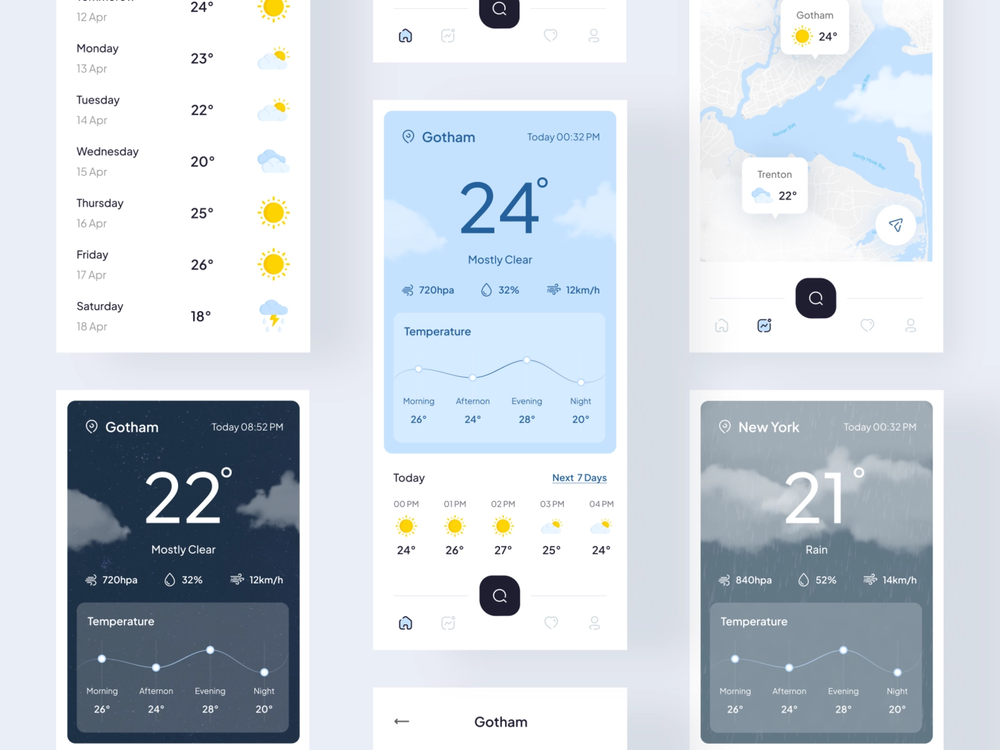
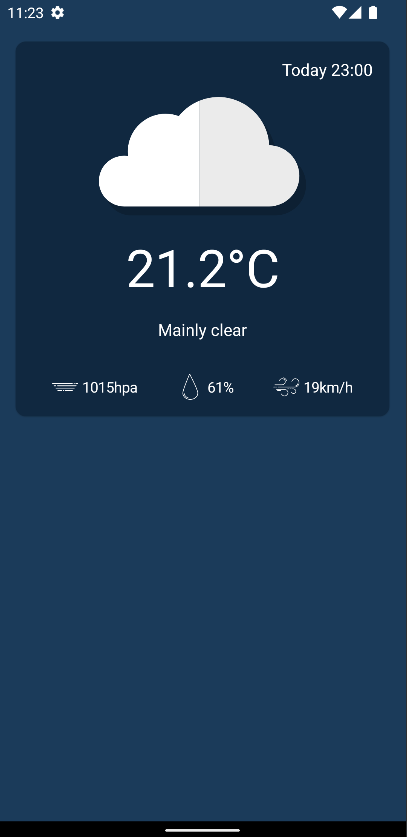
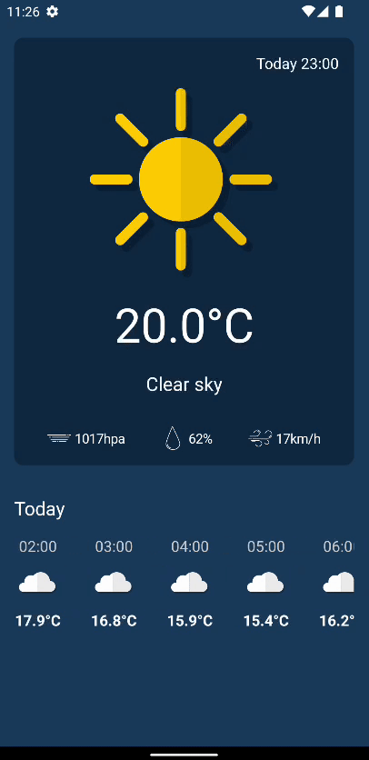

# How to Build an MVI Clean Code Weather App in Android Studio

MVI 패턴을 통해 현재 위치에 대한 날씨 앱을 만들어보자.

## Initial source code

[WeatherApp](https://github.com/philipplackner/WeatherApp)에서 초기 프로젝트를 클론한다.

## API

이 [Weather Forecast API](https://open-meteo.com/en/docs)를 사용한다. 다음과 같은 방식으로 파라미터를 전달해 날씨 데이터를 얻어올 수 있다.

```
https://api.open-meteo.com/v1/forecast?latitude=52.52&longitude=13.41&hourly=temperature_2m
```

문서에 있듯이 `relativehumidity_2m`를 추가해 습도에 대한 정보를 얻을 수도 있다.

```
https://api.open-meteo.com/v1/forecast?latitude=52.52&longitude=13.41&hourly=temperature_2m,relativehumidity_2m
```

## Design

디자인은 [Cuacane - Weather App](https://dribbble.com/shots/17998271-Cuacane-Weather-App)에서 영감을 받았다.

<div align="center">

</div>

## Dependencies

DI를 위한 Dagger-Hilt, 현재 위치 정보를 알기 위한 Location Services, API 호출을 위한 Retrofit 디펜던시를 추가한다.

```groovy
dependencies {
    // ...
    //Dagger - Hilt
    implementation "com.google.dagger:hilt-android:2.40.5"
    kapt "com.google.dagger:hilt-android-compiler:2.40.5"
    implementation "androidx.hilt:hilt-lifecycle-viewmodel:1.0.0-alpha03"
    kapt "androidx.hilt:hilt-compiler:1.0.0"
    implementation 'androidx.hilt:hilt-navigation-compose:1.0.0'

    // Location Services
    implementation 'com.google.android.gms:play-services-location:20.0.0'

    // Retrofit
    implementation 'com.squareup.retrofit2:retrofit:2.9.0'
    implementation 'com.squareup.retrofit2:converter-moshi:2.9.0'
    implementation "com.squareup.okhttp3:logging-interceptor:5.0.0-alpha.3"

    implementation "androidx.lifecycle:lifecycle-viewmodel-compose:2.4.1"
}
```

## Initial resources

날씨에 따라 색깔이 변경되도록 `domain/weather` 패키지에 `WeatherType` sealed class가 구현되어 있다. Integer 코드를 `fromWMO`로 전달해 통해 특정 날씨에
대한 `WeatherType`을 얻을 수 있다.

`domain/util` 패키지에 `Resource` 파일이 존재한다. 이는 sealed class로 성공, 에러에 대한 결과 값을 제공한다.

```kotlin
sealed class Resource<T>(val data: T? = null, val message: String? = null) {
    class Success<T>(data: T?) : Resource<T>(data)
    class Error<T>(message: String, data: T? = null) : Resource<T>(data, message)
}
```

그리고 `drawable` 디렉토리에 필요한 벡터 그래픽들이 존재한다.

## Implementation

### Domain & Data

클린 아키텍처는 data, domain, presentation으로 나눠진다. domain은 제일 안쪽의 레이어로 비즈니스 로직을 포함하며, 다른 레이어에 대해 전혀 몰라야 한다. data 레이어는 SQLite,
API 등 데이터 소스 접근에 대한 내용을 담고 있다.

`WeatherDataDto` data class를 생성한다. 해당 클래스에 원하는 데이터들을 담을 수 있다.

```kotlin
data class WeatherDataDto(
    val time: List<String>,
    @field:Json(name = "temperature_2m")
    val temperatures: List<Double>,
    @field:Json(name = "weathercode")
    val weatherCodes: List<Int>,
    @field:Json(name = "pressure_msl")
    val pressures: List<Double>,
    @field:Json(name = "windspeed_10m")
    val windSpeeds: List<Double>,
    @field:Json(name = "relativehumidity_2m")
    val humidities: List<Double>
)
```

위 `WeatherDataDto`를 인자로 취하는 `WeatherDto` data class를 생성한다. 원하는 데이터가 hourly 필드에 있으므로, 나머지는 무시한다.

```kotlin
data class WeatherDto(
    @field:Json(name = "hourly") // hourly에 원하는 모든 데이터가 존재
    val weatherData: WeatherDataDto
)
```

이제 `WeatherApi` 인터페이스를 생성한 후 다음과 같이 작성한다.

```kotlin
interface WeatherApi {

    @GET("v1/forecast?hourly=temperature_2m,weathercode,relativehumidity_2m,windspeed_10m,pressure_msl")
    suspend fun getWeatherData(
        @Query("latitude") lat: Double,
        @Query("longitude") long: Double
    ): WeatherDto
}
```

`domain` 패키지에 model을 만든다. model은 도메인에서만 사용 가능한 모델이다. 따라서 `WeatherDto`로 받아온 데이터를 mapper를 통해 도메인 모델로 변경해준다.

`WeatherData` data class와 `WeatherInfo` data class를 생성해준다.

```kotlin
data class WeatherData(
    val time: LocalDateTime,
    val temperatureCelsius: Double,
    val pressure: Double,
    val windSpeed: Double,
    val humidity: Double,
    val weatherType: WeatherType
)
```

```kotlin
// weather data per day
data class WeatherInfo(
    val weatherDataPerDay: Map<Int, List<WeatherData>>, // key: current day index, value: all weather data for the day
    val currentWeatherData: WeatherData? // weather data for current time
)
```

`data/mappers` 패키지 생성 후 `WeatherMappers` 파일 생성 및 도메인 모델로 매핑하는 확장 함수를 구현한다.

```kotlin
private data class IndexedWeatherData(
    val index: Int,
    val data: WeatherData
)

fun WeatherDataDto.toWeatherDataMap(): Map<Int, List<WeatherData>> {
    return time.mapIndexed { index, time ->
        val temperature = temperatures[index]
        val weatherCode = weatherCodes[index]
        val windSpeed = windSpeeds[index]
        val pressure = pressures[index]
        val humidity = humidities[index]
        IndexedWeatherData(
            index = index,
            data = WeatherData(
                time = LocalDateTime.parse(time, DateTimeFormatter.ISO_DATE_TIME),
                temperatureCelsius = temperature,
                pressure = pressure,
                windSpeed = windSpeed,
                humidity = humidity,
                weatherType = WeatherType.fromWMO(weatherCode)
            )
        )
    }.groupBy { // index 별로 묶어주기 위함
        it.index / 24 // 시간 별로 데이터가 존재하므로 24로 나눠준다.
    }.mapValues {
        it.value.map { it.data }  // IndexedWeatherData에서 data만 가져오기 위함
    }
}

fun WeatherDto.toWeatherInfo(): WeatherInfo {
    val weatherDataMap = weatherData.toWeatherDataMap()
    val now = LocalDateTime.now()
    val currentWeatherData = weatherDataMap[0]?.find {
        val hour = if (now.minute < 30) now.hour else now.hour + 1
        it.time.hour == hour
    }
    return WeatherInfo(
        weatherDataPerDay = weatherDataMap,
        currentWeatherData = currentWeatherData
    )
}
```

`domain/repository` 패키지 생성 및 `WeatherRepository` 인터페이스를 생성한다. 추후 다른 API 라이브러리나 데이터베이스로 변경하는 경우 구현체만 변경해주면 된다. 또한 이렇게 구현할
경우 테스팅도 간편해진다.

```kotlin
interface WeatherRepository {
    suspend fun getWeatherData(lat: Double, long: Double): Resource<WeatherInfo>
}
```

`data/repository` 생성 후 구현체를 만들어준다.

```kotlin
class WeatherRepositoryImpl @Inject constructor(
    private val api: WeatherApi
) : WeatherRepository {
    override suspend fun getWeatherData(lat: Double, long: Double): Resource<WeatherInfo> {
        return try {
            Resource.Success(
                data = api.getWeatherData(
                    lat = lat,
                    long = long
                ).toWeatherInfo()
            )
        } catch (e: Exception) {
            e.printStackTrace()
            Resource.Error(e.message ?: "An unknown error occured.")
        }
    }
}
```

위치를 사용하기 위해 `domain/location` 패키지를 생성한 후 `LocationTracker` 인터페이스를 생성한다. 완벽한 클린 아키텍처로 구현하려면 `android.location.Location`가
안드로이드 프레임워크이므로 도메인에서 알지 못해야 한다. 하지만 여기선 완전한 안드로이드 앱을 만들고 있으므로 도메인에 포함하여 구현한다.

```kotlin
import android.location.Location

interface LocationTracker {
    suspend fun getCurrentLocation(): Location?
}
```

위치를 가져오기 위해 다음 퍼미션을 `AndroidManifest.xml`에 추가해준다.

```xml

<uses-permission android:name="android.permission.INTERNET"/>
<uses-permission android:name="android.permission.ACCESS_COARSE_LOCATION"/>
<uses-permission android:name="android.permission.ACCESS_FINE_LOCATION"/>
```

`data/location` 패키지를 생성한 후 `LocationTracker`의 구현체인 `DefaultLocationTracker` 클래스를 다음과 같이 구현한다.

```kotlin
class DefaultLocationTracker @Inject constructor(
    private val locationClient: FusedLocationProviderClient,
    private val application: Application
) : LocationTracker {

    override suspend fun getCurrentLocation(): Location? {
        val hasAccessFineLocationPermission = ContextCompat.checkSelfPermission(
            application,
            Manifest.permission.ACCESS_FINE_LOCATION,
        ) == PackageManager.PERMISSION_GRANTED
        val hasAccessCoarseLocationPermission = ContextCompat.checkSelfPermission(
            application,
            Manifest.permission.ACCESS_COARSE_LOCATION,
        ) == PackageManager.PERMISSION_GRANTED

        val locationManager =
            application.getSystemService(Context.LOCATION_SERVICE) as LocationManager
        val isGpsEnabled =
            locationManager.isProviderEnabled(LocationManager.NETWORK_PROVIDER) || locationManager.isProviderEnabled(
                LocationManager.GPS_PROVIDER
            )

        if (!hasAccessCoarseLocationPermission || !hasAccessFineLocationPermission || !isGpsEnabled) {
            return null
        }

        return suspendCancellableCoroutine { cont -> // callback을 suspending coroutine으로 변환할 때 사용
            locationClient.lastLocation.apply {
                if (isComplete) {
                    if (isSuccessful) {
                        cont.resume(result)
                    } else {
                        cont.resume(null)
                    }
                    return@suspendCancellableCoroutine
                }
                addOnSuccessListener {
                    cont.resume(it)
                }
                addOnFailureListener {
                    cont.resume(null)
                }
                addOnCanceledListener {
                    cont.cancel()
                }
            }
        }
    }
}
```

### Dependency injection

`di` 패키지 생성 후 `AppModule` object를 생성하고 다음과 같이 구현한다.

```kotlin
@Module
@InstallIn(SingletonComponent::class)
object AppModule {

    @Provides
    @Singleton
    fun provideWeatherApi(): WeatherApi {
        return Retrofit.Builder()
            .baseUrl("https://api.open-meteo.com/")
            .addConverterFactory(MoshiConverterFactory.create())
            .build()
            .create(WeatherApi::class.java)
    }

    @Provides
    @Singleton
    fun provideFusedLocationProviderClient(app: Application): FusedLocationProviderClient {
        return LocationServices.getFusedLocationProviderClient(app)
    }
}
```

`LocationModule` abstract class를 생성한 후 `LocationTracker`를 반환하는 `bindLocationTracker`를 생성한다. 이는 인터페이스가 존재하는 구현체를 구현할 때 더
적은 코드로 구현할 수 있다.

```kotlin
@Module
@InstallIn(SingletonComponent::class)
abstract class LocationModule {

    @Binds
    @Singleton
    abstract fun bindLocationTracker(defaultLocationTracker: DefaultLocationTracker): LocationTracker
}
```

`RepositoryModule`도 동일하게 바인딩해준다.

```kotlin
@Module
@InstallIn(SingletonComponent::class)
abstract class RepositoryModule {

    @Binds
    @Singleton
    abstract fun bindWeatherRepository(weatherRepositoryImpl: WeatherRepositoryImpl): WeatherRepository
}
```

루트 패키지에 `Application()`을 상속하는 `WeatherApp` 클래스를 생성한다. 그리고 메니페스트에 해당 클래스를 등록해준다.

```kotlin
@HiltAndroidApp
class WeatherApp : Application()
```

### Presenter

`presentation` 패키지에 상태를 표현하기 위한 `WeatherState` data class를 만들어준다.

```kotlin
data class WeatherState(
    val weatherInfo: WeatherInfo? = null,
    val isLoading: Boolean = false,
    val error: String? = null
)
```

`WeatherViewModel`을 생성 및 구현한다. 

```kotlin
@HiltViewModel
class WeatherViewModel @Inject constructor(
    private val repository: WeatherRepository,
    private val locationTracker: LocationTracker
) : ViewModel() {

    var state by mutableStateOf(WeatherState())
        private set

    fun loadWeatherInfo() {
        viewModelScope.launch {
            state = state.copy(
                isLoading = true,
                error = null
            )
            locationTracker.getCurrentLocation()?.let { location ->
                when (val result = repository.getWeatherData(location.latitude, location.longitude)) {
                    is Resource.Success -> {
                        state = state.copy(
                            weatherInfo = result.data,
                            isLoading = false,
                            error = null
                        )
                    }
                    is Resource.Error -> {
                        state = state.copy(
                            weatherInfo = null,
                            isLoading = false,
                            error = result.message
                        )
                    }
                }
            } ?: kotlin.run {
                state = state.copy(
                    isLoading = false,
                    error = "Couldn't retrive location. Make sure to grant permission and enable GPS."
                )
            }
        }
    }
}
```

날씨에 대한 풍속, 습도 등을 보여주기 위한 `WeatherDataDisplay` composable을 `presentation`에 생성 및 구현한다.

```kotlin
@Composable
fun WeatherDataDisplay(
    value: Int,
    unit: String,
    icon: ImageVector,
    modifier: Modifier = Modifier,
    textStyle: TextStyle = TextStyle(),
    iconTint: Color = Color.White
) {
    Row(
        modifier = modifier,
        verticalAlignment = Alignment.CenterVertically
    ) {
        Icon(
            imageVector = icon,
            contentDescription = null,
            tint = iconTint,
            modifier = Modifier.size(25.dp)
        )
        Spacer(modifier = Modifier.width(4.dp))
        Text(
            text = "$value$unit",
            style = textStyle
        )
    }
}
```

날씨에 대한 정보를 보여주는 `WeatherCard` composable을 `presentation` 패키지에 생성 및 구현한다.

```kotlin
@Composable
fun WeatherCard(
    state: WeatherState,
    backgroundColor: Color,
    modifier: Modifier = Modifier
) {
    state.weatherInfo?.currentWeatherData?.let { data ->
        Card(
            backgroundColor = backgroundColor,
            shape = RoundedCornerShape(10.dp),
            modifier = modifier.padding(16.dp)
        ) {
            Column(
                modifier = Modifier
                    .fillMaxWidth()
                    .padding(16.dp),
                horizontalAlignment = Alignment.CenterHorizontally
            ) {
                Text(
                    text = "Today ${
                        data.time.format(
                            DateTimeFormatter.ofPattern("HH:mm")
                        )
                    }",
                    modifier = Modifier.align(Alignment.End),
                    color = Color.White
                )
                Spacer(modifier = Modifier.height(16.dp))
                Image(
                    painter = painterResource(id = data.weatherType.iconRes),
                    contentDescription = null,
                    modifier = Modifier.width(200.dp)
                )
                Spacer(modifier = Modifier.height(16.dp))
                Text(
                    text = "${data.temperatureCelsius}°C",
                    fontSize = 50.sp,
                    color = Color.White
                )
                Spacer(modifier = Modifier.height(16.dp))
                Text(
                    text = data.weatherType.weatherDesc,
                    color = Color.White
                )
                Spacer(modifier = Modifier.height(32.dp))
                Row(
                    modifier = Modifier.fillMaxWidth(),
                    horizontalArrangement = Arrangement.SpaceAround
                ) {
                    WeatherDataDisplay(
                        value = data.pressure.roundToInt(),
                        unit ="hpa",
                        icon = ImageVector.vectorResource(id = R.drawable.ic_pressure),
                        iconTint = Color.White,
                        textStyle = TextStyle(color = Color.White)
                    )
                    WeatherDataDisplay(
                        value = data.humidity.roundToInt(),
                        unit ="%",
                        icon = ImageVector.vectorResource(id = R.drawable.ic_drop),
                        iconTint = Color.White,
                        textStyle = TextStyle(color = Color.White)
                    )
                    WeatherDataDisplay(
                        value = data.windSpeed.roundToInt(),
                        unit ="km/h",
                        icon = ImageVector.vectorResource(id = R.drawable.ic_wind),
                        iconTint = Color.White,
                        textStyle = TextStyle(color = Color.White)
                    )
                }
            }
        }
    }
}
```

이제 `MainActivity`를 다음과 같이 작성하고 UI가 제대로 보여지는지 확인하자. 

```kotlin
@AndroidEntryPoint
class MainActivity : ComponentActivity() {

    private val viewModel: WeatherViewModel by viewModels()
    private lateinit var permissionLauncher: ActivityResultLauncher<Array<String>>

    override fun onCreate(savedInstanceState: Bundle?) {
        super.onCreate(savedInstanceState)
        permissionLauncher = registerForActivityResult(
            ActivityResultContracts.RequestMultiplePermissions()
        ) {
            viewModel.loadWeatherInfo()
        }
        permissionLauncher.launch(
            arrayOf(
                Manifest.permission.ACCESS_FINE_LOCATION,
                Manifest.permission.ACCESS_COARSE_LOCATION,
            )
        )
        setContent {
            WeatherAppTheme {
                Column(
                    modifier = Modifier
                        .fillMaxSize()
                        .background(DarkBlue),
                ) {
                    WeatherCard(state = viewModel.state, backgroundColor = DeepBlue)
                }
            }
        }
    }
}
```

<div align="center">

</div>

시간 별 날씨를 보여주기 위한 `HourlyWeatherDisplay` composable을 생성 및 구현한다.

```kotlin
@Composable                                                                                                          
fun HourlyWeatherDisplay(                                                                                            
   weatherData: WeatherData,                                                                                         
   modifier: Modifier = Modifier,                                                                                    
   textColor: Color = Color.White                                                                                    
) {                                                                                                                  
    val formattedTime = remember(weatherData) { // weatherData가 refetch 되었을 때만 블록 실행                                 
        weatherData.time.format(                                                                                     
            DateTimeFormatter.ofPattern("HH:mm")                                                                     
        )                                                                                                            
    }                                                                                                                
    Column(                                                                                                          
        modifier = modifier,                                                                                         
        horizontalAlignment = Alignment.CenterHorizontally,                                                          
        verticalArrangement = Arrangement.SpaceBetween                                                               
    ) {                                                                                                               
        Text(                                                                                                        
            text = formattedTime,                                                                                    
            color = Color.LightGray                                                                                  
        )                                                                                                            
        Image(                                                                                                       
            painter = painterResource(id = weatherData.weatherType.iconRes),                                         
            contentDescription = null,                                                                               
            modifier = Modifier.width(40.dp)                                                                         
        )                                                                                                            
        Text(                                                                                                        
            text = "${weatherData.temperatureCelsius}°C",                                                            
            color = textColor,                                                                                       
            fontWeight = FontWeight.Bold                                                                             
        )                                                                                                            
    }                                                                                                                
}                                                                                                                    
```

오늘 날씨를 시간 별로 보여주기 위해 `WeatherForecast` composable을 생성 및 구현한다.

```kotlin
@Composable
fun WeatherForecast(
    state: WeatherState,
    modifier: Modifier = Modifier
) {
    state.weatherInfo?.weatherDataPerDay?.get(0)?.let { data ->
        Column(
            modifier = modifier
                .fillMaxWidth()
                .padding(horizontal = 16.dp)
        ) {
            Text(
                text = "Today",
                fontSize = 20.sp,
                color = Color.White
            )
            Spacer(modifier = Modifier.height(16.dp))
            LazyRow(content = {
                items(data) { weatherData ->
                    HourlyWeatherDisplay(
                        weatherData = weatherData,
                        modifier = Modifier
                            .height(100.dp)
                            .padding(16.dp)
                    )
                }
            })
        }
    }
}
```

<div align="center">

</div>

## References

* [How to Build an MVI Clean Code Weather App in Android Studio (Jetpack Compose)](https://www.youtube.com/watch?v=eAbKK7JNxCE&t=1s)