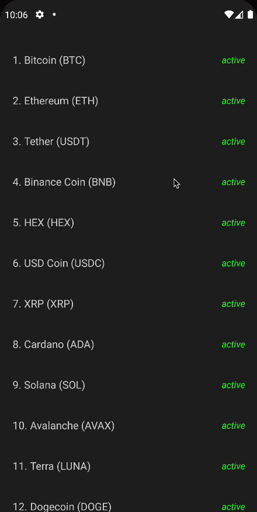

# How to Make a Clean Architecture Cryptocurrency App

클린 아키텍처 기반으로 Cryptocurrency App을 만들어볼 것이다. [여기서](https://github.com/philipplackner/CryptocurrencyAppYT/tree/app) Initial
프로젝트를 클론한다.

무료인 [Coinpaprika API](https://api.coinpaprika.com/)를 사용해 암호화폐 정보를 가져오도록 구현한다.

클린 아키텍처는 MVVM에서 Use case라는 한 가지 개념이 추가된다. Use case는 비즈니스 로직을 포함하고 있으며 앱의 기능 부분이다. MVVM 모델을 사용하면 프로젝트가 커질수록 ViewModel이
방대해지는 문제가 있다. Use case의 장점은 재사용이 가능하다는 것이다. ViewModel에 비즈니스 로직이 구현되는 경우 재사용이 불가능하지만 Use case로 작성한 경우 재사용 가능하다. 파일을 굳이
열어보지 않고 구조만 봐도 어떤 서비스인지 알 수 있는 스크리밍 아키텍처가 된다.

프로젝트는 Presentation(Compose, ViewModels 등) Layer, Domain(Reposiory, Use case 등) Layer, Data(API, Database 등) Layer로 나누어
개발한다.

## **Structuring Skeleton Code**

`presentation`, `domain`, `data`, `common` 패키지를 생성하고 기존에 있던 `ui` 패키지와 `MainActivity`를 `presentation` 패키지로
이동시킨다. `common` 패키지엔 위 3개의 레이어에서 `Constants` 같이 공유하는 것들을 추가한다. `common` 패키지에 `Constants`와 `Resource`를 생성한다.

```kotlin
sealed class Resource<T>(val data: T? = null, val message: String? = null) {
    class Success<T>(data: T) : Resource<T>(data)
    class Error<T>(message: String, data: T? = null) : Resource<T>(data, message)
    class Loading<T>(data: T? = null) : Resource<T>(data)
}
```

`presentation` 패키지에 `coin_detail`, `coin_list` 패키지를 추가해주고 추가된 각 패키지에 `components` 패키지를 추가해준다.

`domain` 패키지에 `model`, `repository`, `use_case` 패키지를 추가한다. `use_case` 패키지에 `get_coin`, `get_coins` 패키지를 추가한다.

`data` 패키지에 `remote`, `repository` 패키지를 추가하고, `remote` 패키지 안에 `dto` 패키지를 추가한다.

그리고 마지막으로 루트 패키지에 `di` 패키지를 추가한다.

## Structuring data

`data.remote.dto` 패키지에 `CoinDto`를 생성 및 작성해준다. [여기서](https://api.coinpaprika.com/v1/coins) 받은 json 데이터를 `Gson` data
class로 생성해준다.

```kotlin
data class CoinDto(
        @SerializedName("id")
        val id: String,
        @SerializedName("is_active")
        val isActive: Boolean,
        @SerializedName("is_new")
        val isNew: Boolean,
        @SerializedName("name")
        val name: String,
        @SerializedName("rank")
        val rank: Int,
        @SerializedName("symbol")
        val symbol: String,
        @SerializedName("type")
        val type: String
)
```

우리는 이 모든 정보를 보여주고 싶지 않고, 일부만 가져다가 사용하고 싶다. 따라서 `domain.model` 패키지에 다음과 같이 필요한 부분만 가져다 `Coin` data class를 생성한다.

```kotlin
data class Coin(
        val id: String,
        val isActive: Boolean,
        val name: String,
        val rank: Int,
        val symbol: String,
)
```

이제 `CoinDto`에를 `Coin`으로 변경하는 mapper 함수를 작성한다.

```kotlin
// ...
fun CoinDto.toCoin(): Coin {
    return Coin(
            id = id,
            isActive = isActive,
            name = name,
            rank = rank,
            symbol = symbol
    )
}
```

그리고 [코인의 자세한 정보](https://api.coinpaprika.com/v1/coins/btc-bitcoin)를 `CoinDetailDto`로 생성한다. 여러 data class 파일들이
생성된다. `CoinDetailDto`의 `Team` data class를 `TeamMember`로 변경해준다.

```kotlin
data class CoinDetailDto(
        @SerializedName("contract")
        val contract: String,
        @SerializedName("contracts")
        val contracts: List<Contract>,
        @SerializedName("description")
        val description: String,
        @SerializedName("development_status")
        val developmentStatus: String,
        @SerializedName("first_data_at")
        val firstDataAt: String,
        @SerializedName("hardware_wallet")
        val hardwareWallet: Boolean,
        @SerializedName("hash_algorithm")
        val hashAlgorithm: String,
        @SerializedName("id")
        val id: String,
        @SerializedName("is_active")
        val isActive: Boolean,
        @SerializedName("is_new")
        val isNew: Boolean,
        @SerializedName("last_data_at")
        val lastDataAt: String,
        @SerializedName("links")
        val links: Links,
        @SerializedName("links_extended")
        val linksExtended: List<LinksExtended>,
        @SerializedName("message")
        val message: String,
        @SerializedName("name")
        val name: String,
        @SerializedName("open_source")
        val openSource: Boolean,
        @SerializedName("org_structure")
        val orgStructure: String,
        @SerializedName("parent")
        val parent: Parent,
        @SerializedName("platform")
        val platform: String,
        @SerializedName("proof_type")
        val proofType: String,
        @SerializedName("rank")
        val rank: Int,
        @SerializedName("started_at")
        val startedAt: String,
        @SerializedName("symbol")
        val symbol: String,
        @SerializedName("tags")
        val tags: List<Tag>,
        @SerializedName("team")
        val team: List<TeamMember>,
        @SerializedName("type")
        val type: String,
        @SerializedName("whitepaper")
        val whitepaper: Whitepaper
)
```

이 DTO 또한 `domain.model`에 `CoinDetail` data class로 작성해준다.

```kotlin
data class CoinDetail(
        val coinId: String,
        val name: String,
        val description: String,
        val symbol: String,
        val rank: Int,
        val isActive: Boolean,
        val tags: List<String>,
        val team: List<TeamMember>
)

fun CoinDetailDto.toCoinDetail(): CoinDetail {
    return CoinDetail(
            coinId = id,
            name = name,
            description = description,
            symbol = symbol,
            rank = rank,
            isActive = isActive,
            tags = tags.map { it.name },
            team = team
    )
}
```

`data.remote` 패키지에 `CoinPaprikaAPI`를 다음과 같이 작성해준다.

```kotlin
interface CoinPaprikaAPI {

    @GET("/v1/coins")
    suspend fun getCoins(): List<CoinDto>

    @GET("/v1/coins/{coinId}")
    suspend fun getCoinById(@Path("coinId") coinId: String): CoinDetailDto

}
```

`domain` 레이어의 `repository`에 `CoinRepository` 인터페이스를 생성해준다.

```kotlin
interface CoinRepository {

    suspend fun getCoins(): List<CoinDto>

    suspend fun getCoinByid(coinId: String): CoinDetailDto
}
```

`data` 레이어의 `repository`에 위 인터페이스를 구현한 구현체를 생성해준다.

```kotlin
class CoinRepositoryImpl @Inject constructor(
        private val api: CoinPaprikaAPI
) : CoinRepository {
    override suspend fun getCoins(): List<CoinDto> {
        return api.getCoins()
    }

    override suspend fun getCoinByid(coinId: String): CoinDetailDto {
        return api.getCoinById(coinId)
    }
}
```

## Create use cases

`domain.use_case.get_coin` 패키지에 `GetCoinsUseCase` 클래스를 생성해준다.

```kotlin
class GetCoinsUseCase @Inject constructor(
        private val repository: CoinRepository
) {

    operator fun invoke(): Flow<Resource<List<Coin>>> = flow {
        try {
            emit(Resource.Loading())
            val coins = repository.getCoins().map { it.toCoin() }
            emit(Resource.Success(coins))
        } catch (e: HttpException) {
            emit(Resource.Error(e.localizedMessage ?: "An unexpected error occured"))
        } catch (e: IOException) {
            emit(Resource.Error("Couldn't reach server. Check your internet connection."))
        }
    }
}
```

`domain.use_case.get_coin` 패키지에도 동일하게 `GetCoinUseCase` 클래스를 생성해준다.

```kotlin
class GetCoinUseCase @Inject constructor(
        private val repository: CoinRepository
) {

    operator fun invoke(coinId: String): Flow<Resource<CoinDetail>> = flow {
        try {
            emit(Resource.Loading<CoinDetail>())
            val coin = repository.getCoinByid(coinId).toCoinDetail()
            emit(Resource.Success<CoinDetail>(coin))
        } catch (e: HttpException) {
            emit(Resource.Error<CoinDetail>(e.localizedMessage ?: "An unexpected error occured"))
        } catch (e: IOException) {
            emit(Resource.Error<CoinDetail>("Couldn't reach server. Check your internet connection."))
        }
    }
}
```

## Setup dependency injection

`common.Constants`에 `BASE_URL`을 정의한다.

```kotlin
object Constants {

    const val BASE_URL = "https://api.coinpaprika.com/"
}
```

그리고 `AppModule`에서 다음과 같이 di를 구현해준다.

```kotlin
@Module
@InstallIn(SingletonComponent::class)
object AppModule {

    @Singleton
    @Provides
    fun providePaprikaApi(): CoinPaprikaAPI {
        return Retrofit.Builder()
                .baseUrl(Constants.BASE_URL)
                .addConverterFactory(GsonConverterFactory.create())
                .build()
                .create(CoinPaprikaAPI::class.java)
    }

    @Singleton
    @Provides
    fun provideCoinRepository(api: CoinPaprikaAPI): CoinRepository {
        return CoinRepositoryImpl(api)
    }
}
```

그리고 `Application` 클래스를 상속한 `CoinApplication` 클래스를 생성하고 `@HiltAndroidApp` 어노테이션을 달아준다. `AndroidManifest.xml`도 이에 맞게
변경해준다.

```kotlin
@HiltAndroidApp
class CoinApplication : Application()
```

## Create viewmodels

### Coin List

`presentation.coin_list` 패키지에 `CoinListState` data class 생성 및 작성한다.

```kotlin
data class CoinListState(
        val isLoading: Boolean = false,
        val coins: List<Coin> = emptyList(),
        val error: String = ""
)
```

그리고 `presentation.coin_list`에 `CoinListViewModel`을 생성 및 작성한다.

```kotlin
@HiltViewModel
class CoinListViewModel @Inject constructor(
        private val getCoinsUseCase: GetCoinsUseCase
) : ViewModel() {

    private val _state = mutableStateOf(CoinListState())
    val state: State<CoinListState> = _state

    init {
        getCoins()
    }

    private fun getCoins() {
        getCoinsUseCase().onEach { result ->
            when (result) {
                is Resource.Success -> {
                    _state.value = CoinListState(coins = result.data ?: emptyList())
                }
                is Resource.Error -> {
                    _state.value = CoinListState(error = result.message ?: "An unexpected error occured")
                }
                is Resource.Loading -> {
                    _state.value = CoinListState(isLoading = true)
                }
            }
        }.launchIn(viewModelScope)
    }
}
```

### Coin Detail

`presentation.coin_detil` 패키지에 `CoinDetailState`, `CoinDetailViewModel`을 만들어준다.

```kotlin
data class CoinDetailState(
        val isLoading: Boolean = false,
        val coin: CoinDetail? = null,
        val error: String = ""
)
```

UI에서 넘어와야하는 `coinId`가 있다. `SavedStateHandle`을 통해 `coinId`를 가져온다. Hilt-Dagger를 사용하면 네비게이션 인자로 전달되는
파라미터를 `SavedStateHandle` 자동으로 인젝션해준다.

```kotlin
object Constants {

    ...

    const val PARAM_COIN_ID = "coinid"
}
```

```kotlin
@HiltViewModel
class CoinDetailViewModel @Inject constructor(
        private val getCoinUseCase: GetCoinUseCase,
        savedStateHandle: SavedStateHandle
) : ViewModel() {

    private val _state = mutableStateOf(CoinDetailState())
    val state: State<CoinDetailState> = _state

    init {
        savedStateHandle.get<String>("coinId")?.let {
            getCoin(it)
        }
    }

    fun getCoin(coinId: String) {
        getCoinUseCase(coinId).onEach { result ->
            when (result) {
                is Resource.Success -> {
                    _state.value = CoinDetailState(coin = result.data)
                }
                is Resource.Error -> {
                    _state.value = CoinDetailState(
                            error = result.message ?: "An unexpected error occured"
                    )
                }
                is Resource.Loading -> {
                    _state.value = CoinDetailState(isLoading = true)
                }
            }
        }.launchIn(viewModelScope)
    }
}
```

## Create UI

### Coin List

`presentation.coin_list.components` 패키지에 `CoinListItem` composable을 만들어준다.

```kotlin
@Composable
fun CoinListItem(
        coin: Coin,
        onItemClick: (Coin) -> Unit,
) {
    Row(
            modifier = Modifier
                    .fillMaxWidth()
                    .clickable { onItemClick(coin) }
                    .padding(20.dp),
            horizontalArrangement = Arrangement.SpaceBetween
    ) {
        Text(
                text = "${coin.rank}. ${coin.name} (${coin.symbol})",
                style = MaterialTheme.typography.body1,
                overflow = TextOverflow.Ellipsis
        )
        Text(
                text = if (coin.isActive) "active" else "inactive",
                color = if (coin.isActive) Color.Green else Color.Red,
                fontStyle = FontStyle.Italic,
                textAlign = TextAlign.End,
                style = MaterialTheme.typography.body2,
                modifier = Modifier.align(CenterVertically)
        )
    }
}
```

네비게이션을 위해 `presentation` 패키지 하위에 `Screen` sealed class를 생성한다.

```kotlin
sealed class Screen(val route: String) {
    object CoinListScreen : Screen("coin_list_screen")
    object CoinDetailScreen : Screen("coin_detail_screen")
}
```

`presentation.coin_list` 패키지에 모든 코인 리스트를 보여주는 `CoinListScreen`를 작성한다.

```kotlin
@Composable
fun CoinListScreen(
        navController: NavController,
        viewModel: CoinListViewModel = hiltViewModel()
) {
    val state = viewModel.state.value
    Box(modifier = Modifier.fillMaxSize()) {
        LazyColumn(modifier = Modifier.fillMaxSize()) {
            items(state.coins) { coin ->
                CoinListItem(
                        coin = coin,
                        onItemClick = {
                            navController.navigate(Screen.CoinDetailScreen.route + "/${coin.id}")
                        }
                )
            }
        }
        if (state.error.isNotBlank()) {
            Text(
                    text = state.error,
                    color = MaterialTheme.colors.error,
                    textAlign = TextAlign.Center,
                    modifier = Modifier
                            .fillMaxWidth()
                            .padding(horizontal = 20.dp)
                            .align(Alignment.Center)
            )
        }
        if (state.isLoading) {
            CircularProgressIndicator(modifier = Modifier.align(Alignment.Center))
        }
    }
}
```

### Coin Detail

우선 `CoinTag` composable을 만든다.

```kotlin
@Composable
fun CoinTag(
        tag: String
) {
    Box(modifier = Modifier
            .border(
                    width = 1.dp,
                    color = MaterialTheme.colors.primary,
                    shape = RoundedCornerShape(100.dp)
            )
            .padding(10.dp)
    ) {
        Text(
                text = tag,
                color = MaterialTheme.colors.primary,
                textAlign = TextAlign.Center,
                style = MaterialTheme.typography.body2
        )
    }
}
```

`TeamListItem` composable도 만들어준다.

```kotlin
@Composable
fun TeamListItem(
        teamMember: TeamMember,
        modifier: Modifier = Modifier
) {
    Column(
            modifier = modifier,
            verticalArrangement = Arrangement.Center
    ) {
        Text(
                text = teamMember.name,
                style = MaterialTheme.typography.h4
        )
        Spacer(modifier = Modifier.height(4.dp))
        Text(
                text = teamMember.position,
                style = MaterialTheme.typography.body2,
                fontStyle = FontStyle.Italic
        )
    }
}
```

`CoinDetailScreen`을 다음과 같이 작성해준다.

```kotlin
@Composable
fun CoinDetailScreen(
        viewModel: CoinDetailViewModel = hiltViewModel()
) {
    val state = viewModel.state.value
    Box(modifier = Modifier.fillMaxSize()) {
        state.coin?.let { coin ->
            LazyColumn(
                    modifier = Modifier.fillMaxSize(),
                    contentPadding = PaddingValues(20.dp)
            ) {
                item {
                    Row(
                            modifier = Modifier.fillMaxWidth(),
                            horizontalArrangement = Arrangement.SpaceBetween
                    ) {
                        Text(
                                text = "${coin.rank}. ${coin.name} (${coin.symbol})",
                                style = MaterialTheme.typography.h2,
                                modifier = Modifier.weight(8f)
                        )
                        Text(
                                text = if (coin.isActive) "active" else "inactive",
                                color = if (coin.isActive) Color.Green else Color.Red,
                                fontStyle = FontStyle.Italic,
                                textAlign = TextAlign.End,
                                modifier = Modifier
                                        .align(CenterVertically)
                                        .weight(2f)
                        )
                    }
                    Spacer(modifier = Modifier.height(15.dp))
                    Text(
                            text = coin.description,
                            style = MaterialTheme.typography.body2,

                            )
                    Spacer(modifier = Modifier.height(15.dp))
                    Text(
                            text = "Tags",
                            style = MaterialTheme.typography.h3
                    )
                    Spacer(modifier = Modifier.height(15.dp))
                    FlowRow(
                            mainAxisSpacing = 10.dp,
                            crossAxisSpacing = 10.dp,
                            modifier = Modifier.fillMaxWidth()
                    ) {
                        coin.tags.forEach { tag ->
                            CoinTag(tag = tag)
                        }
                    }
                    Spacer(modifier = Modifier.height(15.dp))
                    Text(
                            text = "Team members",
                            style = MaterialTheme.typography.h3
                    )
                    Spacer(modifier = Modifier.height(15.dp))
                }
                items(coin.team) { teamMemeber ->
                    TeamListItem(
                            teamMember = teamMemeber,
                            modifier = Modifier
                                    .fillMaxWidth()
                                    .padding(10.dp)
                    )
                    Divider()
                }
            }
        }
        if (state.error.isNotBlank()) {
            Text(
                    text = state.error,
                    color = MaterialTheme.colors.error,
                    textAlign = TextAlign.Center,
                    modifier = Modifier
                            .fillMaxWidth()
                            .padding(horizontal = 20.dp)
                            .align(Alignment.Center)
            )
        }
        if (state.isLoading) {
            CircularProgressIndicator(modifier = Modifier.align(Alignment.Center))
        }
    }
}
```

## Setup navigation

`MainActivity`에서 네비게이션 처리를 구현해준다.

```kotlin
@AndroidEntryPoint
class MainActivity : ComponentActivity() {
    override fun onCreate(savedInstanceState: Bundle?) {
        super.onCreate(savedInstanceState)
        setContent {
            CryptocurrencyAppYTTheme {
                Surface(color = MaterialTheme.colors.background) {
                    val navController = rememberNavController()
                    NavHost(
                            navController = navController,
                            startDestination = Screen.CoinListScreen.route
                    ) {
                        composable(
                                route = Screen.CoinListScreen.route
                        ) {
                            CoinListScreen(navController)
                        }
                        composable(
                                route = Screen.CoinDetailScreen.route + "/{coinId}",
                                arguments = listOf(navArgument("coinId") { type = NavType.StringType })
                        ) {
                            CoinDetailScreen()
                        }
                    }
                }
            }
        }
    }
}
```

마지막으로 `AndroidManifest.xml`에 INTERNET 권한을 추가한 후 실행해보자.

<div align="center">

</div>

## References

* [How to Make a Clean Architecture Cryptocurrency App (MVVM, Use Cases, Compose) - Android Studio](https://www.youtube.com/watch?v=EF33KmyprEQ)