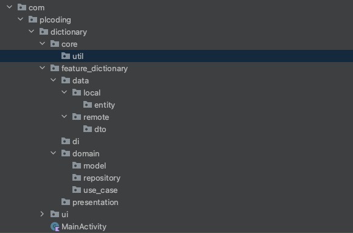
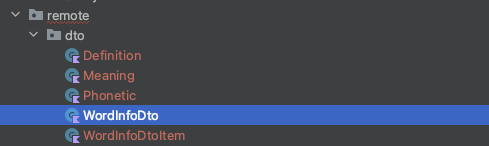

# How to Make a Clean Architecture Dictionary App (WITH CACHING!)

단어를 입력하면 해당하는 사전 API를 이용해 뜻을 보여주는 앱을 만들어보자. 이전에 검색했던 단어를 로컬에 저장해 인터넷이 끊겨도 보여줄 수 있도록 한다. [https://dictionaryapi.dev/](https://www.youtube.com/redirect?event=video_description&redir_token=QUFFLUhqbUZneG5LYW9PeHU3djhmX04tdTZWNk1UdXpEZ3xBQ3Jtc0tsSXpGOHE5dEluWlh1TEZxaGlmeE1pR3g2aGRZa2ZUYWJ2MXZRU25zWHp3aVZ0dUwwQWNFUGs0c2gxcy1xSVRscURxUUlwQmFwcXBvSndmMUJVZjlkWUVFVE5lc1U0X2pCTU55Z1Y4VTdZSGk4X2pxYw&q=https%3A%2F%2Fdictionaryapi.dev%2F)의 API를 사용하며, 별다른 인증은 필요없다.

다음과 같이 디펜던시를 설정해준다.

```groovy
dependencies {
    // ...
    // Compose dependencies
    implementation "androidx.lifecycle:lifecycle-viewmodel-compose:2.4.0"

    // Coroutines
    implementation 'org.jetbrains.kotlinx:kotlinx-coroutines-core:1.5.2'
    implementation 'org.jetbrains.kotlinx:kotlinx-coroutines-android:1.5.2'

    // Coroutine Lifecycle Scopes
    implementation "androidx.lifecycle:lifecycle-viewmodel-ktx:2.4.0"

    //Dagger - Hilt
    implementation "com.google.dagger:hilt-android:2.38.1"
    kapt "com.google.dagger:hilt-android-compiler:2.37"
    implementation "androidx.hilt:hilt-lifecycle-viewmodel:1.0.0-alpha03"
    kapt "androidx.hilt:hilt-compiler:1.0.0"
    implementation 'androidx.hilt:hilt-navigation-compose:1.0.0-alpha03'

    // Retrofit
    implementation 'com.squareup.retrofit2:retrofit:2.9.0'
    implementation 'com.squareup.retrofit2:converter-gson:2.9.0'
    implementation "com.squareup.okhttp3:okhttp:5.0.0-alpha.2"
    implementation "com.squareup.okhttp3:logging-interceptor:5.0.0-alpha.2"

    // Room
    implementation "androidx.room:room-runtime:2.3.0"
    kapt "androidx.room:room-compiler:2.3.0"

    // Kotlin Extensions and Coroutines support for Room
    implementation "androidx.room:room-ktx:2.3.0"
}
```

그리고 다음과 같이 패키지를 만들어준다. Feature 별로 나누고, core에는 feature들이 공통으로 사용하는 것들을 구현한다.

<div align="center">

</div>

API 응답을 받기 위해 API 응답의 Json을 data class로 변경해준다. 이 [URL](https://api.dictionaryapi.dev/api/v2/entries/en/bank)을 참고하자. Retrofit에서 직접 아이템의 리스트를 반환할 수 있기 때문에 `WordInfoDto`를 삭제해준다. 그리고 `WordInfoDtoItem`을 `WordInfoDto`로 변경해준다.

<div align="center">

</div>

## Create Dto

그 후 Shitf + F6를 눌러 `WordInfoDto`의 `Meaning`을 `MeaningDto`로 변경해준다. `Phonetic`도 동일하게 변경해준다.

```kotlin
data class WordInfoDto(
    val meanings: List<MeaningDto>,
    val origin: String,
    val phonetic: String,
    val phonetics: List<PhoneticDto>,
    val word: String
)
```

마지막으로 `Definition` 클래스의 `antonyms` 타입을 `Any` → `String`로 변경 및 클래스명을 `DefinitionDto`로 변경해준다.

```kotlin
data class DefinitionDto(
    // optional
    val antonyms: List<String>,
    val definition: String,
    val example: String,
    val synonyms: List<String>
)
```

## Remote API

`remote.dto` 패키지에 `DictionaryApi` 인터페이스를 만들고 단어의 뜻을 요청하는 `getWordInfo` 함수를 만든다.

```kotlin
interface DictionaryApi {

    @GET("/api/v2/entries/en/{word}")
    suspend fun getWordInfo(
        @Path("word") word: String
    ): List<WordInfoDto> // 단어에 대한 여러개의 뜻이 존재할 수 있어 List로 반환됨
		
		companion object {
        const val BASE_URL = "https://api.dictionaryapi.dev"
    }
}
```
## Create mapper function

`domain.model` 패키지에 `Definition` data class를 생성해준다.

```kotlin
data class Definition(
    val antonyms: List<String>,
    val definition: String,
    val example: String?,
    val synonyms: List<String>
)
```

`DefinitionDto`에 `toDefinition` 함수를 만든다.

```kotlin
data class DefinitionDto(
    val antonyms: List<String>,
    val definition: String,
    val example: String?,  // 몇몇 경우 크래시가 발생하기 때문에 nullable로 변경
    val synonyms: List<String>
) {
    fun toDefinition(): Definition {
        return Definition(
            antonyms = antonyms,
            definition = definition,
            example = example,
            synonyms = synonyms
        )
    }
}
```

`MeaningDto`도 동일하게 `domain.model` 패키지에 `Meaning` data class를 만들어준다.

```kotlin
data class Meaning(
    val definitions: List<Definition>,
    val partOfSpeech: String
)
```

다음 `MeaningDto`에 `toMeaning` 함수를 만들어준다.

```kotlin
data class MeaningDto(
    val definitions: List<DefinitionDto>,
    val partOfSpeech: String
) {
    fun toMeaning(): Meaning {
        return Meaning(
            definitions = definitions.map { it.toDefinition() },
            partOfSpeech = partOfSpeech
        )
    }
}
```

`WordInfoDto`도 동일하게 `domain.model` 패키지에 `WordInfo` data class를 만들어준다.

```kotlin
data class WordInfo(
    val meanings: List<Meaning>,
    val origin: String,
    val phonetic: String,
    val word: String
)
```

```kotlin
data class WordInfoDto(
    val meanings: List<MeaningDto>,
    val origin: String,
    val phonetic: String,
    val phonetics: List<PhoneticDto>,
    val word: String
) {
    fun toWordInfoEntity(): WordInfoEntity {
        return WordInfoEntity(
            meanings = meanings.map { it.toMeaning() },
            origin = origin,
            phonetic = phonetic,
            word = word
        )
    }
}
```

## Setup database

### Create Entity

`local.entity` 패키지에 `WordInfoEntity` 엔티티를 만들어준다.

```kotlin
@Entity
data class WordInfoEntity(
    val word: String,
    val phonetic: String,
    val origin: String,
    val meanings: List<Meaning>,
    @PrimaryKey val id: Int? = null
) {
    fun toWordInfo(): WordInfo {
        return WordInfo(
            meanings = meanings,
            word = word,
            origin = origin,
            phonetic = phonetic
        )
    }
}
```

### Create DAO

로컬 데이터베이스에 저장할 수 있도록 `WordInfoEntity`에 대한 Dao를 생성해준다.

```kotlin
@Dao
interface WordInfoDao {

    @Insert(onConflict = OnConflictStrategy.REPLACE)
    suspend fun insertWordInfos(infos: List<WordInfoEntity>)

    @Query("DELETE FROM wordinfoentity WHERE word IN(:words)")
    suspend fun deleteWordInfos(words: List<String>)

    @Query("SELECT * FROM wordinfoentity WHERE word LIKE '%' || :word || '%'")
    suspend fun getWordInfos(word: String): List<WordInfoEntity>
}
```

### Create Database

`RoomDatabase`를 상속한 `WordInfoDatabase`를 만들어준다.

```kotlin
@Database(
    entities = [WordInfoEntity::class],
    version = 1
)
@TypeConverters(Converters::class)
abstract class WordInfoDatabase: RoomDatabase() {

    abstract val dao: WordInfoDao
}
```

Room은 `WordInfoEntity`의 `meanings: List<Meaning>`를 어떻게 저장할지 모르기 때문에 저장할 때 String으로 변환해주고 로드할 때 Object로 가져오는 Converter가 필요하다.

### Create TypeConverter

`data.util` 패키지를 생성하고 `JsonParser` 인터페이스를 만들어준다. 이 클래스는 2개의 함수를 가지는데 Json String을 객체로, 객체를 Json String으로 변환해주는 함수이다.

```kotlin
interface JsonParser {
    fun <T> fromJson(json: String, type: Type): T?

    fun <T> toJson(obj: T, type: Type): String?
}
```

이를 구현한 `GsonParser` 클래스를 만들어준다. `Gson`을 통해 구현된다.

```kotlin
class GsonParser(
    private val gson: Gson
): JsonParser {
    override fun <T> fromJson(json: String, type: Type): T? {
        return gson.fromJson(json, type)
    }

    override fun <T> toJson(obj: T, type: Type): String? {
        return gson.toJson(obj, type)
    }
}
```

`data.local` 패키지에 `Converters` 클래스를 만들어준다.

```kotlin
@ProvidedTypeConverter
class Converters(
    private val jsonParser: JsonParser
) {
    @TypeConverter
    fun fromMeaningsJson(json: String): List<Meaning> {
        return jsonParser.fromJson<ArrayList<Meaning>>(
            json,
            object: TypeToken<ArrayList<Meaning>>(){}.type
        ) ?: emptyList()
    }

    @TypeConverter
    fun toMeaningsJson(meanings: List<Meaning>): String {
        return jsonParser.toJson(
            meanings,
            object: TypeToken<ArrayList<Meaning>>(){}.type
        ) ?: "[]"
    }
}
```

다음은 API 응답의 상태를 알기 위해 `core.util` 패키지에 `Resource` sealed class를 만들어준다.

```kotlin
typealias SimpleResource = Resource<Unit>

sealed class Resource<T>(val data: T? = null, val message: String? = null) {
    class Loading<T>(data: T? = null): Resource<T>(data)
    class Success<T>(data: T?): Resource<T>(data)
    class Error<T>(message: String, data: T? = null): Resource<T>(data, message)
}
```

### Create repository

`domain.repository` 패키지에 `WordInfoRepository` 인터페이스를 만들어준다.

```kotlin
interface WordInfoRepository {

    fun getWordInfo(word: String): Flow<Resource<List<WordInfo>>>
}
```

`data.repository` 패키지에 다음과 같이 Repository에 대한 구현을 만들어준다.

```kotlin
class WordInfoRepositroyImpl(
    private val api: DictionaryApi,
    private val dao: WordInfoDao
) : WordInfoRepository {
    override fun getWordInfo(word: String): Flow<Resource<List<WordInfo>>> = flow {
        // DB 요청 전 로딩
        emit(Resource.Loading())

        // DB로부터 현재의 캐시된 word를 읽어옴
        val wordInfos = dao.getWordInfos(word).map { it.toWordInfo() }
        // 로딩 상태에서 로컬 데이터 전달
        emit(Resource.Loading(data = wordInfos))

        try {
            // remote로 단어 뜻 가져오고, 기존 데이터 삭제 및 가져온 데이터 저장
            val remoteWordInfos = api.getWordInfo(word)
            dao.deleteWordInfos(remoteWordInfos.map { it.word })
            dao.insertWordInfos(remoteWordInfos.map { it.toWordInfoEntity() })
        } catch (e: HttpException) {
            emit(
                Resource.Error(
                    message = "Oops, something went wrong!",
                    data = wordInfos
                )
            )
        } catch (e: IOException) {
            emit(
                Resource.Error(
                    message = "Couldn't reach server, check your internet connection.",
                    data = wordInfos
                )
            )
        }

        // 완료되면 새로 가져온 데이터 emit
        val newWordInfos = dao.getWordInfos(word).map { it.toWordInfo() }
        emit(Resource.Success(newWordInfos))
    }
}
```

## Create use case

`domain.use_case` 패키지에 `GetWordInfo` 클래스를 생성한다. `operator fun invoke`로 직접 함수처럼 사용할 수 있다.

```kotlin
class GetWordInfo(
    private val repository: WordInfoRepository
) {

    operator fun invoke(word: String): Flow<Resource<List<WordInfo>>> {
        if (word.isBlank()) {
            return flow {  }
        }
        return repository.getWordInfo(word)
    }
}
```

## Create presentation layer

`presentation` 패키지에 `WordInfo`의 로딩 상태를 알기 위해 `WordInfoState` data class를 만든다.

```kotlin
data class WordInfoState(
    val wordInfoItems: List<WordInfo> = emptyList(),
    val isLoading: Boolean = false
)
```

`presentation` 패키지에 `WordInfoViewModel`을 다음과 같이 구현해준다.

```kotlin
@HiltViewModel
class WordInfoViewModel @Inject constructor(
    private val getWordInfo: GetWordInfo
): ViewModel() {

    private val _searchQuery = mutableStateOf("")
    val searchQuery: State<String> = _searchQuery

    // 이 ViewModel의 메인 상태
    private val _state = mutableStateOf(WordInfoState())
    val state: State<WordInfoState> = _state

    private val _eventFlow = MutableSharedFlow<UIEvent>()
    val eventFlow = _eventFlow.asSharedFlow()

    private var searchJob: Job? = null

    fun onSearch(query: String) {
        _searchQuery.value = query
        searchJob?.cancel()
        searchJob = viewModelScope.launch {
            delay(500L)
            getWordInfo(query)
                .onEach { result ->
                    when (result) {
                        is Resource.Success -> {
                            _state.value = state.value.copy(
                                wordInfoItems = result.data ?: emptyList(),
                                isLoading = false
                            )
                        }
                        is Resource.Error -> {
                            _state.value = state.value.copy(
                                wordInfoItems = result.data ?: emptyList(),
                                isLoading = false
                            )
                            _eventFlow.emit(UIEvent.ShowSnackbar(
                                result.message ?: "Unknown error"
                            ))
                        }
                        is Resource.Loading -> {
                            _state.value = state.value.copy(
                                wordInfoItems = result.data ?: emptyList(),
                                isLoading = true
                            )
                        }
                    }
                }
                .launchIn(this)
        }
    }

    sealed class UIEvent {
        data class ShowSnackbar(val message: String): UIEvent()
    }
}
```

`presentation` 패키지에 `WordInfoItem` composable을 다음과 같이 구현해준다.

```kotlin
@Composable
fun WordInfoItem(
    wordInfo: WordInfo,
    modifier: Modifier = Modifier
) {
    Column(
        modifier = modifier
    ) {
        Text(
            text = wordInfo.word,
            fontSize = 24.sp,
            fontWeight = FontWeight.Bold,
            color = Color.Black
        )
        Text(
            text = wordInfo.phonetic,
            fontWeight = FontWeight.Light
        )
        Spacer(modifier = Modifier.height(16.dp))
        Text(text = wordInfo.origin)

        wordInfo.meanings.forEach { meaning ->
            Text(text = meaning.partOfSpeech, fontWeight = FontWeight.Bold)
            meaning.definitions.forEachIndexed { index, definition ->
                Text(text = "${index + 1}. ${definition}")
                Spacer(modifier = Modifier.height(8.dp))
                definition.example?.let { example ->
                    Text(text = "Example: ${example}")
                }
                Spacer(modifier = Modifier.height(8.dp))
            }
            Spacer(modifier = Modifier.height(16.dp))
        }
    }
}
```

## Setup Dagger-Hilt

`DictionaryApp` 클래스를 만들고 `@HiltAndroidApp` 어노테이션을 달아준다.

```kotlin
@HiltAndroidApp
class DictionaryApp: Application()
```

`AndroidManifest.xml`에 인터넷 퍼미션과 `application` 태그의 `name`을 추가해준다.

```xml
<?xml version="1.0" encoding="utf-8"?>
<manifest xmlns:android="http://schemas.android.com/apk/res/android"
    package="com.plcoding.dictionary">

    <uses-permission android:name="android.permission.INTERNET" />

    <application
        android:name=".DictionaryApp"
        android:allowBackup="true"
        android:icon="@mipmap/ic_launcher"
        android:label="@string/app_name"
        android:roundIcon="@mipmap/ic_launcher_round"
        android:supportsRtl="true"
        android:theme="@style/Theme.Dictionary">
        <activity
            android:name=".MainActivity"
            android:exported="true"
            android:label="@string/app_name"
            android:theme="@style/Theme.Dictionary.NoActionBar">
            <intent-filter>
                <action android:name="android.intent.action.MAIN" />

                <category android:name="android.intent.category.LAUNCHER" />
            </intent-filter>
        </activity>
    </application>

</manifest>
```

`di` 패키지에 다음과 같이 Hilt 모듈을 만들어준다.

```kotlin
@Module
@InstallIn(SingletonComponent::class)
object WordInfoModule {

    @Provides
    @Singleton
    fun provideGetWordInfoUseCase(repository: WordInfoRepository): GetWordInfo {
        return GetWordInfo(repository)
    }

    @Provides
    @Singleton
    fun provideWordInfoRepository(
        db: WordInfoDatabase,
        api: DictionaryApi
    ): WordInfoRepository {
        return WordInfoRepositroyImpl(api, db.dao)
    }

    @Provides
    @Singleton
    fun provideWordInfoDatabase(app: Application): WordInfoDatabase {
        return Room.databaseBuilder(
            app,
            WordInfoDatabase::class.java,
            "word_db"
				).addTypeConverter(Converters(GsonParser(Gson())))  // TypeConverter 전달
            .build()
    }

    @Provides
    @Singleton
    fun provideDictonaryApi(): DictionaryApi {
        return Retrofit.Builder()
            .baseUrl(DictionaryApi.BASE_URL)
            .addConverterFactory(GsonConverterFactory.create())
            .build()
            .create(DictionaryApi::class.java)
    }
}
```

마지막으로 `MainActivity` 클래스을 다음과 같이 작성해준다.

```kotlin
@AndroidEntryPoint
class MainActivity : ComponentActivity() {
    override fun onCreate(savedInstanceState: Bundle?) {
        super.onCreate(savedInstanceState)
        setContent {
            DictionaryTheme {
                val viewModel: WordInfoViewModel = hiltViewModel()
                val state = viewModel.state.value
                val scaffoldState = rememberScaffoldState()

                LaunchedEffect(key1 = true) {
                    viewModel.eventFlow.collectLatest { event ->
                        when (event) {
                            is WordInfoViewModel.UIEvent.ShowSnackbar -> {
                                scaffoldState.snackbarHostState.showSnackbar(
                                    message = event.message
                                )
                            }
                        }
                    }
                }
                Scaffold(
                    scaffoldState = scaffoldState
                ) {
                    Box(
                       modifier = Modifier
                           .background(MaterialTheme.colors.background)
                    ) {
                        Column(
                            modifier = Modifier
                                .fillMaxSize()
                                .padding(16.dp)
                        ) {
                            TextField(
                                value = viewModel.searchQuery.value,
                                onValueChange = viewModel::onSearch,
                                modifier = Modifier.fillMaxWidth(),
                                placeholder = {
                                    Text(text = "Search...")
                                }
                            )
                            Spacer(modifier = Modifier.height(16.dp))
                            LazyColumn(
                                modifier = Modifier
                                    .fillMaxSize()
                            ) {
                                items(state.wordInfoItems.size) { i ->
                                    val wordInfo = state.wordInfoItems[i]
                                    if (i > 0) {
                                        Spacer(modifier = Modifier.height(8.dp))
                                    }
                                    WordInfoItem(wordInfo = wordInfo)
                                    if (i < state.wordInfoItems.size - 1) {
                                        Divider()
                                    }
                                }
                            }
                        }
                    }
                    if (state.isLoading) {
                        CircularProgressIndicator()
                    }
                }
            }
        }
    }
}
```

<div align="center">

</div>

## References

* [How to Make a Clean Architecture Dictionary App (WITH CACHING!) - Android Studio Tutorial](https://www.youtube.com/watch?v=Mr8YKDh3li4)