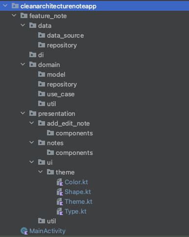
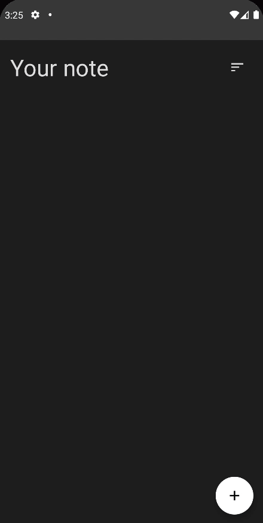

# **How to Make a Clean Architecture Note App (MVVM / CRUD / Jetpack Compose) - Android Studio Tutorial**

MVVM, CRUD, Jetpack Compose를 통해 노트 앱을 만들어 볼 것이다. Cryptocurrency와 다른 점은 Local Room Database를 사용한다는
것이다. [여기서](https://github.com/philipplackner/CleanArchitectureNoteApp) Initial 프로젝트를 클론하자.

## Structuring skeleton architecture

`data`, `domain`, `presentation` 레이어에 해당하는 패키지를 생성해주고, Dependency injection을 위한 `di` 패키지도 추가해준다.

<div align="center">

</div>

## Setup data

`domain.model` 패키지에 `Note` data class를 생성하고 다음과 같이 작성해준다.

```kotlin
@Entity
data class Note(
        val title: String,
        val content: String,
        val timestamp: Long,
        val color: Int,
        @PrimaryKey val id: Int? = null
) {
    companion object {
        // Note가 가지고 있는 색 하드코딩
        val noteColors = listOf(RedOrange, LightGreen, Violet, BabyBlue, RedPink)
    }
}

class InvalidNoteException(message: String) : Exception(message)
```

### Setup database

Database를 위한 `NoteDao` 인터페이스를 `feature_note.data.data_source` 패키지에 생성 및 작성해준다.

```kotlin
@Dao
interface NoteDao {

    @Query("SELECT * FROM note")
    fun getNotes(): Flow<List<Note>>

    @Query("SELECT * FROM note WHERE id=:id")
    fun getNoteById(id: Int): Note?

    @Insert(onConflict = OnConflictStrategy.REPLACE)
    suspend fun insertNote(note: Note)

    @Delete
    suspend fun deleteNote(note: Note)
}
```

동일한 패키지에 생성한 Dao를 포함하는 `NoteDatabase` abstract class를 생성해준다.

```kotlin
@Database(
        entities = [Note::class],
        version = 1
)
abstract class NoteDatabase : RoomDatabase() {

    abstract val noteDao: NoteDao

    companion object {
        const val DATABASE_NAME = "note_db"
    }
}
```

### Setup repository

`feature_note.domain.repository` 패키지에 `NoteRepository` 인터페이스를 만들어준다. domain 레이어에는 repository에 대한 인터페이스만 존재하며, 실제 구현은
data 레이어에서 이루어진다.

```kotlin
interface NoteRepository {

    fun getNotes(): Flow<List<Note>>

    suspend fun getNoteById(id: Int): Note?

    suspend fun insertNote(note: Note)

    suspend fun deleteNote(note: Note)
}
```

`data.repository` 패키지에 `NoteRepositoryImpl`을 구현해준다.

```kotlin
class NoteRepositoryImpl @Inject constructor(
        private val dao: NoteDao
) : NoteRepository {
    override fun getNotes(): Flow<List<Note>> {
        return dao.getNotes()
    }

    override suspend fun getNoteById(id: Int): Note? {
        return dao.getNoteById(id)
    }

    override suspend fun insertNote(note: Note) {
        return dao.insertNote(note)
    }

    override suspend fun deleteNote(note: Note) {
        return dao.deleteNote(note)
    }
}
```

## Implement use cases

### GetNote use case

노트는 정렬 순서가 존재하므로, 이를 확인하기 위해 `domain.util` 패키지에 `OrderType` sealed class를 생성하고 작성해준다.

```kotlin
sealed class OrderType {
    object Ascending : OrderType()
    object Descending : OrderType()
}
```

그리고 동일한 패키지에 어떤 기준으로 정렬할 것인지에 대한 `NoteOrder` sealed class를 생성하고 작성해준다.

```kotlin
sealed class NoteOrder(val orderType: OrderType) {
    class Title(orderType: OrderType) : NoteOrder(orderType)
    class Date(orderType: OrderType) : NoteOrder(orderType)
    class Color(orderType: OrderType) : NoteOrder(orderType)

    fun copy(orderType: OrderType): NoteOrder {
        return when (this) {
            is Title -> Title(orderType)
            is Date -> Date(orderType)
            is Color -> Color(orderType)
        }
    }
}
```

그리고 `GetNotes`를 다음과 같이 생성하고 작성해준다.

```kotlin
class GetNotes(
        private val repository: NoteRepository
) {

    operator fun invoke(
            noteOrder: NoteOrder = NoteOrder.Date(OrderType.Descending)
    ): Flow<List<Note>> {
        return repository.getNotes().map { notes ->
            when (noteOrder.orderType) {
                is OrderType.Ascending -> {
                    when (noteOrder) {
                        is NoteOrder.Title -> notes.sortedBy { it.title.lowercase() }
                        is NoteOrder.Date -> notes.sortedBy { it.timestamp }
                        is NoteOrder.Color -> notes.sortedBy { it.color }
                    }
                }
                is OrderType.Descending -> {
                    when (noteOrder) {
                        is NoteOrder.Title -> notes.sortedByDescending { it.title.lowercase() }
                        is NoteOrder.Date -> notes.sortedByDescending { it.timestamp }
                        is NoteOrder.Color -> notes.sortedByDescending { it.color }
                    }
                }
            }
        }
    }
}
```

### DeleteNote use case

```kotlin
class DeleteNote(
        private val repository: NoteRepository
) {

    suspend operator fun invoke(note: Note) {
        repository.deleteNote(note)
    }
}
```

### AddNote use case

```kotlin
class AddNote(
        private val repository: NoteRepository
) {

    @Throws(InvalidNoteException::class)
    suspend operator fun invoke(note: Note) {
        if (note.title.isBlank()) {
            throw InvalidNoteException("The title of the note can't be empty.")
        }
        if (note.content.isBlank()) {
            throw InvalidNoteException("The content of the note can't be empty.")
        }

        repository.insertNote(note)
    }
}
```

### GetNote use case

```kotlin
class GetNote(
        private val repository: NoteRepository
) {

    suspend operator fun invoke(id: Int): Note? {
        return repository.getNoteById(id)
    }
}
```

### NoteUseCases

이 use case 들을 하나의 클래스로 모아 그 클래스만 injection하여 사용하도록 한다. use case 들을 모두 injection 하기엔 보일러 플레이트 코드가 늘어나기 때문이다.

`domain.use_case` 패키지에 `NoteUseCases`를 만들어준다.

```kotlin
data class NoteUseCases(
        val getNotes: GetNotes,
        val deleteNote: DeleteNote,
        val addNote: AddNote,
        val getNote: GetNote
)
```

## Setup dependency injection

`NoteApp` 클래스를 만들고 `@HiltAndroidApp` 어노테이션을 달아준다. `AndroidManifest.xml`에도 해당 클래스를 추가해준다.

```kotlin
@HiltAndroidApp
class NoteApp : Application()
```

`di` 패키지에 `AppModule`을 추가해준다. feature에 따라 모듈을 구분해주어도 좋다. 여기선 하나의 모듈에 모두 넣어준다.

```kotlin
@Module
@InstallIn(SingletonComponent::class)
object AppModule {

    @Singleton
    @Provides
    fun provideNoteDatabase(app: Application): NoteDatabase {
        return Room.databaseBuilder(
                app,
                NoteDatabase::class.java,
                NoteDatabase.DATABASE_NAME
        ).build()
    }

    @Singleton
    @Provides
    fun provideNoteRepository(noteDatabase: NoteDatabase): NoteRepository {
        return NoteRepositoryImpl(noteDatabase.noteDao)
    }

    @Singleton
    @Provides
    fun provideNoteUseCases(repository: NoteRepository): NoteUseCases {
        return NoteUseCases(
                getNotes = GetNotes(repository),
                deleteNote = DeleteNote(repository),
                addNote = AddNote(repository),
                getNote = GetNote(repository)
        )
    }
}
```

## Implement Note UI

### NoteState

우선 note UI에 대한 상태를 알려주는 `NoteState` data class를 `presentation.notes` 패키지에 생성하고 작성한다.

```kotlin
data class NoteState(
        val notes: List<Note> = emptyList(),
        val noteOrder: NoteOrder = NoteOrder.Date(OrderType.Descending),
        val isOrderSectionVisible: Boolean = false
)
```

### NotesEvent

유저가 UI에서 상호작용하면 그 이벤트를 전달하는 `NotesEvent` sealed class를 동일한 패키지에 생성하고 작성해준다.

```kotlin
sealed class NotesEvent {
    data class Order(val noteOrder: NoteOrder) : NotesEvent()
    data class DeleteNote(val note: Note) : NotesEvent()
    object RestoreNote : NotesEvent()
    object ToggleOrderSection : NotesEvent()
}
```

### NotesViewModel

```kotlin
@HiltViewModel
class NotesViewModel @Inject constructor(
        private val noteUseCases: NoteUseCases
) : ViewModel() {

    private val _state = mutableStateOf<NoteState>(NoteState())
    val state: State<NoteState> = _state

    private var recentlyDeletedNote: Note? = null

    private var getNotesJob: Job? = null

    init {
        getNotes(NoteOrder.Date(OrderType.Descending))
    }

    fun onEvent(event: NotesEvent) {
        when (event) {
            is NotesEvent.Order -> {
                // not compare with reference, compare with Title, Date, Color class
                // because noteOrder is just class
                if (state.value.noteOrder::class == event.noteOrder::class &&
                        state.value.noteOrder.orderType == event.noteOrder.orderType
                ) {
                    return
                }
                getNotes(event.noteOrder)
            }
            is NotesEvent.DeleteNote -> {
                viewModelScope.launch {
                    noteUseCases.deleteNote(event.note)
                    recentlyDeletedNote = event.note
                }
            }
            is NotesEvent.RestoreNote -> {
                viewModelScope.launch {
                    noteUseCases.addNote(recentlyDeletedNote ?: return@launch)
                    recentlyDeletedNote = null
                }
            }
            is NotesEvent.ToggleOrderSection -> {
                _state.value = state.value.copy(isOrderSectionVisible = !state.value.isOrderSectionVisible)
            }
        }
    }

    private fun getNotes(noteOrder: NoteOrder) {
        getNotesJob?.cancel()
        getNotesJob = noteUseCases.getNotes(noteOrder)
                .onEach { notes ->
                    _state.value = state.value.copy(
                            notes = notes,
                            noteOrder = noteOrder
                    )
                }
                .launchIn(viewModelScope)
    }
}
```

### DefaultRadioButton

`NotesScreen`을 위한 `DefaultRadioButton` composable을 `components` 패키지에 생성하고 작성해준다.

```kotlin
@Composable
fun DefaultRadioButton(
        text: String,
        selected: Boolean,
        onSelect: () -> Unit,
        modifier: Modifier = Modifier
) {
    Row(
            modifier = modifier,
            verticalAlignment = Alignment.CenterVertically
    ) {
        RadioButton(
                selected = selected,
                onClick = onSelect,
                colors = RadioButtonDefaults.colors(
                        selectedColor = MaterialTheme.colors.primary,
                        unselectedColor = MaterialTheme.colors.onBackground
                )
        )
        Spacer(modifier = Modifier.width(8.dp))
        Text(
                text = text,
                style = MaterialTheme.typography.body1
        )
    }
}
```

### OrderSection

생성한 라디오 버튼을 통해 `OrderSection` composable을 구현해준다.

```kotlin
@Composable
fun OrderSection(
        modifier: Modifier = Modifier,
        noteOrder: NoteOrder = NoteOrder.Date(OrderType.Descending),
        onOrderChange: (NoteOrder) -> Unit
) {
    Column(
            modifier = modifier
    ) {
        Row(
                modifier = Modifier.fillMaxWidth()
        ) {
            DefaultRadioButton(
                    text = "Title",
                    selected = noteOrder is NoteOrder.Title,
                    onSelect = { onOrderChange(NoteOrder.Title(noteOrder.orderType)) }
            )
            Spacer(modifier = Modifier.width(8.dp))
            DefaultRadioButton(
                    text = "Date",
                    selected = noteOrder is NoteOrder.Date,
                    onSelect = { onOrderChange(NoteOrder.Date(noteOrder.orderType)) }
            )
            Spacer(modifier = Modifier.width(8.dp))
            DefaultRadioButton(
                    text = "Color",
                    selected = noteOrder is NoteOrder.Color,
                    onSelect = { onOrderChange(NoteOrder.Color(noteOrder.orderType)) }
            )
        }
        Spacer(modifier = Modifier.height(16.dp))
        Row(
                modifier = Modifier.fillMaxWidth()
        ) {
            DefaultRadioButton(
                    text = "Ascending",
                    selected = noteOrder.orderType is OrderType.Ascending,
                    onSelect = {
                        onOrderChange(noteOrder.copy(OrderType.Ascending))
                    }
            )
            Spacer(modifier = Modifier.width(8.dp))
            DefaultRadioButton(
                    text = "Descending",
                    selected = noteOrder.orderType is OrderType.Descending,
                    onSelect = {
                        onOrderChange(noteOrder.copy(OrderType.Descending))
                    }
            )
        }
    }
}
```

### NoteItem

각 노트를 보여주기 위한 `NoteItem` composable을 생성하고 작성한다.

```kotlin
@Composable
fun NoteItem(
        note: Note,
        modifier: Modifier = Modifier,
        cornerRadius: Dp = 10.dp,
        cutCornerSize: Dp = 30.dp,
        onDeleteClick: () -> Unit
) {
    Box(
            modifier = modifier
    ) {
        Canvas(
                // we want to check how much space the box occupied, and the box knows after text took their space, so use matchParentSize
                modifier = Modifier.matchParentSize()
        ) {
            val clipPath = Path().apply {
                lineTo(size.width - cutCornerSize.toPx(), 0f)
                lineTo(size.width, cutCornerSize.toPx())
                lineTo(size.width, size.height)
                lineTo(0f, size.height)
                close()
            }

            clipPath(clipPath) {
                drawRoundRect(
                        color = Color(note.color),
                        size = size,
                        cornerRadius = CornerRadius(cornerRadius.toPx())
                )
                drawRoundRect(
                        color = Color(
                                ColorUtils.blendARGB(note.color, 0x000000, 0.2f)
                        ),
                        topLeft = Offset(size.width - cutCornerSize.toPx(), -100f),
                        size = Size(cutCornerSize.toPx() + 100f, cutCornerSize.toPx() + 100f),
                        cornerRadius = CornerRadius(cornerRadius.toPx())
                )
            }
        }

        Column(
                modifier = Modifier
                        .fillMaxSize()
                        .padding(16.dp)
                        .padding(end = 32.dp)
        ) {
            Text(
                    text = note.title,
                    style = MaterialTheme.typography.h6,
                    color = MaterialTheme.colors.onSurface,
                    maxLines = 1,
                    overflow = TextOverflow.Ellipsis
            )
            Spacer(modifier = Modifier.height(8.dp))
            Text(
                    text = note.content,
                    style = MaterialTheme.typography.body1,
                    color = MaterialTheme.colors.onSurface,
                    maxLines = 10,
                    overflow = TextOverflow.Ellipsis
            )
        }
        IconButton(
                onClick = onDeleteClick,
                modifier = Modifier.align(Alignment.BottomEnd)
        ) {
            Icon(
                    imageVector = Icons.Default.Delete,
                    contentDescription = "Delete note",
                    tint = MaterialTheme.colors.onSurface
            )
        }
    }
}
```

### NoteScreen

```kotlin
@ExperimentalAnimationApi
@Composable
fun NoteScreen(
        navController: NavController,
        viewModel: NotesViewModel = hiltViewModel()
) {
    val state = viewModel.state.value
    val scaffoldState = rememberScaffoldState()
    val scope = rememberCoroutineScope()

    Scaffold(
            floatingActionButton = {
                FloatingActionButton(
                        onClick = {

                        },
                        backgroundColor = MaterialTheme.colors.primary
                ) {
                    Icon(imageVector = Icons.Default.Add, contentDescription = "Add note")
                }
            },
            scaffoldState = scaffoldState
    ) {
        Column(
                modifier = Modifier
                        .fillMaxSize()
                        .padding(16.dp)
        ) {
            Row(
                    modifier = Modifier.fillMaxWidth(),
                    horizontalArrangement = Arrangement.SpaceBetween,
                    verticalAlignment = Alignment.CenterVertically
            ) {
                Text(
                        text = "Your note",
                        style = MaterialTheme.typography.h4
                )
                IconButton(
                        onClick = {
                            viewModel.onEvent(NotesEvent.ToggleOrderSection)
                        },
                ) {
                    Icon(
                            imageVector = Icons.Default.Sort,
                            contentDescription = "Sort"
                    )
                }

            }
            AnimatedVisibility(
                    visible = state.isOrderSectionVisible,
                    enter = fadeIn() + slideInVertically(),
                    exit = fadeOut() + slideOutVertically()
            ) {
                OrderSection(
                        modifier = Modifier
                                .fillMaxWidth()
                                .padding(vertical = 16.dp),
                        noteOrder = state.noteOrder,
                        onOrderChange = {
                            viewModel.onEvent(NotesEvent.Order(it))
                        }
                )
            }
            Spacer(modifier = Modifier.height(16.dp))
            LazyColumn(modifier = Modifier.fillMaxSize()) {
                items(state.notes) { note ->
                    NoteItem(
                            note = note,
                            modifier = Modifier
                                    .fillMaxWidth()
                                    .clickable {

                                    },
                            onDeleteClick = {
                                viewModel.onEvent(NotesEvent.DeleteNote(note))
                                scope.launch {
                                    val result = scaffoldState.snackbarHostState.showSnackbar(
                                            message = "Note deleted",
                                            actionLabel = "Undo"
                                    )
                                    if (result == SnackbarResult.ActionPerformed) {
                                        viewModel.onEvent(NotesEvent.RestoreNote)
                                    }
                                }
                            }
                    )
                    Spacer(modifier = Modifier.height(16.dp))
                }
            }
        }
    }
}
```

## Implement Add Edit Note UI

### NoteTextFieldState

`NoteTextFieldState`를 따로 생성 및 작성한다.

```kotlin
data class NoteTextFieldState(
        val text: String = "",
        val hint: String = "",
        val isHintVisible: Boolean = true
)
```

### AddEditNoteEvent

```kotlin
sealed class AddEditNoteEvent {
    data class EnteredTitle(val value: String) : AddEditNoteEvent()
    data class ChangeTitleFocus(val focusState: FocusState) : AddEditNoteEvent()
    data class EnteredContent(val value: String) : AddEditNoteEvent()
    data class ChangeContentFocus(val focusState: FocusState) : AddEditNoteEvent()
    data class ChangeColor(val color: Int) : AddEditNoteEvent()
    object SaveNote : AddEditNoteEvent()
}
```

### AddEditNoteViewModel

```kotlin
@HiltViewModel
class AddEditNoteViewModel @Inject constructor(
        private val noteUseCases: NoteUseCases,
        savedStateHandle: SavedStateHandle // contain navigation arg -> hilt automactically inject to SavedStateHandle
) : ViewModel() {

    private val _noteTitle = mutableStateOf<NoteTextFieldState>(
            NoteTextFieldState(
                    hint = "Enter title..."
            )
    )
    val noteTitle: State<NoteTextFieldState> = _noteTitle

    private val _noteContent = mutableStateOf<NoteTextFieldState>(
            NoteTextFieldState(
                    hint = "Enter some content"
            )
    )
    val noteContent: State<NoteTextFieldState> = _noteContent

    private val _noteColor = mutableStateOf<Int>(Note.noteColors.random().toArgb())
    val noteColor: State<Int> = _noteColor

    // one time event for ViewModel
    private val _eventFlow = MutableSharedFlow<UiEvent>()
    val eventFlow = _eventFlow.asSharedFlow()

    private var currentNoteId: Int? = null

    init {
        savedStateHandle.get<Int>("noteId")?.let { noteId ->
            if (noteId != -1) {
                viewModelScope.launch {
                    noteUseCases.getNote(noteId)?.also { note ->
                        currentNoteId = note.id
                        _noteTitle.value = noteTitle.value.copy(
                                text = note.title,
                                isHintVisible = false
                        )
                        _noteContent.value = noteContent.value.copy(
                                text = note.content,
                                isHintVisible = false
                        )
                        _noteColor.value = note.color
                    }
                }
            }
        }
    }

    fun onEvent(event: AddEditNoteEvent) {
        when (event) {
            is AddEditNoteEvent.EnteredTitle -> {
                _noteTitle.value = noteTitle.value.copy(
                        text = event.value
                )
            }
            is AddEditNoteEvent.ChangeTitleFocus -> {
                _noteTitle.value = noteTitle.value.copy(
                        isHintVisible = !event.focusState.isFocused && noteTitle.value.text.isBlank()
                )
            }
            is AddEditNoteEvent.EnteredContent -> {
                _noteContent.value = noteContent.value.copy(
                        text = event.value
                )
            }
            is AddEditNoteEvent.ChangeContentFocus -> {
                _noteContent.value = noteContent.value.copy(
                        isHintVisible = !event.focusState.isFocused && noteContent.value.text.isBlank()
                )
            }
            is AddEditNoteEvent.ChangeColor -> {
                _noteColor.value = event.color
            }
            is AddEditNoteEvent.SaveNote -> {
                viewModelScope.launch {
                    try {
                        noteUseCases.addNote(
                                Note(
                                        title = noteTitle.value.text,
                                        content = noteContent.value.text,
                                        timestamp = System.currentTimeMillis(),
                                        color = noteColor.value,
                                        id = currentNoteId
                                )
                        )
                        _eventFlow.emit(UiEvent.SaveNote)
                    } catch (e: InvalidNoteException) {
                        _eventFlow.emit(
                                UiEvent.ShowSnackbar(
                                        message = e.message ?: "Couldn't save note"
                                )
                        )
                    }
                }
            }
        }
    }

    sealed class UiEvent {
        data class ShowSnackbar(val message: String) : UiEvent()
        object SaveNote : UiEvent()
    }
}
```

### TransparentHintTextField

`components`에 hint를 보여주기 위한 `TransparentHintTextField` composable을 생성하고 작성한다.

```kotlin
@Composable
fun TransparentHintTextField(
        text: String,
        hint: String,
        modifier: Modifier = Modifier,
        isHintVisible: Boolean = true,
        onValueChange: (String) -> Unit,
        textStyle: TextStyle = TextStyle(),
        singleLine: Boolean = false,
        onFocusChange: (FocusState) -> Unit
) {
    Box(
            modifier = modifier
    ) {
        BasicTextField(
                value = text,
                onValueChange = onValueChange,
                singleLine = singleLine,
                textStyle = textStyle,
                modifier = Modifier
                        .fillMaxWidth()
                        .onFocusChanged {
                            onFocusChange(it)
                        }
        )
        if (isHintVisible) {
            Text(
                    text = hint,
                    style = textStyle,
                    color = Color.DarkGray
            )
        }
    }
}
```

### AddEditNoteScreen

```kotlin
@Composable
fun AddEditNoteScreen(
        navController: NavController,
        noteColor: Int,  // 이미 저장된 노트의 색이 다른 색으로 보여지지 않기 위해 noteColor 파라미터 사용
        viewModel: AddEditNoteViewModel = hiltViewModel()
) {
    val titleState = viewModel.noteTitle.value
    val contentState = viewModel.noteContent.value

    val scaffoldState = rememberScaffoldState()

    val noteBackgroundAnimatable = remember {
        Animatable(
                Color(if (noteColor != -1) noteColor else viewModel.noteColor.value)
        )
    }
    val scope = rememberCoroutineScope()

    LaunchedEffect(key1 = true) {
        viewModel.eventFlow.collectLatest { event ->
            when (event) {
                is AddEditNoteViewModel.UiEvent.ShowSnackbar -> {
                    scaffoldState.snackbarHostState.showSnackbar(
                            message = event.message
                    )
                }
                is AddEditNoteViewModel.UiEvent.SaveNote -> {
                    navController.navigateUp()
                }
            }
        }
    }

    Scaffold(
            floatingActionButton = {
                FloatingActionButton(
                        onClick = {
                            viewModel.onEvent(AddEditNoteEvent.SaveNote)
                        },
                        backgroundColor = MaterialTheme.colors.primary
                ) {
                    Icon(
                            imageVector = Icons.Default.Save,
                            contentDescription = "Save note"
                    )
                }
            },
            scaffoldState = scaffoldState
    ) {
        Column(
                modifier = Modifier
                        .fillMaxSize()
                        .background(noteBackgroundAnimatable.value)
                        .padding(16.dp)
        ) {
            Row(
                    modifier = Modifier
                            .fillMaxWidth()
                            .padding(8.dp),
                    horizontalArrangement = Arrangement.SpaceBetween
            ) {
                Note.noteColors.forEach { color ->
                    val colorInt = color.toArgb()
                    Box(
                            modifier = Modifier
                                    .size(50.dp)
                                    .shadow(15.dp, CircleShape)
                                    .clip(CircleShape)
                                    .background(color)
                                    .border(
                                            width = 3.dp,
                                            color = if (viewModel.noteColor.value == colorInt) {
                                                Color.Black
                                            } else Color.Transparent,
                                            shape = CircleShape
                                    )
                                    .clickable {
                                        scope.launch {
                                            noteBackgroundAnimatable.animateTo(
                                                    targetValue = Color(colorInt),
                                                    animationSpec = tween(
                                                            durationMillis = 500
                                                    )
                                            )
                                        }
                                        viewModel.onEvent(AddEditNoteEvent.ChangeColor(colorInt))
                                    }
                    )
                }
            }
            Spacer(modifier = Modifier.height(16.dp))
            TransparentHintTextField(
                    text = titleState.text,
                    hint = titleState.hint,
                    onValueChange = {
                        viewModel.onEvent(AddEditNoteEvent.EnteredTitle(it))
                    },
                    onFocusChange = {
                        viewModel.onEvent(AddEditNoteEvent.ChangeTitleFocus(it))
                    },
                    isHintVisible = titleState.isHintVisible,
                    singleLine = true,
                    textStyle = MaterialTheme.typography.h5
            )
            Spacer(modifier = Modifier.height(16.dp))
            TransparentHintTextField(
                    text = contentState.text,
                    hint = contentState.hint,
                    onValueChange = {
                        viewModel.onEvent(AddEditNoteEvent.EnteredContent(it))
                    },
                    onFocusChange = {
                        viewModel.onEvent(AddEditNoteEvent.ChangeContentFocus(it))
                    },
                    isHintVisible = contentState.isHintVisible,
                    textStyle = MaterialTheme.typography.body1,
                    modifier = Modifier.fillMaxHeight()
            )
        }
    }
}
```

## Setup navigation

`presentation.util` 패키지에 네비게이션을 위한 `Screen` sealed class를 만들어준다.

```kotlin
sealed class Screen(val route: String) {
    object NotesScreen : Screen("note_screen")
    object AddEditNoteScreen : Screen("add_edit_note_screen")
}
```

### MainActivity

```kotlin
@ExperimentalAnimationApi
@AndroidEntryPoint
class MainActivity : ComponentActivity() {
    override fun onCreate(savedInstanceState: Bundle?) {
        super.onCreate(savedInstanceState)
        setContent {
            CleanArchitectureNoteAppTheme {
                Surface(
                        color = MaterialTheme.colors.background
                ) {
                    val navController = rememberNavController()
                    NavHost(
                            navController = navController,
                            startDestination = Screen.NotesScreen.route
                    ) {
                        composable(Screen.NotesScreen.route) {
                            NoteScreen(navController = navController)
                        }
                        composable(
                                Screen.AddEditNoteScreen.route +
                                        "?noteId={noteId}&noteColor={noteColor}",
                                arguments = listOf(
                                        navArgument(
                                                name = "noteId"
                                        ) {
                                            type = NavType.IntType
                                            defaultValue = -1
                                        },
                                        navArgument(
                                                name = "noteColor"
                                        ) {
                                            type = NavType.IntType
                                            defaultValue = -1
                                        },
                                )
                        ) {
                            val color = it.arguments?.getInt("noteColor") ?: -1
                            AddEditNoteScreen(
                                    navController = navController,
                                    noteColor = color
                            )
                        }
                    }
                }
            }
        }
    }
}
```

<div align="center">

</div>

## Referenes

* [How to Make a Clean Architecture Note App (MVVM / CRUD / Jetpack Compose) - Android Studio Tutorial](https://www.youtube.com/watch?v=8YPXv7xKh2w&t=149s)