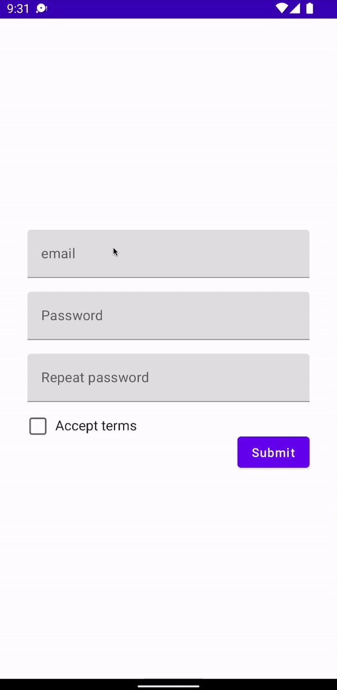

# How to Validate Forms with Clean Architecture

클린 아키텍처를 통해 유효성을 검증하는 Form을 만들어보자.

### Dependencies

`lifecycle-viewmodel-compose` 디펜던시를 추가한다.

```groovy
dependencies {
    // ...
    implementation "androidx.lifecycle:lifecycle-viewmodel-compose:2.4.1"
}
```

`MainViewModel` 생성 및 `ViewModel`을 상속한다.

```kotlin
class MainViewModel: ViewModel() {
}
```

`presentation` 패키지 생성 후 `MainActivity`와 `MainViewModel`을 해당 패키지로 이동시킨다.

`domain.use_case` 패키지를 생성한다. 데이터 레이어는 현재 불필요하므로 생성하지 않는다.

`presentation` 패키지에 상태를 표현하는 `RegistrationFromState` data class를 생성한다.

```kotlin
data class RegistrationFromState(
    val email: String = "",
    val emailError: String? = null,
    val password: String = "",
    val passwordError: String? = null,
    val repeatedPassword: String = "",
    val repeatedPasswordError: String? = null,
    val acceptedTerms: Boolean = false,
    val termsError: String? = null
)
```

`MainViewModel`에 `RegistrationFromState` 상태를 추가한다.

```kotlin
class MainViewModel: ViewModel() {

    var state by mutableStateOf(RegistrationFromState())
        private set
}
```

Use case는 뷰모델과 데이터 레이어의 중간 레이어이다. Use case는 디비에 접근하는 레포지토리에 접근할 수 있고 또는 직접 데이터 소스에 접근할 수 있다. 클린 아키텍처에서 Use Case를 사용하는 이유는 Single responsibility principle 원칙을 준수하기 때문이다. 따라서 하나의 클래스에 하나의 작업만 수행하도록 구현한다.    

`domain.use_case` 패키지에 `ValidationResult`를 생성한다. 이는 모든 Use case에서 성공했는지, 실패했는지와 실패했을 때의 에러 메시지를 포함하는 data class이다. Use Case마다 다른 Result가 필요하다면 Use case 내부에 Result 클래스를 생성하여 반환한다. 

```kotlin
data class ValidationResult(
    val successful: Boolean,
    val errorMessage: String? = null
)
```

동일한 패키지에 `ValidateEmail`, `ValidatePassword`, `ValidateRepeatedPassword`, `ValidateTerms` Use case를 생성한다.

```kotlin
class ValidateEmail {

    fun execute(email: String): ValidationResult {
        if (email.isBlank()) {
            return ValidationResult(
                successful = false,
                errorMessage = "The email can't be blank"
            )
        }
        if (!Patterns.EMAIL_ADDRESS.matcher(email).matches()) {
            return ValidationResult(
                successful = false,
                errorMessage = "That's not a valid email"
            )
        }
        return ValidationResult(
            successful = true
        )
    }
}
```

```kotlin
class ValidatePassword {

    fun execute(password: String): ValidationResult {
        if (password.length < 8) {
            return ValidationResult(
                successful = false,
                errorMessage = "The password needs to consist of at least 8 characters"
            )
        }
        val containsLettersAndDigits = password.any { it.isDigit() } && password.any { it.isLetter() }
        if (!containsLettersAndDigits) {
            return ValidationResult(
                successful = false,
                errorMessage = "The password needs to contain at least one letter and digit"
            )
        }
        return ValidationResult(
            successful = true
        )
    }
}
```

```kotlin
class ValidateRepeatedPassword {

    fun execute(password: String, repeatedPassword: String): ValidationResult {
        if (password != repeatedPassword) {
            return ValidationResult(
                    successful = false,
                    errorMessage = "The passwords don't match"
            )
        }
        return ValidationResult(
                successful = true
        )
    }
}
```

```kotlin
class ValidateTerms {

    fun execute(acceptedTerms: Boolean): ValidationResult {
        if (!acceptedTerms) {
            return ValidationResult(
                successful = false,
                errorMessage = "Please accept the terms"
            )
        }
        return ValidationResult(
            successful = true
        )
    }
}
```

위 작성한 Use cases를 `MainViewModel`로 전달한다. 여기선 각각 생성자를 통해 생성해주었지만 DI를 사용하는게 좋은 방식이다.

```kotlin
class MainViewModel(
    private val validateEmail: ValidateEmail = ValidateEmail(),
    private val validatePassword: ValidatePassword = ValidatePassword(),
    private val validateRepeatedPassword: ValidateRepeatedPassword = ValidateRepeatedPassword(),
    private val validateTerms: ValidateTerms = ValidateTerms()
): ViewModel() {
    // ...
}
```

유저가 이벤트를 발생시켰을 때의 이벤트를 `RegistrationFormEvent` sealed class로 작성한다.

```kotlin
sealed class RegistrationFormEvent {
    data class EmailChanged(val email: String): RegistrationFormEvent()
    data class PasswordChanged(val password: String): RegistrationFormEvent()
    data class RepeatedPasswordChanged(val repeatedPassword: String): RegistrationFormEvent()
    data class AcceptTerms(val isAccepted: Boolean): RegistrationFormEvent()
    object Submit: RegistrationFormEvent()
}
```

`onEvent`를 생성해 각 이벤트 별 처리를 수행하고, `_validationEventChannel` 채널을 생성해 validate가 성공할 경우 `ValidationEvent.Success`를 emit 한다.

```kotlin
class MainViewModel(
    private val validateEmail: ValidateEmail = ValidateEmail(),
    private val validatePassword: ValidatePassword = ValidatePassword(),
    private val validateRepeatedPassword: ValidateRepeatedPassword = ValidateRepeatedPassword(),
    private val validateTerms: ValidateTerms = ValidateTerms()
): ViewModel() {

    var state by mutableStateOf(RegistrationFromState())
        private set

    private val _validationEventChannel = Channel<ValidationEvent>()
    val validationEvents = _validationEventChannel.receiveAsFlow()

    fun onEvent(event: RegistrationFormEvent) {
        when (event) {
            is RegistrationFormEvent.EmailChanged -> {
                state = state.copy(email = event.email) // copy를 사용하는 이유는 RegistrationFromState 내부의 필드가 val로 선언되어 있기 때문
            }
            is RegistrationFormEvent.PasswordChanged -> {
                state = state.copy(password = event.password)
            }
            is RegistrationFormEvent.RepeatedPasswordChanged -> {
                state = state.copy(repeatedPassword = event.repeatedPassword)
            }
            is RegistrationFormEvent.AcceptTerms -> {
                state = state.copy(acceptedTerms = event.isAccepted)
            }
            is RegistrationFormEvent.Submit -> {
                submitData()
            }
        }
    }

    private fun submitData() {
        val emailResult = validateEmail.execute(state.email)
        val passwordResult = validatePassword.execute(state.password)
        val repeatedPasswordResult = validateRepeatedPassword.execute(state.password, state.repeatedPassword)
        val termsResult = validateTerms.execute(state.acceptedTerms)

        val hasError = listOf(
            emailResult,
            passwordResult,
            repeatedPasswordResult,
            termsResult
        ).any { !it.successful }

        if (hasError) {
            state = state.copy(
                emailError = emailResult.errorMessage,
                passwordError = passwordResult.errorMessage,
                repeatedPasswordError = repeatedPasswordResult.errorMessage,
                termsError = termsResult.errorMessage,
            )
            return
        }
        
        viewModelScope.launch {
            _validationEventChannel.send(ValidationEvent.Success)
        }
    }

    sealed class ValidationEvent {
        object Success: ValidationEvent()
    }
}
```

`MainActivity`에 UI를 다음과 같이 작성한다.

```kotlin
class MainActivity : ComponentActivity() {
    override fun onCreate(savedInstanceState: Bundle?) {
        super.onCreate(savedInstanceState)
        setContent {
            CleanArchFormValidationTheme {
                // A surface container using the 'background' color from the theme
                Surface(
                    modifier = Modifier.fillMaxSize(),
                    color = MaterialTheme.colors.background
                ) {
                    val viewModel = viewModel<MainViewModel>()
                    val state = viewModel.state
                    val context = LocalContext.current

                    LaunchedEffect(key1 = context) { // context가 변경되면 실행
                        viewModel.validationEvents.collect { event ->
                            when (event) {
                                is MainViewModel.ValidationEvent.Success -> {
                                    Toast.makeText(
                                        context,
                                        "Registration successful",
                                        Toast.LENGTH_LONG
                                    ).show()
                                }
                            }
                        }
                    }

                    Column(
                        modifier = Modifier
                            .fillMaxSize()
                            .padding(32.dp),
                        verticalArrangement = Arrangement.Center
                    ) {
                        TextField(
                            value = state.email,
                            onValueChange = {
                                viewModel.onEvent(RegistrationFormEvent.EmailChanged(it))
                            },
                            isError = state.emailError != null,
                            modifier = Modifier.fillMaxWidth(),
                            placeholder = {
                                Text(text = "email")
                            },
                            keyboardOptions = KeyboardOptions(keyboardType = KeyboardType.Email)
                        )
                        if (state.emailError != null) {
                            Text(
                                text = state.emailError,
                                color = MaterialTheme.colors.error,
                                modifier = Modifier.align(Alignment.End)
                            )
                        }
                        Spacer(modifier = Modifier.height(16.dp))

                        TextField(
                            value = state.password,
                            onValueChange = {
                                viewModel.onEvent(RegistrationFormEvent.PasswordChanged(it))
                            },
                            isError = state.passwordError != null,
                            modifier = Modifier.fillMaxWidth(),
                            placeholder = {
                                Text(text = "Password")
                            },
                            keyboardOptions = KeyboardOptions(keyboardType = KeyboardType.Password),
                            visualTransformation = PasswordVisualTransformation()
                        )
                        if (state.passwordError != null) {
                            Text(
                                text = state.passwordError,
                                color = MaterialTheme.colors.error,
                                modifier = Modifier.align(Alignment.End)
                            )
                        }
                        Spacer(modifier = Modifier.height(16.dp))

                        TextField(
                            value = state.repeatedPassword,
                            onValueChange = {
                                viewModel.onEvent(RegistrationFormEvent.RepeatedPasswordChanged(it))
                            },
                            isError = state.repeatedPasswordError != null,
                            modifier = Modifier.fillMaxWidth(),
                            placeholder = {
                                Text(text = "Repeat password")
                            },
                            keyboardOptions = KeyboardOptions(keyboardType = KeyboardType.Password),
                            visualTransformation = PasswordVisualTransformation()
                        )
                        if (state.repeatedPasswordError != null) {
                            Text(
                                text = state.repeatedPasswordError,
                                color = MaterialTheme.colors.error,
                                modifier = Modifier.align(Alignment.End)
                            )
                        }
                        Spacer(modifier = Modifier.height(16.dp))

                        Row(
                            modifier = Modifier.fillMaxWidth()
                        ) {
                            Checkbox(
                                checked = state.acceptedTerms,
                                onCheckedChange = {
                                    viewModel.onEvent(RegistrationFormEvent.AcceptTerms(it))
                                }
                            )
                            Spacer(modifier = Modifier.width(8.dp))
                            Text(
                                text = "Accept terms"
                            )
                        }
                        if (state.termsError != null) {
                            Text(
                                text = state.termsError,
                                color = MaterialTheme.colors.error
                            )
                        }

                        Button(
                            onClick = {
                                viewModel.onEvent(RegistrationFormEvent.Submit)
                            },
                            modifier = Modifier.align(Alignment.End)
                        ) {
                            Text(text = "Submit")
                        }
                    }
                }
            }
        }
    }
}
```

<div align="center">

</div>

## Testing

Use case를 사용하면 테스팅이 간결해진다. `ValidateEmail`의 경우 Email 검증 시 안드로이드 모듈을 사용하므로 instrument test를 수행해야 한다(이 부분도 클린 아키텍쳐로 작성하여 유닛 테스팅 할 수 있다.). 비밀번호 검증하는 `ValidatePassword`의 테스트 코드를 작성해보자.

```kotlin
class ValidatePasswordTest {

    private lateinit var validatePassword: ValidatePassword

    @Before
    fun setUp() {
        validatePassword = ValidatePassword()
    }

    @Test
    fun `Password is letter-only, returns error`() {
        val result = validatePassword.execute("abcdefgh")

        assertEquals(result.successful, false)
    }
}
```

## References
* [How to Validate Forms with Clean Architecture (You're Doing it Wrong)](https://www.youtube.com/watch?v=zu8lQSVw4vk&t=7s)