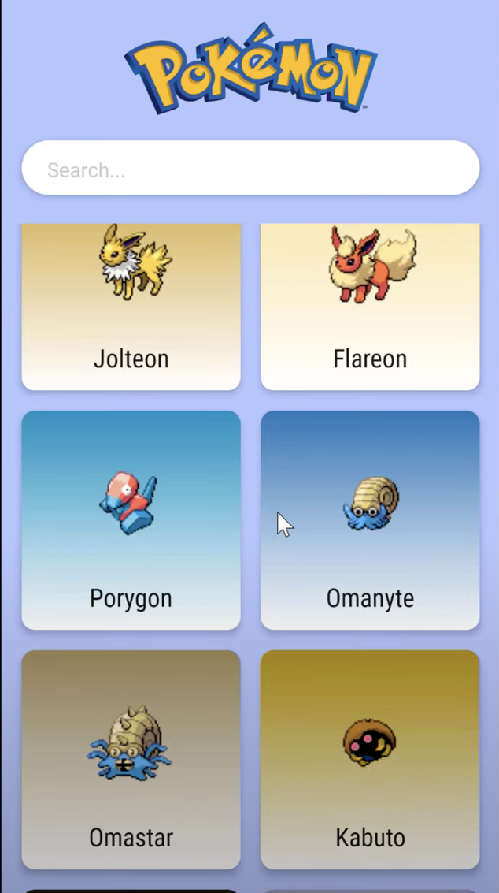
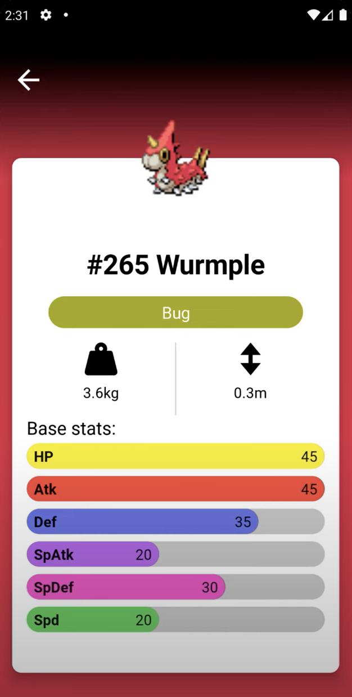

# MVVM Pokédex App with Jetpack Compose

다음과 같은 포켓몬 도감을 Jetpack Compose를 통해 만들어 볼 것이다. 포켓몬을 클릭하면 상세 내용이 나온다.

<div align="center" class="row">


</div>

기본적인 세팅이 되어있는 [이 레포](https://github.com/philipplackner/JetpackComposePokedex)에서 프로젝트를 클론하자. 포켓몬에 대한 정보는 [여기](https://pokeapi.co/)에서 무료로 가져올 수 있다.

MainAcitivity에서 기본적인 네비게이션과 Dagger-Hilt를 설정한다.

```kotlin
@AndroidEntryPoint
class MainActivity : ComponentActivity() {
    override fun onCreate(savedInstanceState: Bundle?) {
        super.onCreate(savedInstanceState)
        setContent {
            JetpackComposePokedexTheme {
                val navController = rememberNavController()
                NavHost(
                    navController = navController,
                    startDestination = "pokemon_list_screen"
                ) {
                    composable("pokemon_list_screen") {

                    }
                    composable(
                        "pokemon_detail_screen/{dominantColor}/{pokemonName}",
                        arguments = listOf(
                            navArgument("dominantColor") {
                                type = NavType.IntType
                            },
                            navArgument("pokemonName") {
                                type = NavType.StringType
                            }
                        )
                    ) {
                        val dominantColor = remember {
                            val color = it.arguments?.getInt("dominantColor")
                            color?.let { Color(it) } ?: Color.White
                        }
                        val pokemonName = remember {
                            it.arguments.getString("pokemonName")
                        }
                        
                    }
                }
            }
        }
    }
}
```

`PokedexApplication`, `Application` 클래스를 생성하고 `@HiltAndroidApp`로 어노테이션 해준다.

```kotlin
@HiltAndroidApp
class PokedexApplication : Application() {

    override fun onCreate() {
        super.onCreate()
				// Timber init
        Timber.plant(Timber.DebugTree())
    }
}
```

`AndroidManifest.xml`에 위 `Application` 클래스를 설정해준다.

다음은 Dagger-Hilt 모듈을 설정해준다.

```kotlin
@Module
@InstallIn(SingletonComponent::class)
object AppModule {
}
```

## References

* [MVVM Pokédex App with Jetpack Compose - Android Studio Tutorial - Part 1](https://www.youtube.com/watch?v=v0of23TxIKc&list=PLQkwcJG4YTCTimTCpEL5FZgaWdIZQuB7m&index=1)