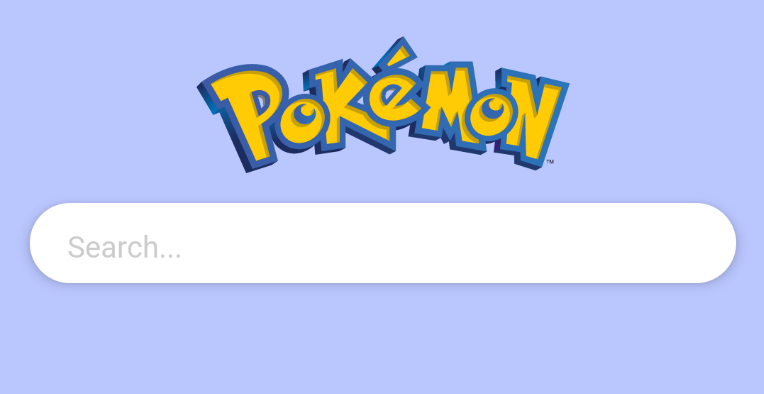
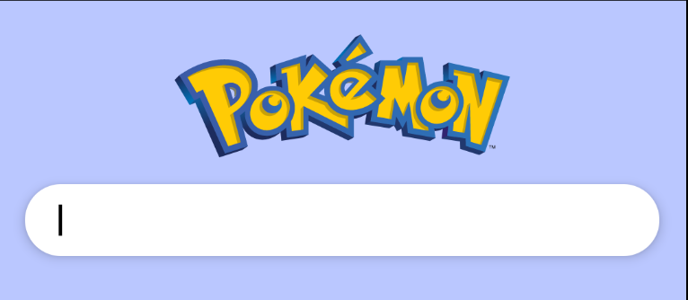

# SearchBar & PokémonListScreen

이번에는 포켓몬들의 리스트 스크린을 만들어볼 것이다. `pokemonlist` 패키지를 생성하고 `PokemonListScreen`을 생성한다.

```kotlin
@Composable
fun PokemonListScreen(
    navController: NavController
) {
    Surface(
        color = MaterialTheme.colors.background,
        modifier = Modifier
            .fillMaxSize()
    ) {
        Column {
            Spacer(modifier = Modifier.height(20.dp))
            Image(
                painter = painterResource(id = R.drawable.ic_international_pok_mon_logo),
                contentDescription = "Pokemon",
                modifier = Modifier
                    .fillMaxWidth()
                    .align(CenterHorizontally)
            )
            SearchBar(
                hint = "Search...",
                modifier = Modifier
                    .fillMaxWidth()
                    .padding(16.dp)
            ) {

            }
        }
    }
}

@Composable
fun SearchBar(
    modifier: Modifier = Modifier,
    hint: String = "",
    onSearch: (String) -> Unit = {}
) {
    var text by remember {
        mutableStateOf("")
    }
    var isHintDisplayed by remember {
        mutableStateOf(hint != "")
    }

    Box(modifier = modifier) {
        BasicTextField(
            value = text,
            onValueChange = {
                text = it
                onSearch(it)
            },
            maxLines = 1,
            singleLine = true,
            textStyle = TextStyle(color = Color.Black),
            modifier = Modifier
                .fillMaxWidth()
                .shadow(5.dp, CircleShape)
                .background(Color.White, CircleShape)
                .padding(horizontal = 20.dp, vertical = 12.dp)
                .onFocusChanged {
										isHintDisplayed = !it.isFocused && text.isEmpty()
                }
        )
        if (isHintDisplayed) {
            Text(
                text = hint,
                color = Color.LightGray,
                modifier = Modifier
                    .padding(horizontal = 20.dp, vertical = 12.dp)
            )
        }
    }
}
```

그리고 `MainActivity`의 `pokemon_list_screen`에서 `PokemonListScreen`을 호출한다.

```kotlin
composable("pokemon_list_screen") {
		PokemonListScreen(navController = navController)
}
```

에뮬레이터에서 실행시켜보면 다음과 같이 보여지며 Focus가 된 경우 hint가 사라진다.

<div align="center" class="column">
<div></div>
<div></div>
</div>

## References

* [SearchBar & PokémonListScreen - Pokédex App With Jetpack Compose - Part 3](https://www.youtube.com/watch?v=O6k5Q2LoL0k&list=PLQkwcJG4YTCTimTCpEL5FZgaWdIZQuB7m&index=3)