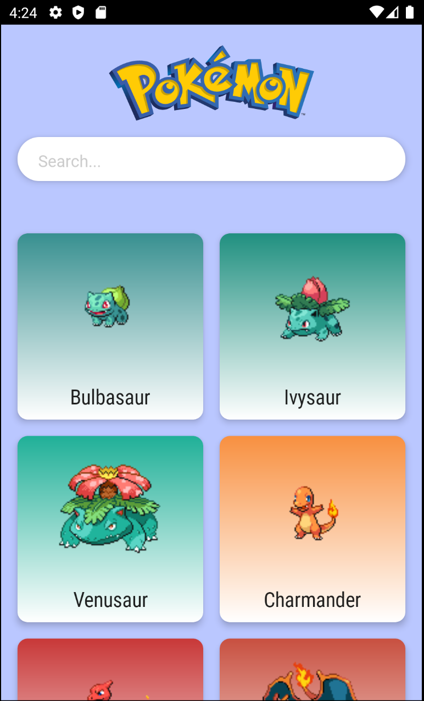
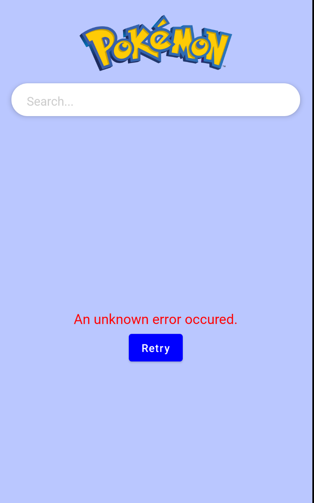

# Paginating Pokémon List

이번에는 페이지네이션 기능을 구현하여 포켓몬 리스트를 보여줄 것이다. 우선 `Constants` 파일에 `PAGE_SIZE`를 지정한다.

```kotlin
object Constants {

    const val BASE_URL = "https://pokeapi.co/api/v2/"
    const val PAGE_SIZE = 20
}
```

`PokemonListViewModel`에 `loadPokemonPaginated()` 함수를 생성하고 성공, 로딩중, 에러 발생에 대한 처리를 해준다.

```kotlin
@HiltViewModel
class PokemonListViewModel @Inject constructor(
    private val repository: PokemonRepository
): ViewModel() {

    private var curPage = 0

    // composed state를 사용할 것이다.
    // 만약 데이터를 변경하거나 조작할 경우 flow state 사용 후 convert 하면 된다.
    var pokemonList = mutableStateOf<List<PokedexListEntry>>(listOf())
    var loadError = mutableStateOf("")
    var isLoading = mutableStateOf(false)
    var endReached = mutableStateOf(false)

    init {
        loadPokemonPaginated()
    }

    fun loadPokemonPaginated() {
        isLoading.value = true
        viewModelScope.launch {
            val result = repository.getPokemonList(PAGE_SIZE, curPage * PAGE_SIZE)
            when (result) {
                is Resource.Success -> {
                    endReached.value = curPage * PAGE_SIZE >= result.data!!.count
                    val pokedexEntries = result.data.results.mapIndexed { index, entry ->
                        val number = if (entry.url.endsWith("/")) {
                            // takeLastWhile은 마지막에 있는 숫자들을 가져온다. 예를 들어 /1223이라면 1223을 가져온다.
                            entry.url.dropLast(1).takeLastWhile { it.isDigit() }
                        } else {
                            entry.url.takeLastWhile { it.isDigit() }
                        }
                        val url = "https://raw.githubusercontent.com/PokeAPI/sprites/master/sprites/pokemon/${number}.png"
                        PokedexListEntry(entry.name.replaceFirstChar { it.uppercase() }, url, number.toInt())
                    }
                    curPage++

                    loadError.value = ""
                    isLoading.value = false
                    pokemonList.value += pokedexEntries
                }
                is Resource.Error -> {
                    loadError.value = result.message!!
                    isLoading.value = false
                }
            }
        }
    }

    fun calcDominantColor(drawable: Drawable, onFinish: (Color) -> Unit) {
        // paleatte API 포맷에 맞지 않으므로 bitmap을 mutable로 변경한 다음 Bitmap.Config로 변경해 API를 사용가능하도록 한다.
        val bmp = (drawable as BitmapDrawable).bitmap.copy(Bitmap.Config.ARGB_8888, true)

        Palette.from(bmp).generate { palette ->
            palette?.dominantSwatch?.rgb?.let { colorValue ->
                onFinish(Color(colorValue))
            }
        }
    }
}
```

`MainActivity`에 `PokemonList` composable을 만들어주고 각 Row 별 `PokedexRow`를 호출한다.

```kotlin
@Composable
fun PokemonList(
    navController: NavController,
    viewModel: PokemonListViewModel = hiltNavGraphViewModel()
) {
    val pokemonList by remember { viewModel.pokemonList }
    val endReached by remember { viewModel.endReached }
    val loadError by remember { viewModel.loadError }
    val isLoading by remember { viewModel.isLoading }

    LazyColumn(contentPadding = PaddingValues(16.dp)) {
        val itemCount = if(pokemonList.size % 2 == 0) {
            pokemonList.size / 2
        } else {
            pokemonList.size / 2 + 1
        }
        items(itemCount) {
						// 여기선 Page를 직접 구현했지만 나중엔 Paging 라이브러리를 쓰도록 하자
            if(it >= itemCount - 1 && !endReached && !isLoading) {
                viewModel.loadPokemonPaginated()
            }
            PokedexRow(rowIndex = it, entries = pokemonList, navController = navController)
        }
    }
}
```

<div align="center">

</div>

이제 포켓몬들을 API로 가져와 보여주는데 에러가 발생했을 때의 처리를 안해주었다. 따라서 retry 버튼을 보여주기 위해 다음과 같이 작성한다.

```kotlin
@Composable
fun RetrySection(
    error: String,
    onRetry: () -> Unit
) {
    Column {
        Text(text = error, color = Color.Red, fontSize = 18.sp)
        Spacer(modifier = Modifier.height(8.dp))
        Button(
            onClick = { onRetry() },
            modifier = Modifier.align(CenterHorizontally)
        ) {
            Text(text = "Retry")
        }
    }
}
```

그런 다음 `PokemonList` composable에 추가한다.

```kotlin
@Composable
fun PokemonList(
    navController: NavController,
    viewModel: PokemonListViewModel = hiltNavGraphViewModel()
) {
    val pokemonList by remember { viewModel.pokemonList }
    val endReached by remember { viewModel.endReached }
    val loadError by remember { viewModel.loadError }
    val isLoading by remember { viewModel.isLoading }

    LazyColumn(contentPadding = PaddingValues(16.dp)) {
        val itemCount = if(pokemonList.size % 2 == 0) {
            pokemonList.size / 2
        } else {
            pokemonList.size / 2 + 1
        }
        items(itemCount) {
            if(it >= itemCount - 1 && !endReached) {
                viewModel.loadPokemonPaginated()
            }
            PokedexRow(rowIndex = it, entries = pokemonList, navController = navController)
        }
    }

    Box(
        contentAlignment = Center,
        modifier = Modifier.fillMaxSize()
    ) {
        if (isLoading) {
            CircularProgressIndicator(color = MaterialTheme.colors.primary)
        }
        if (loadError.isNotEmpty()) {
            RetrySection(error = loadError) {
                viewModel.loadPokemonPaginated()
            }
        }
    }
}
```

비행기모드로 실행하면 다음과 같이 에러를 출력한다.

<div align="center">

</div>

## References

* [Paginating Pokémon List - Pokédex App With Jetpack Compose - Part 5](https://www.youtube.com/watch?v=jrIfGAk8PyQ&list=PLQkwcJG4YTCTimTCpEL5FZgaWdIZQuB7m&index=5)