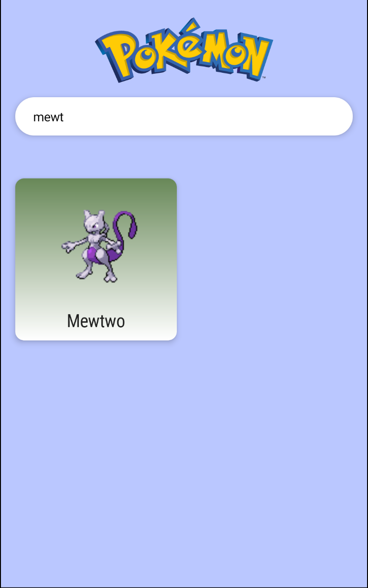

# Searching Pokémon

이번에는 포켓몬을 검색할 수 있는 기능을 만들어보자. 아쉽게도 API가 지원되지 않아 리모트 검색은 되지 않고 로컬에 저장된 아이템들에 대해서만 검색이 가능하다.

`PokemonListViewModel`에 다음과 같이 추가한다.

```kotlin
// cached pokemon list
private var cachedPokemonList = listOf<PokedexListEntry>()
// search field가 비어있으면 true
private var isSearchStarting = true
// display search result
var isSearching = mutableStateOf(false)

init {
    loadPokemonPaginated()
}

fun searchPokemonList(query: String) {
    val listToSearch = if (isSearchStarting) {
        pokemonList.value
    } else {
        cachedPokemonList
    }
    viewModelScope.launch(Dispatchers.Default) {
        if (query.isEmpty()) {
            pokemonList.value = cachedPokemonList
            isSearching.value = false
            isSearchStarting = true
            return@launch
        }
        val results = listToSearch.filter {
            it.pokemonName.contains(query.trim(), ignoreCase = true) ||
                    it.number.toString() == query.trim()  // search with number
        }
        if (isSearchStarting) {
            cachedPokemonList = pokemonList.value
            isSearchStarting = false
        }
        pokemonList.value = results
        isSearching.value = true
    }
}
```

그리고 `PokemonList`의 `items` 블록에 `!isSearching`을 추가한다.

```kotlin
items(itemCount) {
    if(it >= itemCount - 1 && !endReached && !isLoading && !isSearching) {
        viewModel.loadPokemonPaginated()
    }
    PokedexRow(rowIndex = it, entries = pokemonList, navController = navController)
}
```

Searching을 하기 위해 `SearchBar`에 `viewModel.searchPokemonList(it)` 호출을 추가한다.

```kotlin
SearchBar(
    hint = "Search...",
    modifier = Modifier
        .fillMaxWidth()
        .padding(16.dp)
) {
    viewModel.searchPokemonList(it)
}
```

실행하면 다음과 같이 검색을 통해 원하는 포켓몬을 확인할 수 있다.

<div align="center">

</div>

## References

* [Bug fix & Searching Pokémon - MVVM Pokédex App with Jetpack Compose - Part 6](https://www.youtube.com/watch?v=X4Y63Cw9Gmw&list=PLQkwcJG4YTCTimTCpEL5FZgaWdIZQuB7m&index=6)