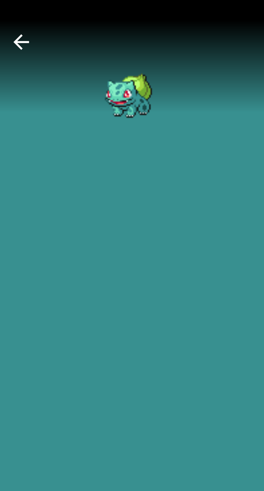

# Pokémon Detail Screen (1)

이제 Pokemon Detail 화면을 만들어보자. `pokemondetail` 패키지를 만들고 하위에 `PokemonDetailViewModel`을 생성한 후 다음과 같이 작성한다.

```kotlin
@HiltViewModel
class PokemonDetailViewModel @Inject constructor(
    private val repository: PokemonRepository
): ViewModel() {

    suspend fun getPokemonInfo(pokemonName: String): Resource<Pokemon> {
        return repository.getPokemonInfo(pokemonName)
    }
}
```

또한 `PokemonDetailScreen`을 생성하고 다음과 같이 구현한다.

```kotlin
@Composable
fun PokemonDetailScreen(
    dominantColor: Color,
    pokemonName: String,
    navController: NavController,
    topPadding: Dp = 20.dp,
    pokemonImageSize: Dp = 200.dp,
    viewModel: PokemonDetailViewModel = hiltViewModel()
) {
    // produceState는 State<T>를 반환할 수 있다.
    val pokemonInfo = produceState<Resource<Pokemon>>(initialValue = Resource.Loading()) {
        value = viewModel.getPokemonInfo(pokemonName)
    }.value

    val painter = rememberImagePainter(
        data = pokemonInfo?.data?.sprites?.frontDefault,
        builder = {
            crossfade(true)
        },
    )

    Box(modifier = Modifier
        .fillMaxSize()
        .background(dominantColor)
        .padding(bottom = 16.dp)
    ) {

        PokemonDetailTopSection(
            navController = navController,
            modifier = Modifier
                .fillMaxWidth()
                .fillMaxHeight(0.2f)
                .align(Alignment.TopCenter)
        )

        PokemonDetailStateWrapper(
            pokemonInfo = pokemonInfo,
            modifier = Modifier
                .fillMaxSize()
                .padding(
                    top = topPadding + pokemonImageSize / 2f,
                    start = 16.dp,
                    end = 16.dp,
                    bottom = 16.dp
                )
                .shadow(
                    10.dp,
                    RoundedCornerShape(10.dp)
                )
                .clip(RoundedCornerShape(10.dp))
                .background(MaterialTheme.colors.surface)
                .padding(16.dp)
                .align(Alignment.BottomCenter),
            loadingModifier = Modifier
                .size(100.dp)
                .align(Alignment.Center)
                .padding(
                    top = topPadding + pokemonImageSize / 2f,
                    start = 16.dp,
                    end = 16.dp,
                    bottom = 16.dp
                )
        )

        Box(contentAlignment = Alignment.TopCenter,
            modifier = Modifier
            .fillMaxSize()) {
            if (pokemonInfo is Resource.Success) {
                Image(
                    painter = painter,
                    contentDescription = pokemonInfo.data?.name,
                    modifier = Modifier
                        .size(pokemonImageSize)
                        .offset(y = topPadding)
                )

            }
        }
    }
}
```

`PokemonDetailTopSection()`은 다음과 같이 구현한다. 배경색 설정이랑 뒤로가기 버튼을 추가한다.

```kotlin
@Composable
fun PokemonDetailTopSection(
    navController: NavController,
    modifier: Modifier = Modifier
) {
    Box(
        contentAlignment = Alignment.TopStart,
        modifier = modifier
            .background(
                Brush.verticalGradient(
                    listOf(
                        Color.Black,
                        Color.Transparent
                    )
                )
            )
    ) {
        Icon(
            imageVector = Icons.Default.ArrowBack,
            contentDescription = null,
            tint = Color.White,
            modifier = Modifier
                .size(36.dp)
                .offset(16.dp, 16.dp)
                .clickable {
                    navController.popBackStack()
                }
        )
    }
}
```

`PokemonDetailStateWrapper()`는 다음과 같이 구현한다. 각 상태에 대한 처리를 수행한다.

```kotlin
@Composable
fun PokemonDetailStateWrapper(
    pokemonInfo: Resource<Pokemon>,
    modifier: Modifier = Modifier,
    loadingModifier: Modifier = Modifier
) {
    when (pokemonInfo) {
        is Resource.Success -> {

        }
        is Resource.Error -> {
            Text(
                text = pokemonInfo.message!!,
                color = Color.Red,
                modifier = modifier
            )
        }
        is Resource.Loading -> {
            CircularProgressIndicator(
                color = MaterialTheme.colors.primary,
                modifier = loadingModifier
            )
        }
    }
}
```

`MainActivity`의 `pokemon_detail_screen`에 `PokemonDetailScreen()`을 추가한다.

```kotlin
composable(
    "pokemon_detail_screen/{dominantColor}/{pokemonName}",
    arguments = listOf(
        navArgument("dominantColor") {
            type = NavType.IntType
        },
        navArgument("pokemonName") {
            type = NavType.StringType
        }
    )
) {
    val dominantColor = remember {
        val color = it.arguments?.getInt("dominantColor")
        color?.let { Color(it) } ?: Color.White
    }
    val pokemonName = remember {
        it.arguments?.getString("pokemonName")
    }
    PokemonDetailScreen(
        dominantColor = dominantColor,
        pokemonName = pokemonName?.toLowerCase(java.util.Locale.ROOT) ?: "",
        navController = navController)
}
```

그리고 실행해보면 다음과 같이 나타나는 것을 확인할 수 있다.

<div align="center">

</div>

## References

* [Pokémon Detail Screen (1) - MVVM Pokédex App With Jetpack Compose - Part 7](https://www.youtube.com/watch?v=FgJLP-VIiRA&list=PLQkwcJG4YTCTimTCpEL5FZgaWdIZQuB7m&index=7)