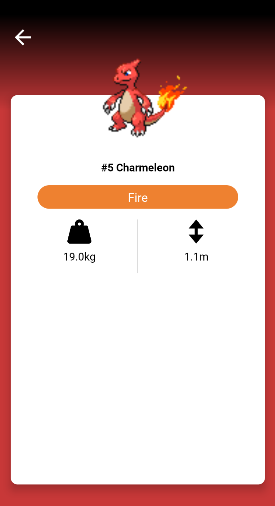

# Pokémon Detail Screen (2)

이번에는 포켓몬의 이름, 몸무게, 높이와 같은 정보를 보여줄 것이다. 포켓몬 타입 및 속성을 나타내기 위해 `util/` 디렉토리 하위에 다음의 파일을 작성한다.

```kotlin
fun parseTypeToColor(type: Type): Color {
    return when(type.type.name.toLowerCase(Locale.ROOT)) {
        "normal" -> TypeNormal
        "fire" -> TypeFire
        "water" -> TypeWater
        "electric" -> TypeElectric
        "grass" -> TypeGrass
        "ice" -> TypeIce
        "fighting" -> TypeFighting
        "poison" -> TypePoison
        "ground" -> TypeGround
        "flying" -> TypeFlying
        "psychic" -> TypePsychic
        "bug" -> TypeBug
        "rock" -> TypeRock
        "ghost" -> TypeGhost
        "dragon" -> TypeDragon
        "dark" -> TypeDark
        "steel" -> TypeSteel
        "fairy" -> TypeFairy
        else -> Color.Black
    }
}

fun parseStatToColor(stat: Stat): Color {
    return when(stat.stat.name.toLowerCase()) {
        "hp" -> HPColor
        "attack" -> AtkColor
        "defense" -> DefColor
        "special-attack" -> SpAtkColor
        "special-defense" -> SpDefColor
        "speed" -> SpdColor
        else -> Color.White
    }
}

fun parseStatToAbbr(stat: Stat): String {
    return when(stat.stat.name.toLowerCase()) {
        "hp" -> "HP"
        "attack" -> "Atk"
        "defense" -> "Def"
        "special-attack" -> "SpAtk"
        "special-defense" -> "SpDef"
        "speed" -> "Spd"
        else -> ""
    }
}
```

포켓몬의 타입과 속성을 나타내기 위해 `PokemonDetailSection()`을 작성한다.

```kotlin
@Composable
fun PokemonDetailSection(
    pokemonInfo: Pokemon,
    modifier: Modifier = Modifier
) {
    val scrollState = rememberScrollState()
    Column(
        horizontalAlignment = Alignment.CenterHorizontally,
        modifier = modifier
            .fillMaxSize()
            .offset(y = 100.dp)
            .verticalScroll(scrollState)
    ) {
        Text(
            text = "#${pokemonInfo.id} ${pokemonInfo.name.capitalize(Locale.ROOT)}",
            fontWeight = FontWeight.Bold,
						fontSize = 30.sp,
            textAlign = TextAlign.Center,
            color = MaterialTheme.colors.onSurface
        )
        PokemonTypeSection(types = pokemonInfo.types)
        PokemonDetailDataSection(
            pokemonWeight = pokemonInfo.weight,
            pokemonHeight = pokemonInfo.height
        )

    }
}
```

`PokemonTypeSection()`은 타입 별로 색상을 다르게 나타내주도록 구현한다.

```kotlin
@Composable
fun PokemonTypeSection(types: List<Type>) {
    Row(
        verticalAlignment = Alignment.CenterVertically,
        modifier = Modifier
            .padding(16.dp)
    ) {
        for (type in types) {
            Box(
                contentAlignment = Alignment.Center,
                modifier = Modifier
                    .weight(1f)
                    .padding(horizontal = 8.dp)
                    .clip(CircleShape)
                    .background(parseTypeToColor(type))
                    .height(35.dp)
            ) {
                Text(
                    text = type.type.name.capitalize(Locale.ROOT),
                    color = Color.White,
                    fontSize = 18.sp
                )
            }
        }
    }
}
```

`PokemonDetailDataSection()`은 포켓몬의 무게, 높이를 나타낼 수 있도록 구현한다.

```kotlin
@Composable
fun PokemonDetailDataSection(
    pokemonWeight: Int,
    pokemonHeight: Int,
    sectionHeight: Dp = 80.dp
) {
    val pokemonWeightInKg = remember {
        round(pokemonWeight * 100f) / 1000f
    }
    val pokemonHeightInKg = remember {
        round(pokemonHeight * 100f) / 1000f
    }
    Row(
        modifier = Modifier
            .fillMaxWidth()
    ) {
        PokemonDetailDataItem(
            dataValue = pokemonWeightInKg,
            dataUnit = "kg",
            dataIcon = painterResource(id = R.drawable.ic_weight),
            modifier = Modifier
                .weight(1f)
        )
        Spacer(modifier = Modifier
            .size(1.dp, sectionHeight)
            .background(Color.LightGray)
        )
        PokemonDetailDataItem(
            dataValue = pokemonHeightInKg,
            dataUnit = "m",
            dataIcon = painterResource(id = R.drawable.ic_height),
            modifier = Modifier
                .weight(1f)
        )
    }
}
```

`PokemonDetailDataItem()`은 무게와 높이를 표현할 수 있도록 해준다.

```kotlin
@Composable
fun PokemonDetailDataItem(
    dataValue: Float,
    dataUnit: String,
    dataIcon: Painter,
    modifier:Modifier
) {
    Column(
        horizontalAlignment = Alignment.CenterHorizontally,
        verticalArrangement = Arrangement.Center,
        modifier = modifier
    ) {
        Icon(painter = dataIcon, contentDescription = null, tint = MaterialTheme.colors.onSurface)
        Spacer(modifier = Modifier.height(8.dp))
        Text(
            text = "${dataValue}${dataUnit}",
            color = MaterialTheme.colors.onSurface
        )
    }
}
```

<div align="center">

</div>

## References

* [Pokémon Detail Screen (2) - MVVM Pokédex App With Jetpack Compose - Part 8](https://www.youtube.com/watch?v=18N-5MJlPKY&list=PLQkwcJG4YTCTimTCpEL5FZgaWdIZQuB7m&index=8)