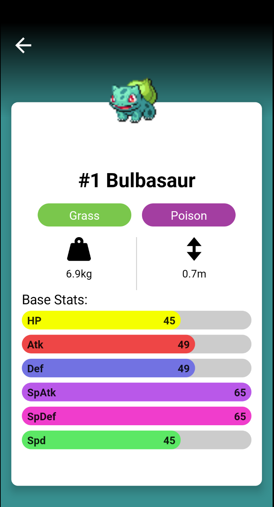

# Pokémon Detail Screen (3)

마지막으로 포켓몬의 스탯을 애니메이션으로 구현할 것이다. 스탯을 표시하기 위해 `PokemonStat()`을 생성한다.

```kotlin
@Composable
fun PokemonStat(
    statName: String,
    statValue: Int,
    statMaxValue: Int,
    statColor: Color,
    height: Dp = 28.dp,
    animDuration: Int = 1000,
    animDelay: Int = 0
) {
    var animationPlayed by remember {
        mutableStateOf(false)
    }
    val curPercent = animateFloatAsState(
        targetValue = if (animationPlayed) {
            statValue / statMaxValue.toFloat()
        } else 0f,
        animationSpec = tween(
            animDuration,
            animDelay
        )
    )
    LaunchedEffect(key1 = true) {
        animationPlayed = true
    }
    Box(
        modifier = Modifier
            .fillMaxWidth()
            .height(height)
            .clip(CircleShape)
            .background(
                if (isSystemInDarkTheme()) {
                    Color(0xff505050)
                } else {
                    Color.LightGray
                }
            )
    ) {
        Row(
            horizontalArrangement = Arrangement.SpaceBetween,
            verticalAlignment = Alignment.CenterVertically,
            modifier = Modifier
                .fillMaxHeight()
                .fillMaxWidth(curPercent.value)
                .clip(CircleShape)
                .background(statColor)
                .padding(horizontal = 8.dp)
        ) {
            Text(
                text = statName,
                fontWeight = FontWeight.Bold,
            )
            Text(
                text = (curPercent.value * statMaxValue).toInt().toString(),
                fontWeight = FontWeight.Bold,
            )
        }
    }
}
```

`PokemonBaseStats()`을 생성하여 애니메이션을 적용시킨다.

```kotlin
@Composable
fun PokemonBaseStats(
    pokemonInfo: Pokemon,
    animDelayPerItem: Int = 100
) {
    val maxBaseStat = remember {
        pokemonInfo.stats.maxOf { it.baseStat }
    }
    Column(
        modifier = Modifier
            .fillMaxWidth()
    ) {
        Text(
            text = "Base Stats:",
            fontSize = 20.sp,
            color = MaterialTheme.colors.onSurface
        )
        Spacer(modifier = Modifier.height(4.dp))

        for (i in pokemonInfo.stats.indices) {
            val stat = pokemonInfo.stats[i]
            PokemonStat(
                statName = parseStatToAbbr(stat),
                statValue = stat.baseStat,
                statMaxValue = maxBaseStat,
                statColor = parseStatToColor(stat),
                // i를 곱해 인덱스가 넘어갈 때마다 100 씩 증가시킴
                animDelay = i * animDelayPerItem
            )
            Spacer(modifier = Modifier.height(8.dp))
        }
    }
}
```

<div align="center">

</div>

## References

* [Pokémon Detail Screen (3) - MVVM Pokédex App With Jetpack Compose - Part 9](https://www.youtube.com/watch?v=UR-lrDimmPI&list=PLQkwcJG4YTCTimTCpEL5FZgaWdIZQuB7m&index=9)