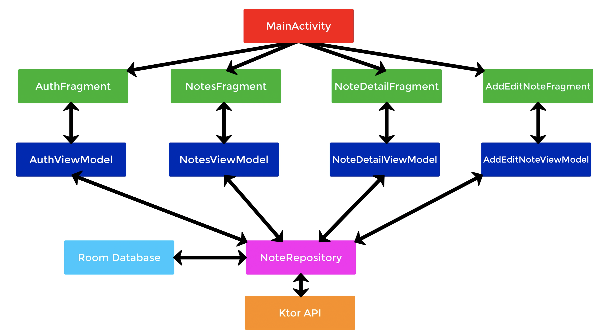

# Project architecture

Ktor 서버와 통신하는 앱을 만들 것이다. [여기서](https://github.com/philipplackner/KtorNoteApp/tree/InitialNoteAppSetup) 기본적인 레이아웃 파일,
drawable 등이 미리 정의되어 있으므로 클론 후 앱을 만들자. 다음은 앱 디펜던시에 대한 내용이다.

```groovy
dependencies {
    // ...
    // Material Design
    implementation 'com.google.android.material:material:1.3.0-alpha02'

    // MotionLayout (Login screen swipe)
    implementation 'androidx.constraintlayout:constraintlayout:2.0.0-rc1'

    // Architectural Components
    implementation "androidx.lifecycle:lifecycle-viewmodel-ktx:2.2.0"

    // Lifecycle
    implementation "androidx.lifecycle:lifecycle-extensions:2.2.0"
    implementation "androidx.lifecycle:lifecycle-livedata-ktx:2.2.0"
    implementation "androidx.lifecycle:lifecycle-runtime:2.2.0"
    implementation "androidx.lifecycle:lifecycle-runtime-ktx:2.2.0"

    // Shared Preference data encrypt
    implementation "androidx.security:security-crypto:1.1.0-alpha02"

    // Room
    implementation "androidx.room:room-runtime:2.2.5"
    kapt "androidx.room:room-compiler:2.2.5"

    // Kotlin Extensions and Coroutines support for Room
    implementation "androidx.room:room-ktx:2.2.5"

    // Retrofit
    implementation 'com.squareup.retrofit2:retrofit:2.9.0'
    implementation 'com.squareup.retrofit2:converter-gson:2.9.0'
    implementation "com.squareup.okhttp3:logging-interceptor:4.7.2"

    // Coroutines
    implementation 'org.jetbrains.kotlinx:kotlinx-coroutines-core:1.3.7'
    implementation 'org.jetbrains.kotlinx:kotlinx-coroutines-android:1.3.5'

    // Coroutine Lifecycle Scopes
    implementation "androidx.lifecycle:lifecycle-viewmodel-ktx:2.2.0"
    implementation "androidx.lifecycle:lifecycle-runtime-ktx:2.2.0"

    // Navigation Components
    implementation "androidx.navigation:navigation-fragment-ktx:2.3.0"
    implementation "androidx.navigation:navigation-ui-ktx:2.3.0"

    // Activity KTX for viewModels()
    implementation "androidx.activity:activity-ktx:1.1.0"

    //Dagger - Hilt
    implementation "com.google.dagger:hilt-android:2.28-alpha"
    kapt "com.google.dagger:hilt-android-compiler:2.28-alpha"

    implementation "androidx.hilt:hilt-lifecycle-viewmodel:1.0.0-alpha02"
    kapt "androidx.hilt:hilt-compiler:1.0.0-alpha02"

    // Timber (logging)
    implementation 'com.jakewharton.timber:timber:4.7.1'

    // Markwon (markdown support)
    implementation "io.noties.markwon:core:4.4.0"

    // Color Picker Dialog
    implementation "com.github.skydoves:colorpickerview:2.1.7"
}
```

다음은 구현할 앱의 아키텍처 구조이다.

<div align="center">

</div>