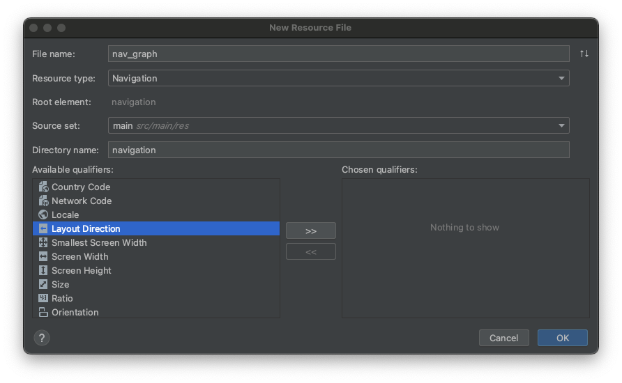
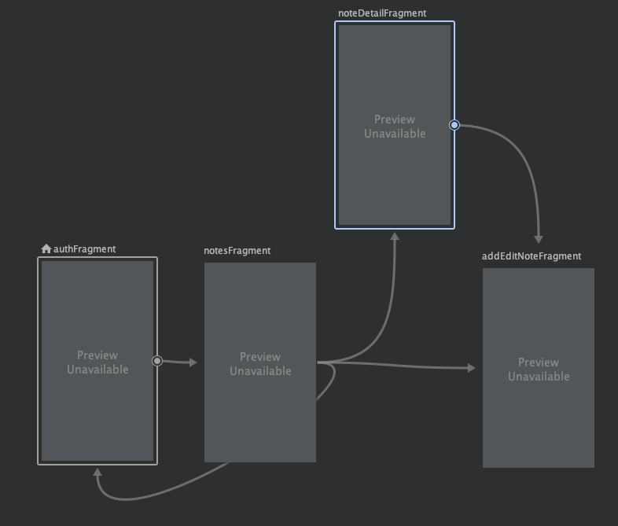
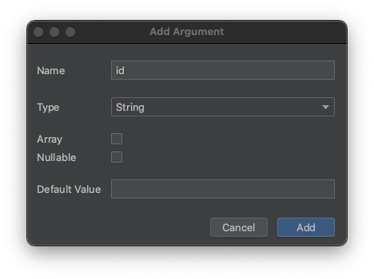

# Navigation & architectural skeleton

이번엔 네비게이션 컴포넌트와 아키텍처의 스켈레톤 구조를 정의할 것이다.

## Structure the architecture skeleton

`ui` 패키지를 생성한 후 하위에 `addeditnote`, `auth`, `notedetail`, `notes` 패키지를 각각 생성해준다. 그리고 `MainActivity`를 `ui` 패키지로 이동시킨다.

`ui` 패키지 하위에 `BaseFragment`를 생성 후 작성한다. `BaseFragment`를 생성함으로써 많은 보일러 플레이트 코드를 줄일 수 있다.

```kotlin
abstract class BaseFragment(layoutId: Int) : Fragment(layoutId) {

    fun showSnackbar(text: String) {
        Snackbar.make(
            requireActivity().rootLayout,   // 다른 프레그먼트로 이동했을 때 보여지지 않는 것을 막기 위해 rootLayout 설정
            text,
            Snackbar.LENGTH_LONG
        ).show()
    }
}
```

`ui/addeditnote` 패키지에 `AddEditNoteFragment`를 생성한다. `auth`, `notedetail`, `notes` 패키지에도 일치하는 `Fragment`들을 생성해준다.

```kotlin
class AddEditNoteFragment : BaseFragment(R.layout.fragment_add_edit_note) {
}
```

```kotlin
class AuthFragment : BaseFragment(R.layout.fragment_auth) {
}
```

```kotlin
class NoteDetailFragment : BaseFragment(R.layout.fragment_note_detail) {
}
```

```kotlin
class NotesFragment : BaseFragment(R.layout.fragment_notes) {
}
```

그리고 이에 대응하는 `ViewModel`들을 생성해준다.

```kotlin
class AddEditNoteViewModel : ViewModel() {
}
```

```kotlin
class AuthViewModel : ViewModel() {
}
```

```kotlin
class NoteDetailViewModel : ViewModel() {
}
```

```kotlin
class NotesViewModel : ViewModel() {
}
```

## Create repository

`repositories` 패키지를 생성해준다. 이 코스는 하나의 repository만 사용하지만 추후에 추가될 것을 대비해 `repositories`라 이름지었다. 그리고 하위에 `NoteRepository`
클래스를 생성해준다.

```kotlin
class NoteRepository {
}
```

## Setup navigation component

네비게이션 컴포넌트를 사용하기 위해 `activity_main.xml`에 다음과 같이 추가적인 설정을 수행한다.

```xml
<?xml version="1.0" encoding="utf-8"?>
<androidx.constraintlayout.widget.ConstraintLayout xmlns:android="http://schemas.android.com/apk/res/android"
                                                   xmlns:app="http://schemas.android.com/apk/res-auto"
                                                   xmlns:tools="http://schemas.android.com/tools"
                                                   android:id="@+id/rootLayout"
                                                   android:layout_width="match_parent"
                                                   android:layout_height="match_parent"
                                                   tools:context=".ui.MainActivity">

    <FrameLayout
            android:id="@+id/flContainer"
            android:layout_width="match_parent"
            android:layout_height="0dp"
            app:layout_constraintBottom_toBottomOf="parent"
            app:layout_constraintEnd_toEndOf="parent"
            app:layout_constraintHorizontal_bias="0.5"
            app:layout_constraintStart_toStartOf="parent"
            app:layout_constraintTop_toTopOf="parent">

        <fragment
                android:id="@+id/navHostFragment"
                android:name="androidx.navigation.fragment.NavHostFragment"
                android:layout_width="match_parent"
                android:layout_height="match_parent"
                app:defaultNavHost="true"
                app:navGraph="@navigation/nav_graph"/>

    </FrameLayout>

</androidx.constraintlayout.widget.ConstraintLayout>
```

`res` 하위에 `navGraph`를 추가한다.

<div align="center">

</div>

그 후 위에 생성한 4개의 프레그먼트들을 추가해준 후 다음과 같이 네비게이션 설정을 해준다.

<div align="center">

</div>

그리고 `noteDetailFragment`, `addEditNoteFramgnet`에 필요한 navArgs를 다음과 같이 둘 다 동일한 인자를 설정해준다.

<div align="center">

</div>

이렇게 설정한 후 빌드를 수행해주면 navigate 시 빌드된 `Directions`를 사용할 수 있다.

네비게이션이 정상적으로 동작하는지 확인하기 위해 각 프레그먼트의 버튼을 눌렀을 경우 원하는 프레그먼트로 이동하는 코드를 작성하자.

```kotlin
class AuthFragment : BaseFragment(R.layout.fragment_auth) {
    override fun onViewCreated(view: View, savedInstanceState: Bundle?) {
        super.onViewCreated(view, savedInstanceState)
        btnLogin.setOnClickListener {
            findNavController().navigate(AuthFragmentDirections.actionAuthFragmentToNotesFragment())
        }
    }
}
```

```kotlin
class NotesFragment : BaseFragment(R.layout.fragment_notes) {

    override fun onViewCreated(view: View, savedInstanceState: Bundle?) {
        super.onViewCreated(view, savedInstanceState)
        fabAddNote.setOnClickListener {
            findNavController().navigate(NotesFragmentDirections.actionNotesFragmentToAddEditNoteFragment(""))
        }
    }
}
```

이제 네비게이션 테스트를 위해 실행하면 크래시가 발생한다. 한 가지 디펜던시를 추가하지 않아서인데, 다음 Swipe Refresh layout에 대한 디펜던시를 추가해주고 실행하면 크래시 없이 잘 실행되는 것을
확인할 수 있다.

```groovy
dependencies {
    // Swipe Refresh Layout
    implementation 'androidx.swiperefreshlayout:swiperefreshlayout:1.1.0'
}
```

<div align="center">

</div>