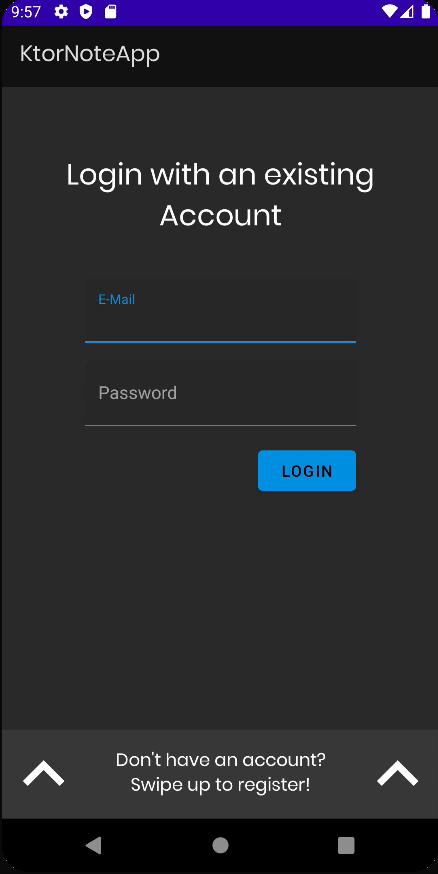
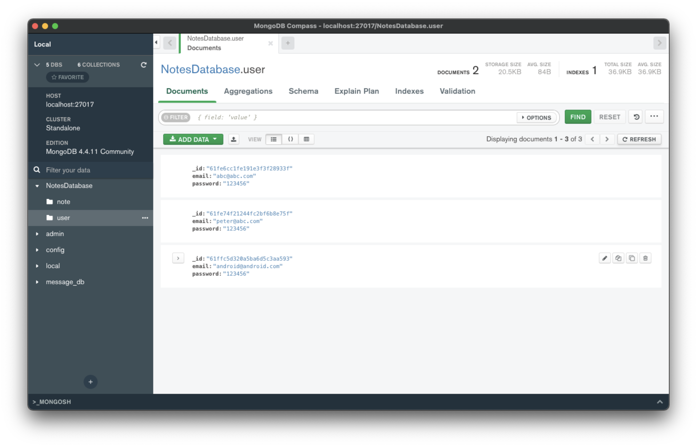

# Registering users

이번엔 Ktor 서버에 유저를 등록하는 기능을 구현해보자.

`repositories` 패키지에 있는 `NoteRepository`를 다음과 같이 작성한다.

```kotlin
class NoteRepository @Inject constructor(
    private val noteDao: NoteDao,
    private val noteApi: NoteApi,
    private val context: Application // for check internet connection
) {

    suspend fun register(email: String, password: String) = withContext(Dispatchers.IO) {
        try {
            val response = noteApi.register(AccountRequest(email, password))
            if (response.isSuccessful) {
                Resource.success(response.body()?.message)
            } else {
                Resource.error(response.message(), null)
            }
        } catch (e: Exception) {
            Resource.error("Couldn't connect to the servers. Check your internet connection", null)
        }
    }
} 
```

작성된 `NoteRepository`를 통해 `AuthViewModel`을 다음과 같이 작성한다.

```kotlin
class AuthViewModel @ViewModelInject constructor(
    private val repository: NoteRepository
) : ViewModel() {

    private val _registerStatus = MutableLiveData<Resource<String>>()
    val registerStatus: LiveData<Resource<String>> = _registerStatus

    fun register(email: String, password: String, repeatedPassword: String) {
        _registerStatus.postValue(Resource.loading(null))
        if (email.isEmpty() || password.isEmpty() || repeatedPassword.isEmpty()) {
            _registerStatus.postValue(Resource.error("Please fill out all the fields", null))
            return
        }
        if (password != repeatedPassword) {
            _registerStatus.postValue(Resource.error("The passwords do not match", null))
            return
        }
        viewModelScope.launch {
            val result = repository.register(email, password)
            _registerStatus.postValue(result)
        }
    }
}
```

`AuthViewModel`에 대응하는 `AuthFragment`를 다음과 같이 작성해준다.

```kotlin
@AndroidEntryPoint
class AuthFragment : BaseFragment(R.layout.fragment_auth) {

    private val viewModel: AuthViewModel by viewModels()

    override fun onViewCreated(view: View, savedInstanceState: Bundle?) {
        super.onViewCreated(view, savedInstanceState)

        // 화면을 고정하기 위함
        requireActivity().requestedOrientation = SCREEN_ORIENTATION_PORTRAIT
        subscribeToObservers()

        btnRegister.setOnClickListener {
            val email = etRegisterEmail.text.toString()
            val password = etRegisterPassword.text.toString()
            val confirmedPassword = etRegisterPasswordConfirm.text.toString()
            viewModel.register(email, password, confirmedPassword)
        }
    }

    private fun subscribeToObservers() {
        viewModel.registerStatus.observe(viewLifecycleOwner, Observer { result ->
            result?.let {
                when (result.status) {
                    Status.SUCCESS -> {
                        registerProgressBar.visibility = View.GONE
                        showSnackbar(result.data ?: "Successfully registered an account")
                    }
                    Status.ERROR -> {
                        registerProgressBar.visibility = View.GONE
                        showSnackbar(result.message ?: "An unknown error occured")
                    }
                    Status.LOADING -> {
                        registerProgressBar.visibility = View.VISIBLE
                    }
                }
            }
        })
    }
}
```

통신을 위해 HTTP를 사용하므로, `AndroidManifest.xml`에 `android:usesCleartextTraffic`을 true로 설정해준다.

```xml
<manifest xmlns:android="http://schemas.android.com/apk/res/android"
          package="com.androiddevs.ktornoteapp">

    <!-- ... -->

    <application
            android:usesCleartextTraffic="true">
    </application>

</manifest>
```

이제 앱에서 유저가 앱에서 정상적으로 등록되는지 테스트해보자.

<div align="center">

</div>

<div align="center">

</div>