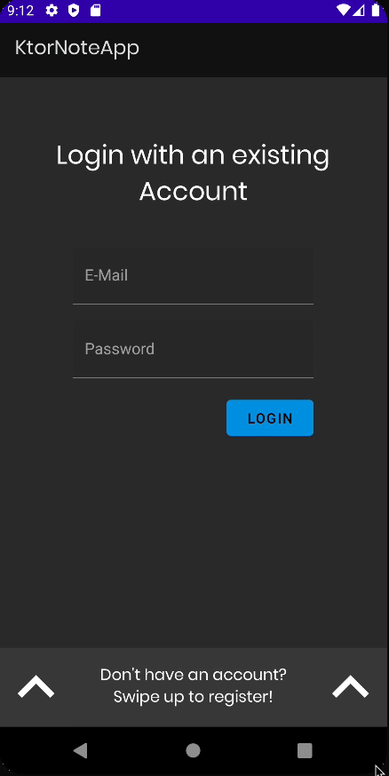

# Logging in users

이제 등록된 유저를 로그인 가능하도록 구현해보자.

`repositories` 패키지의 `NoteRepository`에 `login` 함수를 추가해주고, `register` 함수도 `login` 함수와 유사하게 검증하도록 변경해준다.

```kotlin
class NoteRepository @Inject constructor(
    private val noteDao: NoteDao,
    private val noteApi: NoteApi,
    private val context: Application // for check internet connection
) {

    suspend fun login(email: String, password: String) = withContext(Dispatchers.IO) {
        try {
            val response = noteApi.login(AccountRequest(email, password))
            if (response.isSuccessful && response.body()!!.successful) {
                Resource.success(response.body()?.message)
            } else {
                Resource.error(response.body()?.message ?: response.message(), null)
            }
        } catch (e: Exception) {
            Resource.error("Couldn't connect to the servers. Check your internet connection", null)
        }
    }

    suspend fun register(email: String, password: String) = withContext(Dispatchers.IO) {
        try {
            val response = noteApi.register(AccountRequest(email, password))
            if (response.isSuccessful && response.body()!!.successful) {
                Resource.success(response.body()?.message)
            } else {
                Resource.error(response.body()?.message ?: response.message(), null)
            }
        } catch (e: Exception) {
            Resource.error("Couldn't connect to the servers. Check your internet connection", null)
        }
    }
}
```

`AuthViewModel`에 login 로직을 추가해준다. register 로직과 비슷하므로 복사한 후 구현해주도록 하자.

```kotlin
class AuthViewModel @ViewModelInject constructor(
    private val repository: NoteRepository
) : ViewModel() {

    // ...

    private val _loginStatus = MutableLiveData<Resource<String>>()
    val loginStatus: LiveData<Resource<String>> = _loginStatus

    // ...

    fun login(email: String, password: String) {
        _loginStatus.postValue(Resource.loading(null))
        if (email.isEmpty() || password.isEmpty()) {
            _loginStatus.postValue(Resource.error("Please fill out all the fields", null))
            return
        }
        viewModelScope.launch {
            val result = repository.login(email, password)
            _loginStatus.postValue(result)
        }
    }
}
```

`other` 패캐지의 `Constants`에 다음 2개의 변수를 생성한다.

```kotlin
object Constants {

    // ...

    const val KEY_LOGGED_IN_EMAIL = "KEY_LOGGED_IN_EMAIL"
    const val KEY_PASSWORD = "KEY_PASSWORD"

    // ...
}
```

그리고 `AuthFragment`를 다음과 같이 작성한다.

```kotlin
@AndroidEntryPoint
class AuthFragment : BaseFragment(R.layout.fragment_auth) {

    // ...

    @Inject
    lateinit var sharedPref: SharedPreferences

    @Inject
    lateinit var basicAuthInterceptor: BasicAuthInterceptor

    private var curEmail: String? = null
    private var curPassword: String? = null

    override fun onViewCreated(view: View, savedInstanceState: Bundle?) {
        super.onViewCreated(view, savedInstanceState)

        // ...
        btnLogin.setOnClickListener {
            val email = etLoginEmail.text.toString()
            val password = etLoginPassword.text.toString()
            curEmail = email
            curPassword = password
            viewModel.login(email, password)
        }
    }

    private fun authenticateApi(email: String, passsword: String) {
        basicAuthInterceptor.email = email
        basicAuthInterceptor.password = passsword
    }

    private fun redirectLogin() {
        val navOptions = NavOptions.Builder()
            // popup all backstacks until reach authFragment 
            .setPopUpTo(R.id.authFragment, true)
            .build()
        findNavController().navigate(
            AuthFragmentDirections.actionAuthFragmentToNotesFragment(),
            navOptions
        )
    }

    private fun subscribeToObservers() {
        // ...

        viewModel.loginStatus.observe(viewLifecycleOwner, Observer { result ->
            result?.let {
                when (result.status) {
                    Status.SUCCESS -> {
                        loginProgressBar.visibility = View.GONE
                        showSnackbar(result.data ?: "Successfully logged in")
                        // 네트워크가 끊겼을 때 SharedPreferences를 보고 로그인 되었는지 확인하기 위함
                        sharedPref.edit().putString(KEY_LOGGED_IN_EMAIL, curEmail).apply()
                        sharedPref.edit().putString(KEY_PASSWORD, curPassword).apply()
                        // 이메일, 패스워드 설정
                        authenticateApi(curEmail ?: "", curPassword ?: "")
                        redirectLogin()
                    }
                    Status.ERROR -> {
                        loginProgressBar.visibility = View.GONE
                        showSnackbar(result.message ?: "An unknown error occured")
                    }
                    Status.LOADING -> {
                        loginProgressBar.visibility = View.VISIBLE
                    }
                }
            }
        })
    }
}
```

<div align="center">

</div>