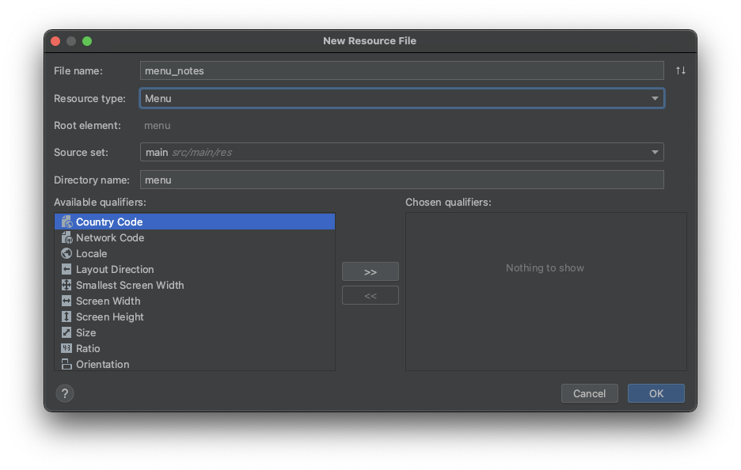
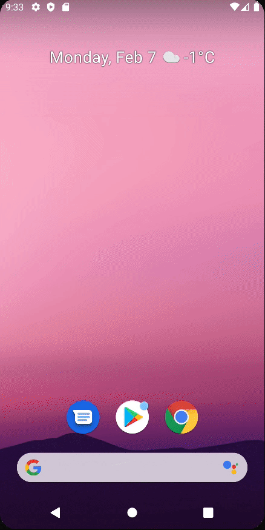

# Staying logged in & logging out

## Implementation logout

Note 화면의 메뉴에 로그아웃을 노출하고 해당 메뉴를 클릭하면 로그아웃 되도록 구현해보자. 이를 위해 메뉴 리소스 파일이 필요하다. 다음과 같이 메뉴 리소스 디렉토리 및 리소스를 만들어준다.

<div align="center">

</div>

만들어진 메뉴 리소스 파일에 로그아웃 아이템을 추가한다.

```xml
<?xml version="1.0" encoding="utf-8"?>
<menu xmlns:android="http://schemas.android.com/apk/res/android"
      xmlns:app="http://schemas.android.com/apk/res-auto">

    <item
            android:id="@+id/miLogout"
            android:title="Logout"
            app:showAsAction="never"/>
</menu>
```

로그아웃 시 `SharedPreferences`의 유저 정보를 삭제해주기 위해 `Constants`에 다음과 같이 추가한다.

```kotlin
object Constants {

    // ...

    const val NO_EMAIL = "NO_EMAIL"
    const val NO_PASSWORD = "NO_PASSWORD"

    // ...
}
```

그리고 `NotesFragment`에서 다음과 같이 로그아웃을 구현해준다.

```kotlin
@AndroidEntryPoint
class NotesFragment : BaseFragment(R.layout.fragment_notes) {

    @Inject
    lateinit var sharedPref: SharedPreferences

    override fun onCreateView(
        inflater: LayoutInflater,
        container: ViewGroup?,
        savedInstanceState: Bundle?
    ): View? {
        setHasOptionsMenu(true)
        return super.onCreateView(inflater, container, savedInstanceState)
    }

    override fun onViewCreated(view: View, savedInstanceState: Bundle?) {
        super.onViewCreated(view, savedInstanceState)
        fabAddNote.setOnClickListener {
            findNavController().navigate(NotesFragmentDirections.actionNotesFragmentToAddEditNoteFragment(""))
        }
    }

    private fun logout() {
        sharedPref.edit().putString(KEY_LOGGED_IN_EMAIL, NO_EMAIL).apply()
        sharedPref.edit().putString(KEY_PASSWORD, NO_PASSWORD).apply()
        // AuthFragment를 제외한 모든 프레그먼트를 pop
        val navOptions = NavOptions.Builder()
            .setPopUpTo(R.id.notesFragment, true)
            .build()
        findNavController().navigate(
            NotesFragmentDirections.actionNotesFragmentToAuthFragment(),
            navOptions
        )
    }

    override fun onOptionsItemSelected(item: MenuItem): Boolean {
        when (item.itemId) {
            R.id.miLogout -> logout()
        }
        return super.onOptionsItemSelected(item)
    }

    override fun onCreateOptionsMenu(menu: Menu, inflater: MenuInflater) {
        super.onCreateOptionsMenu(menu, inflater)
        inflater.inflate(R.menu.menu_notes, menu)
    }
}
```

## Implementation stay logged in

만약 `SharedPreferences`에 유저 정보가 있다면 앱 실행 즉시 `NotesFragment`로 이동하도록 구현해야 한다. 이를 `AuthFragment`에서 구현한다.

```kotlin
@AndroidEntryPoint
class AuthFragment : BaseFragment(R.layout.fragment_auth) {

    // ...
    override fun onViewCreated(view: View, savedInstanceState: Bundle?) {
        super.onViewCreated(view, savedInstanceState)

        if (isLoggedIn()) {
            authenticateApi(curEmail ?: "", curPassword ?: "")
            redirectLogin()
        }
        // ...
    }

    private fun isLoggedIn(): Boolean {
        curEmail = sharedPref.getString(KEY_LOGGED_IN_EMAIL, NO_EMAIL) ?: NO_EMAIL
        curPassword = sharedPref.getString(KEY_PASSWORD, NO_EMAIL) ?: NO_PASSWORD
        return curEmail != NO_EMAIL && curPassword != NO_PASSWORD
    }
}
```

앱을 실행하여 구현된 로그아웃 기능과 로그인 중인 기능을 확인해보자. 비행기 모드를 켜고도 계속 로그인 되어 있는 것을 확인할 수 있다.

<div align="center">

</div>