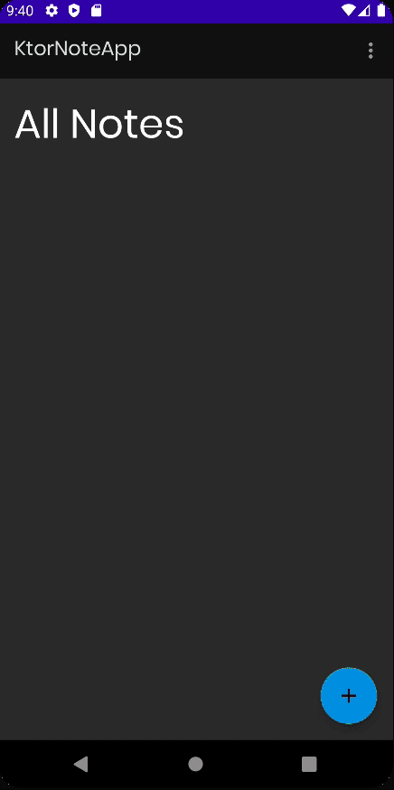

# Adding & updating notes

이번엔 Note를 추가하고 업데이트 할 수 있는 기능을 만들어보자.

### NoteRepository

API에서 받아온 데이터는 Sync로 설정해주는 `insertNote()` 함수 구현 및 추가 함수 구현해준다.

```kotlin
class NoteRepository @Inject constructor(
    private val noteDao: NoteDao,
    private val noteApi: NoteApi,
    private val context: Application // for check internet connection
) {

    suspend fun insertNote(note: Note) {
        val response = try {
            noteApi.addNote(note)
        } catch (e: Exception) {
            null
        }
        if (response != null && response.isSuccessful) {
            noteDao.insertNote(note.apply { isSynced = true })
        } else {    // not synced
            noteDao.insertNote(note)
        }
    }

    suspend fun insertNotes(notes: List<Note>) {
        notes.forEach { insertNote(it) }
    }

    suspend fun getNoteById(noteID: String) = noteDao.getNoteById(noteID)

    fun getAllNotes(): Flow<Resource<List<Note>>> {
        return networkBoundResource(
            query = {
                noteDao.getAllNotes()
            },
            fetch = {
                noteApi.getNotes()
            },
            saveFetchResult = { response ->
                response.body()?.let {
                    insertNotes(it)
                }
            },
            shouldFetch = {
                // 1. timestamp
                // 2. always fetch it
                checkForInternetConnection(context)
            }
        )
    }
    // ...
}
```

### AddEditNoteViewModel

```kotlin
class AddEditNoteViewModel @ViewModelInject constructor(
    private val repository: NoteRepository
) : ViewModel() {

    private val _note = MutableLiveData<Event<Resource<Note>>>()
    val note: LiveData<Event<Resource<Note>>> = _note

    // viewModelScope는 ViewModel의 생명주기에 관여되어 있기 때문에 AddEditNoteViewModel이 파괴될 때 API 요청 중이라면 취소될 것이다.
    // GlobalScope는 애플리케이션 생명주기에 관여되므로 AddEditNoteViewModel이 파괴되더라도 API가 수행된다.
    fun insertNote(note: Note) = GlobalScope.launch {
        repository.insertNote(note)
    }

    fun getNoteById(noteID: String) = viewModelScope.launch {
        _note.postValue(Event(Resource.loading(null)))
        val note = repository.getNoteById(noteID)
        note?.let {
            _note.postValue(Event(Resource.success(it)))
        } ?: _note.postValue(Event(Resource.error("Note not found", null)))
    }
}
```

### Constants

```kotlin
const val FRAGMENT_TAG = "AddEditNoteFragment"

object Constants {

    // ...
    const val DEFAULT_NOTE_COLOR = "FFA500"
    // ...
}
```

### AddEditNoteFragment

```kotlin
@AndroidEntryPoint
class AddEditNoteFragment : BaseFragment(R.layout.fragment_add_edit_note) {
    private val viewModel: AddEditNoteViewModel by viewModels()

    private val args: AddEditNoteFragmentArgs by navArgs()

    private var curNote: Note? = null
    private var curNoteColor = DEFAULT_NOTE_COLOR

    @Inject
    lateinit var sharedPref: SharedPreferences

    override fun onViewCreated(view: View, savedInstanceState: Bundle?) {
        super.onViewCreated(view, savedInstanceState)
        if (args.id.isNotEmpty()) {
            viewModel.getNoteById(args.id)
            subscribeToObservers()
        }
    }

    override fun onPause() {
        super.onPause()
        saveNote()
    }

    private fun subscribeToObservers() {
        // TO-DO
    }

    private fun saveNote() {
        val authEmail = sharedPref.getString(KEY_LOGGED_IN_EMAIL, NO_EMAIL) ?: NO_EMAIL

        val title = etNoteTitle.text.toString()
        val content = etNoteContent.text.toString()
        if (title.isEmpty() || content.isEmpty()) {
            return
        }
        val date = System.currentTimeMillis()
        val color = curNoteColor
        val id = curNote?.id ?: UUID.randomUUID().toString()
        val owners = curNote?.owners ?: listOf(authEmail)
        val note = Note(title, content, date, owners, color, id = id)
        viewModel.insertNote(note)
    }
}
```

### ColorPickerDialogFragment

`ui/dialogs` 패키지를 생성한 후 Note의 색상을 정하기 위한 `ColorPickerDialogFragment`를 생성 및 작성해준다.

```kotlin
// survive screen rotation
class ColorPickerDialogFragment : DialogFragment() {

    private var positiveListener: ((String) -> Unit)? = null

    fun setPositiveListener(listener: (String) -> Unit) {
        positiveListener = listener
    }

    override fun onCreateDialog(savedInstanceState: Bundle?): Dialog {
        return ColorPickerDialog.Builder(requireContext())
            .setTitle("Choose a color")
            .setPositiveButton("Ok", object : ColorEnvelopeListener {
                // when we changed a color in dialog then this function will be call
                override fun onColorSelected(envelope: ColorEnvelope?, fromUser: Boolean) {
                    positiveListener?.let { yes ->
                        envelope?.let {
                            yes(it.hexCode)
                        }
                    }
                }
            })
            .setNegativeButton("Cancel") { dialogInterface, _ ->
                dialogInterface.cancel()
            }
            .setBottomSpace(12)
            .attachAlphaSlideBar(true)
            .attachBrightnessSlideBar(true)
            .create()
    }
}
```

### AddEditNoteFragment

```kotlin
@AndroidEntryPoint
class AddEditNoteFragment : BaseFragment(R.layout.fragment_add_edit_note) {
    private val viewModel: AddEditNoteViewModel by viewModels()

    private val args: AddEditNoteFragmentArgs by navArgs()

    private var curNote: Note? = null
    private var curNoteColor = DEFAULT_NOTE_COLOR

    @Inject
    lateinit var sharedPref: SharedPreferences

    override fun onViewCreated(view: View, savedInstanceState: Bundle?) {
        super.onViewCreated(view, savedInstanceState)
        if (args.id.isNotEmpty()) {
            viewModel.getNoteById(args.id)
            subscribeToObservers()
        }

        if (savedInstanceState != null) {
            val colorPickerDialog = parentFragmentManager.findFragmentByTag(FRAGMENT_TAG)
                    as ColorPickerDialogFragment?
            colorPickerDialog?.setPositiveListener {
                changeViewNoteColor(it)
            }
        }

        viewNoteColor.setOnClickListener {
            ColorPickerDialogFragment().apply {
                setPositiveListener {
                    changeViewNoteColor(it)
                }
            }.show(parentFragmentManager, FRAGMENT_TAG)
        }
    }

    private fun changeViewNoteColor(colorString: String) {
        val drawable = ResourcesCompat.getDrawable(resources, R.drawable.circle_shape, null)
        drawable?.let {
            val wrappedDrawable = DrawableCompat.wrap(it)
            val color = Color.parseColor("#${colorString}")
            DrawableCompat.setTint(wrappedDrawable, color)
            viewNoteColor.background = wrappedDrawable
            curNoteColor = colorString
        }
    }

    private fun subscribeToObservers() {
        viewModel.note.observe(viewLifecycleOwner, Observer {
            it?.getContentIfNotHandled()?.let { result ->
                when (result.status) {
                    Status.SUCCESS -> {
                        val note = result.data!!
                        curNote = note
                        etNoteTitle.setText(note?.title)
                        etNoteContent.setText(note?.content)
                        changeViewNoteColor(note.color)
                    }
                    Status.ERROR -> {
                        showSnackbar(result.message ?: "Note not found")
                    }
                    Status.LOADING -> {
                        /* NO-OP */
                    }
                }
            }
        })
    }

    // ...
}
```

### NoteDetailFragment

```kotlin
class NoteDetailFragment : BaseFragment(R.layout.fragment_note_detail) {

    private val args: NoteDetailFragmentArgs by navArgs()

    override fun onViewCreated(view: View, savedInstanceState: Bundle?) {
        super.onViewCreated(view, savedInstanceState)
        fabEditNote.setOnClickListener {
            findNavController().navigate(
                NoteDetailFragmentDirections.actionNoteDetailFragmentToAddEditNoteFragment(args.id)
            )
        }
    }
}
```

<div align="center" class="row">


</div>