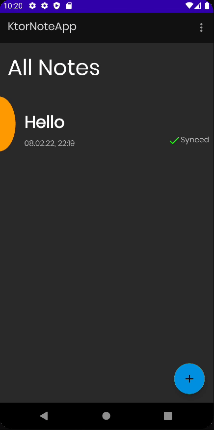

# Deleting notes

이번엔 Note를 삭제하는 기능을 구현해보자. 연결이 끊어진 경우 네트워크 API를 어떻게 수행할지에 대해 고민해야 한다. 만약 네트워크에 연결되어 있지 않을 때 Note를 삭제하고 다시 네트워크를 연결하면
서버에서는 삭제되지 않았기 때문에 Note를 다시 로딩한다. 우리가 원하는 것은 이것이 아니므로 로컬에서 삭제한 Note를 추적하여 네트워크에 연결된 경우 싱크를 맞춰주는 작업을 수행한다.

아이템을 Swipe하여 삭제하는 기능을 추가하자.

### LocallyDeletedNoteId

싱크를 맞춰주기 위해 `data/local/entities` 패키지에 `LocallyDeletedNoteId`를 추가 및 작성한다.

```kotlin
@Entity(tableName = "locally_deleted_note_ids")
data class LocallyDeletedNoteId(
    @PrimaryKey(autoGenerate = false)
    val deletedNoteID: String
)
```

### NoteDao

```kotlin
@Dao
interface NoteDao {

    // ...

    @Query("SELECT * FROM locally_deleted_note_ids")
    suspend fun getAllLocallyDeletedNoteIDs(): List<LocallyDeletedNoteId>

    @Query("DELETE FROM locally_deleted_note_ids WHERE deletedNoteID = :deletedNoteId")
    suspend fun deleteLocallyDeletedNoteID(deletedNoteId: String)

    @Insert(onConflict = OnConflictStrategy.REPLACE)
    suspend fun insertLocallyDeletedNoteID(locallyDeletedNoteID: LocallyDeletedNoteId)
}
```

### NoteRepository

```kotlin
class NoteRepository @Inject constructor(
    private val noteDao: NoteDao,
    private val noteApi: NoteApi,
    private val context: Application // for check internet connection
) {

    suspend fun deleteLocallyDeletedNoteID(deletedNoteId: String) {
        noteDao.deleteLocallyDeletedNoteID(deletedNoteId)
    }

    suspend fun deleteNote(noteID: String) {
        val response = try {
            noteApi.deleteNote(DeleteNoteRequest(noteID))
        } catch (e: Exception) {
            null
        }
        noteDao.deleteNoteById(noteID) // delete local note 
        if (response == null || !response.isSuccessful) {
            noteDao.insertLocallyDeletedNoteID(LocallyDeletedNoteId(noteID))
        } else {
            // delete locally deleted note id
            deleteLocallyDeletedNoteID(noteID)
        }
    }
    // ...
} 
```

### NotesViewModel

```kotlin
class NotesViewModel @ViewModelInject constructor(
    private val repository: NoteRepository
) : ViewModel() {

    // ...
    fun insertNote(note: Note) = viewModelScope.launch {
        repository.insertNote(note)
    }

    fun deleteNote(noteID: String) = viewModelScope.launch {
        repository.deleteNote(noteID)
    }

    fun deleteLocallyDeletedNoteID(deletedNoteId: String) = viewModelScope.launch {
        repository.deleteLocallyDeletedNoteID(deletedNoteId)
    }
}
```

### NotesFragment

```kotlin
@AndroidEntryPoint
class NotesFragment : BaseFragment(R.layout.fragment_notes) {

    // ...

    // swipe animation
    private val itemTouchHelperCallback = object : ItemTouchHelper.SimpleCallback(
        0, ItemTouchHelper.LEFT or ItemTouchHelper.RIGHT
    ) {
        override fun onMove(
            recyclerView: RecyclerView,
            viewHolder: RecyclerView.ViewHolder,
            target: RecyclerView.ViewHolder
        ): Boolean {
            // when item moved
            // don't need
            return true
        }

        override fun onSwiped(viewHolder: RecyclerView.ViewHolder, direction: Int) {
            val position = viewHolder.layoutPosition
            val note = noteAdapter.notes[position]
            viewModel.deleteNote(note.id)
            Snackbar.make(requireView(), "Note was successfully deleted", Snackbar.LENGTH_LONG).apply {
                setAction("Undo") {
                    viewModel.insertNote(note)
                    viewModel.deleteLocallyDeletedNoteID(note.id)
                }
                show()
            }
        }
    }

    private fun setupRecyclerView() = rvNotes.apply {
        noteAdapter = NoteAdapter()
        adapter = noteAdapter
        layoutManager = LinearLayoutManager(requireContext())
        ItemTouchHelper(itemTouchHelperCallback).attachToRecyclerView(this)
    }

    // ...
}
```

### NotesDatabase

```kotlin
@Database(
    entities = [Note::class, LocallyDeletedNoteId::class], // add
    version = 1
)
@TypeConverters(Converters::class)
abstract class NotesDatabase : RoomDatabase() {
    abstract fun noteDao(): NoteDao
}
```

Swipe 할 때 프로그레스바가 살짝 보이는 경우가 존재한다. 이 부분을 수정해보자.

<div align="center">

</div>

### NotesFragment

LiveData를 하나 추가하여 해결할 수 있다.

```kotlin
@AndroidEntryPoint
class NotesFragment : BaseFragment(R.layout.fragment_notes) {

    // ...
    private val swipingItem = MutableLiveData(false)

    // ...

    private fun subscribeToObservers() {
        // ...
        swipingItem.observe(viewLifecycleOwner, Observer {
            swipeRefreshLayout.isEnabled = !it
        })
    }

    // swipe animation
    private val itemTouchHelperCallback = object : ItemTouchHelper.SimpleCallback(
        0, ItemTouchHelper.LEFT or ItemTouchHelper.RIGHT
    ) {
        override fun onChildDraw(
            c: Canvas,
            recyclerView: RecyclerView,
            viewHolder: RecyclerView.ViewHolder,
            dX: Float,
            dY: Float,
            actionState: Int,
            isCurrentlyActive: Boolean
        ) {
            super.onChildDraw(c, recyclerView, viewHolder, dX, dY, actionState, isCurrentlyActive)
            if (actionState == ItemTouchHelper.ACTION_STATE_SWIPE) {
                swipingItem.postValue(isCurrentlyActive)
            }
        }
        // ...
    }
    // ...
}
```

<div align="center">

</div>