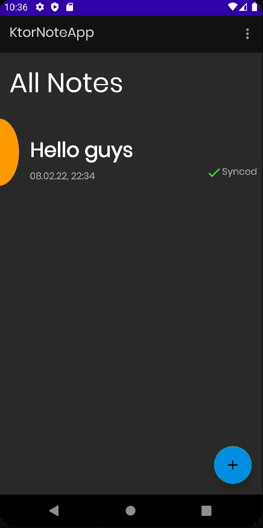

# Syncing notes

이번엔 Note를 서버와 싱크를 맞추는 작업을 구현해보자.

Swipe Down 하면 서버의 새로운 Note를 가져오거나, 로컬에서 생성 및 삭제된 Note를 서버에게 알려주어야 한다.

### NoteDao

```kotlin
@Dao
interface NoteDao {
    // ...
    @Query("DELETE FROM notes")
    suspend fun deleteAllNotes()
    // ...
}
```

### NoteRepository

```kotlin
class NoteRepository @Inject constructor(
    private val noteDao: NoteDao,
    private val noteApi: NoteApi,
    private val context: Application // for check internet connection
) {

    private var curNotesResponse: Response<List<Note>>? = null

    suspend fun syncNotes() {
        val locallyDeletedNoteIds = noteDao.getAllLocallyDeletedNoteIDs()
        locallyDeletedNoteIds.forEach { id -> deleteNote(id.deletedNoteID) }

        val unsyncedNotes = noteDao.getAllUnsyncedNotes()
        unsyncedNotes.forEach { note -> insertNote(note) }

        curNotesResponse = noteApi.getNotes()
        curNotesResponse?.body()?.let { notes ->
            noteDao.deleteAllNotes()
            insertNotes(notes.onEach { note -> note.isSynced = true })
        }
    }

    // ...

    fun getAllNotes(): Flow<Resource<List<Note>>> {
        return networkBoundResource(
            query = {
                noteDao.getAllNotes()
            },
            fetch = {
                syncNotes()
                curNotesResponse
            },
            saveFetchResult = { response ->
                response?.body()?.let {
                    insertNotes(it.onEach { note -> note.isSynced = true })
                }
            },
            shouldFetch = {
                // 1. timestamp
                // 2. always fetch it
                checkForInternetConnection(context)
            }
        )
    }
    // ...
}
```

### NotesFragment

```kotlin
@AndroidEntryPoint
class NotesFragment : BaseFragment(R.layout.fragment_notes) {

    // ...

    override fun onViewCreated(view: View, savedInstanceState: Bundle?) {
        super.onViewCreated(view, savedInstanceState)
        requireActivity().requestedOrientation = SCREEN_ORIENTATION_USER
        setupRecyclerView()
        setupSwipeRefreshLayout() // added
        subscribeToObservers()
        // ...
    }

    private fun setupSwipeRefreshLayout() {
        swipeRefreshLayout.setOnRefreshListener {
            viewModel.syncAllNotes()
        }
    }
    // ...
}
```

<div align="center">

</div>