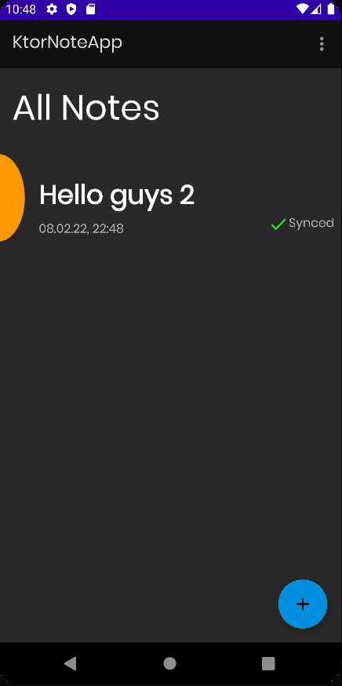

# Showing formatted notes

이번엔 Note를 markdown 포맷으로 파싱하여 NoteDetail에 보여주는 기능을 구현해보자.

### NoteRepository

```kotlin
fun observeNoteById(noteID: String) = noteDao.observeNoteById(noteID)
```

### NoteDetailViewModel

```kotlin
class NoteDetailViewModel @ViewModelInject constructor(
    private val repository: NoteRepository
) : ViewModel() {

    fun observeNoteById(noteID: String) = repository.observeNoteById(noteID)
}
```

### NoteDetailFragment

```kotlin
@AndroidEntryPoint
class NoteDetailFragment : BaseFragment(R.layout.fragment_note_detail) {

    private val viewModel: NoteDetailViewModel by viewModels()

    private val args: NoteDetailFragmentArgs by navArgs()

    private var curNote: Note? = null

    override fun onViewCreated(view: View, savedInstanceState: Bundle?) {
        super.onViewCreated(view, savedInstanceState)
        subscribeToObservers()
        fabEditNote.setOnClickListener {
            findNavController().navigate(
                NoteDetailFragmentDirections.actionNoteDetailFragmentToAddEditNoteFragment(args.id)
            )
        }
    }

    private fun setMarkdownText(text: String) {
        val markwon = Markwon.create(requireContext())
        val markdown = markwon.toMarkdown(text)
        markwon.setParsedMarkdown(tvNoteContent, markdown)
    }

    private fun subscribeToObservers() {
        viewModel.observeNoteById(args.id).observe(viewLifecycleOwner, Observer {
            it?.let { note ->
                tvNoteTitle.text = note.title
                setMarkdownText(note.content)
                curNote = note
            } ?: showSnackbar("Note not found")
        })
    }
}
```

<div align="center">

</div>