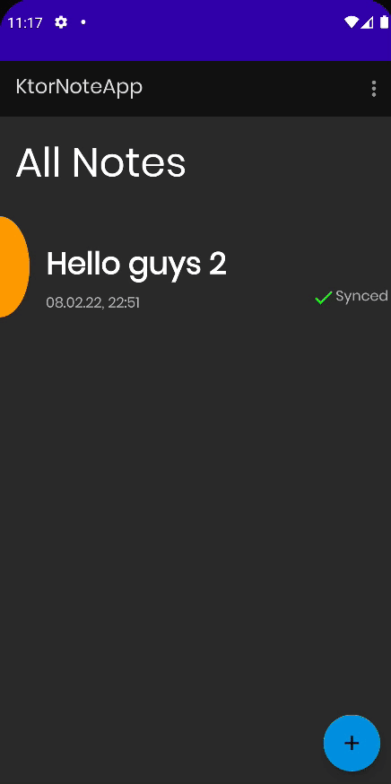

# Adding owners to notes

이번엔 Note에 owner를 추가하는 기능을 구현해보자.

### NoteRepository

```kotlin
class NoteRepository @Inject constructor(
    private val noteDao: NoteDao,
    private val noteApi: NoteApi,
    private val context: Application // for check internet connection
) {

    // ...
    suspend fun addOwnerToNote(owner: String, noteID: String) = withContext(Dispatchers.IO) {
        try {
            val response = noteApi.addOwnerToNote(AddOwnerRequest(owner, noteID))
            if (response.isSuccessful && response.body()!!.successful) {
                Resource.success(response.body()?.message)
            } else {
                Resource.error(response.body()?.message ?: response.message(), null)
            }
        } catch (e: Exception) {
            Resource.error("Couldn't connect to the servers. Check your internet connection", null)
        }
    }
}
```

### NoteDetailViewModel

```kotlin
class NoteDetailViewModel @ViewModelInject constructor(
    private val repository: NoteRepository
) : ViewModel() {

    private val _addOwnerStatus = MutableLiveData<Event<Resource<String>>>()
    val addOwnerStatus: LiveData<Event<Resource<String>>> = _addOwnerStatus

    fun addOwnerToNote(owner: String, noteID: String) {
        _addOwnerStatus.postValue(Event(Resource.loading(null)))
        if (owner.isEmpty() || noteID.isEmpty()) {
            _addOwnerStatus.postValue(Event(Resource.error("The owner or noteID can't be empty", null)))
            return
        }
        viewModelScope.launch {
            val result = repository.addOwnerToNote(owner, noteID)
            _addOwnerStatus.postValue(Event(result))
        }
    }

    fun observeNoteById(noteID: String) = repository.observeNoteById(noteID)
}
```

### AddOwnerDialog

`ui/dialogs` 패키지에 Owner 추가를 위한 Dialog를 구현해준다.

```kotlin
class AddOwnerDialog : DialogFragment() {

    private var positiveListener: ((String) -> Unit)? = null

    fun setPositiveListener(listener: (String) -> Unit) {
        positiveListener = listener
    }

    override fun onCreateDialog(savedInstanceState: Bundle?): Dialog {
        val addOwnerEditText = LayoutInflater.from(requireContext()).inflate(
            R.layout.edit_text_email,
            clNoteContainer,
            false
        ) as TextInputLayout
        return MaterialAlertDialogBuilder(requireContext())
            .setIcon(R.drawable.ic_add_person)
            .setTitle("Add Owner to Note")
            .setMessage(
                "Enter a E-Mail of a person you want to share the note with." +
                        "This person will be able to read and edit the note"
            )
            .setView(addOwnerEditText)
            .setPositiveButton("Add") { _, _ ->
                val email = addOwnerEditText.findViewById<EditText>(R.id.etAddOwnerEmail).text.toString()
                positiveListener?.let { yes ->
                    yes(email)
                }
            }
            .setNegativeButton("Cancel") { dialogInterface, _ ->
                dialogInterface.cancel()
            }
            .create()
    }
}
```

### note_detail_menu

메뉴를 통해 보여지게 할 것이므로 `note_detail_menu`를 `menu` 디렉토리에 생성 및 작성해준다.

```xml
<?xml version="1.0" encoding="utf-8"?>
<menu xmlns:android="http://schemas.android.com/apk/res/android"
      xmlns:app="http://schemas.android.com/apk/res-auto">

    <item android:id="@+id/miAddOwner"
          app:showAsAction="always"
          android:title="Add Owner to this Note"
          android:icon="@drawable/ic_add_person"/>
</menu>
```

### NoteDetailFragment

```kotlin
@AndroidEntryPoint
class NoteDetailFragment : BaseFragment(R.layout.fragment_note_detail) {

    private val viewModel: NoteDetailViewModel by viewModels()

    private val args: NoteDetailFragmentArgs by navArgs()

    private var curNote: Note? = null

    override fun onCreateView(
        inflater: LayoutInflater,
        container: ViewGroup?,
        savedInstanceState: Bundle?
    ): View? {
        setHasOptionsMenu(true)
        return super.onCreateView(inflater, container, savedInstanceState)
    }

    override fun onViewCreated(view: View, savedInstanceState: Bundle?) {
        super.onViewCreated(view, savedInstanceState)
        subscribeToObservers()
        fabEditNote.setOnClickListener {
            findNavController().navigate(
                NoteDetailFragmentDirections.actionNoteDetailFragmentToAddEditNoteFragment(args.id)
            )
        }

        if (savedInstanceState != null) {
            val addOwnerDialog = parentFragmentManager.findFragmentByTag(ADD_OWNER_DIALOG_TAG)
                    as AddOwnerDialog?
            addOwnerDialog?.setPositiveListener {
                addOwnerToCurNote(it)
            }
        }
    }

    override fun onCreateOptionsMenu(menu: Menu, inflater: MenuInflater) {
        super.onCreateOptionsMenu(menu, inflater)
        inflater.inflate(R.menu.note_detail_menu, menu)
    }

    override fun onOptionsItemSelected(item: MenuItem): Boolean {
        when (item.itemId) {
            R.id.miAddOwner -> showAddOwnerDialog()
        }
        return super.onOptionsItemSelected(item)
    }

    private fun showAddOwnerDialog() {
        AddOwnerDialog().apply {
            setPositiveListener {
                addOwnerToCurNote(it)
            }
        }.show(
            parentFragmentManager,
            ADD_OWNER_DIALOG_TAG
        )  // 화면 회전 시 listener가 null이 될 수 있으므로 tag를 추가해 리스너가 동작하게 만들어준다.
    }

    private fun addOwnerToCurNote(email: String) {
        curNote?.let { note ->
            viewModel.addOwnerToNote(email, note.id)
        }
    }

    // ...

    private fun subscribeToObservers() {
        viewModel.addOwnerStatus.observe(viewLifecycleOwner, Observer { event ->
            event?.getContentIfNotHandled()?.let { result ->
                when (result.status) {
                    Status.SUCCESS -> {
                        addOwnerProgressBar.visibility = View.GONE
                        showSnackbar(result.data ?: "Successfully added owner to note")
                    }
                    Status.ERROR -> {
                        addOwnerProgressBar.visibility = View.GONE
                        showSnackbar(result.message ?: "An unknown error occured")
                    }
                    Status.LOADING -> {
                        addOwnerProgressBar.visibility = View.VISIBLE
                    }
                }
            }
        })

        // ...
    }
}
```

<div align="center">

</div>